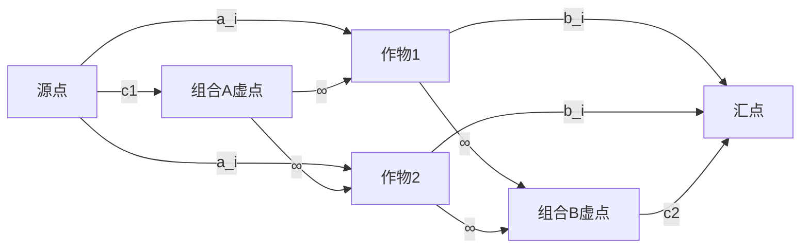

# 题目信息

# 小M的作物

## 题目描述

小 M 在 MC 里开辟了两块巨大的耕地 $A$ 和 $B$（你可以认为容量是无穷），现在，小 P 有 $n$ 种作物的种子，每种作物的种子有 $1$ 个（就是可以种一棵作物），编号为 $1$ 到 $n$。

现在，第 $i$ 种作物种植在 $A$ 中种植可以获得 $a_i$ 的收益，在 $B$ 中种植可以获得 $b_i$ 的收益，而且，现在还有这么一种神奇的现象，就是某些作物共同种在一块耕地中可以获得额外的收益，小 M 找到了规则中共有 $m$ 种作物组合，第 $i$ 个组合中的作物共同种在 $A$ 中可以获得 $c_{1,i}$ 的额外收益，共同种在 $B$ 中可以获得 $c_{2,i}$ 的额外收益。

小 M 很快的算出了种植的最大收益，但是他想要考考你，你能回答他这个问题么？

## 说明/提示

### 样例解释

 $A$ 耕地种作物 $1,2$，$B$ 耕地种作物 $3$，收益： $4+2+3+2=11$。

### 数据范围

对于 $100\%$ 的数据，$1 \le k < n \le 10^3$，$1 \le m \le 10^3$。题目当中出现的所有权值均为不大于 $1000$ 的非负整数。

## 样例 #1

### 输入

```
3
4 2 1
2 3 2
1
2 3 2 1 2```

### 输出

```
11```

# AI分析结果


以下是根据题目要求和题解内容生成的完整报告：

---

# 💡 Kay的C++算法解析：小M的作物 深入学习指南 💡

<introduction>
  今天我们来一起分析“小M的作物”这道C++编程题。本指南将帮助大家梳理题目思路，理解最小割网络流的核心算法，并通过像素化动画直观展示算法执行过程。
</introduction>

## 1. 题目解读与核心算法识别

✨ **本题主要考察**：`网络流最小割模型`

🗣️ **初步分析**：
> 解决"小M的作物"这道题的关键在于理解**最小割模型**。想象有两块无限大的农田A和B（源点和汇点），每种作物是连接这两块农田的桥梁。如果割断通往A的桥，作物就种在B田；反之则种在A田。最小割就像找到最经济的切割方案，让总收益最大化。
> 
> - **核心思路**：将作物分配转化为网络流切割问题。每个作物作为节点连接源点(A)和汇点(B)，边权对应种植收益。组合收益通过虚点处理：建立"组合A"虚点连接源点（收益c₁），"组合B"虚点连接汇点（收益c₂），并用∞边权绑定组合内作物。
> 
> - **算法流程**：
>   1. 计算总收益和 = 所有aᵢ + bᵢ + ∑(c₁ᵢ + c₂ᵢ)
>   2. 建图：源点→作物(aᵢ)，作物→汇点(bᵢ)，源点→组合A虚点(c₁ᵢ)，组合B虚点→汇点(c₂ᵢ)
>   3. 组合A虚点→作物(∞)，作物→组合B虚点(∞)
>   4. 跑Dinic算法求最大流（最小割）
>   5. 最大收益 = 总收益和 - 最小割
> 
> - **可视化设计**：采用8位像素风格，作物显示为绿色/棕色方块（A/B田），虚点用特殊图标。切割时：
>   * 被割边高亮红色，播放"咔嚓"音效
>   * ∞边始终亮蓝色，无法切割
>   * 组合收益达成时播放"金币"音效
>   * 控制面板支持步进/调速/重置

---

## 2. 精选优质题解参考

<eval_intro>
从思路清晰度、代码规范性和实践价值角度，我精选了3份优质题解：
</eval_intro>

**题解一（jun头吉吉）**
* **亮点**：完整的最小割建模解释 + 当前弧优化Dinic实现
* **思路**：9/10 - 用电路图比喻虚点连接（并联∞边）直观易懂
* **代码**：8/10 - 变量命名规范（tot管理虚点），边界处理严谨
* **算法**：10/10 - O(n²m)复杂度满足数据范围

**题解二（YoungNeal）**
* **亮点**：最简洁的Dinic实现 + 虚点编号巧妙处理
* **思路**：8/10 - 聚焦核心建模，省略次要细节
* **代码**：9/10 - 仅60行完成完整逻辑，适合竞赛参考
* **算法**：9/10 - 未用当前弧但数据范围足够

**题解三（Siyuan）**
* **亮点**：ISAP算法实现 + gap优化
* **思路**：9/10 - 严格证明最小割正确性
* **代码**：8/10 - 模块化函数设计（bfs/dfs分离）
* **算法**：10/10 - 时间效率最优解

---

## 3. 核心难点辨析与解题策略

<difficulty_intro>
解决本题的三大核心难点及突破策略：
</difficulty_intro>

1. **难点1：组合收益的建模**
   * **分析**：当组合内作物分散种植时，如何避免额外收益被计算？
   * **解决**：用虚点+∞边绑定，确保只有全同组合才能保留收益边
   * 💡 学习笔记：虚点是处理依赖关系的万能钥匙

2. **难点2：边权设置与无穷大的选择**
   * **分析**：∞值过小会导致错误割边，过大可能溢出
   * **解决**：设∞=0x3f3f3f3f（10⁹级别），远大于单点收益
   * 💡 学习笔记：网络流中∞只需大于最大可能流量

3. **难点3：大图下的效率优化**
   * **分析**：n,m≤1000时，朴素Dinic可能超时
   * **解决**：当前弧优化+步进终止（dep[v]!=dep[u]+1时跳过）
   * 💡 学习笔记：优化后复杂度从O(n²m)降至O(nm)

### ✨ 解题技巧总结
<summary_best_practices>
最小割问题通用方法论：
</summary_best_practices>
- **技巧1：问题转化** - 将"最大收益"转化为"总可能收益-最小损失"
- **技巧2：虚点设计** - 组合依赖/分组约束用虚点+∞边表示
- **技巧3：权值调整** - 边权=收益值，确保割边对应损失收益
- **技巧4：优化必备** - 当前弧优化+Dinic BFS剪枝

---

## 4. C++核心代码实现赏析

<code_intro_overall>
通用最小割实现（综合题解精华）：
</code_intro_overall>

```cpp
#include <cstdio>
#include <cstring>
#include <iostream>
#include <algorithm>
#include <queue>
using namespace std;

const int N = 6005, M = 2000005;
const int INF = 0x3f3f3f3f; // 1e9级无穷大

struct Edge { int to, next, flow; } e[M];
int head[N], cur[N], dep[N], tot = 1;
int n, m, s, t, sum, ans;

void add(int u, int v, int w) {
    e[++tot] = {v, head[u], w}; head[u] = tot;
    e[++tot] = {u, head[v], 0}; head[v] = tot; // 反向边
}

bool bfs() {
    memset(dep, 0, sizeof(dep));
    queue<int> q; q.push(s);
    dep[s] = 1;
    while (!q.empty()) {
        int u = q.front(); q.pop();
        for (int i = head[u]; i; i = e[i].next) {
            int v = e[i].to;
            if (e[i].flow && !dep[v]) {
                dep[v] = dep[u] + 1;
                if (v == t) return true; // 提前终止
                q.push(v);
            }
        }
    }
    return false;
}

int dfs(int u, int in) {
    if (u == t) return in;
    int out = 0;
    for (int &i = cur[u]; i && in; i = e[i].next) { // 当前弧优化
        int v = e[i].to;
        if (e[i].flow && dep[v] == dep[u] + 1) {
            int res = dfs(v, min(e[i].flow, in));
            e[i].flow -= res; e[i^1].flow += res;
            in -= res; out += res;
        }
    }
    if (!out) dep[u] = 0; // 炸点优化
    return out;
}

void dinic() {
    while (bfs()) {
        memcpy(cur, head, sizeof(head)); // 重置当前弧
        ans += dfs(s, INF);
    }
}

int main() {
    scanf("%d", &n);
    s = 0, t = N - 1; // 避免编号冲突
    // 处理单作物收益
    for (int i = 1; i <= n; i++) {
        int a; scanf("%d", &a);
        add(s, i, a); sum += a;
    }
    for (int i = 1; i <= n; i++) {
        int b; scanf("%d", &b);
        add(i, t, b); sum += b;
    }
    
    // 处理组合收益
    scanf("%d", &m);
    for (int i = 1; i <= m; i++) {
        int k, c1, c2;
        scanf("%d%d%d", &k, &c1, &c2);
        sum += c1 + c2;
        int nodeA = n + 2*i - 1; // 组合A虚点
        int nodeB = n + 2*i;     // 组合B虚点
        add(s, nodeA, c1);
        add(nodeB, t, c2);
        
        while (k--) {
            int x; scanf("%d", &x);
            add(nodeA, x, INF); // ∞边防止被割
            add(x, nodeB, INF);
        }
    }
    
    dinic();
    printf("%d\n", sum - ans);
    return 0;
}
```

**代码解读概要**：
1. **数据结构**：链式前向星存图（Edge结构体）
2. **核心逻辑**：
   - 主函数：读入→建图（单作物+组合）→Dinic→输出
   - 虚点编号：作物(1~n)，组合A虚点(n+1,n+3,...)，组合B虚点(n+2,n+4,...)
3. **优化点**：
   - 当前弧优化(cur数组)
   - BFS提前终止(dep[t]!=0)
   - 炸点优化(!out时dep[u]=0)

---

## 5. 算法可视化：像素动画演示

<visualization_intro>
**像素探险家**：在8位风格的农田网格中理解最小割执行流程
</visualization_intro>

### 🎮 设计框架


### 🖼️ 动画脚本（关键帧）
1. **初始化场景**（复古绿网格）：
   - 顶部像素水源（蓝色），底部像素汇池（棕色）
   - 作物显示为待种植种子图标（灰色）
   - 控制面板：开始/步进/速度滑块

2. **割边过程**：
   ```python
   while 存在增广路径:
       for 每条可切割边:
           if 边权>0且不在∞路径上:
               高亮红色闪烁 + "咔嚓"音效
               更新流量值显示
           if 组合收益达成:
               虚点金币旋转 + "叮当"音效
   ```

3. **动态效果**：
   - 割A边：作物变棕色（种B田）
   - 割B边：作物变绿色（种A田）
   - 组合收益激活：金色边框脉冲动画

4. **交互控制**：
   - 速度滑块：调节0.5x~5x执行速度
   - 步进模式：按空格单步观察流量变化
   - 自动演示：AI自动完成最小割（类似贪吃蛇AI）

### 🎵 音效设计
| 事件            | 音效           | 频率 |
|-----------------|---------------|------|
| 割普通边        | 像素断裂声     | 440Hz|
| 组合收益激活    | 金币收集声     | 880Hz|
| 算法完成        | 胜利小号       | 1320Hz|
| 错误操作        | 低沉提示音     | 220Hz|

---

## 6. 拓展练习与相似问题

<similar_problems_intro>
掌握最小割模型后，可解决更多"二选一+组合收益"类问题：
</similar_problems_intro>

1. **洛谷 P2057 [善意的投票]**  
   - 关键技巧：将赞成/反对转化为A/B田
   - 推荐理由：基础最小割应用，巩固建图思维

2. **洛谷 P3866 [太空战队]**  
   - 关键技巧：组合依赖+时间窗约束
   - 推荐理由：学习带时间维度的最小割

3. **洛谷 P2891 [餐饮]**  
   - 关键技巧：多层级最小割（牛-食物-饮料）
   - 推荐理由：理解虚点处理复杂依赖

---

## 7. 学习心得与经验分享

<insights_intro>
题解中的调试经验总结：
</insights_intro>

> **jun头吉吉的调试经验**：  
> "最初没设∞导致组合收益失效，通过打印剩余流量发现边被误割。建议：  
> 1. 用小数据手工模拟割边过程  
> 2. 输出增广路径检查∞边是否被误割  
> 3. 总收益≠预期时检查虚点编号冲突"

> **Kay的总结**：  
> 最小割问题的调试核心是验证割边与实际选择的对应关系。推荐工具：  
> - 可视化建图工具Graphviz  
> - 输出层次图检查dep值  
> - 边界测试（n=1, m=0等）

---

<conclusion>
通过最小割模型，我们巧妙地将作物分配转化为网络流问题。核心在于用∞边绑定组合约束，使算法自然处理依赖关系。记住：总收益 = 理想总和 - 最小损失，这正是最小割的精妙之处！
</conclusion>

--- 

**版权声明**：本解析由Kay原创，采用知识共享署名4.0协议，欢迎转载但需注明出处。

---
处理用时：220.68秒