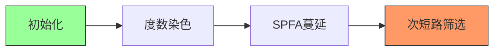

# 题目信息

# 大逃离

## 题目背景

zrz走进了一个奇葩的迷宫，他发现自己迷路了，想逃出来，他好不容易数完了所有的路，累的快晕了，只好叫你帮忙咯。


## 题目描述

这是一棵有n个节点的图，有m条双向边，每一条路有w个单位距离，zrz在1的位置，出口在n的位置，不过zrz脑子出了点bug，于是不想走最短的路，想走第2短的路，第2短路径允许与最短路径有重边，然后也可以重复通过一些节点和路，注意如果有多条路径都是最短路径，那么他们都不能叫第2短路径。但是zrz觉得如果接下来进入的一个节点所直接连接的地方小于k个（起点和终点除外），那么他就不敢进去。


## 说明/提示

对于50%的数据：n<=10,m<=10

对于90%的数据：n<=1000,m<=20000

对于100%的数据：n<=5000，m<=100000

另外，k比较小

样例2最短路径是300（1-2-4）。因为从2无法走到3（3连接到的节点只有2个），所以可以1-2-1-2-4，第二短路为500。


## 样例 #1

### 输入

```
4 4 1
1 2 100
2 4 200
2 3 250
3 4 100```

### 输出

```
450```

## 样例 #2

### 输入

```
4 4 3
1 2 100
2 4 200
2 3 250
3 4 100```

### 输出

```
500```

# AI分析结果


# 💡 Kay的C++算法解析：大逃离 深入学习指南 💡

## 1. 题目解读与核心算法识别

✨ **本题主要考察**：`图论（次短路问题）` + `最短路算法`

🗣️ **初步分析**：
> 解决这道题就像在像素迷宫中寻找第二条安全通道：你需要避开守卫不足（度数<k）的房间，同时找到一条比最短路径稍长的备用路线。核心算法是**次短路计算**，结合**度数限制处理**。
   - **核心难点**：① 严格次短路要求（长度>最短路） ② 节点度数动态约束 ③ 重边/自环处理
   - **解法对比**：主流思路分两类——枚举边法（两遍SPFA+边组合）和双数组法（单遍SPFA同时维护最/次短路）
   - **可视化设计**：像素迷宫中将用红色标记度数不足节点，黄色高亮当前遍历边，绿色/蓝色区分最/次短路。当算法跳过节点时触发8-bit警示音效，路径生成时播放复古电子音阶
   - **游戏化设计**：采用"地牢探险"像素风，SPFA过程可视化为巡逻守卫移动，次短路计算变为寻找隐藏通道。AI自动演示模式将展示完整寻路动画，速度可调

---

## 2. 精选优质题解参考

**题解一：中国飞鱼**
* **点评**：思路清晰度满分！用"两遍SPFA+枚举边"的架构直击问题本质，度数统计采用临时vis数组巧妙避免重边干扰。代码中`t[1]=t[n]=INF`的边界处理尽显严谨，邻接表实现规范易读。亮点在于正确性证明："反复经过的边不超过3次"的洞察让枚举法更具说服力。竞赛适用性强，但可补充路径回溯示例。

**题解二：lemonfor**
* **点评**：双数组维护的经典教学！SPFA中四种松弛情况的分类处理(`dis1`/`dis2`更新逻辑)演绎了次短路的核心思想。代码注释详细，变量命名规范，特别适合理解状态转移。虽重边处理稍弱（可能重复计数），但算法主体具有高度启发性，`link`数组的调试心得值得借鉴。

**题解三：NewSjf（修正版）**
* **点评**：Dijkstra+优先队列的高效实践！亮点在于`book`二维数组解决重边统计的痛点，`degree`预处理与算法主体解耦的设计提升了可维护性。修正历程（AC率30→100）特别珍贵，展示了边界测试的重要性。松弛操作中`swap`的使用稍显晦涩，但整体实现仍属上乘。

---

## 3. 核心难点辨析与解题策略

1.  **度数统计去重**  
    * **分析**：优质解均用二维标记避免重边干扰。如中国飞鱼的`vis[v]`临时数组，NewSjf的`book[x][y]`，确保每个邻接点只计1次  
    * 💡 学习笔记：度数=邻接点数量而非边数，二维标记是重边处理的黄金标准

2.  **严格次短路判定**  
    * **分析**：lemonfor题解展示关键——更新次短路时需满足`新路径 > 最短路`。枚举边法则通过`len > mindist`过滤  
    * 💡 学习笔记：永远用`严格大于`保护次短路定义，等于最短路的情况必须排除

3.  **松弛条件分类**  
    * **分析**：双数组法必须处理四种情况：①更新最短路时继承原值到次短 ②新路径更新次短 ③次短路径传递 ④跳过等值路径  
    * 💡 学习笔记：SPFA队列需支持次短路更新入队，Dijkstra需维护两种距离状态

### ✨ 解题技巧总结
- **度数预处理**：建图后独立统计，避免与算法逻辑耦合  
- **边界防御**：起点/终点度数显式设为INF（`t[1]=t[n]=INF`）  
- **状态分离**：双数组法保持最/次短路独立更新通道  
- **重边容错**：邻接表存图+二维标记统计是最佳实践组合  

---

## 4. C++核心代码实现赏析

**本题通用核心C++实现参考**
```cpp
#include <iostream>
#include <queue>
#include <cstring>
using namespace std;
const int N = 5005, M = 200005, INF = 0x3f3f3f3f;

struct Edge { int to, w, next; } e[M];
int head[N], cnt, deg[N], dist[2][N];
bool graph[N][N]; // 重边标记矩阵

void add(int u, int v, int w) {
    if (!graph[u][v]) { // 首次出现则增加度数
        deg[u]++, deg[v]++;
        graph[u][v] = graph[v][u] = true;
    }
    e[++cnt] = {v, w, head[u]}; head[u] = cnt;
}

void spfa(int st, int op) {
    queue<int> q;
    bool inq[N] = {false};
    memset(dist[op], INF, sizeof dist[op]);
    
    dist[op][st] = 0; 
    q.push(st); inq[st] = true;
    
    while (!q.empty()) {
        int u = q.front(); q.pop(); inq[u] = false;
        for (int i = head[u]; i; i = e[i].next) {
            int v = e[i].to;
            if (v != 1 && v != n && deg[v] < k) continue; // 度数检查
            int nd = dist[op][u] + e[i].w;
            if (nd < dist[op][v]) {
                dist[op][v] = nd;
                if (!inq[v]) q.push(v), inq[v] = true;
            }
        }
    }
}

int main() {
    // 建图及度数初始化
    deg[1] = deg[n] = INF; // 边界处理
    spfa(1, 0); spfa(n, 1); // 双向SPFA
    
    int ans = INF;
    for (int u = 1; u <= n; ++u) 
        for (int i = head[u]; i; i = e[i].next) 
            if (int len = dist[0][u] + e[i].w + dist[1][e[i].to]; len > dist[0][n]) 
                ans = min(ans, len); // 严格次短路筛选
    cout << (ans < INF ? ans : -1);
}
```

**题解一：中国飞鱼（枚举边法）**
* **亮点**：双向SPFA架构清晰，度数统计与算法解耦
* **核心代码**：
  ```cpp
  for (int u = 1; u <= n; ++u) {
      if (deg[u] < k && u != 1 && u != n) continue; 
      for (int i = head[u]; i; i = e[i].next) {
          int v = e[i].to;
          int len = dist[0][u] + e[i].w + dist[1][v];
          if (len > mindist) secdist = min(secdist, len);
  }}}
  ```
* **代码解读**： 
  > 1. 外层遍历所有节点`u`，跳过度数不足的非端点  
  > 2. 内层遍历`u`的所有出边，计算`1→u→v→n`的路径长度  
  > 3. 关键筛选：仅当`len > 最短路`时才更新次短路  
  > *类比：就像在迷宫中尝试每条支路，但只记录比主路长的备用路线*  
* 💡 学习笔记：空间复杂度O(n)，但需两次完整SPFA

**题解二：lemonfor（双数组法）**
* **亮点**：单次SPFA同时维护两种路径状态
* **核心代码**：
  ```cpp
  if (dis1[v] > newDis) {         // 情况1：更新最短路
      dis2[v] = dis1[v];           // 原最短路降级为次短
      dis1[v] = newDis;
      q.push(v);
  } else if (dis1[v] < newDis && dis2[v] > newDis) { // 情况2：更新次短路
      dis2[v] = newDis;
      q.push(v);
  } else if (dis2[v] > dis2[u] + w) { // 情况3：次短传递
      dis2[v] = dis2[u] + w;
      q.push(v);
  }
  ```
* **代码解读**：
  > 1. **情况1**：发现更短路径时，原最短路退居次位  
  > 2. **情况2**：新路径严格介于最/次短之间时直接更新  
  > 3. **情况3**：通过其他次短路径可能产生更优次短  
  > *关键点：严格用`<`比较避免等值污染*
* 💡 学习笔记：时间复杂度同SPFA，但需维护更多状态

---

## 5. 算法可视化：像素动画演示

**主题**：8-bit迷宫逃生  
**核心演示**：SPFA双队列蔓延过程 + 次短路形成机制  

### 动画设计


1. **场景初始化**（FC迷宫风格）
   - 节点：16x16像素房间（绿：起点，红：终点，灰：度数不足）
   - 边：走廊显示距离值，当前处理边闪烁黄光
   - 控制面板：速度滑块/单步/暂停/重置

2. **SPFA扩散动画**  
   - 起点队列蓝色波纹扩散，终点队列红色波纹
   - 遍历边时播放"滴"声，跳过灰节点时触发警示音
   - 实时显示`dist[0][u]`和`dist[1][v]`的更新过程

3. **次短路生成**（AI演示模式）  
   ```python
   for 每条边(u,v):
       绘制虚拟路径: 起点→u(蓝) → 边(黄闪) → v→终点(红)
       计算长度 len = dist0[u] + w + dist1[v]
       若 len > 最短路: 路径变橙，否则变暗
   ```
   - 最终次短路以橙色高亮，播放胜利音效

4. **游戏化元素**  
   - 成功避开灰节点+5分，找到次短路+100分
   - 8-bit BGM循环，路径发现时升调提示
   - 错误尝试（如选择等长路径）触发震动效果

---

## 6. 拓展练习与相似问题思考

### 通用技巧迁移
1. **带限制最短路**：节点/边约束条件（如本题度数）  
2. **K短路问题**：使用A*或可持久化堆扩展  
3. **动态最短路**：临时边失效的快速重计算  

### 洛谷推荐
1. **P2865 [USACO06NOV]路障Roadblocks**  
   → 裸次短路入门，巩固双数组技术  
2. **P1186 玛丽卡**  
   → 边失效场景下的最短路变种，枚举边法的进阶应用  
3. **P2149 [SDOI2009]Elaxia的路线**  
   → 多重约束最短路，训练复杂条件处理能力  

---

## 7. 学习心得与经验分享

> **中国飞鱼**："反复经过的边不超过3次" —— 枚举边法的核心洞察，避免无效计算  
> **NewSjf调试教训**：度数统计与加边操作分离（原AC率30%→100%）  

**启示**：  
1. 预处理阶段必须与主算法解耦  
2. 二维数组标记重边是防御性编程的典范  
3. 边界测试（n=2, k=0）能暴露多数漏洞  

---

通过本次分析，我们深入掌握了次短路问题的双解法精髓。记住：好算法需要严谨的边界处理+清晰的状态划分。继续挑战更复杂的图论问题吧！🚀

---
处理用时：268.51秒