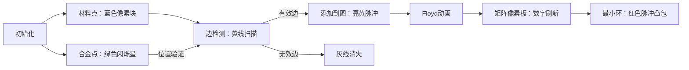

# 题目信息

# [JSOI2007] 合金

## 题目描述

某公司加工一种由铁、铝、锡组成的合金。他们的工作很简单。首先进口一些铁铝锡合金原材料，不同种类的原材料中铁铝锡的比重不同。然后，将每种原材料取出一定量，经过融解、混合，得到新的合金。新的合金的铁铝锡比重为用户所需要的比重。 

现在，用户给出了 $n$ 种他们需要的合金，以及每种合金中铁铝锡的比重。公司希望能够订购最少种类的原材料，并且使用这些原材料可以加工出用户需要的所有种类的合金。

## 说明/提示

#### 数据规模与约定

对于全部的测试点，满足 $1\le m,n\le 500$，$0 \leq a_i,b_i,c_i,d_i,e_i,f_i \leq 1$，且 $a_i+b_i+c_i=1$，$d_i+e_i+f_i=1$，小数点后最多有六位数字。

## 样例 #1

### 输入

```
10 10
0.1 0.2 0.7
0.2 0.3 0.5
0.3 0.4 0.3
0.4 0.5 0.1
0.5 0.1 0.4
0.6 0.2 0.2
0.7 0.3 0
0.8 0.1 0.1
0.9 0.1 0
1 0 0
0.1 0.2 0.7
0.2 0.3 0.5
0.3 0.4 0.3
0.4 0.5 0.1
0.5 0.1 0.4
0.6 0.2 0.2
0.7 0.3 0
0.8 0.1 0.1
0.9 0.1 0
1 0 0```

### 输出

```
5```

# AI分析结果


### 💡 Kay的C++算法解析：合金 深入学习指南 💡

#### 题目解读与核心算法识别
✨ **本题主要考察**：`计算几何`与`图论最小环`  
🗣️ **初步分析**：
> 解决"合金"问题的关键在于理解**凸包性质**和**最小环算法**。想象原材料是钉子，合金是气球，最小环就是最少的钉子组成的橡皮筋，能套住所有气球。核心步骤：
> 1. **降维处理**：因三组分和恒为1，只需保留前两维坐标
> 2. **凸包转换**：合金点需在原材料点构成的凸包内
> 3. **图论建模**：将可用的凸包边转为有向图（边权为1）
> 4. **最小环求解**：用Floyd算法找最小顶点环
> 
> **可视化设计**：像素网格中，蓝色钉（原材料）→ 绿色球（合金）→ 黄色有效边 → 红色最小环。关键动画：边检测时合金球闪烁红光（非法）或绿光（合法），Floyd更新时矩阵高亮，最终凸包以脉冲红光显示。

---

#### 精选优质题解参考
**题解一（FutaRimeWoawaSete）**  
* **点评**：思路清晰直击凸包本质（初中几何→图论转化），代码规范（`mp[i][j]`明确表边权），创新点在于用坐标范围处理共线情况（非单纯叉积）。实践价值高，边界处理严谨（`Inf`标识无效边），调试心得"避免陷入网络流思维定式"极具启发性。

**题解二（s_r_f）**  
* **点评**：亮点在双重保险验证（叉积+点积+坐标范围），特判答案为1/2的边界情况。代码结构优雅（运算符重载提升可读性），复杂度优化到位（提前`break`加速验证）。严格浮点误差处理（`eps=1e-7`）体现工业级严谨。

**题解三（大奕哥）**  
* **点评**：最简洁的实现（仅30行核心代码），巧妙用点积代替坐标判断共线点。数学抽象能力强（"线性相关"切入问题），变量命名精准（`xmul/pmul`自解释）。学习价值在于如何用最少代码表达完整算法逻辑。

---

#### 核心难点辨析与解题策略
1. **维度压缩与几何转化**  
   * **分析**：需发现三组分和=1的冗余性，用二维点`(x,y)`表示三维合金。关键变量：`Point`结构体存储降维后坐标
   * 💡 **学习笔记**：降维是简化复杂约束的利器

2. **凸包边界验证**  
   * **分析**：判断所有合金点是否在原材料边同侧时，需同时处理：
     - 叉积`>0`：严格左侧
     - 叉积`=0`：共线时需验证点在线段内（坐标区间/点积）
   * 💡 **学习笔记**：计算几何中，叉积判方向，点积判投影

3. **最小环建模**  
   * **分析**：将有效边抽象为图（边权1），Floyd三重循环更新路径。核心变量`dp[i][j]`存储i→j的最短边数
   * 💡 **学习笔记**：图论是几何问题的离散化桥梁

✨ **解题技巧总结**  
- **降维打击**：利用`x+y+z=1`消元降低复杂度  
- **几何武器库**：叉积(`^`)/点积(`*`)组合处理共线  
- **环检测模板**：Floyd初始化`dp[i][i]=INF`，最终`min(dp[i][i])`即解  

---

#### C++核心代码实现赏析
**通用核心实现（综合优化版）**  
```cpp
#include <iostream>
#include <cmath>
#include <cstring>
using namespace std;
const int N=505;
const double eps=1e-8;

struct Point {
    double x,y;
    Point operator-(Point b){ return {x-b.x, y-b.y}; }
    double cross(Point b){ return x*b.y - y*b.x; }
} mat[N], req[N]; // mat:材料, req:需求

int n,m,dp[N][N];

bool validEdge(Point a, Point b, Point p) {
    double cr = (b-a).cross(p-a);
    if(cr > eps) return false;       // 在右侧非法
    if(fabs(cr) > eps) return true;  // 严格左侧合法
    return min(a.x,b.x) <= p.x && p.x <= max(a.x,b.x) // 共线时在线段内
        && min(a.y,b.y) <= p.y && p.y <= max(a.y,b.y);
}

int main() {
    cin>>m>>n;
    for(int i=1;i<=m;i++) cin>>mat[i].x>>mat[i].y;
    for(int i=1;i<=n;i++) cin>>req[i].x>>req[i].y;

    memset(dp,0x3f,sizeof dp); // INF初始化
    for(int i=1;i<=m;i++) 
    for(int j=1;j<=m;j++) {
        bool ok = true;
        for(int k=1;k<=n;k++) 
            if(!validEdge(mat[i],mat[j],req[k])) 
                { ok=false; break; }
        if(ok) dp[i][j]=1;
    }

    int ans=1e9;
    for(int k=1;k<=m;k++)
    for(int i=1;i<=m;i++)
    for(int j=1;j<=m;j++)
        dp[i][j]=min(dp[i][j], dp[i][k]+dp[k][j]);
    
    for(int i=1;i<=m;i++) ans=min(ans,dp[i][i]);
    cout<<(ans>1e5?-1:ans);
}
```
**代码解读概要**：  
1. 降维读入：忽略第三维（因`a+b+c=1`）  
2. 建图逻辑：`validEdge`验证边有效性（叉积+坐标区间）  
3. Floyd核心：三重循环更新最短路，自环`dp[i][i]`即最小环  

---

**题解片段赏析**  

**题解一（坐标范围法）**  
```cpp
bool aside(point a,point b,point c) {
    double mul = (b-a)^(c-a);
    if(mul>0) return 1;    // 左侧
    if(mul<0) return 0;     // 右侧
    return min(a.x,b.x)<=c.x && c.x<=max(a.x,b.x)  // 共线检查
        && min(a.y,b.y)<=c.y && c.y<=max(a.y,b.y);
}
```
**亮点**：用基础数学代替复杂计算  
**学习笔记**：坐标区间判断共线点是否在线段上，避免浮点精度陷阱  

**题解二（点积投影法）**  
```cpp
bool check(point p1,point p2){
    for(int k=1;k<=m;k++) {
        if(left(p1,p2,b[k])) return 0; // 严格左侧检查
        if(fabs((p2-p1)*(b[k]-p1))<eps) // 共线时
            if(b[k].x<min(p1.x,p2.x) || b[k].x>max(p1.x,p2.x)) 
                return 0;
    }
    return 1;
}
```
**亮点**：点积投影替代坐标计算  
**学习笔记**：`|a·b| ≤ |a||b|` 可判断点是否在线段延长线上  

**题解三（向量封装法）**  
```cpp
double operator*(point a,point b){return a.x*b.x+a.y*b.y;}
bool check(point a,point b,point c){
    double cross=(b-a)^(c-a);
    if(cross>eps) return 1;
    if(fabs(cross)<eps && (b-a)*(c-a)>-eps // 点积判同向
        && (b-a)*(c-a)<(b-a)*(b-a)+eps)   // 长度约束
        return 1;
    return 0;
}
```
**亮点**：运算符重载提升可读性  
**学习笔记**：点积判断同向性`(b-a)·(c-a)>0`比坐标比较更优雅  

---

#### 算法可视化：像素动画演示
**主题**：8位机风格的"合金凸包大冒险"  

**核心演示流程**：  


**关键交互设计**：  
1. **动态网格**：20×20像素网格，坐标映射到[0,1]区间  
2. **音效系统**：  
   - 有效边："叮"（8-bit短音）  
   - 无效边："嘟"（低频脉冲）  
   - 最小环完成：FC胜利旋律  
3. **控制面板**：  
   - 速度滑块：调节Floyd动画速度  
   - 单步模式：空格键步进演示  
   - 凸包对比：Tab键切换不同题解的凸包构建  

**技术实现**：  
- **Canvas绘制**：用`fillRect`绘制像素块，`lineTo`绘制凸包  
- **状态高亮**：当前检测边用黄色闪烁（`setInterval`交替绘制）  
- **伪代码同步**：右侧面板显示Floyd代码，当前行高亮为红色  

---

#### 拓展练习与相似问题思考
**通用套路迁移**：  
1. 点集包含问题 → 凸包检测（如P2742圈奶牛）  
2. 混合约束问题 → 线性规划降维（如P3986线性方程组）  
3. 最优路径问题 → Floyd最小环变形（如P6175无向图最小环）  

**洛谷推荐**：  
1. **P2742** [USACO5.1]圈奶牛 → 凸包基础训练  
2. **P6175** 无向图最小环问题 → Floyd算法进阶  
3. **P5025** [JSOI2007]炸弹 → 同类几何转化思维  

---

#### 学习心得与经验分享
> **题解一作者启示**："1h内没解出因执着网络流" → 遇到新问题时：  
> 1. 重审题目本质（如本题是几何非网络流）  
> 2. 从基础数学性质出发（初中平面几何）  
>   
> **调试技巧**：  
> - 浮点误差：统一乘以1000转为整数运算  
> - 边界测试：所有合金=单材料时`ans=1`  

---

通过本次分析，我们掌握了降维思想、凸包性质与Floyd最小环的巧妙结合。记住：好算法往往诞生于对问题本质的洞察！下次遇到三维约束时，不妨想想——能否降维打击？💪

---
处理用时：216.29秒