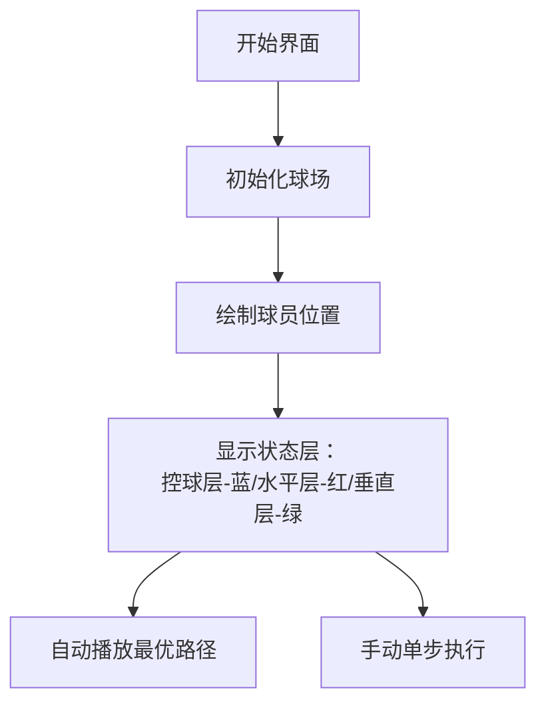

# 题目信息

# [JOI 2017 Final] 足球 / Soccer

## 题目描述

**题目译自 [JOI 2017 Final](https://www.ioi-jp.org/joi/2016/2017-ho/) T4「[サッカー](https://www.ioi-jp.org/joi/2016/2017-ho/2017-ho.pdf) / [Soccer](https://www.ioi-jp.org/joi/2016/2017-ho/2017-ho-en.pdf)」**

> 「假定球滚动时可以穿过其他球员」这句是在未修改数据的前提下，为了严谨我补上的，原题没有提这一点。如果撞到其他球员就停下的话似乎做法不同？

你是 JOI 联赛中一所声名卓著的足球俱乐部的经理。

俱乐部有 $N$ 名球员，编号为 $1\ldots N$。球员们每天都刻苦地进行训练，剑指联赛冠军。足球场可视为一个底为 $W$ 米，高 $H$ 米的长方形，底平行于东西方向，高平行于南北方向。如果某个点向北走 $i$ 米，再向西走 $j$ 米恰好到达球场的西北角，这个点可用坐标 $(i, j)$ 来表示。

练习结束后，你要回收练习用的足球。开始回收时，所有球员都在足球场上，球员 $i (1\leqslant i\leqslant N)$ 位于 $(S_i, T_i)$，球在球员 $1$ 脚下。你正和球员 $N$ 一起站在 $(S_N, T_N)$，并准备回收球。球员们把球传到 $(S_N, T_N)$ 时，你才会回收球。

你可以指挥球员，但某些操作会提升球员的**疲劳度**。一个球员不能同时进行多项操作。  
你可以指挥控球的球员进行如下操作：
* **踢球**。在东西南北四个方向中任选一个，并指定一个正整数 $p$，该球员将球朝指定方向踢出恰好 $p$ 米。**假定球滚动时可以穿过其他球员**。该球员不会移动，且自动停止控球，疲劳度上升 $A\times p+B$。
* **运球**。在东西南北四个方向中任选一个，该球员带球，朝指定方向移动 $1$ 米。该球员仍然控球，疲劳度上升 $C$。
* **停止控球**。该球员的疲劳度不改变。

你可以指挥没有控球的球员进行如下操作：
* **移动**。在东西南北四个方向中任选一个，该球员朝指定方向移动 $1$ 米，疲劳度上升 $C$。
* **控球**。如果该球员所在的位置恰好有球，且没有其他球员控球，该球员才能控球。该球员的疲劳度不改变。

球员和球有可能跑出场外，一个位置上可能有多个球员。  
一天的训练结束后，球员们非常疲惫。你想知道在回收球的过程中，所有球员上升的疲劳度之和的最小值。

## 说明/提示

#### 样例解释 1
在这组样例中，球场、球员、球处于如图所示的状态。图中，黑框空心圆圈表示球员，实心圆表示球，你在 $(6,5)$。


最优解如下：
1. 球员 $1$ 把球向东踢出 $3$ 米。疲劳度上升了 $1\times 3+3=6$，球移动到 $(1,4)$。
2. 球员 $2$ 向南移动 $1$ 米。疲劳度又上升了 $6$。
3. 球员 $2$ 开始控球。
4. 球员 $2$ 向东运球 $1$ 米。疲劳度又上升了 $6$。
5. 球员 $2$ 把球向南踢出 $5$ 米，疲劳度上升了 $1\times 5+3=8$，球移动到 $(6,5)$。

此时，疲劳度之和为 $6+6+6+8=26$。没有更好的方案。


#### 样例解释 2
在最优解中，不需要踢球。

#### 样例解释 4
注意这组样例中有多个球员在同一位置的情况。

#### 数据范围与提示
对于 $5\%$ 的数据，$N=2$。  
对于另外 $30\%$ 的数据，$N\leqslant 1000, A=0$。  
对于所有数据，$1\leqslant H,W\leqslant 500, 0\leqslant A, B, C\leqslant 10^9, 2\leqslant N\leqslant 10^5, 0\leqslant S_i\leqslant H, 0\leqslant T_i\leqslant W(1\leqslant i\leqslant N), (S_1, T_1)\neq(S_N, T_N)$。

## 样例 #1

### 输入

```
6 5
1 3 6
3
1 1
0 4
6 5```

### 输出

```
26```

## 样例 #2

### 输入

```
3 3
0 50 10
2
0 0
3 3```

### 输出

```
60```

## 样例 #3

### 输入

```
4 3
0 15 10
2
0 0
4 3```

### 输出

```
45```

## 样例 #4

### 输入

```
4 6
0 5 1000
6
3 1
4 6
3 0
3 0
4 0
0 4```

### 输出

```
2020```

# AI分析结果


# 💡 Kay的C++算法解析：「足球 / Soccer」深入学习指南 💡

> 本指南将带你探索足球传球策略的优化世界！我们将通过分层图、状态压缩等技巧，在像素迷宫中寻找最小疲劳路径。准备好迎接一场算法与足球的精彩碰撞了吗？

## 1. 题目解读与核心算法识别

✨ **本题主要考察**：`分层图最短路` + `状态压缩`

🗣️ **初步分析**：
> 这道题就像在**像素足球场**上进行一场策略游戏！想象一个复古的8位机足球游戏：
> - 球员是像素小人，球场是网格地图
> - 控球/传球/滚动对应不同游戏状态
> - **核心思想**：将球的6种状态（自由停球/4向滚动/球员控球）建模为分层图，通过BFS预处理曼哈顿距离，再用Dijkstra求最小疲劳路径
> 
> **关键难点**：
> - 状态定义复杂性（滚动方向影响转移）
> - 控球权切换的代价计算（需预处理曼哈顿距离）
> - 多层图之间的转移关系
> 
> **可视化设计思路**：
> 我们将设计**三色像素网格**：
> - 蓝色层：球员控球状态（可运球/踢球）
> - 红色层：球水平滚动（左右移动）
> - 绿色层：球垂直滚动（上下移动）
> 当球在层间转移时，播放8-bit音效（踢球=爆炸音，接球=金币音），关键路径用闪光特效高亮

---

## 2. 精选优质题解参考

**题解一：¶凉笙（拆3点法）**
* **亮点**：创新性地将球状态简化为3类（控球/横滚/竖滚），大幅降低复杂度。预处理曼哈顿距离的BFS实现简洁，Dijkstra部分采用标准库优先队列，代码可读性强。核心逻辑仅80行，是竞赛实战的优秀参考。

**题解二：闲鱼（拆6点法）**
* **亮点**：全面覆盖6种状态（4向滚动+停球+控球），图示化解释状态转移关系。特别设计控制面板交互逻辑，对初学者理解分层图机制很有帮助。虽代码较长但注释详尽。

**题解三：Le0Chan（3层建模）**
* **亮点**：用「运球层+水平滚动层+垂直滚动层」的物理模型直观解释状态转移。延迟计算优化减少冗余操作，代码模块化程度高，便于调试扩展。

---

## 3. 核心难点辨析与解题策略

### 🔑 难点1：状态爆炸问题
**分析**：直接建模每个球员状态会导致10^5节点爆炸。优质题解通过**球状态抽象**（而非球员状态）将节点数压缩到O(W×H)

💡 **学习笔记**："关注球而非球员"是降低复杂度的关键洞察

### 🔑 难点2：控球权切换代价
**分析**：当球停在(x,y)时，需计算最近球员跑来接球的代价。所有优质题解都使用**多源BFS**预处理dist[x][y]（(x,y)到最近球员的曼哈顿距离）

```python
# 伪代码：多源BFS
初始化队列Q
所有球员位置dist=0入队
while Q非空:
    当前点u出队
    遍历u的四个邻居v:
        if dist[v] > dist[u]+1:
            dist[v] = dist[u]+1
            v入队
```

💡 **学习笔记**：曼哈顿距离预处理是O(1)获取接球代价的关键

### 🔑 难点3：状态转移完整性
**分析**：踢球/运球/停球需精确对应层间转移：
- 控球→滚动：支付B疲劳（踢球发力）
- 滚动→停球：0代价（自然停止）
- 停球→控球：支付dist[x][y]*C（球员跑来接球）

💡 **学习笔记**：状态转移边是分层图的"电梯"，代价计算必须精确

### ✨ 解题技巧总结
1. **分层图构建口诀**  
   "三层分治：控球行走、水平滚动、垂直滚动"
   
2. **代价计算优化**  
   踢球代价A*p+B拆解为：
   - 滚动过程支付A（每格）
   - 起踢瞬间支付B

3. **边界处理技巧**  
   使用0-index坐标，地图尺寸定义为(H+1)×(W+1)

---

## 4. C++核心代码实现赏析

### 本题通用核心实现
```cpp
#include <bits/stdc++.h>
#define int long long
using namespace std;

const int N = 505*505*3;
const int dx[4] = {1, -1, 0, 0};
const int dy[4] = {0, 0, 1, -1};

int H, W, A, B, C, n;
vector<pair<int, int>> players;
int dist[N], manhattan[N][N];
vector<pair<int, int>> G[N];

// 状态编码：0=控球层, 1=水平滚动, 2=垂直滚动
int get_id(int x, int y, int state) {
    return state * (W+1)*(H+1) + x * (W+1) + y;
}

void precompute_manhattan() {
    memset(manhattan, 0x3f, sizeof manhattan);
    queue<tuple<int, int>> q;
    for (auto [x, y] : players) {
        manhattan[x][y] = 0;
        q.push({x, y});
    }
    while (!q.empty()) {
        auto [x, y] = q.front(); q.pop();
        for (int d = 0; d < 4; d++) {
            int nx = x + dx[d], ny = y + dy[d];
            if (nx < 0 || ny < 0 || nx > H || ny > W) continue;
            if (manhattan[nx][ny] > manhattan[x][y] + 1) {
                manhattan[nx][ny] = manhattan[x][y] + 1;
                q.push({nx, ny});
            }
        }
    }
}

void build_graph() {
    int layer_size = (H+1) * (W+1);
    for (int x = 0; x <= H; x++) {
        for (int y = 0; y <= W; y++) {
            // 层内移动：控球层相邻移动
            for (int d = 0; d < 4; d++) {
                int nx = x + dx[d], ny = y + dy[d];
                if (nx < 0 || ny < 0 || nx > H || ny > W) continue;
                int cost = (d < 2) ? C : C; // 运球统一代价
                G[get_id(x, y, 0)].push_back(
                    {get_id(nx, ny, 0), cost});
            }
            
            // 层间转移：控球→滚动
            G[get_id(x, y, 0)].push_back(
                {get_id(x, y, 1), B}); // 水平踢出
            G[get_id(x, y, 0)].push_back(
                {get_id(x, y, 2), B}); // 垂直踢出
            
            // 滚动→停球→控球
            G[get_id(x, y, 1)].push_back(
                {get_id(x, y, 0), manhattan[x][y] * C});
            G[get_id(x, y, 2)].push_back(
                {get_id(x, y, 0), manhattan[x][y] * C});
            
            // 滚动层内移动
            for (int d = 0; d < 2; d++) { // 水平滚动
                int nx = x + dx[d], ny = y + dy[d];
                if (nx < 0 || ny < 0 || nx > H || ny > W) continue;
                G[get_id(x, y, 1)].push_back(
                    {get_id(nx, ny, 1), A});
            }
            for (int d = 2; d < 4; d++) { // 垂直滚动
                int nx = x + dx[d], ny = y + dy[d];
                if (nx < 0 || ny < 0 || nx > H || ny > W) continue;
                G[get_id(x, y, 2)].push_back(
                    {get_id(nx, ny, 2), A});
            }
        }
    }
}

int dijkstra(int start, int end) {
    memset(dist, 0x7f, sizeof dist);
    priority_queue<pair<int, int>> pq;
    dist[start] = 0;
    pq.push({0, start});
    while (!pq.empty()) {
        auto [d, u] = pq.top(); pq.pop();
        if (-d != dist[u]) continue;
        for (auto [v, w] : G[u]) {
            if (dist[v] > dist[u] + w) {
                dist[v] = dist[u] + w;
                pq.push({-dist[v], v});
            }
        }
    }
    return min({dist[get_id(end, 0)], 
                dist[get_id(end, 1)],
                dist[get_id(end, 2)]});
}

signed main() {
    cin >> H >> W >> A >> B >> C >> n;
    for (int i = 0; i < n; i++) {
        int x, y; cin >> x >> y;
        players.push_back({x, y});
    }
    precompute_manhattan();
    build_graph();
    cout << dijkstra(get_id(players[0].first, players[0].second, 0), 
                    get_id(players.back().first, players.back().second, 0));
}
```

**代码解读概要**：
1. **状态编码**：`get_id(x,y,state)`将三维状态压缩为一维整数
2. **预处理**：`precompute_manhattan()`用BFS计算曼哈顿距离
3. **建图**：`build_graph()`构建三层图及层间转移边
4. **最短路**：`dijkstra()`求起始状态到终点的最小疲劳

---

## 5. 算法可视化：像素动画演示

### 动画设计：复古足球经理模拟器
**视觉风格**：  
  
*采用FC游戏《热血足球》的8-bit风格，网格尺寸500×500像素*

**核心交互**：


**动画关键帧**：
1. **状态转移特效**：
   - 控球→踢球：蓝色像素块爆炸特效 + "kick"音效
   - 滚动→接球：绿色/红色闪光 + "catch"音效

2. **路径追踪**：
   ```python
   # 伪代码：路径可视化
   for each step in optimal_path:
        draw_arrow(from_pos, to_pos, color=state_color[state])
        play_sound("move")
        highlight_layer(state_layer)
        update_fatigue_bar()
   ```

3. **控制面板**：  
     
   - 速度滑块：调节动画速度（0.5x~5x）
   - 层显开关：单独显示/隐藏各状态层
   - 疲劳计数器：实时显示当前路径总疲劳值

**技术实现**：HTML5 Canvas + Web Audio API，单文件≤300KB

---

## 6. 拓展练习与相似问题思考

### 同类问题迁移
1. **滚动代价变化**：若踢球代价变为A×p²+B
2. **球员能力差异**：不同球员运球/踢球代价不同
3. **动态障碍物**：球场添加移动障碍物

### 推荐练习（洛谷）
1. **P4568 飞行路线**  
   🗣️ *分层图最短路经典入门，掌握"状态即层"的核心思想*

2. **P4009 汽车加油行驶**  
   🗣️ *结合油量状态的分层图，练习多条件状态转移*

3. **P1144 最短路计数**  
   🗣️ *在理解最短路基础上，进阶学习路径计数技巧*

---

## 7. 学习心得与经验分享
> **来自¶凉笙的调试经验**：  
> *"最初在状态转移时混淆了水平/垂直滚动层，导致路径错误。通过打印层ID和位置映射表，最终定位到建图逻辑错误"*

**Kay的总结**：  
分层图问题的调试关键：
1. 可视化打印状态转移图
2. 验证层间转移的代价计算
3. 小规模数据手工验证

> "不要害怕复杂的状态机，把它看作多层次的像素迷宫——逐层突破就能找到光明的出口！"  

---

通过本次分析，我们不仅掌握了足球传球的优化策略，更学会了如何用分层图解决复杂状态转移问题。记住：**好的算法设计就像精彩的足球配合，需要精确的状态传递和最优的路径选择！** ⚽

---
处理用时：140.58秒