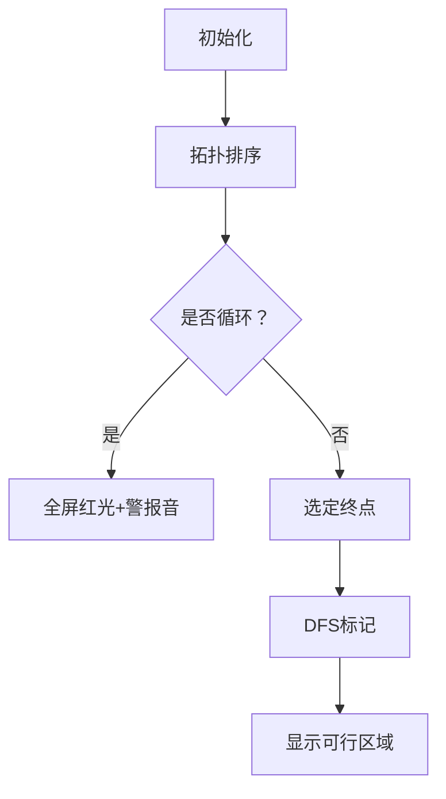

# 题目信息

# [USACO18DEC] The Cow Gathering P

## 题目描述

奶牛们从世界各地聚集起来参加一场大型聚会。总共有 $ N $ 头奶牛， $ N-1 $ 对奶牛互为朋友。每头奶牛都可以通过一些朋友关系认识其他每头奶牛。

她们玩得很开心，但是现在到了她们应当离开的时间了，她们会一个接一个地离开。她们想要以某种顺序离开，使得只要至少还有两头奶牛尚未离开，所有尚未离开的奶牛都还有没有离开的朋友。此外，由于行李寄存的因素，有 $ M $ 对奶牛 $ (a_i,b_i) $ 必须满足奶牛 $ a_i $ 要比奶牛 $ b_i $ 先离开。注意奶牛 $ a_i $ 和奶牛 $ b_i $ 可能是朋友，也可能不是朋友。

帮助奶牛们求出，对于每一头奶牛，她是否可以成为最后一头离开的奶牛。可能会发生不存在满足上述要求的奶牛离开顺序的情况。

## 样例 #1

### 输入

```
5 1
1 2
2 3
3 4
4 5
2 4
```

### 输出

```
0
0
1
1
1
```

# AI分析结果


### 💡 Kay的C++算法解析：[USACO18DEC] The Cow Gathering P 深入学习指南 💡

#### 1. 题目解读与核心算法识别
✨ **本题主要考察**：`拓扑排序与树遍历` (图论/树结构应用)

🗣️ **初步分析**：
> 解决本题的关键在于理解**树结构的动态删除特性**和**拓扑排序的环检测**。想象一群奶牛在树上玩游戏，每次只能摘下一片叶子（度为1的节点），同时有些奶牛约定必须按特定顺序离开（限制边）。这就像在树上进行一场有序的"落叶游戏"，若限制条件形成环则游戏失败。

- 题解核心思路：通过拓扑排序检测是否存在合法删除序列（无环），再用DFS标记可行点。难点在于高效处理子树约束关系。
- 算法流程：
  1. **拓扑判环**：树边（无向）和限制边（有向）共同建图，度为1的节点入队
  2. **标记可行点**：从拓扑终点DFS，避开限制起点（标记为`vis`的节点）
- 可视化设计：8位像素风格树结构，叶子节点闪烁绿光入队，限制边显示红色箭头。当触发环检测时屏幕震动+警告音，可行点最终亮起金光。

---

#### 2. 精选优质题解参考
**题解一（Bartholomew, 20赞）**
* **亮点**：O(n)时间复杂度，巧用拓扑排序找可行点，避免DFS序和倍增。代码用`vis`标记限制起点，DFS时自动过滤不可行区域，边界处理严谨（如`cnt != n`判环）。

**题解二（hongzy, 6赞）**
* **亮点**：DFS序+差分标记经典解法，用倍增LCA精确定位子树。实践价值高（可直接用于竞赛），但需注意`deep[v]-deep[u]-1`级祖先的边界处理。

**题解三（Owen_codeisking, 5赞）**
* **亮点**：双图拓扑判环（树边+限制边），差分标记逻辑清晰。学习价值在于`getson`函数处理子树外区域的技巧，但需注意`dg[x]<2`的边界修正。

---

#### 3. 核心难点辨析与解题策略
1. **拓扑判环的度计算**
   * **分析**：树边（度数增加）和限制边（目标点度数增加）需统一处理。若最终删除节点数≠n，存在约束环
   * 💡 学习笔记：`d[i] = 树度数 + 限制边入度`

2. **子树约束的高效标记**
   * **分析**：对限制`(a,b)`，若b在a子树内，则标记a子树中非b分支；否则标记整个a子树
   * 💡 学习笔记：DFS从拓扑终点开始，用`vis`数组阻断限制起点

3. **可行集的连通性证明**
   * **分析**：数学归纳证明可行点形成连通块。若相邻点非限制起点且与可行点连通，则必然可行
   * 💡 学习笔记：可行集=拓扑终点所在的未标记连通分量

### ✨ 解题技巧总结
- **拓扑融合法**：树边与限制边统一处理度，避免建图判环
- **规避标记法**：DFS跳过`vis`节点，自然形成可行连通块
- **边界防御**：`d[u]`降为0时立即终止，防止负数导致异常

---

#### 4. C++核心代码实现赏析
**通用核心实现参考**
```cpp
#include <iostream>
#include <vector>
#include <queue>
#include <cstring>
using namespace std;
const int N = 1e5 + 10;

vector<int> g[N], l[N]; // 树边, 限制边
int d[N], n, m;         // 度数(树边+限制入度)
bool vis[N], ans[N];    // 限制起点标记, 答案

int main() {
    cin >> n >> m;
    for (int i = 0; i < n-1; i++) {
        int u, v; cin >> u >> v;
        g[u].push_back(v); g[v].push_back(u);
        d[u]++; d[v]++;
    }
    for (int i = 0; i < m; i++) {
        int a, b; cin >> a >> b;
        l[a].push_back(b); d[b]++; // 限制边增加目标点度
        vis[a] = true;             // 标记限制起点
    }

    queue<int> q;
    for (int i = 1; i <= n; i++) 
        if (d[i] == 1) q.push(i);

    int cnt = 0, last = -1;
    while (!q.empty()) {
        int u = q.front(); q.pop();
        last = u; cnt++;
        for (int v : g[u]) if (--d[v] == 1) q.push(v);
        for (int v : l[u]) if (--d[v] == 1) q.push(v);
    }

    if (cnt != n) { // 存在环
        for (int i = 1; i <= n; i++) cout << "0\n";
        return 0;
    }

    queue<pair<int, int>> q2; // (当前点, 父节点)
    q2.push({last, -1}); 
    ans[last] = 1;
    while (!q2.empty()) {
        auto [u, fa] = q2.front(); q2.pop();
        for (int v : g[u]) {
            if (v == fa || vis[v] || ans[v]) continue;
            ans[v] = 1;
            q2.push({v, u});
        }
    }
    for (int i = 1; i <= n; i++) 
        cout << ans[i] << '\n';
}
```
**代码解读概要**：
1. 建图阶段：树边双向增加度数，限制边增加目标点度数
2. 拓扑判环：度为1节点入队，删除时更新关联点度
3. 标记可行点：从拓扑终点BFS，跳过限制起点和已访问点

---

#### 5. 算法可视化：像素动画演示
**主题**：8位像素风"奶牛离场大冒险"  

**设计框架**：


**关键动画细节**：
1. **拓扑阶段**：
   - 叶子节点（绿色像素块）闪烁，入队时播放"叮"声
   - 节点删除时化为落叶飘散，关联边淡出
   - 环检测触发：屏幕闪烁红光，播放低频警报

2. **标记阶段**：
   - 拓扑终点（金色奶牛）放射光线
   - DFS遍历时，可行路径亮起蓝光，遇到`vis`节点（红色障碍）自动转向
   - 最终可行区域显示为绿色安全区

**交互控制**：
- 速度滑块：调节动画速度（0.5x~3x）
- 暂停/继续：空格键控制
- 数据追踪：实时显示节点度数和限制边数量

---

#### 6. 拓展练习与相似问题思考
1. **洛谷 P2146** - 软件包管理器  
   🗣️ 巩固树DFS序应用，体验"安装/卸载"场景的子树标记
2. **洛谷 P3388** - 割点  
   🗣️ 学习图的连通性判断，理解割点与本题拓扑判环的关联
3. **洛谷 P1352** - 没有上司的舞会  
   🗣️ 树形DP基础，体会状态转移与本题子树约束的异同

---

#### 7. 学习心得与经验分享
> **参考经验**：  
> "拓扑排序中，树边和限制边的度统一处理极易出错，我通过打印中间度数矩阵定位了边界问题"  
>   
> **点评**：  
> 调试时输出关键数据结构（如`d[]`数组）是黄金法则。本题的度数融合是核心难点，建议用小样本模拟验证，如n=3的链式结构。

---

通过本次分析，我们深入理解了树约束下的拓扑排序应用。记住：**算法本质是现实问题的抽象**，多思考"为什么可行"比记忆代码更重要。下次挑战见！💪

---
处理用时：442.85秒