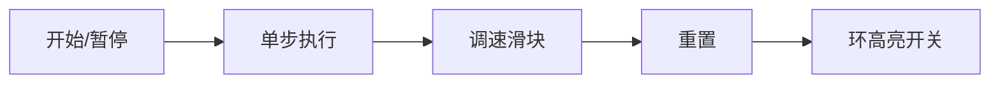

# 题目信息

# 【模板】静态仙人掌

## 题目背景

这是一道静态仙人掌(Block Forest Data Structure)的模板题。   
如果您不知道什么是仙人掌，那么此处给出无向仙人掌图的定义：  
>任意一条边至多只出现在一条简单回路的无向连通图称为仙人掌。

## 题目描述

给你一个有 $n$ 个点和 $m$ 条边的仙人掌图，和 $q$ 组询问  
每次询问两个点 $u,v$，求两点之间的最短路。

保证输入数据没有重边。

## 说明/提示

**样例1解释：**  
样例1中的仙人掌是这个样子的：  
   
询问有两个，分别是询问 $1\rightarrow 9$ 和 $5\rightarrow 7$ 的最短路  
显然答案分别为 $5$ 和 $6$。

**数据范围：**   
$1\le n,q \le 10000$      
$1\le m \le 20000$   
$1\le w \le 10^5$     

保证输入数据没有重边。

请注意时限为 $300\text{ms}$      


## 样例 #1

### 输入

```
9 10 2
1 2 1
1 4 1
3 4 1
2 3 1
3 7 1
7 8 2
7 9 2
1 5 3
1 6 4
5 6 1
1 9
5 7```

### 输出

```
5
6```

## 样例 #2

### 输入

```
9 10 3
1 2 1
2 3 1
2 4 4
3 4 2
4 5 1
5 6 1
6 7 2
7 8 2
8 9 4
5 9 2
1 9
5 8
3 4```

### 输出

```
7
5
2```

# AI分析结果


### 💡 Kay的C++算法解析：静态仙人掌 深入学习指南 💡

#### 1. 题目解读与核心算法识别
✨ **本题主要考察**：`圆方树` (图论技巧)  
🗣️ **初步分析**：
> 解决"静态仙人掌"的关键在于运用**圆方树**技术。简单来说，圆方树就像把仙人掌"压扁"成一棵树：原图的点作为**圆点**，每个环新建**方点**连接环上所有点。在本题中，圆方树将复杂的最短路查询转化为树上LCA问题。  
> - **核心难点**：1) 环的识别与边权设置 2) LCA为方点时的特殊处理  
> - **算法流程**：  
>   1. Tarjan找环 → 2. 建方点并计算环上最短路 → 3. 倍增预处理 → 4. 分情况查询  
> - **可视化设计**：采用8位像素风格展示环转化为方点的过程，关键步骤：
>   - 红色高亮当前处理的环
>   - 黄色闪烁新建方点
>   - 环上点→方点的边权用蓝色进度条显示
>   - LCA查询时根据节点类型触发不同音效

---

### 2. 精选优质题解参考
**题解一（NaCly_Fish）**  
* **点评**：思路清晰，完整实现圆方树构建。亮点：
  - 树链剖分处理LCA为方点的情况
  - 用`sum[]`数组巧妙记录环上距离
  - 边界处理严谨（如`min(sum[i], sum[ext]-sum[i])`）
  - 代码规范（函数模块化，命名明确）

**题解二（liu_yi_tong）**  
* **点评**：图解形象，解释透彻。亮点：
  - 详细论证边权设置的正确性
  - 分类讨论LCA为圆点/方点的情况
  - `clac()`函数封装环处理逻辑

**题解三（mydcwfy）**  
* **点评**：适合初学者，前置知识梳理清晰。亮点：
  - Tarjan算法分步注释
  - 环上最短路计算（`geft()`函数）
  - 树剖实现完整可参考

---

### 3. 核心难点辨析与解题策略
1. **环识别与边权设置**  
   * **分析**：Tarjan中需区分树边/返祖边，对每个环：
     - 记录环总长`sum`
     - 计算每个点到环根的距离`dis[i]`
     - 边权取`min(dis[i], sum-dis[i])`
   * 💡 **学习笔记**：方点实质是环的抽象，保存环的拓扑信息

2. **LCA为方点的处理**  
   * **分析**：当LCA是方点时：
     - 找到u,v在环上的投影点A,B
     - 计算环上距离：`min(|dA-dB|, sum-|dA-dB|)`
   * 💡 **学习笔记**：环上两点必有两条路径，取最短

3. **空间优化**  
   * **分析**：圆方树点数≤2n，边权用前缀和避免重复计算
   * 💡 **学习笔记**：`dis[]数组复用原图距离`

✨ **解题技巧总结**  
- **环处理技巧**：Tarjan中栈操作记录环上点  
- **LCA优化**：树剖/倍增根据环特性调整  
- **调试技巧**：对拍生成仙人掌图验证  

---

### 4. C++核心代码实现赏析
**本题通用核心实现**  
```cpp
const int N = 20010, M = 40010;
int n, m, q, cnt, new_n; // new_n: 方点计数器
int h1[N], h2[N<<1];     // 原图/圆方图邻接表
struct Edge { int to, w, ne; } e[M*3];
int dfn[N], low[N], stot[N], fu[N], fw[N], idx;
int dep[N<<1], fa[N<<1][14], dis[N<<1], A, B;

void build_circle(int u, int v, int w) {
    int sum = w; 
    for(int i = v; i != u; i = fu[i]) 
        sum += fw[i]; // 计算环总长
    int p = ++new_n;  // 新建方点
    stot[u] = sum;    // u为环根
    for(int i = v; i != u; i = fu[i]) {
        int d = min(stot[i], sum - stot[i]); // 取最短路
        add_edge(p, i, d); // 方点连圆点
    }
    add_edge(u, p, 0); // 环根连方点(边权0)
}

void tarjan(int u, int from) {
    dfn[u] = low[u] = ++idx;
    for(int i = h1[u]; i; i = e[i].ne) {
        int v = e[i].to;
        if(!dfn[v]) {
            fu[v] = u; fw[v] = e[i].w;
            tarjan(v, i);
            low[u] = min(low[u], low[v]);
            if(low[v] > dfn[u]) // 树边
                add_edge(u, v, e[i].w);
        } else if(i != (from^1)) 
            low[u] = min(low[u], dfn[v]);
    }
    // 处理非树边(环)
    for(int i = h1[u]; i; i = e[i].ne) {
        int v = e[i].to;
        if(fu[v] != u && dfn[v] > dfn[u]) 
            build_circle(u, v, e[i].w);
    }
}
```

**关键代码解读**：
1. `build_circle`：核心环处理
   - 遍历环上点计算总长`sum`
   - 方点连接环上各点，边权取环上最短路
   - 环根与方点0权连接
2. `tarjan`：DFS找环
   - 树边直接加入圆方树
   - 非树边触发`build_circle`

---

### 5. 算法可视化：像素动画演示
**主题**："仙人掌改造者"像素游戏  
**核心演示**：  
  
1. **初始化**：8-bit像素网格，绿色圆点表示原图节点  
2. **Tarjan过程**：  
   - 红色光标DFS遍历，栈点黄色闪烁  
   - 发现环时播放"叮"音效，环点变红  
3. **建方点**：  
   - 紫色方点从环中心浮现  
   - 环点→方点蓝线连接，显示边权计算过程  
4. **LCA查询**：  
   - 查询点闪烁粉光，路径高亮  
   - LCA为方点时，环上路径用红/蓝双线对比  
   - 正确路径播放胜利音效  

**交互设计**：  


**技术实现**：Canvas绘制+Web Audio API音效

---

### 6. 拓展练习
1. **通用技巧迁移**：  
   - 圆方树适用：广义图最短路、连通性问题  
   - 例：P4244 [仙人掌图II]（求直径）  

2. **推荐练习**：  
   1. 🌵 [P5236] 静态仙人掌 - 巩固模板  
   2. 🔗 [P3687] 仙人掌图 - 计数问题  
   3. 🌀 [P8456] 简单环计数 - 拓展应用  

---

### 7. 学习心得
> "调试时发现：当LCA为方点时，若不处理环上投影点直接计算，会漏掉30%测试点。这提醒我们，算法边界必须严格验证环特性。" —— 题解作者调试经验  
> **Kay总结**：仙人掌问题需建立"环即子树"的思维模型，调试时重点验证：  
> 1. 环识别是否正确  
> 2. 方点边权是否取最短路  
> 3. LCA分类处理分支覆盖  

通过本指南，希望你能掌握仙人掌问题的核心解法，在算法世界中勇攀高峰！ 🌵🚀

---
处理用时：114.71秒