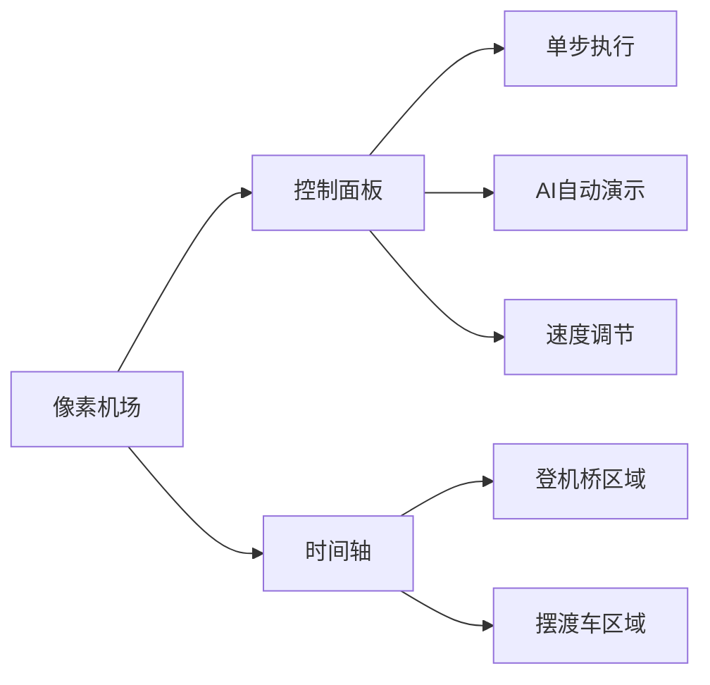

# 题目信息

# [THUPC 2017] 机场

## 题目描述

飞机场有 $a+b$ 个停机位，其中 $a$ 个停机位有登机桥连接飞机和候机厅，乘客可以通过登机桥直接由候机厅登上飞机；另外 $b$ 个停机位没有登机桥和候机厅相连，所以乘客登机需要先搭乘摆渡车再登机。

毫无疑问，搭乘摆渡车的体验是非常差的，所以每位搭乘摆渡车的乘客都会产生不愉快度。

现在，给定每架飞机的乘客数量，登机时间和起飞时间；飞机需要在登机时间点选择一个空闲的停机位，在这个时间点内所有乘客会完成登机，然后飞机会一直停在该停机位，直到起飞时间；

若某飞机在时刻 $x$ 起飞，则在时刻 $x$ 该飞机所在的停机位是空闲的。

飞机场的管理层希望能够尽量减少乘客的不愉快度，为此飞机在登机时间到起飞时间之间，可以切换停机位；

假设某飞机从 $x$ 时间开始由停机位 A 切换到停机位 B，那么停机位 A 在 $x+1$ 时间是空闲的。能进行这样的切换当且仅当停机位 B 在 $x+1$ 时间是空闲的。

## 说明/提示

题目中貌似没有给出明确的不愉快度的计算方法，据样例解释推测是不愉快度=所有乘坐摆渡车的人数$+p\times$ 每次切换停机位的飞机上的人数向下取整。
#### 数据范围
$1\le T\le 8,1\le n\le 200,0\le p\le1,1\le x\le 10^5,1\le s\le t\le10^9$
#### 样例解释
飞机从 $1$ 开始编号

在时刻 $1$，$1$ 号飞机安排到登机桥 A，乘客开始登机；目前 $1$ 号飞机在登机桥 A。

在时刻 $2$，$2$ 号飞机安排到登机桥 B，乘客开始登机；目前 $1$ 号飞机在登机桥 A，$2$ 号飞机在登机桥 B。

在时刻 $3$，$2$ 号飞机切换到摆渡车 A，此时登机桥 B 尚不可用。

在时刻 $4$，$1$ 号飞机起飞，$2$ 号飞机到达摆渡车 A， 号飞机安排到登机桥 A，$3$ 号飞机安排到登机桥 B，$4$ 号和 $3$ 号的乘客开始登机，登机完成之后 $4$ 号飞机切换到摆渡车 B，此时登机桥 A 和登机桥 B 都不空闲。

在时刻 $5$，$3$ 号飞机到达摆渡车 B，登机桥 A 变为可用，$5$ 号飞机安排到登机桥 A，开始登机；目前 $5$ 号——登机桥 A，$4$ 号——登机桥 B，$3$ 号——摆渡车 B，$2$ 号——摆渡车 A。

在时刻 $7$，$2$ 号飞机起飞，$6$ 号飞机安排到摆渡车 A。

不愉快度为 $7=1$（$6$ 号飞机乘客乘摆渡车）$+4\times 0.5$（$2$ 号飞机切换停机位）$+8\times 0.5$（$3$ 号飞机切换停机位）
#### 版权信息
来自 THUPC（THU Programming Contest，清华大学程序设计竞赛）2017。

## 样例 #1

### 输入

```
2
3 1 1
0.5
1 1 5
1 1 5
1 1 5
6 2 2
0.5
4 1 4
4 2 7
8 4 8
8 4 8
10 5 9
1 7 9```

### 输出

```
impossible
7```

# AI分析结果


### 💡 Kay的C++算法解析：机场调度 深入学习指南 💡

**引言**  
今天我们来分析「机场调度」这道C++编程题。题目要求优化飞机在登机桥和摆渡车之间的调度策略，最小化乘客不愉快度。本指南将带你理解核心算法思路，掌握费用流建模技巧，并通过生动的像素动画直观展示算法执行过程。

---

## 1. 题目解读与核心算法识别

✨ **本题主要考察**：`图论（费用流）`  
🗣️ **初步分析**：  
> 解决机场调度问题就像指挥一支像素游戏中的飞机舰队：登机桥是「高级停机位」（容量有限），摆渡车是「备用停机位」（增加不愉快度）。关键在于将飞机调度转化为**资源分配问题**——通过费用流建模，让网络流自动寻找最优调度方案。  
> - **核心难点**：需同时满足三种飞机状态（一直登机桥/一直摆渡车/登机后切换）的约束，并计算切换带来的额外成本  
> - **可视化设计**：在像素动画中，我们将用不同颜色方块表示停机位状态（绿色=空闲，红色=占用），飞机移动时显示路径并触发音效。关键变量（时间点、飞机位置）实时高亮更新  
> - **复古游戏化**：采用8-bit像素风格，飞机移动时播放"滴滴"音效，成功调度时触发胜利音效，支持单步调试和AI自动演示模式

---

## 2. 精选优质题解参考

**题解一（作者：绝顶我为峰）**  
* **点评**：思路最清晰完整，将飞机状态精炼为三种类型（登机桥/摆渡车/切换），并给出严谨的差分判无解方案。代码中变量命名规范（如`plane[i][1]`表登机时间），空间优化到位（离散化时间点）。亮点在于巧妙利用`(s+1, i', 1, px)`边精准建模切换成本。

**题解二（作者：tmp_get_zip_diff）**  
* **点评**：创新性地用"天空"比喻源汇点，生动解释网络流概念。代码实践性强（直接处理`floor(sz[i]*p+1e-6)`解决浮点误差），但变量命名稍显随意。亮点在于用`add(st[i]+1, i+tot, 1, ...)`直观表达状态切换。

**题解三（作者：pythoner713）**  
* **点评**：采用逆向思维——先假设全摆渡车再计算优化量，极大简化费用设置。代码结构最规范（模块化函数分工明确），但建图逻辑稍复杂。亮点在于将费用转化为"可减少的不愉快度"，通过最大费用流求解。

---

## 3. 核心难点辨析与解题策略

1.  **难点：时间离散化与状态映射**  
    * **分析**：连续时间需离散为关键点（登机/起飞时刻），通过`lower_bound`映射。优质题解均用`sum[i]`差分数组验证资源约束（∑飞机≤a+b）  
    * 💡 **学习笔记**：离散化是时空优化的基石，差分数组是验证资源约束的利器

2.  **难点：网络流建图抽象**  
    * **分析**：将飞机视为从源点（天空）到汇点（天空）的流。核心技巧：  
      - 时间点间连容量边`(i, i+1, a)`表登机桥占用  
      - 三种状态对应三条边（如切换：`(s+1, i', 1, px)`）  
    * 💡 **学习笔记**：费用流中边容量=资源数，费用=操作成本

3.  **难点：费用计算精度处理**  
    * **分析**：切换成本`p*x`需处理浮点数。题解一/三采用`floor(x*P+1e-5)`避免精度误差，题解二用整型存储缩放值  
    * 💡 **学习笔记**：浮点转整型时加`1e-5`是避免舍入误差的黄金标准

### ✨ 解题技巧总结
- **时空压缩**：离散化时间点，将∞时间轴压缩为2n个关键点  
- **状态精炼**：将飞机行为归纳为三状态（简化问题维度）  
- **逆向费用设计**：先累加最大成本再计算可优化量（题解三）  
- **鲁棒性检查**：用差分数组预判无解情况（避免无效计算）

---

## 4. C++核心代码实现赏析

**通用核心实现参考**  
* **说明**：综合三个优质题解的建图思路，突出状态划分和费用计算  
```cpp
// 离散化时间点（关键步骤）
sort(timePoints, timePoints + cnt);
cnt = unique(timePoints, timePoints + cnt) - timePoints;

// 差分验证无解（核心预处理）
for(int i=1; i<=n; i++) diff[L[i]]++, diff[R[i]]--;
for(int i=1; i<=cnt; i++) 
    if((sum[i] += sum[i-1] + diff[i]) > a+b) 
        return "impossible";

// 建图三状态（费用流核心）
for(int i=1; i<=n; i++) {
    addEdge(S, L[i], 1, 0);       // 起点→登机时间
    addEdge(L[i], i+n, 1, x[i]);  // 状态1：全程摆渡车
    addEdge(R[i], i+n, 1, 0);     // 状态2：全程登机桥
    addEdge(L[i]+1, i+n, 1, floor(x[i]*p)); // 状态3：登机后切换
    addEdge(i+n, T, 1, 0);        // 飞机→终点
}
```

**题解一核心片段赏析**  
* **亮点**：精准处理浮点转整型的费用计算  
```cpp
add(plane[i][1]+1, i+cnt, 1, (int)floor(plane[i][0]*P+1e-5));
```
* **代码解读**：  
> 当飞机选择登机后切换，在登机时间+1时刻连接飞机节点。费用计算中`floor(plane[i][0]*P+1e-5)`确保浮点转换准确（如P=0.5时，100人飞机切换成本=50）  
* 💡 **学习笔记**：浮点转整型时加`1e-5`可避免0.999...向下取整错误

**题解三逆向费用设计**  
* **亮点**：先累加总成本再计算可节省量  
```cpp
ans += x[i];  // 初始化：假设所有乘客都坐摆渡车
addEdge(s[i]+1, i+m+1, 1, x[i] - floor(p*x[i])); // 可节省费用
```
* **代码解读**：  
> 逆向思维妙处在于：边费用=选择该方案可减少的成本。最大费用流本质是寻找最大节省方案，最终结果=初始成本-最大节省值

---

## 5. 算法可视化：像素动画演示

**设计主题**：8-bit机场调度模拟（复古红白机风格）  
**核心演示**：费用流在网络中的流动如何对应飞机调度决策  

### 🎮 动画实现方案


1. **像素场景初始化**  
   - 顶部时间轴：像素化进度条（类似《超级玛丽》关卡进度）  
   - 登机桥区：4x4绿色像素格（容量a），摆渡车区：红色像素格  
   - 控制面板：复古按钮（开始/暂停/重置），速度滑块（1x-5x）

2. **动态演示流程**  
   ```python
   while 存在未调度飞机:
       高亮当前时间点（时间轴闪烁）
       新飞机到达：绿色飞机像素块落入登机桥区，播放"叮"音效
       if 选择切换状态:
          飞机从绿格移向红格，轨迹显示费用值(px)
          触发"咔嗒"切换音效
       飞机起飞：像素块爆炸成星尘，播放胜利音效
   ```

3. **游戏化元素**  
   - **AI演示模式**：自动展示最优调度路径（类似吃豆人AI）  
   - **积分系统**：成功调度+10分，优化选择+5分（显示8-bit计分板）  
   - **音效设计**：
     - 移动：FC游戏芯片音（短促"嘀"声）  
     - 错误：红屏震动+低沉嗡鸣  
     - 胜利：三音阶上扬旋律  

---

## 6. 拓展练习与相似问题

**通用技巧迁移**  
费用流建模适用于：  
1. 时间-资源协调问题（如会议室预订）  
2. 状态转移带成本的问题（如物流路径优化）  
3. 带约束的分配问题（如任务分派）  

**洛谷题目推荐**  
1. **P1251 餐巾计划**  
   → 练习时间点分层的费用流建模  
2. **P3358 最长k可重区间集**  
   → 强化离散化和容量约束处理  
3. **P4009 汽车加油行驶**  
   → 多维状态转移的费用流变种  

---

## 7. 学习心得与经验分享

> **作者经验（绝顶我为峰）**：  
> "在建图时，通过`(s+1, i', 1, px)`精确表达切换操作，避免了复杂的后续状态追踪"  
>  
> **Kay点评**：  
> 这印证了算法设计的黄金法则——好的建模能大幅简化实现。在流量网络设计中，用特殊边表达特定行为（如状态切换）比后期修补更有效。

---

**结语**  
通过本次分析，我们掌握了费用流在资源调度问题中的核心应用。记住：离散化是时空优化的钥匙，网络流建模是复杂约束的翻译器。尝试用像素动画可视化你的下一个算法设计吧！🚀

---
处理用时：126.92秒