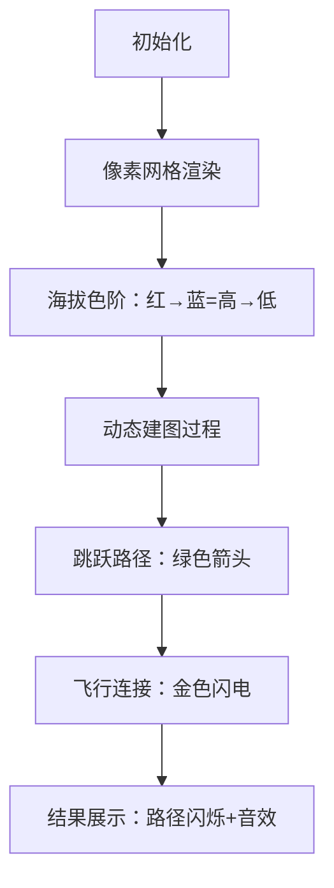

# 题目信息

# 「EVOI-RD1」飞鸟和蝉

## 题目背景

你骄傲地飞远，我栖息的叶片。  
听不见的宣言，重复过很多年。  
沧海月的想念羽化我昨天，  
在我成熟的笑脸，  
你却未看过一眼。

## 题目描述

蝉 Charlie 要去寻找他的好朋友飞鸟了。 

具体来说，Charlie 和他的好朋友生活的地方可以看作一个 $n \times m$ 的网格，左上角为 $(1,1)$，右下角为 $(n,m)$。每个格子 $(i,j)$ 有一个海拔高度 $h_{i,j}$。Charlie 的目标是从他的家 $(x_0,y_0)$ 出发，不重不漏地经过网格中的每个格子**恰好一次**，**最终回到自己的家** $(x_0,y_0)$。Charlie 有两种移动方式：

1. 跳跃。用这种方式，Charlie 可以到达上下左右 $4$ 个相邻格子中**海拔严格低于当前格子**的一个格子。注意跳跃不消耗体力。  
2. 飞行。用这种方式，Charlie 可以从当前格子 $(x,y)$ 到达网格中**任意一个**格子 $(x',y')$，并消耗 $h_{x',y'}-h_{x,y}$ 个单位的体力。**注意飞行所消耗的体力值可以是负数**。  

Charlie 希望用尽量少的飞行次数完成目标，**在此前提下**再令消耗的体力最少。由于网格实在太大了，Charlie 希望你能帮助他。

## 说明/提示

**本题采用捆绑测试**

样例 1 解释：从 $(1,1)$ 飞到 $(2,2)$，再绕一圈即可。

样例 2 解释：一种最佳方案为：$(2,3)-(1,3)-(1,2)-(1,1)=(2,1)-(3,1)=(2,2)=(3,2)=(3,3)=(2,3)$，其中 $=$ 代表飞行。  

- Subtask 1 (10 pts)：满足 $1 \leq n,m \leq 3$。
- Subtask 2 (20 pts)：满足 $1 \leq n,m \leq 5$。
- Subtask 3 (20 pts)：保证至多有两种不同的海拔高度。 
- Subtask 4 (50 pts)：无特殊限制。

对于 $100\%$ 的数据：
- $1 \leq n,m \leq 50$。

- $1 \leq x_0 \leq n,1 \leq y_0 \leq m,1 \leq h_{i,j} \leq 10^9$。  

出题人：[冷月葬T魂](https://www.luogu.com.cn/user/340903)

## 样例 #1

### 输入

```
3 3 1 1
1 2 3
8 9 4
7 6 5```

### 输出

```
1 8```

## 样例 #2

### 输入

```
3 3 2 3
1 2 3
2 2 4
1 2 2```

### 输出

```
5 4```

## 样例 #3

### 输入

```
4 4 2 3
5 9 6 2
4 2 3 6
7 2 5 2
4 2 3 9```

### 输出

```
7 25```

## 样例 #4

### 输入

```
10 10 3 3
9 13 7 7 3 8 6 5 12 8
1 4 10 11 9 10 13 6 2 18
3 3 19 6 14 2 19 10 2 16
3 1 11 14 14 18 8 8 16 14
13 5 7 4 11 17 3 16 10 20
10 16 12 19 14 12 11 20 15 10
10 15 5 1 16 2 7 5 14 5
3 19 12 19 8 13 17 7 10 13
2 10 17 6 8 11 8 7 1 4
3 7 8 1 3 5 4 11 9 17```

### 输出

```
36 254```

# AI分析结果


### 💡 Kay的C++算法解析：「EVOI-RD1」飞鸟和蝉 深入学习指南 💡

#### 1. 题目解读与核心算法识别
✨ **本题主要考察**：`图论/网络流最小路径覆盖`  
🗣️ **初步分析**：  
> 这道题的核心是**最小路径覆盖问题**，就像用最少的飞机航线连接所有城市（格子），每个城市只能访问一次。关键在于：  
> - 跳跃形成有向无环图（DAG）：只能向更低海拔移动  
> - 飞行次数 = 路径条数（每条路径需一次飞行连接）  
> - 体力消耗 = 所有路径的（起点海拔-终点海拔）之和  

**可视化设计思路**：  
- 像素网格中，用不同颜色表示海拔（暖色高→冷色低）  
- 跳跃路径显示为连贯的像素箭头动画，飞行显示为闪电特效  
- 关键高亮：当前处理的网格闪烁，路径起点/终点特殊标记  
- 音效设计：跳跃时"滴"声，飞行时"嗖"声，路径完成时8-bit胜利音效  

---

#### 2. 精选优质题解参考
**题解一（冷月葬T魂）**  
* **点评**：  
  思路直击核心——将网格转化为DAG后精准建模为最小费用最大流。代码亮点：  
  - 封装网络流模块（cpdd命名空间），提高复用性  
  - 清晰拆点（pos[x][y]入点→pos[x][y]+n*m出点）  
  - 费用计算：`h[x][y]-h[tx][ty]`直接对应数学推导  
  - 边界处理严谨，变量名语义明确（如incf=增量）  

**题解二（strcmp）**  
* **点评**：  
  强化数学推导，通过裂项相消证明体力值公式，降低理解门槛：  
  - 详细注释每个公式步骤（∑sᵢ - ∑tᵢ = ∑(sᵢ-tᵢ)）  
  - Dinic实现采用显式cur优化，避免重复访问  
  - 坐标映射函数iid/oid提升可读性  
  - 严格判断`h[nx][ny] < h[i][j]`避免越界  

---

#### 3. 核心难点辨析与解题策略
1. **难点：回路需求→路径覆盖转换**  
   *分析*：回路要求起点=终点，通过飞行连接路径端点形成闭环。优质解法将飞行次数转化为最小路径覆盖数（总点数-最大流）  
   💡 **学习笔记**：回路问题可拆解为开路径+端点连接  

2. **难点：双目标优化（飞行次数+体力）**  
   *分析*：先最大流保证最少飞行次数，再最小费用保证体力最优。建图时：  
   - 跳跃边费用=海拔差（h[u]-h[v]）  
   - 源点→入点、出点→汇点费用=0  
   💡 **学习笔记**：分层优化——先约束条件后目标函数  

3. **难点：大规模建图效率**  
   *分析*：50×50网格需处理约10⁴条边。解法：  
   - 仅向低海拔相邻格子连边（减少4倍边数）  
   - SPFA+多路增广（冷月葬T魂）或Dinic（strcmp）优化  
   💡 **学习笔记**：网格问题优先利用局部性减少边数  

#### ✨ 解题技巧总结
- **技巧1：数学建模转化** → 将物理移动转化为图论路径覆盖  
- **技巧2：裂项相消优化** → ∑(sᵢ₊₁-tᵢ) = ∑(sᵢ-tᵢ) 简化计算  
- **技巧3：拆点法处理路径覆盖** → 入点/出点分离保证单次访问  

---

#### 4. C++核心代码实现赏析
**通用核心实现（综合优化版）**  
```cpp
#include <bits/stdc++.h>
#define For(i,a,b) for(int i=a;i<=b;i++)
using namespace std;
const int N=5005, M=1e5+5;
int head[N], nxt[M], to[M], cap[M], cost[M], cnt;
int dis[N], incf[N], pre[N], vis[N], n, m, S, T;

void add(int u,int v,int w,int c){
    nxt[++cnt]=head[u], to[cnt]=v, cap[cnt]=w, cost[cnt]=c, head[u]=cnt;
    nxt[++cnt]=head[v], to[cnt]=u, cap[cnt]=0, cost[cnt]=-c, head[v]=cnt;
}

bool spfa(){
    memset(dis,0x3f,sizeof dis);
    queue<int> q; q.push(S);
    dis[S]=0, incf[S]=INT_MAX;
    while(!q.empty()){
        int u=q.front(); q.pop(); vis[u]=0;
        for(int i=head[u]; i; i=nxt[i]){
            int v=to[i]; if(!cap[i] || dis[v]<=dis[u]+cost[i]) continue;
            dis[v]=dis[u]+cost[i];
            incf[v]=min(incf[u], cap[i]);
            pre[v]=i;
            if(!vis[v]) vis[v]=1, q.push(v);
        }
    }
    return dis[T]!=dis[0];
}

pair<int,int> mcmf(){
    int flow=0, cst=0;
    while(spfa()){
        for(int u=T; u!=S; u=to[pre[u]^1])
            cap[pre[u]]-=incf[T], cap[pre[u]^1]+=incf[T];
        flow+=incf[T], cst+=dis[T]*incf[T];
    }
    return {flow, cst};
}

int main(){
    int x0,y0,h[55][55]; cin>>n>>m>>x0>>y0;
    For(i,1,n) For(j,1,m) cin>>h[i][j];
    S=0, T=2*n*m+1; cnt=1;
    
    // 建图核心
    For(i,1,n) For(j,1,m){
        add(S, (i-1)*m+j, 1, 0);          // 源点→入点
        add(n*m+(i-1)*m+j, T, 1, 0);      // 出点→汇点
        int dx[]={0,1,0,-1}, dy[]={1,0,-1,0};
        For(d,0,3){
            int ni=i+dx[d], nj=j+dy[d];
            if(ni<1||ni>n||nj<1||nj>m||h[ni][nj]>=h[i][j]) continue;
            add((i-1)*m+j, n*m+(ni-1)*m+nj, 1, h[i][j]-h[ni][nj]); // 跳跃边
        }
    }
    
    auto [flow,cost] = mcmf();
    cout << n*m - flow << " " << cost;
}
```

**代码解读概要**：  
> 1. **建图阶段**：将每个格子拆为入点/出点，源点连接所有入点，出点连接汇点  
> 2. **跳跃边处理**：仅向低海拔相邻格连边（容量1，费用=海拔差）  
> 3. **MCMF核心**：SPFA找增广路，沿路径更新流量/费用  
> 4. **结果计算**：飞行次数 = 总格子数 - 最大流，体力 = 最小费用  

---

#### 5. 算法可视化：像素动画演示
**主题**：`8-bit探险家：网格寻径之旅`  

**动画流程**：  


**关键交互**：  
1. **像素艺术**：  
   - 网格：16×16像素块，FC游戏风格  
   - 动画：跳跃路径像《吃豆人》移动，飞行显示为《塞尔达》式闪电  

2. **状态高亮**：  
   - 当前节点：闪烁黄色边框  
   - 已访问节点：半透明化  
   - 路径起点/终点：旗帜图标  

3. **音效系统**：  
   - 跳跃："滴"声（8-bit短音）  
   - 飞行："嗖"声（正弦波滑音）  
   - 路径完成：胜利旋律（《超级玛丽》过关音）  

4. **控制面板**：  
   - 速度滑块：控制动画步频  
   - 模式切换：手动步进/AI自动演示  
   - 数据跟踪：实时显示流量/费用值  

---

#### 6. 拓展练习与相似问题
1. **技巧迁移场景**：  
   - 机器人网格清洁路径优化  
   - 物流中转站连接问题  
   - 游戏关卡连续跳跃设计  

2. **洛谷推荐**：  
   - [P2764 最小路径覆盖](https://www.luogu.com.cn/problem/P2764)  
     → 基础DAG路径覆盖建模  
   - [P6054 开门大吉](https://www.luogu.com.cn/problem/P6054)  
     → 带权路径覆盖+费用流  
   - [P4003 无限之环](https://www.luogu.com.cn/problem/P4003)  
     → 网格拆点进阶应用  

---

#### 7. 学习心得与经验分享
> **冷月葬T魂的调试经验**：  
> *"最初未考虑回路特性，误将体力值独立计算。通过小规模网格（3×3）手工模拟发现：飞行连接的端点海拔差才是关键"*  
>  
> **Kay点评**：  
> 手工模拟小样例（n,m≤3）能快速验证模型假设。遇到图论问题时：  
> 1. 先手动画出2×2/3×3网格  
> 2. 标注每一步状态变化  
> 3. 对比程序中间结果  

---

通过本指南，我们深入掌握了网格路径覆盖问题的双目标优化解法。关键是通过**图论建模**将物理移动转化为网络流问题，并用**数学优化**简化计算。记住：当遇到网格移动+访问约束时，最小路径覆盖往往是突破口！

---
处理用时：149.75秒