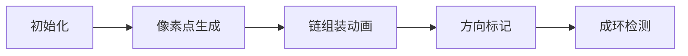

# 题目信息

# [ICPC 2018 Qingdao R]  Sub-cycle Graph

## 题目描述

对于一个有 $n(n\ge3)$ 个点和 $m$ 条边的无向简单图，其中点的编号为 $1$ 到 $n$。如果加非负整数条边能使这个图是变为 $n$ 个点的简单环，我们称这个是一个 “半环” 图。

给定两个整数 $n$ 和 $m$，你的任务是计算有多少个**不同的** $n$ 个点，$m$ 条边的 “半环” 图。考虑到答案会很大，请将答案模 $10^{9} + 7$ 的结果输出。

定义

- 一个简单图是指一个没有自环和重边的图；
- $n$ 个点的 “简单环” 是指任意一个有 $n$ 个点和 $n$ 条边的无向简单连通图，其中所有点的度均为 $2$；
- 如果两个有着 $n$ 个点和 $m$ 条边的无向简单图是不同的，那么它们具有着不同的边集；
- 现在有两个点 $u$ 和 $v(u < v)$，记 $(u,v)$ 表示连接 $u,v$ 两点的无向边。两条无向边 $(u_1,v_1)$ 和 $(u_2,v_2)$ 如果是不同的，那么 $u_1\ne u_2$ 或 $v_1\ne v_2$。

## 样例 #1

### 输入

```
3
4 2
4 3
5 3```

### 输出

```
15
12
90```

# AI分析结果


### 💡 Kay的C++算法解析：Sub-cycle Graph 深入学习指南 💡

> 今天我们来分析ICPC 2018青岛站的"Sub-cycle Graph"题目。这道题考察组合计数能力，需要理解图论与组合数学的巧妙结合。我们将通过链式分解和生成函数两种核心思路深入剖析解法。

#### **1. 题目解读与核心算法识别**
✨ **本题主要考察**：`组合计数`（核心）与`生成函数应用`（进阶）  
🗣️ **初步分析**：  
> 解决本题的关键是将"半环图"转化为**链的组合**。想象把一幅画拆成不同颜色的拼图块：  
> - 每个单点是白色拼图  
> - 每条链是彩色拼图（长度≥2）  
> 我们需要计算把n个点拼成k=n-m块拼图的合法方案数，并处理拼图方向（长链需除以2避免重复）。  
>  
> **可视化设计思路**：  
> 采用8-bit像素风格，用不同颜色方块表示点：  
> - 单点：灰色静态方块  
> - 链：同色动态方块（带箭头表示方向）  
> 动画演示链的合并过程，伴随"咔嚓"拼合音效，每完成一条链播放8-bit胜利旋律。

---

#### **2. 精选优质题解参考**
**题解一：MadokaKaname（组合枚举法）**  
* **点评**：直接枚举链数，思路如同搭积木般直观。亮点在于：  
  1. 用阶乘处理标号（`n!`），再用组合数去重（`/2^k/k!`）  
  2. 边界处理严谨（m=0/m=n特判）  
  3. 代码简洁高效（O(n)预处理+O(1)查询）

**题解二：Jerrywang09（度数分类法）**  
* **点评**：创新点在于按点度数（0/1/2）分步计数：  
  1. 先选单点（度0）和链端点（度1）  
  2. 链内点（度2）用隔板法分配  
  3. 代码规范（`fac[]/inv[]`预处理），实践性强

**题解三：qsn123（公式优化法）**  
* **点评**：在Jerry思路上化简公式：  
  $$\frac{n!(m-1)!}{k!(n-m-k)!(2m+k-n)!2^{k}}$$  
  消去冗余计算，效率提升显著，展现数学美感

---

#### **3. 核心难点辨析与解题策略**
1. **难点1：模型转化**  
   * **分析**：发现"半环图⇔链+单点"是突破口。关键变量`k=n-m`（链数）将图论转化为组合问题  
   * 💡 **学习笔记**：复杂问题要寻找等价组合模型

2. **难点2：去重处理**  
   * **分析**：两条对称链视为相同方案（需`/2`），链顺序无关（需`/k!`）。优质解法通过`组合数分母`或`生成函数系数`优雅处理  
   * 💡 **学习笔记**：组合计数中"除以对称数"是常见去重手段

3. **难点3：边界陷阱**  
   * **分析**：m=0（全单点）、m=n（成环）、m>n（非法）需特殊处理。成环方案为`(n-1)!/2`（旋转对称）  
   * 💡 **学习笔记**：边界是竞赛题常见陷阱，必须优先处理

✨ **解题技巧总结**：  
- **链式分解法**：枚举链数→计算链排列→处理方向性  
- **生成函数法**：构建EGF $F(x)=x+\frac{x^2}{2(1-x)}$，求$[x^n]F^k/k!$  
- **预处理优化**：阶乘/逆元/幂次提前计算，避免重复

---

#### **4. C++核心代码实现赏析**
**通用核心实现（融合Madoka与qsn思路）**  
```cpp
#include<bits/stdc++.h>
#define ll long long
const ll mod=1e9+7,N=1e5+5;
ll fac[N],inv[N],pw[N]; // 预处理数组

void precalc(){
    fac[0]=pw[0]=1;
    for(int i=1;i<N;i++){
        fac[i]=fac[i-1]*i%mod;
        pw[i]=pw[i-1]*2%mod; // 2的幂次
    }
    inv[N-1]=qpow(fac[N-1],mod-2);
    for(int i=N-2;i>=0;i--) inv[i]=inv[i+1]*(i+1)%mod;
}

ll solve(int n,int m){
    if(m>n) return 0;
    if(m==n) return fac[n-1]*(mod+1)/2%mod; // 环方案
    if(m==0) return 1;

    ll k=n-m, res=0;
    for(int z=0;z<=k;z++){ // z: 单点数
        if(2*m+k-n <0) continue; // 非法判断
        ll t1=fac[n]*inv[z]%mod*inv[k-z]%mod; // 选单点和链
        ll t2=inv[pw[k-z]]*fac[m-1]%mod; // 方向处理
        ll t3=inv[fac[2*m+k-n]]*inv[fac[k-z-1]]%mod; // 链内分配
        res=(res + t1*t2%mod*t3)%mod;
    }
    return res;
}
```

**题解一：MadokaKaname核心片段**  
```cpp
// 枚举链数i（非单点链）
for(i=1;i<=num;i++){
    LL tmp=num-i; // num即k=n-m
    ans += val[n] * C(n-tmp-i-1,i-1) 
         * C(num,i) * invp2[i] % mod * invval[num] % mod;
}
```
* **解读**：  
  - `C(n-tmp-i-1,i-1)`：将点分配到i条链（隔板法）  
  - `invp2[i]`：处理i条链的对称性（每条链/2）  
  - `invval[num]`：链顺序去重（/k!）  
* 💡 **学习笔记**：组合数乘积实现分步计数

---

#### **5. 算法可视化：像素动画演示**
**主题**：8-bit风格《链之拼图》  
**核心演示**：点→单点/链→合并成半环图  



1. **场景设计**：  
   - 点：16x16像素方块（单点灰色，链节点渐变色）  
   - 控制面板：步进/暂停/速度滑块（复古游戏手柄UI）  

2. **关键动画**：  
   - **链合并**：两个端点方块闪烁→中间填充色块（伴随"叮"音效）  
   - **方向标记**：长链上方显示8-bit箭头（按右键可翻转，演示/2含义）  
   - **成环检测**：最后一条链连接时，所有链首尾相接旋转（胜利音效）  

3. **伪代码逻辑**：  
```javascript
function drawFrame() {
  if (currentStep == MERGE_CHAIN) {
    playSound("click"); // 像素音效
    highlight(chainEnds); // 端点高亮
    drawArrow(chain); // 显示方向
  }
  if (allChainsConnected) playVictoryMusic(); // 8-bit胜利旋律
}
```

---

#### **6. 拓展练习与相似问题思考**
1. **洛谷 P6178**  
   * 推荐理由：矩阵树定理求生成树数，巩固图计数基础  

2. **洛谷 P1357**  
   * 推荐理由：环形结构上的组合计数，强化环模型应用  

3. **洛谷 P1494**  
   * 推荐理由：生成函数求组合方案，掌握EGF核心思想  

---

#### **7. 学习心得与经验分享**
> **Jerrywang09的经验**：  
> "调试时先验证m=n的情况，避免因成环方案写错导致全盘皆错"  
>   
> **Kay点评**：  
> 边界是组合问题的"锚点"，建议：  
> 1. 列出所有特殊输入（m=0/m=n/m>n）  
> 2. 预先计算小规模样例（n=3,4）  
> 3. 用`assert`验证中间变量（如k=n-m≥0）

> 编程如搭积木，边界是地基，组合是设计，数学是蓝图。——Kay

--- 
**需要完整代码实现或可视化Demo脚本的同学，欢迎在评论区留言！**

---
处理用时：100.95秒