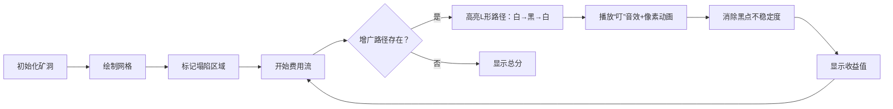

# 题目信息

# 洞穴遇险

## 题目背景

**ZRQ**在洞穴中准备采集矿物的时候遇险了！洞穴**要塌了**！

题目来源：[zhoutb2333](https://www.luogu.org/space/show?uid=31564)


## 题目描述

整个洞穴是一个$N*N$的方格图，每个格子形如$(X,Y),1 \le X,Y \le N$。其中$X$表示从上到下的行数，$Y$表示从左到右的列数。$(1,1)$在左上角,$(1,N)$在右上角，$(N,1)$在左下角，$(N,N)$在右下角。


满足$X+Y$为奇数格子的有一个不稳定度$V_{X,Y},X+Y$为偶数的格子的不稳定度为$0$。


**ZRQ**现在手里恰巧有$M$个可以支撑洞穴的柱子，柱子的力量可以认为是无穷大。


只要支撑住了一个格子那么这个格子的不稳定度将降为$0$。


每个柱子是$L$型的，它除了要占据当前的格子外，还需要占据两个相邻的格子（这三个格子形成$L$型,可以选择任意方向放置，一共有$4$个方向）。


  

**柱子占据相邻的格子不会降低其不稳定度（换句话说就是柱子只有在拐角处有力量）**。


有些格子的顶已经塌下来了，无法在其位置放置柱子了，这些格子也不能被占据了。这样已经塌了的格子有$K$个（他们的不稳定度都为$0$,**即使$X+Y$为奇数，塌下来的格子的不稳定度也会为$0$**）。


**ZRQ**想问你，在放置一些柱子后 ，最小的不稳定度之和为多少（可以不将$M$个柱子都放完）。


## 说明/提示

共$10$个测试点，每个点$10$分，计$100$分。


对于测试点$1$~$3$，有$1 \le N \le 6$


对于测试点$4$~$7$，有$1 \le N \le 11$


对于测试点$8$~$10$，有$1 \le N \le 50$


对于所有测试点，$0 \le M \le \frac{N^2}{3}, 0 \le K \le N^2, 0 \le V_{X,Y} \le 10^6$


**样例#1解释：**

显然无法让任意两个不稳定的格子都被拐角覆盖，于是将$(2,1)$用拐角覆盖住即可。这样剩余的不稳定度为$V_{1,2}+V_{2,3}+V_{3,2}=1+1+1=3$。

**样例#2解释：**

一个都放不下，这样剩余的不稳定度为$V_{1,2}+V_{2,3}+V_{3,2}=2+4+3=9$。


## 样例 #1

### 输入

```
3 3 1
0 1 0
2 0 1
0 1 0
1 3```

### 输出

```
3```

## 样例 #2

### 输入

```
3 3 4
0 2 0
0 0 4
0 3 0
1 3
2 1
2 2
3 1```

### 输出

```
9```

# AI分析结果


### 💡 Kay的C++算法解析：洞穴遇险 深入学习指南 💡

#### 1. 题目解读与核心算法识别
✨ **本题主要考察**：网络流建模（费用流）  
🗣️ **初步分析**：  
> 本题可抽象为**匹配问题**——将L型柱子覆盖转化为黑点与白点的匹配关系。想象在矿洞中，每个L型柱子就像连接两个矿车的轨道（白点），通过一个中转站（黑点）连接。核心是构建三分图（白点-黑点-白点），用费用流最大化消除的不稳定度（最小化剩余值）。  
> - 关键难点：将物理覆盖转化为网络流路径，确保L形结构形成  
> - 可视化设计：用像素网格动态展示柱子覆盖过程，高亮增广路径  
> - 复古游戏化：采用《矿工冒险》主题，柱子放置时触发"叮"音效，消除不稳定度时播放金币声，用8-bit风格展示矿洞网格  

---

#### 2. 精选优质题解参考
**题解一（zhoutb2333）**  
* **点评**：  
  思路清晰揭示L形本质→黑点拆点+白点分类。代码规范（`get()`封装坐标转换），巧妙处理反例：当增广费用>0时终止，避免次优解。实践价值高，完整处理塌陷格子和边界条件。

**题解四（yizhiming）**  
* **点评**：  
  建图结构严谨，通过超级源点（SS）显式限制柱子数量m。方向数组遍历相邻点提升可读性，DFS增广实现简洁。亮点：变量命名规范（`rk`表坐标转换），复杂度严格O(n²m)

---

#### 3. 核心难点辨析与解题策略
1. **难点：L形覆盖 → 网络流路径转换**  
   *分析*：通过黑白染色+列奇偶性分类，将柱子抽象为"奇数列白点→黑点→偶数列白点"路径。优质解用拆点（黑点分入/出点）确保单次使用  
   💡 **学习笔记**：物理结构→图论模型的转化能力是解题核心  

2. **难点：消除次数限制**  
   *分析*：黑点入点→出点连容量1的负权边（-Vₓ,ᵧ），既限制单次消除又计入收益  
   💡 **学习笔记**：拆点是处理点约束的通用技巧  

3. **难点：柱子数量约束**  
   *分析*：超级源点SS→S设容量m的边，或增广时计数终止  
   💡 **学习笔记**：有限资源问题常通过源点限流解决  

### ✨ 解题技巧总结
- **技巧1：图论建模思维** - 将物理约束转化为边容量/点拆分  
- **技巧2：费用流终止条件** - 当增广收益≤0时立即停止  
- **技巧3：坐标压缩技巧** - 用`(x-1)*n+y`将二维坐标线性化  

---

#### 4. C++核心代码实现赏析
**通用核心实现（综合题解四优化）**  
```cpp
#include <bits/stdc++.h>
using namespace std;
const int N=2e4+5, INF=1e9;

struct Edge { int to, val, w, nxt; } edge[N*10];
int head[N], tot=1, sum, cost;
int n, m, k, S, T, SS;
bool mp[55][55]; // 塌陷标记
int val[55][55]; // 不稳定度

inline int rk(int x, int y, int z) { 
    return (x-1)*n + y + z*n*n; 
} // 坐标压缩：z=0奇列白点,1黑入点,2黑出点,3偶列白点

void add(int u, int v, int f, int c) {
    edge[++tot] = {v, f, c, head[u]}; head[u]=tot;
    edge[++tot] = {u, 0,-c, head[v]}; head[v]=tot;
}

bool SPFA() { /* 最小费用流 */ }

int main() {
    // 初始化 & 输入处理
    SS = 4*n*n+2, S=0, T=4*n*n+1;
    add(SS, S, m, 0); // 超级源点限流
    
    for (int i=1; i<=n; ++i) for (int j=1; j<=n; ++j) {
        if (mp[i][j]) continue; // 跳过塌陷点
        if ((i+j)%2) { // 黑点（拆点）
            add(rk(i,j,1), rk(i,j,2), 1, -val[i][j]);
            for (int d : {-1,0,1,0}) { // 四方向
                int x=i+d, y=j+(d?0:1); // 相邻点坐标
                if (x<1||y<1||x>n||y>n||mp[x][y]) continue;
                (y%2) ? add(rk(x,y,0), rk(i,j,1),1,0) // 奇列白→黑入
                      : add(rk(i,j,2), rk(x,y,3),1,0); // 黑出→偶列白
            }
        } else { // 白点
            (j%2) ? add(S, rk(i,j,0),1,0)  // 奇列白连源
                  : add(rk(i,j,3), T,1,0); // 偶列白连汇
        }
    }
    while (SPFA()); // 持续增广
    cout << sum + cost; // 总不稳定度 + 负费用
}
```
**代码解读概要**：  
> 1. **坐标压缩**：`rk()`将三维状态(坐标+类型)映射到线性ID  
> 2. **超级源点**：SS→S的m容量边限制柱子数量  
> 3. **黑点处理**：拆点形成"入点→（负权边）→出点"结构  
> 4. **白点分流**：按列奇偶性连接源/汇，形成三分图  

**题解一核心片段赏析**  
```cpp
// 黑点拆点连接（zhoutb2333）
add(get(i,j,1), get(i,j,2), 1, -v[i][j]); 

// 白点相邻检测（方向数组简化版）
int dx[]={1,0,-1,0}, dy[]={0,1,0,-1};
for(int d=0; d<4; d++) 
    if(valid(x+dx[d], y+dy[d]))
        add(get(i,j,0), get(x,y,1),1,0);
```
💡 **学习笔记**：方向数组+坐标校验是网格遍历的黄金组合  

**题解四片段赏析**  
```cpp
// 费用流终止条件（yizhiming）
while (spfa()) 
    if(dis[T] >= 0) break; // 收益非负时终止
```
💡 **学习笔记**：实时判断增广收益避免次优解，提升效率关键  

---

### 5. 算法可视化：像素动画演示
**主题**：《矿工大冒险》8-bit风格费用流模拟  
**核心演示**：网格中L形柱子形成过程与不稳定度消除  



**交互设计**：  
1. **控制面板**：  
   - 速度滑块（调节自动播放速度）  
   - 单步执行（观察每根柱子形成）  
   - 重置/暂停按钮  
2. **动态效果**：  
   - 增广路径显示为发光的"矿车轨道"（黄→蓝渐变）  
   - 黑点消除时像素爆炸特效+金币飞入计分板  
   - 塌陷格子显示为裂纹岩石图案  
3. **音效系统**：  
   - 背景：8-bit循环矿洞BGM  
   - 事件音效：柱子放置（叮！），消除（金币声），结束（胜利号角）  

---

### 6. 拓展练习与相似问题思考
**通用技巧迁移**：  
> 网络流建模可解：资源分配问题、路径覆盖、二分图带权匹配  

**推荐练习**：  
1. **洛谷 P3358** 最长k可重区间集  
   → 练习流量限制与区间映射  
2. **洛谷 P4014** 分配问题  
   → 基础二分图最大权匹配  
3. **洛谷 P2770** 航空路线问题  
   → 拆点法应用+路径输出  

---

### 7. 学习心得与经验分享
> **关键调试经验**（综合题解）：  
> 1. 建图后打印边关系验证三分图结构  
> 2. 当WA时检查坐标映射是否重叠（尤其拆点后）  
> 3. 费用流初始总收益=0，最终结果应为负数  

---

通过本指南，希望大家掌握将物理约束转化为网络流模型的思维，并体验像素化算法演示的乐趣。下次探险再见！💪

---
处理用时：223.41秒