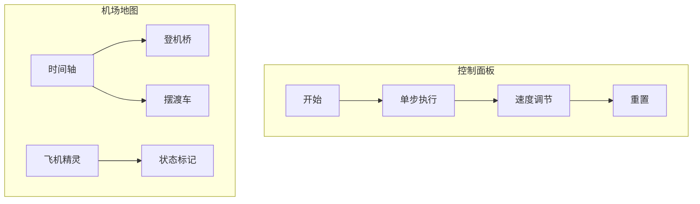

# 题目信息

# [THUPC 2017] 机场

## 题目描述

飞机场有 $a+b$ 个停机位，其中 $a$ 个停机位有登机桥连接飞机和候机厅，乘客可以通过登机桥直接由候机厅登上飞机；另外 $b$ 个停机位没有登机桥和候机厅相连，所以乘客登机需要先搭乘摆渡车再登机。

毫无疑问，搭乘摆渡车的体验是非常差的，所以每位搭乘摆渡车的乘客都会产生不愉快度。

现在，给定每架飞机的乘客数量，登机时间和起飞时间；飞机需要在登机时间点选择一个空闲的停机位，在这个时间点内所有乘客会完成登机，然后飞机会一直停在该停机位，直到起飞时间；

若某飞机在时刻 $x$ 起飞，则在时刻 $x$ 该飞机所在的停机位是空闲的。

飞机场的管理层希望能够尽量减少乘客的不愉快度，为此飞机在登机时间到起飞时间之间，可以切换停机位；

假设某飞机从 $x$ 时间开始由停机位 A 切换到停机位 B，那么停机位 A 在 $x+1$ 时间是空闲的。能进行这样的切换当且仅当停机位 B 在 $x+1$ 时间是空闲的。

## 说明/提示

题目中貌似没有给出明确的不愉快度的计算方法，据样例解释推测是不愉快度=所有乘坐摆渡车的人数$+p\times$ 每次切换停机位的飞机上的人数向下取整。
#### 数据范围
$1\le T\le 8,1\le n\le 200,0\le p\le1,1\le x\le 10^5,1\le s\le t\le10^9$
#### 样例解释
飞机从 $1$ 开始编号

在时刻 $1$，$1$ 号飞机安排到登机桥 A，乘客开始登机；目前 $1$ 号飞机在登机桥 A。

在时刻 $2$，$2$ 号飞机安排到登机桥 B，乘客开始登机；目前 $1$ 号飞机在登机桥 A，$2$ 号飞机在登机桥 B。

在时刻 $3$，$2$ 号飞机切换到摆渡车 A，此时登机桥 B 尚不可用。

在时刻 $4$，$1$ 号飞机起飞，$2$ 号飞机到达摆渡车 A， 号飞机安排到登机桥 A，$3$ 号飞机安排到登机桥 B，$4$ 号和 $3$ 号的乘客开始登机，登机完成之后 $4$ 号飞机切换到摆渡车 B，此时登机桥 A 和登机桥 B 都不空闲。

在时刻 $5$，$3$ 号飞机到达摆渡车 B，登机桥 A 变为可用，$5$ 号飞机安排到登机桥 A，开始登机；目前 $5$ 号——登机桥 A，$4$ 号——登机桥 B，$3$ 号——摆渡车 B，$2$ 号——摆渡车 A。

在时刻 $7$，$2$ 号飞机起飞，$6$ 号飞机安排到摆渡车 A。

不愉快度为 $7=1$（$6$ 号飞机乘客乘摆渡车）$+4\times 0.5$（$2$ 号飞机切换停机位）$+8\times 0.5$（$3$ 号飞机切换停机位）
#### 版权信息
来自 THUPC（THU Programming Contest，清华大学程序设计竞赛）2017。

## 样例 #1

### 输入

```
2
3 1 1
0.5
1 1 5
1 1 5
1 1 5
6 2 2
0.5
4 1 4
4 2 7
8 4 8
8 4 8
10 5 9
1 7 9```

### 输出

```
impossible
7```

# AI分析结果


### Kay的C++算法解析：机场调度问题 深入学习指南 💡

#### 题目解读与核心算法识别
✨ **本题主要考察**：`图论-网络流/费用流`  

🗣️ **初步分析**：
> 机场调度问题就像管理一个繁忙的机场塔台，需要为每架飞机安排停机位（登机桥或摆渡车）并决定是否切换位置。核心挑战在于**最小化乘客不愉快度**（乘坐摆渡车人数+切换惩罚）。  

- **算法核心**：费用流建模（类比水管网络）。将时间点视为水管节点，飞机视为水流，容量限制对应停机位数量，费用对应不愉快度。离散化时间后，通过三类边模拟飞机状态：  
  ```mermaid
  graph LR
    S(源点) -->|容量1| 登机时间点
    登机时间点 -->|费用x_i| 飞机节点
    登机时间点 -->|费用px_i| 飞机节点
    飞机节点 -->|费用0| 起飞时间点
    起飞时间点 --> T(汇点)
  ```
- **可视化设计**：像素塔台控制面板显示时间轴（横轴），飞机用不同颜色像素块表示。增广路径查找时播放"滴"音效，费用更新时高亮边，成功调度时触发胜利音效。

---

#### 精选优质题解参考
**题解一（作者：绝顶我为峰）**  
* **点评**：思路清晰地将飞机状态分解为三种情况（一直摆渡/一直登机桥/切换），离散化时间后精确建模。代码规范（如`plane[i][1]`存储离散化时间），亮点在于用差分数组快速判无解。费用计算`floor(plane[i][0]*P+1e-5)`避免浮点误差，实践价值高。

**题解二（作者：tmp_get_zip_diff）**  
* **点评**：创新性地用"天空"比喻源/汇点，强化概念理解。代码中`hig[]`数组优化DFS效率是亮点，但变量命名可读性稍弱（如`nbr`）。最大费用流实现完整，边界处理严谨。

**题解三（作者：pythoner713）**  
* **点评**：独特提出"先假设全摆渡车再减费用"的反向思维。代码模块化优秀（如`Work()`函数），离散化与差分统计分离提升可读性。`ans -= res * e[i].cost`巧妙实现费用扣除。

---

#### 核心难点辨析与解题策略
1. **时间离散化与节点设计**  
   * **分析**：时间范围高达10^9，需离散化为2n个点。优质解法均用`lower_bound`映射时间，`sum[]`数组统计时段飞机数。
   * 💡 **学习笔记**：离散化是处理大范围区间的黄金法则。

2. **费用流边权设置**  
   * **分析**：三种状态对应不同费用：  
     - 一直摆渡车：边权 = 乘客数`x_i`
     - 一直登机桥：边权 = 0
     - 切换停机位：边权 = `p * x_i`
   * 💡 **学习笔记**：费用值需用`floor(x*P+1e-5)`避免浮点误差。

3. **无解判定条件**  
   * **分析**：差分统计每个时刻飞机数，若超过`a+b`则无解。关键代码：
     ```cpp
     for(int i=1; i<=cnt; i++){
         sum[i] += sum[i-1];
         if(sum[i] > a+b) return "impossible";
     }
     ```

### ✨ 解题技巧总结
- **时空压缩**：大范围离散化 → 节点数从10^9降至400  
- **状态分解**：复杂行为拆解为原子操作（三种飞机状态）  
- **边界防御**：`floor(x+1e-5)`防御浮点误差，差分数组防御时段重叠  

---

### C++核心代码实现赏析
**通用核心实现参考**  
```cpp
#include <bits/stdc++.h>
using namespace std;

struct Edge { int to, cap, cost, rev; };
const int INF = 0x3f3f3f3f;

void addEdge(vector<vector<Edge>>& graph, int from, int to, int cap, int cost) {
    graph[from].push_back({to, cap, cost, (int)graph[to].size()});
    graph[to].push_back({from, 0, -cost, (int)graph[from].size()-1});
}

pair<int, int> minCostFlow(vector<vector<Edge>>& graph, int source, int sink, int flow) {
    int totalCost = 0;
    // SPFA + DFS 实现费用流
    while(flow > 0) {
        vector<int> dist(graph.size(), INF);
        vector<Edge*> prev(graph.size());
        queue<int> q;
        dist[source] = 0;
        q.push(source);
        while (!q.empty()) {
            int u = q.front(); q.pop();
            for (Edge& e : graph[u]) {
                if (e.cap > 0 && dist[e.to] > dist[u] + e.cost) {
                    dist[e.to] = dist[u] + e.cost;
                    prev[e.to] = &e;
                    q.push(e.to);
                }
            }
        }
        if (dist[sink] == INF) break; // 无增广路
        
        int f = flow;
        for (int v = sink; v != source; v = prev[v]->to) 
            f = min(f, graph[prev[v]->to][prev[v]->rev].cap);
        
        for (int v = sink; v != source; v = prev[v]->to) {
            Edge& e = *prev[v];
            e.cap -= f;
            graph[v][e.rev].cap += f;
            totalCost += f * e.cost;
        }
        flow -= f;
    }
    return {flow, totalCost};
}
```

---

### 算法可视化：像素动画演示
**主题**：8位像素风《机场指挥官》  
**核心演示**：费用流调度过程  



1. **初始化场景**  
   - 顶部时间轴（像素刻度），左侧登机桥区（绿色像素块），右侧摆渡车区（黄色像素块）  
   - 飞机显示为带编号的像素飞机（✈️1, ✈️2）

2. **动态调度演示**  
   - **增广路径查找**：当前检查的节点闪烁蓝色，SPFA搜索时播放"滴"音效  
   - **状态切换**：飞机移动时显示轨迹，切换停机位触发"咔嚓"音效  
   - **容量更新**：边容量减少时显示-1动画，费用增加时显示红色↑符号  

3. **游戏化元素**  
   - 每成功调度一架飞机得10分，失败时显示"impossible"像素文字  
   - 背景播放8位芯片音乐，胜利时触发马里奥式过关音效  

---

### 拓展练习与相似问题思考
1. **洛谷 P4015** - 运输问题  
   * **推荐理由**：费用流经典题，巩固节点设计与边权计算  

2. **洛谷 P1251** - 餐巾计划  
   * **推荐理由**：时间离散化+状态分解，强化本题核心技巧  

3. **洛谷 P2770** - 航空路线  
   * **推荐理由**：拓展到图结构建模，理解网络流的广泛应用  

---

> 通过本次分析，我们深入掌握了费用流建模的核心方法。记住：**离散化压缩时空，状态分解简化问题，边界防御保障稳健**！下次挑战见！ 🚀

---
处理用时：81.70秒