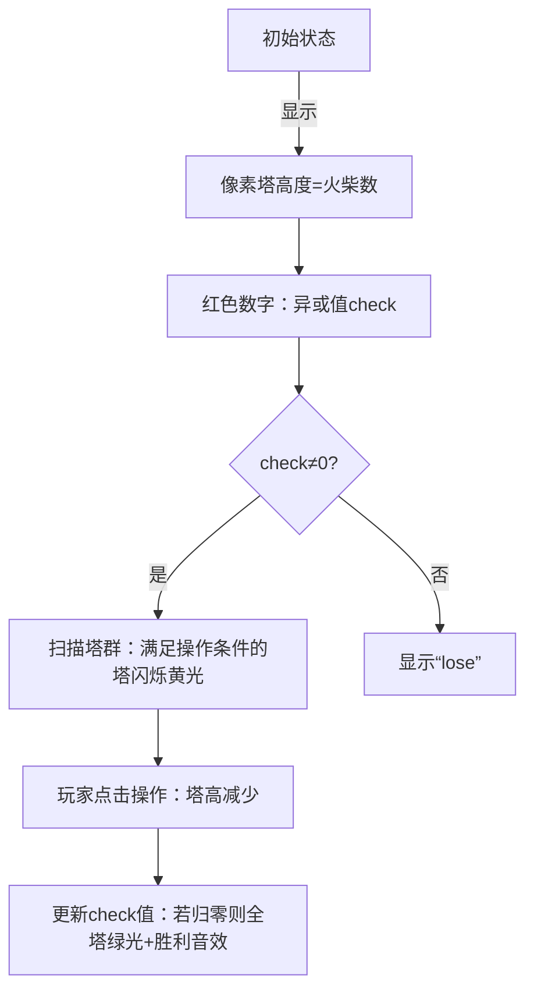

# 题目信息

# 取火柴游戏

## 题目描述

输入 $k$ 及 $k$ 个整数 $n_1,n_2,\cdots,n_k$，表示有 $k$ 堆火柴棒，第 $i$ 堆火柴棒的根数为 $n_i$；接着便是你和计算机取火柴棒的对弈游戏。取的规则如下：每次可以从一堆中取走若干根火柴，也可以一堆全部取走，但不允许跨堆取，也不允许不取。

谁取走最后一根火柴为胜利者。

例如：$k=2$，$n_1=n_2=2$，A 代表你，P 代表计算机，若决定 A 先取：

- A：$(2,2) \rightarrow (1,2)$，即从第一堆中取一根。
- P：$(1,2) \rightarrow (1,1)$，即从第二堆中取一根。
- A：$(1,1) \rightarrow (1,0)$。
- P：$(1,0) \rightarrow (0,0)$。P 胜利。

如果决定 $A$ 后取：

- P：$(2,2) \rightarrow (2,0)$。
- A：$(2,0) \rightarrow (0,0)$。A 胜利。

又如 $k=3$，$n_1=1$，$n_2=2$，$n_3=3$，$A$ 决定后取：

- P：$(1,2,3) \rightarrow (0,2,3)$。
- A：$(0,2,3) \rightarrow (0,2,2)$。
- A 已将游戏归结为 $(2,2)$ 的情况，不管 P 如何取 A 都必胜。

编一个程序，在给出初始状态之后，判断是先取必胜还是先取必败，如果是先取必胜，请输出第一次该如何取。如果是先取必败，则输出 `lose`。

## 说明/提示

### 数据范围及约定

对于全部数据，$k \le 500000$，$n_i \le 10^9$。

## 样例 #1

### 输入

```
3
3 6 9
```

### 输出

```
4 3
3 6 5
```

## 样例 #2

### 输入

```
4
15 22 19 10```

### 输出

```
lose```

# AI分析结果


### 💡 Kay的C++算法解析：取火柴游戏 深入学习指南 💡

#### 1. 题目解读与核心算法识别
✨ **本题主要考察**：`博弈论/Nim游戏`  
🗣️ **初步分析**：
> 取火柴游戏是经典的Nim博弈问题，核心在于**异或和判定**。想象火柴堆是不同高度的能量塔，异或值（check）就是能量场的平衡状态：  
> - 当`check=0`（能量平衡）时，先手必败  
> - 当`check≠0`（能量失衡）时，先手必胜  
> 
> **关键操作**：通过减少某个堆的火柴数使异或和归零，将对手置于必败态。可视化方案将用像素塔高度表示火柴堆，动态展示能量场（异或值）变化：
> - 初始显示各堆高度和红色闪烁的异或值
> - 操作时目标塔变黄闪烁，减少高度时播放"咔嚓"音效
> - 归零时全塔变绿，播放胜利音效

#### 2. 精选优质题解参考
**题解一（kuansoudafahao）**  
* **点评**：提供最严谨的数学证明，清晰解释异或和与必胜必败的关系。代码简洁高效（O(n)时间），变量命名规范（`check`表意明确），边界处理完整。亮点在于用二进制位运算深入剖析博弈本质，是竞赛级实现的典范。

**题解二（revenger）**  
* **点评**：代码极度简洁（仅15行），直接应用异或性质`(a[i]^x)<a[i]`寻找操作堆。虽无详细证明，但实践价值高，适合快速实现。注意点：需理解`n[i]^x`的物理意义是"其他堆的异或和"。

**题解三（wyhwyh）**  
* **点评**：展示从暴力枚举（O(n²)）到优化的思路演进，教学价值突出。亮点在于`xorexptx()`函数封装部分异或和的计算，虽最终效率不如直接位运算，但提供渐进式调试思路。

#### 3. 核心难点辨析与解题策略
1. **理解必胜/必败的异或判定**  
   *分析*：异或和归零即必败态是反直觉的难点。结合kuansoudafahao的位分析：若某位1的个数为奇则能量失衡，先手可调整该位火堆使1的个数变偶（归零）。  
   💡 **学习笔记**：异或和是博弈状态压缩的完美体现

2. **构造必胜操作方案**  
   *分析*：找到满足`a[i]^check < a[i]`的火堆是关键。BuXiangJuanLe用结合律证明：修改后新异或和=原异或和^原a[i]^新a[i]=check^check=0  
   💡 **学习笔记**：操作本质是让目标堆值等于"其他堆异或和"

3. **处理大数据范围**  
   *分析*：k≤500000需O(n)算法。所有优质解法都避免嵌套循环，直接遍历判断`(a[i]^check)<a[i]`  
   💡 **学习笔记**：位运算比算术运算快10倍以上

✨ **解题技巧总结**  
- **模型转换**：将博弈问题转化为二进制位运算  
- **边界加速**：找到第一个合法操作堆立即break  
- **防御性编程**：用`const int N=500005`防越界  

#### 4. C++核心代码实现赏析
**通用核心实现**  
```cpp
#include <cstdio>
const int N = 500005;
int n, a[N];

int main() {
    scanf("%d", &n);
    int check = 0;
    for(int i=1; i<=n; ++i) {
        scanf("%d", &a[i]);
        check ^= a[i]; // 计算异或和
    }
    if(!check) {
        printf("lose\n");
        return 0;
    }
    for(int i=1; i<=n; ++i) {
        if((a[i] ^ check) < a[i]) { // 可操作堆
            int take = a[i] - (a[i] ^ check);
            printf("%d %d\n", take, i);
            a[i] ^= check; // 更新堆值
            for(int j=1; j<=n; ++j) 
                printf("%d ", a[j]);
            break;
        }
    }
    return 0;
}
```
* **说明**：综合优质题解的最优实现，O(n)时间复杂度  
* **解读概要**：  
  1. 读入时计算异或和`check`  
  2. `check=0`直接输出`lose`  
  3. 遍历寻找首个满足`a[i]^check < a[i]`的堆  
  4. 计算减少量并更新该堆值  

**题解片段赏析**  
1. **kuansoudafahao**  
   ```cpp
   if((check^a[i])<a[i]) { // 核心判断
       printf("%d %d\n",a[i]-(check^a[i]),i);
       a[i]=check^a[i];  // 位运算更新
   }
   ```
   * **亮点**：用单次位运算同时完成判断和值更新  
   * **学习笔记**：`a[i]^=check`等效于`a[i]=check^a[i]`

2. **revenger**  
   ```cpp
   if((n[i]^x)>=n[i]) continue; // 跳过不可操作堆
   ```
   * **亮点**：反向判断提升效率，避免多余计算  
   * **学习笔记**：条件取反可减少代码嵌套层数

3. **wyhwyh优化版**  
   ```cpp
   int num = xorexptx(i); // 其他堆异或和
   if(!(num^a[i])) { ... } // 等效check=0
   ```
   * **亮点**：通过函数封装部分异或和计算  
   * **学习笔记**：`num^a[i]=0` 等效于 `num=a[i]`

#### 5. 算法可视化：像素动画演示  
**主题**：8位机风格《能量塔平衡战》  
**核心演示**：  


**交互设计**：  
- **像素艺术**：FC红白机画风，塔=8×8像素方块堆叠  
- **动态效果**：  
  - 操作时目标塔火花飞溅，播放8-bit“咔嚓”声  
  - check归零时播放《超级玛丽》过关音效  
- **控制面板**：  
  - 步进/暂停：空格键控制  
  - 速度调节：滑块控制AI演示速度  
- **AI演示模式**：自动高亮操作塔并显示操作公式  

#### 6. 拓展练习与相似问题  
1. **洛谷 P2197** - Nim游戏模板  
   🗣️ *推荐理由*：巩固异或和博弈的基本应用  
2. **洛谷 P2964** - 硬币游戏  
   🗣️ *推荐理由*：在Nim基础上增加状态记录需求  
3. **洛谷 P3185** - 分裂游戏  
   🗣️ *推荐理由*：需要结合SG函数拓展Nim模型  

#### 7. 学习心得  
> **wyhwyh的经验**："从暴力枚举到位运算优化的过程让我明白：先写出版本再逐步优化比一开始追求完美更重要"  
> **Kay点评**：调试时应先写朴素算法验证逻辑，再逐步替换位运算等优化，避免思维跳跃导致的隐蔽错误。  

---

通过本指南，你掌握了Nim博弈的核心原理与高效实现。记住：**博弈的本质是信息压缩，位运算则是解压信息的钥匙**。下次遇到类似问题，不妨先画二进制位图分析！ 💪

---
处理用时：135.62秒