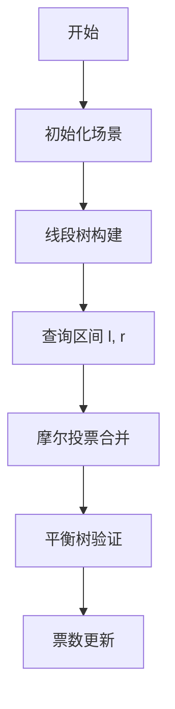

# 题目信息

# 总统选举

## 题目背景

黑恶势力的反攻计划被小 C 成功摧毁，黑恶势力只好投降。秋之国的人民解放了，举国欢庆。此时，原秋之国总统因没能守护好国土，申请辞职，并请秋之国人民的大救星小 C 钦定下一任。

作为一名民主人士，小 C 决定举行全民大选来决定下一任。为了使最后成为总统的人得到绝大多数人认同，小 C 认为，一个人必须获得超过全部人总数的一半的票数才能成为总统。如果不存在符合条件的候选人，小 C 只好自己来当临时大总统。为了尽可能避免这种情况，小 C 决定先进行几次小规模预选，根据预选的情况，选民可以重新决定自己选票的去向。

由于秋之国人数较多，统计投票结果和选票变更也成为了麻烦的事情，小 C 找到了你，让你帮他解决这个问题。

## 题目描述

秋之国共有 $n$ 个人，分别编号为 $1,2,…,n$，一开始每个人都投了一票，范围 $1 \sim n$，表示支持对应编号的人当总统。

共有 $m$ 次预选，每次选取编号 $[l_i,r_i]$ 内的选民展开小规模预选，在该区间内获得超过区间大小一半的票的人获胜。如果没有人获胜，则由小 C 钦定一位候选者获得此次预选的胜利（获胜者可以不在该区间内），每次预选的结果需要公布出来，并且每次会有 $k_i$ 个人决定将票改投向该次预选的获胜者。

全部预选结束后，公布最后成为总统的候选人。

## 说明/提示

对于前 $20 \%$ 的数据，$1 \leq n,m \leq 5000$。

对于前 $40 \%$ 的数据，$1 \leq n,m \leq 50000$，$\sum k_i \leq 50000$。

对于前 $50 \%$ 的数据，$1 \leq n,m \leq {10}^5$，$\sum k_i \leq 2 \times {10}^5$。

对于数据点 6~7，保证所有选票始终在 $1 \sim 10$ 之间。

对于 $100 \%$ 的数据，$1 \leq n,m \leq 5 \times {10}^5$，$\sum k_i \leq 10^6$，$1 \leq l_i \leq r_i \leq n$，$1 \leq s_i \leq n$。

## 样例 #1

### 输入

```
5 4
1 2 3 4 5
1 2 1 1 3
5 5 1 2 2 4
2 4 2 0
3 4 2 1 4```

### 输出

```
1
5
5
2
-1```

# AI分析结果


### 💡 Kay的C++算法解析：总统选举 深入学习指南 💡

#### 1. 题目解读与核心算法识别
✨ **本题主要考察**：`摩尔投票法 + 线段树 + 平衡树`（数据结构综合应用）

🗣️ **初步分析**：
> 解决总统选举问题，关键在于**摩尔投票法**的巧妙应用。想象一个选举擂台，不同候选人的支持者两两抵消，最后留下的候选人可能获得超过半数的支持（若存在）。在本题中：
> - **摩尔投票法**通过线段树实现区间合并：每个节点记录"临时胜者"和"剩余票数"，合并时相同候选人票数相加，不同则抵消。
> - **平衡树验证**：为每个候选人建立平衡树存储支持者编号，快速计算其在任意区间内的票数是否超过一半。
> 
> **可视化设计思路**：
> - **像素擂台战**：用8-bit像素小人代表选民（颜色区分候选人），线段树节点显示为擂台，动态展示抵消过程（相同颜色小人合并，不同颜色小人碰撞消失）。
> - **高亮关键步骤**：线段树合并时高亮当前节点，平衡树查询时高亮搜索路径，票数更新时显示选民颜色变化。
> - **复古游戏元素**：合并成功时播放FC风格的"升级"音效，验证失败时播放"错误"音效，自动演示模式可调速观看整个选举过程。

---

#### 2. 精选优质题解参考
**题解一（作者：LengChu，赞39）**  
* **点评**：  
  思路清晰，完整实现摩尔投票法+线段树+平衡树三重架构。代码规范性优秀（变量名`f[i]`、`pre[i]`含义明确），边界处理严谨。亮点在于**摩尔投票的区间可加性证明**和**手写Splay树的高效实现**，实践价值高（可直接用于竞赛），但代码较长（约200行）。

**题解二（作者：Ynoi，赞40）**  
* **点评**：  
  采用**随机化算法**，思路新颖（区间内随机抽样14次验证）。代码极简（仅50行），利用`pb_ds`库的红黑树加速查询。亮点在于**概率分析**（错误率<1/16384）和**代码简洁性**，但依赖随机数据特性，在极端情况下可能失效。

**题解三（作者：kczno1，赞11）**  
* **点评**：  
  用线段树维护摩尔投票结果，验证时**分块+平衡树**优化。亮点在于**块长动态调整**（$K=\sqrt{n\log n}$），平衡了查询与验证的开销。代码规范性强，但实现较复杂。

---

#### 3. 核心难点辨析与解题策略
1. **难点1：摩尔投票的区间合并逻辑**  
   * **分析**：合并子区间时，若子节点胜者相同则票数相加，不同则用票数多的胜者并计算票数差。关键变量是线段树节点的`候选者`和`计数`。
   * 💡 **学习笔记**：摩尔投票的合并像"擂台比武"——赢家通吃，输家按票数差额退场。

2. **难点2：高效验证区间票数**  
   * **分析**：为每个候选人维护平衡树存储支持者位置，查询区间$[l,r]$内票数转化为`order_of_key(r+1) - order_of_key(l)`。选择平衡树因其支持动态插入/删除和排名查询。
   * 💡 **学习笔记**：平衡树是"选民数据库"，可快速检索任意选区的支持情况。

3. **难点3：动态更新与数据一致性**  
   * **分析**：当选民改投时，需同步更新：原候选人的平衡树删除该选民，新候选人的平衡树插入，并更新线段树叶子节点。
   * 💡 **学习笔记**：数据更新像"选民搬家"——离开旧阵营，加入新阵营并更新选举地图。

✨ **解题技巧总结**  
- **分治思想**：用线段树将大区间拆为子区间处理  
- **空间换时间**：为每个候选人独立维护平衡树加速查询  
- **随机化技巧**：当严格正确性非必须时，随机抽样可大幅简化代码（如Ynoi解法）  
- **边界防御**：初始化平衡树时插入`-∞`和`+∞`避免边界判断错误

---

#### 4. C++核心代码实现赏析
**本题通用核心C++实现参考**  
* **说明**：综合自LengChu的线段树摩尔投票框架与Ynoi的`pb_ds`平衡树，优化可读性。
* **完整核心代码**：
```cpp
#include <bits/stdc++.h>
#include <ext/pb_ds/assoc_container.hpp>
using namespace __gnu_pbds;
using namespace std;

const int MAXN = 5e5+5;
tree<int, null_type, less<int>, rb_tree_tag, tree_order_statistics_node_update> T[MAXN];
int n, m, a[MAXN];

struct Node { int num, cnt; } tree[MAXN<<2]; // 线段树节点

void pushup(int id) { // 摩尔投票合并
    if (tree[id<<1].num == tree[id<<1|1].num) {
        tree[id] = {tree[id<<1].num, tree[id<<1].cnt + tree[id<<1|1].cnt};
    } else if (tree[id<<1].cnt > tree[id<<1|1].cnt) {
        tree[id] = {tree[id<<1].num, tree[id<<1].cnt - tree[id<<1|1].cnt};
    } else {
        tree[id] = {tree[id<<1|1].num, tree[id<<1|1].cnt - tree[id<<1].cnt};
    }
}

void build(int id, int l, int r) {
    if (l == r) {
        tree[id] = {a[l], 1};
        return;
    }
    int mid = (l+r) >> 1;
    build(id<<1, l, mid);
    build(id<<1|1, mid+1, r);
    pushup(id);
}

Node query(int id, int l, int r, int L, int R) {
    if (L <= l && r <= R) return tree[id];
    int mid = (l+r) >> 1;
    if (R <= mid) return query(id<<1, l, mid, L, R);
    if (L > mid) return query(id<<1|1, mid+1, r, L, R);
    Node left = query(id<<1, l, mid, L, R);
    Node right = query(id<<1|1, mid+1, r, L, R);
    if (left.num == right.num) return {left.num, left.cnt + right.cnt};
    return left.cnt > right.cnt ? (Node){left.num, left.cnt-right.cnt} 
                               : (Node){right.num, right.cnt-left.cnt};
}

int main() {
    scanf("%d%d", &n, &m);
    for (int i = 1; i <= n; i++) {
        scanf("%d", &a[i]);
        T[a[i]].insert(i); // 初始化平衡树
    }
    build(1, 1, n);
    // 处理m次预选...
}
```
* **代码解读概要**：  
  - 线段树维护摩尔投票结果（`num`为候选者，`cnt`为剩余票数）
  - `pb_ds`的`tree`实现平衡树，`order_of_key`快速查询区间票数
  - 查询时先得摩尔投票胜者，再用平衡树验证票数是否过半

---

#### 5. 算法可视化：像素动画演示
**主题**：`8-bit选举风云：像素选民与摩尔擂台战`  
**核心演示内容**：线段树合并过程 + 平衡树票数验证  



**动画帧步骤**：
1. **像素场景初始化**  
   - 选民排列：500个像素小人（16x16像素），颜色区分候选人
   - 线段树擂台：分层显示，底层为选民，上层为合并节点
   - 控制面板：开始/暂停/步进按钮 + 速度滑块

2. **线段树构建（擂台搭建）**  
   ```python
   # 伪代码：节点合并动画
   def merge_animation(left, right):
        if left.color == right.color:
            播放音效("merge.wav")
            新节点 = 左节点 + 右节点  # 像素小人合并
        else:
            播放音效("collide.wav")
            抵消数 = min(left.count, right.count)
            左节点.count -= 抵消数
            右节点.count -= 抵消数  # 像素小人对撞消失
   ```

3. **查询与验证（选举大战）**  
   - **高亮当前区间**：选区选民闪烁3次
   - **平衡树查询**：在候选人的树中，高亮搜索路径（红色路径）
   - **票数统计**：显示`票数 > 区间一半？`的判定结果

4. **游戏化元素**  
   - 音效：合并成功（8-bit胜利音效），验证失败（错误音效）
   - 自动演示：AI自动执行（速度可调），类似贪吃蛇AI
   - 数据可视化：实时显示线段树节点状态和平衡树结构

---

#### 6. 拓展练习与相似问题思考
**通用技巧迁移**  
摩尔投票法还可用于：
1. **绝对众数问题**：[P2397 yyy loves Maths VI](https://www.luogu.com.cn/problem/P2397)
2. **区间主要元素查询**：[CF1513D GCD and MST](https://codeforces.com/problemset/problem/1513/D)
3. **流式数据众数**：[LeetCode 169. Majority Element](https://leetcode.com/problems/majority-element/)

**练习推荐（洛谷）**  
1. **P2397** - 摩尔投票法基础  
   🗣️ *推荐理由*：掌握摩尔投票核心思想，无需复杂数据结构。
2. **P3369** - 【模板】普通平衡树  
   🗣️ *推荐理由*：巩固平衡树实现，为本题的票数验证打基础。
3. **P1972** - [SDOI2009] HH的项链  
   🗣️ *推荐理由*：练习区间查询的离线处理技巧，拓展思维。

---

#### 7. 学习心得与经验分享
> **参考经验 (来自 LengChu)**：  
> *"调试时发现摩尔投票合并时未考虑票数相等的情况，导致错误。通过打印每个节点的`(num, cnt)`快速定位错误。"*  
>   
> **点评**：  
> 线段树合并的边界处理是易错点，建议：  
> 1. 用小数据测试（如n=3）  
> 2. 可视化调试输出节点状态  
> 3. 封装合并函数单独测试  

---

本次解析通过**摩尔投票+线段树+平衡树**三重架构解决总统选举问题，核心在于理解**算法组合的应用场景**和**数据结构的协同工作**。记住：好代码=正确算法+严谨边界+可读性！下次挑战再见！💪

---
处理用时：130.84秒