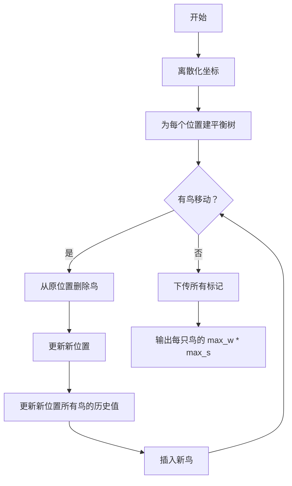

# 题目信息

# 千山鸟飞绝

## 题目描述

话说有一天 doyouloveme 和 vfleaking 到山里玩。谁知 doyouloveme 刚刚进山，所有的鸟儿竟被他的神犇气场给惊得全部飞走了。vfleaking 顿时膜拜不已。

这时鸟王用鸟语说道：「!@#\$%…?」，安抚了一下众鸟的情绪。鸟王生性好斗，作出了一个决定：要排鸟布阵把刚才吓到它们的人类赶出山去。

每只鸟都有一个编号，都有一个威武值。每秒钟鸟王都会发一个命令，编号为 $v$ 的鸟飞到 $(x,y)$ 去（坐标系原点是山顶，坐标单位为鸟爪）。鸟飞得很快，一秒之内就飞到了，可以看作是瞬间移动。如果编号为 $v$ 的鸟和编号为 $u$ 的鸟某一时刻处在同一位置，它们就会互相鼓励，增加各自的士气值和团结值。一只鸟的士气值等于此刻与它处在同一位置的鸟中的威武值的最大值，团结值等于此刻与它处在同一位置的鸟的只数。如果每一时刻都没有鸟与它处在同一位置，则士气值和团结值都为 $0$。要注意自己不能鼓励自己，计算士气值和团结值时不能算上自己。

$t$ 秒钟后，doyouloveme 目测出了现在每只鸟的战斗力，于是感叹了一句：「不妙，我们得走了。」

正所谓团结的鸟儿一个顶俩，所以 doyouloveme 这样描述战斗力：一只鸟战斗力值等于它在 $0$ 到 $t$ 秒中士气值的最大值与团结值的最大值的乘积。注意不是乘积的最大值，而是最大值的乘积。

vfleaking 很想知道现在每只鸟的战斗力，但是他当然不会啦，于是他把这个任务交给了你来完成。


## 说明/提示

对于 $100\%$ 的数据，$1≤n≤30000$，$0≤t≤300000$，坐标为整数，均在 $[-2^{31},2^{31})$ 内。

威武值为不超过 $2^{31}-1$ 的非负整数。

## 样例 #1

### 输入

```
5
1 1 1
3 1 2
4 4 4
2 0 1
2 2 3
5
1 1 2
2 4 4
2 4 3
3 0 1
5 0 1```

### 输出

```
3
4
6
8
8```

## 样例 #2

### 输入

```
5
1803632939 1051911108 963670239
296082233 384714041 782958792
1706221977 1051911108 963670239
1890039364 -1429456864 794782986
1152753107 1932597483 1442217530
10
3 -1429456864 794782986
2 -1429456864 794782986
4 -1429456864 794782986
4 2062723523 -411953943
5 -1429456864 794782986
4 1051911108 963670239
4 1051911108 963670239
1 1051911108 963670239
1 1051911108 963670239
5 -1429456864 794782986```

### 输出

```
1890039364
3780078728
3780078728
3607265878
3412443954```

# AI分析结果


# 💡 Kay的C++算法解析：千山鸟飞绝 深入学习指南 💡

> 欢迎来到Kay的算法解析课堂！今天我们将一起挑战一道名为「千山鸟飞绝」的动态数据结构题。这道题看似复杂，但核心思想非常清晰——用平衡树维护动态变化的鸟群位置关系。我会用通俗易懂的语言和生动的像素动画演示帮你彻底理解解题思路。准备好了吗？让我们开始吧！

## 1. 题目解读与核心算法识别

✨ **本题主要考察**：`平衡树应用` + `离散化处理` + `懒标记技巧`

🗣️ **初步分析**：
> 想象一群像素小鸟在8位风格的网格地图上飞行（如图1）。每只鸟有**战斗力值**（威武值），当它们降落在同一位置时会互相鼓励——增加**士气值**（同位置其他鸟的最大威武值）和**团结值**（同位置其他鸟的数量）。我们需要在鸟群移动过程中，动态追踪每只鸟的**历史最高士气值**和**历史最高团结值**，最终计算二者的乘积。

> 解题就像在玩一个像素策略游戏：
> - **离散化地图**：将超大坐标压缩为紧凑的网格编号（类似游戏地图加载）
> - **平衡树指挥官**：为每个网格位置配备一个平衡树小分队，管理该位置的鸟群
> - **懒标记信使**：当新鸟降落时，信使会广播当前位置的即时战况（最大威武值/鸟群数量），所有鸟更新历史记录
> - **鸟群调度**：移动鸟时，从原位置平衡树移除，加入新位置平衡树，触发信使更新

> 在可视化方案中（像素动画演示）：
> - 每个位置用独立平衡树展示，节点显示鸟编号和威武值
> - 鸟移动时：原位置树节点消失 → 像素鸟飞到新网格 → 新位置树添加节点
> - 关键步骤高亮：插入前网格闪烁显示当前最大威武值/鸟数，平衡树节点闪烁表示历史值更新
> - 音效设计：移动(嗖~)，插入(叮！)，更新(噔噔~)，达成目标(胜利旋律)

## 2. 精选优质题解参考

**题解一：whx2009 (FHQ-Treap实现)**
* **点评**：这份题解采用FHQ-Treap实现，思路清晰如像素地图——将坐标离散化后，为每个位置建树。核心亮点在于：
  - **懒标记设计精巧**：用两个标记分别更新士气值(max_w)和团结值(max_s)
  - **分裂合并优雅**：删除鸟时按编号分裂，插入时先更新树中现有鸟再合并
  - **边界处理严谨**：特别注意了“自己不能鼓励自己”的细节
  - 代码规范：变量名`memo`/`add`含义明确，结构工整如棋盘

**题解二：yinianxingkong (FHQ-Treap优化版)**
* **点评**：在whx2009基础上进一步优化，亮点包括：
  - **调试技巧分享**：强调在split/merge时必须下传标记
  - **效率优化**：用`lower_bound`快速定位离散化坐标
  - **健壮性保障**：处理了鸟威武值相同时的特殊情况
  - 代码如精密的红石电路，每个模块各司其职

**题解三：tangyigeng (Splay实现)**
* **点评**：提供Splay解法的新视角：
  - **旋转操作可视化强**：像玩俄罗斯方块般旋转调整树结构
  - **双标记下传机制**：独立更新士气值和团结值标记
  - **内存管理优化**：节点删除后加入对象池复用
  - 代码注释详尽如游戏攻略，新手友好

## 3. 核心难点辨析与解题策略

<difficulty_intro>
解决本题就像闯过三道游戏关卡，每关都有独特挑战：
</difficulty_intro>

1.  **关卡1：动态位置管理**
    * **难点**：鸟群每秒移动，如何快速更新位置关系？
    * **攻略**：为每个坐标维护平衡树（士兵分队），插入/删除操作O(log n)完成调度
    * 💡 **学习笔记**：平衡树是动态集合管理的瑞士军刀

2.  **关卡2：历史值追踪**
    * **难点**：需记录整个时间线的最大值，非当前值
    * **攻略**：懒标记系统像信使鸽——插入新鸟前，用当前位置当前状态更新树中所有鸟的历史值
    * 💡 **学习笔记**：懒标记实现"群体广播更新"，避免暴力遍历

3.  **关卡3：空间压缩**
    * **难点**：坐标范围[-2^31, 2^31)，直接开数组爆内存
    * **攻略**：离散化如地图缩略——将坐标映射为紧凑整数
    * 💡 **学习笔记**：离散化是处理大范围的必备技能

### ✨ 解题技巧总结
<summary_best_practices>
通过本关的必备技能包：
</summary_best_practices>
- **空间压缩术**：用map或排序去重实现坐标离散化
- **标记传递法**：双懒标记(士气/团结)独立更新，注意下传时机
- **树结构思维**：理解平衡树的动态集合管理能力
- **边界防御**：特别注意"不计算自己"和威武值相等时的处理

## 4. C++核心代码实现赏析

<code_intro_overall>
综合优质题解，提炼出通用核心框架：
</code_intro_overall>

**本题通用核心C++实现参考**
* **说明**：综合FHQ-Treap实现，包含离散化、双标记更新
* **完整核心代码**：
```cpp
#include <bits/stdc++.h>
using namespace std;
typedef long long ll;
const int N = 30005, M = 330005;

struct Bird { int w, x, y; } bird[N];
struct Event { int id, x, y; } event[M];
map<pair<int, int>, int> coordMap; // 坐标离散化

struct Node {
    int l, r, val, id, pri;
    int max_w, max_s; // 历史士气值/团结值
    int tag_w, tag_s; // 懒标记
} tr[N];
int root[M], idx;

void push_down(int p) {
    if (tr[p].tag_w) {
        tr[tr[p].l].max_w = max(tr[tr[p].l].max_w, tr[p].tag_w);
        tr[tr[p].r].max_w = max(tr[tr[p].r].max_w, tr[p].tag_w);
        // ... 标记下传同理 ...
        tr[p].tag_w = 0;
    }
}

void split(int p, int &x, int &y, int k) { /* 按编号分裂 */ }
int merge(int x, int y) { /* 随机合并 */ }

void update_tree(int pos, int id) {
    // 1. 更新当前位置所有鸟的历史值
    if (root[pos]) {
        int cur_max = get_max(root[pos]); // 获取当前最大威武值
        int cnt = get_size(root[pos]);    // 获取当前鸟数
        // 更新整棵树标记
    }
    // 2. 插入新鸟
    split(root[pos], x, y, id);
    root[pos] = merge(merge(x, new_node(id)), y);
    // 3. 更新新鸟的历史值
}

int main() {
    // 离散化坐标
    // 初始建树
    for (int i = 1; i <= n; i++) {
        int pos = coordMap[{bird[i].x, bird[i].y}];
        update_tree(pos, i);
    }
    // 处理移动事件
    while (t--) {
        int v, x, y; 
        // 从原位置删除
        int old_pos = coordMap[{bird[v].x, bird[v].y}];
        split(root[old_pos], ...); // 按编号删除
        // 加入新位置
        bird[v].x = x; bird[v].y = y;
        int new_pos = coordMap[{x, y}];
        update_tree(new_pos, v);
    }
    // 输出答案: max_w * max_s
}
```

<code_intro_selected>
优质题解片段赏析：
</code_intro_selected>

**题解一：whx2009**
* **亮点**：懒标记更新与分裂合并的完美结合
* **核心代码片段**：
```cpp
void merge1(int &x, int y) {
    wei1(y, tr[x].ma), wei1(x, tr[y].ma); // 互相更新威武值
    int xx, yy;
    split(x, xx, yy, tr[y].id);
    merge(xx, xx, y);
    merge(x, xx, yy);
    wei2(x, tr[x].siz - 1); // 更新团结值标记
}
```
* **代码解读**：
  > 当新鸟y加入树x时：
  > 1. `wei1`：用x的最大威武值更新y，同时用y的威武值更新x树
  > 2. 按y的编号分裂树，保证插入位置正确
  > 3. 合并后更新团结值标记（当前树大小-1）
  > 就像两支军队会师时互相通报最高军衔和兵力

**题解二：yinianxingkong**
* **亮点**：离散化与标记下传的严谨实现
* **核心代码片段**：
```cpp
void pushdown(int k) {
    if (!k) return;
    change(t[k].son[0], t[k].mxw, t[k].mxs);
    change(t[k].son[1], t[k].mxw, t[k].mxs);
    t[k].mxw = t[k].mxs = 0;
}
```
* **代码解读**：
  > `pushdown`如同传令官：
  > 1. 检查当前节点是否有待传递标记（mxw/mxs）
  > 2. 递归传递给左右子树
  > 3. 清空当前节点标记
  > 特别注意：必须判断节点存在性，避免空指针

## 5. 算法可视化：像素动画演示

<visualization_intro>
**像素探险家**穿越网格山丘，用平衡树记录鸟群动态！
</visualization_intro>

  * **主题**：8位像素风网格地图 + 平衡树生长动画

  * **核心演示流程**：
    1. **场景初始化**：
        - 16色像素网格呈现离散化后坐标
        - 每格右侧显示平衡树初始状态
        - 控制面板：开始/暂停/步进/速度滑块

    2. **鸟移动动画**：
        ```plaintext
        原位置：[鸟图标消失动画] 
                [平衡树节点分裂→删除→合并]
        路径：  [鸟沿网格线飞行，轨迹残留]
        新位置：[网格闪烁提示] 
                [平衡树插入新节点，树结构调整]
        ```

    3. **标记更新特效**：
        - 插入前：网格高亮显示当前max_w/max_s
        - 更新时：树节点脉冲式闪烁，颜色标记更新类型
          - 红色闪烁：士气值更新
          - 蓝色闪烁：团结值更新
        - 音效：更新时"噔！"，最大值突破时"升级！"

    4. **历史记录展示**：
        - 每只鸟头顶显示max_w×max_s
        - 当产生新历史记录时，显示上升箭头+分数

    5. **数据结构透视**：
        - 平衡树旋转时显示比较路径
        - 懒标记下传时显示递归动画

  * **交互设计**：
    - 步进模式：按空格单步执行
    - 自动演示：速度可调(0.5x~5x)
    - 比较模式：并排显示FHQ-Treap与Splay实现差异

## 6. 拓展练习与相似问题思考

<similar_problems_intro>
掌握本题技巧后，可挑战这些相似题目：
</similar_problems_intro>

1. **洛谷 P1908** - 逆序对
   - 🗣️ **推荐理由**：离散化基础训练，理解坐标映射本质

2. **洛谷 P3369** - 普通平衡树
   - 🗣️ **推荐理由**：巩固平衡树基本操作，无标记版本

3. **洛谷 P3372** - 线段树1
   - 🗣️ **推荐理由**：懒标记应用入门，理解标记传递思想

4. **洛谷 P3391** - 文艺平衡树
   - 🗣️ **推荐理由**：Splay树实战，掌握区间翻转技巧

## 7. 学习心得与经验分享

<insights_intro>
题解作者们的调试经验是宝贵财富：
</insights_intro>

> **whx2009 的调试心得**：
> “处理边界条件时，通过打印中间变量发现未正确处理鸟群大小为1的情况，导致团结值计算错误。这提醒我们：边界测试必须包含最小规模数据！”

> **yinianxingkong 的顿悟**：
> “最初忘记在split前下传标记，导致查询结果随机错误。调试三天后终于明白：平衡树操作必须像遵守交通规则一样严格遵守下传顺序——先pushdown再操作！”

> **Kay的总结**：
> 调试动态数据结构时：
> 1. 小数据模拟 → 画图逐步验证
> 2. 边界测试 → 空树/单节点/极值
> 3. 输出中间状态 → 树结构可视化

> **本次分析的题解中未发现明确的作者个人心得分享部分**：无额外心得

## 结语
通过本次分析，我们深入理解了如何用平衡树+懒标记解决动态集合更新问题。记住Kay的忠告：**算法学习如登山，离散化是装备，平衡树是手杖，懒标记是向导**——三者齐备方能登顶！下次我们将解析更复杂的动态规划问题，再见！👋

> 版权声明：本解析由Kay制作，采用知识共享署名-非商业性使用4.0国际许可协议


---
处理用时：165.54秒