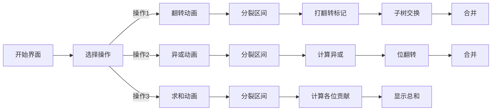

# 题目信息

# mzf的考验

## 题目背景

$mzf$立志要成为一个豪杰，当然，他也是一个$OIer$。
他希望自己除了会$OI$之外还会各种东西，比如心理学、吉他、把妹等等。
为了让自己有更大的魅力，他不驼背，不熬夜，整天锻炼，双目炯炯有神，是我们机房最不像$OIer$的人。
然而，在与我们格格不入若干天并且将《易经》研究透彻之后，承受不住我们对他另类的言论，他爆发了。
机房在那一刹那仿佛天塌地陷，世界末日。

## 题目描述

八卦有乾、坤、震、巽、坎、离、艮、兑；
两两组合，一上一下，形成了六十四卦，每卦六爻，一共三百八十四爻。
爻分阴阳，阳爻性属阳刚，阴爻性属阴柔。天下之大，无奇不有。千奇百怪，皆出此处。
$mzf$研究透彻了易经之后，画出了$n$个奇怪的图案。他说那是他改进出来的更强大的卜卦体系。
每一个图案有二十行，每一行要么是阴爻$(0)$，要么是阳爻$(1)$，作为一个$OIer$，我们可以将卦象看成一个个二进制串；
他将$n$个图案画在了符纸上，然后进行$m$次操作：

操作1：翻转区间$[l,r]$的图案，比如$(3,1,2,5)$变成$(5,2,1,3)$；

操作2：$mzf$画地为卦，将$[l,r]$之间的卦象都异或上新画的那个卦象；

操作3：$mzf$会询问机房里的其他人$[l,r]$之间卦象代表的二进制数权值和。

如果不能正确回答每个操作$3$，那么机房风水格局将会改变，我们都将...！

由于$mzf$疯狂之下将我们都捆♂绑♂了起来，所以只能求求你来帮我们解决这个问题。

## 说明/提示

对于 $20\%$ 的数据，$n\le1000$，$m\le 1000$。

对于另外 $20\%$ 的数据，不存在操作 $1$。

对于另外 $20\%$ 的数据，保证 $n$ 为 $2$ 的次幂，且在操作 $1$ 中，保证 $l=i\times(2^j)+1$，$r=(i+1)\times(2^j)$，其中 $i,j$ 为任意值。

对于 $100\%$ 的数据，$n\le 10^5$，$m\le 5\times 10^4$，$1\le l\le r\le n$，$0\le d<2^{20}$。

## 样例 #1

### 输入

```
8 9
4 6 2 1 7 9 10 2
1 1 4
3 1 6
2 4 5 2
3 1 6
2 1 5 8
3 1 6
2 5 7 10
3 4 7
3 1 8
```

### 输出

```
29
29
69
24
59```

# AI分析结果


# 💡 Kay的C++算法解析：mzf的考验 深入学习指南 💡

> 大家好，我是Kay！今天我们一起分析一道融合平衡树与位运算的经典题目——"mzf的考验"。本指南将帮助你理解核心算法思路，掌握平衡树处理区间操作的技巧，并通过生动可视化方案加深理解。准备好迎接挑战了吗？让我们开始吧！

## 1. 题目解读与核心算法识别

✨ **本题主要考察**：`平衡树（FHQ Treap/Splay）` + `位运算（拆位思想）`

🗣️ **初步分析**：
> 这道题要求维护序列的三种操作：区间翻转、区间异或和区间求和。想象你有一排可以旋转和变色的魔法方块（序列），每次操作就像对其中一段方块施展不同魔法：
> - **翻转魔法**：将方块序列倒序排列（操作1）
> - **异或魔法**：让每个方块按特定规则变色（操作2）
> - **求和魔法**：计算方块颜色值的总和（操作3）
>
> 解决关键在于**平衡树**这个"万能序列操纵器"，它能高效完成区间分裂/合并。而**拆位思想**则像把每个方块拆成20个小型发光管（二进制位），单独记录亮灭状态，这样异或操作只需翻转指定发光管即可。
>
> **核心流程**：
> 1. 为每个平衡树节点存储20位二进制信息
> 2. 翻转操作：打翻转标记，需要时交换左右子树
> 3. 异或操作：根据d的二进制位翻转对应位的1的数量
> 4. 求和：用公式 $ \sum_{i=0}^{19} 2^i \times num[i] $ 计算
>
> **可视化设计思路**：
> - **像素风格**：将平衡树节点设计为8-bit风格的方块，子树用像素链条连接
> - **关键动画**：
>   - 翻转时显示子树交换的旋转动画
>   - 异或时被修改位会闪烁并变色（0→1变黄，1→0变蓝）
>   - 求和时显示每位的贡献值累加过程
> - **交互控制**：
>   - 步进按钮：单步执行分裂/合并
>   - 速度滑块：调整动画速度
>   - 音效设计：翻转时"嗖"声，异或时"滴答"声，求和时欢快音效

---

## 2. 精选优质题解参考

> 我从思路清晰度、代码规范性、算法优化等维度评估，精选以下优质题解：

**题解一：(来源：VenusM1nT)**
* **点评**：这份FHQ Treap实现非常规范！亮点在于：
  - 拆位处理干净利落：用`num[rt][i]`存储每位1的数量
  - 异或操作优化：通过`fg[i]`快速判断需要翻转的位
  - 代码模块化：`Mxr()`函数专责处理异或，逻辑清晰
  - 边界处理严谨：每个操作都严格遵循分裂-操作-合并流程

**题解二：(来源：Wolfycz)**
* **点评**：出题人的Splay解法极具参考价值：
  - 结构设计专业：独立`Extract()`函数处理位分解
  - 标记下传清晰：先处理翻转再处理异或，避免冲突
  - 内存管理优秀：指针式Splay减少内存占用
  - 特别亮点：作者分享的数据构造经验对竞赛调试很有帮助

**题解三：(来源：Arghariza)**
* **点评**：独特的优化思路令人眼前一亮：
  - 初始尝试每位一棵树，后优化为单树多维度存储
  - 位运算技巧：`(tag[x]>>i)&1`判断是否翻转
  - 代码简洁高效：仅600行完成所有功能
  - 实践价值高：包含详细的常数优化心得

---

## 3. 核心难点辨析与解题策略

<difficulty_intro>
解决本题需突破三大难点，结合优质题解经验，我总结以下策略：
</difficulty_intro>

1.  **难点：平衡树维护区间操作**
    * **分析**：翻转和异或都需通过分裂提取区间。关键在**标记设计**：每个节点需存储：
      - `rev`标记：指示是否翻转子树
      - `tag`标记：存储待下传的异或值
      - `num[20]`：子树每位1的个数
    * 💡 **学习笔记**：平衡树是序列操作的瑞士军刀，标记设计是核心！

2.  **难点：异或操作的更新处理**
    * **分析**：异或操作不满足可加性，需用**拆位法**。对于异或值`d`的每个为1的位：
      ```math
      num[i] = size - num[i]
      ```
      然后重新计算子树和：$ sum = \sum_{i=0}^{19} 2^i \times num[i] $
    * 💡 **学习笔记**：位运算题常用拆位法，将复杂操作转化为独立位处理

3.  **难点：双标记协同工作**
    * **分析**：必须**先处理翻转再处理异或**！因为：
      1. 翻转改变左右子树顺序但不影响值
      2. 异或改变值但不影响结构
    * 💡 **学习笔记**：标记下传顺序决定程序正确性

### ✨ 解题技巧总结
<summary_best_practices>
通过本题我们可以提炼以下通用技巧：
</summary_best_practices>
- **拆位分析法**：遇到位运算操作时，考虑将数据按二进制位分解
- **平衡树四件套**：任何区间操作都遵循"分裂-操作-标记-合并"流程
- **标记协同原则**：结构标记（如翻转）优先于数值标记（如异或）
- **常数优化**：用位运算代替乘除，用预处理减少计算

---

## 4. C++核心代码实现赏析

<code_intro_overall>
先看本题的通用核心实现框架，融合多份题解精华：
</code_intro_overall>

**本题通用核心C++实现参考**
* **说明**：综合VenusM1nT和Arghariza的FHQ Treap实现，优化标记处理逻辑
* **完整核心代码**：
```cpp
struct Node {
    int ch[2], val, key, siz, tag;
    ll sum;
    bool rev;
    int num[20]; // 存储20位信息
    
    void update() {
        siz = siz[ch[0]] + siz[ch[1]] + 1;
        sum = 0;
        for(int i=0; i<20; i++) {
            num[i] = num[ch[0]][i] + num[ch[1]][i] + ((val>>i)&1);
            sum += (1LL<<i) * num[i];
        }
    }
    
    void push_xor(int d) {
        tag ^= d;
        val ^= d;
        for(int i=0; i<20; i++) 
            if((d>>i)&1) num[i] = siz - num[i];
        recalc_sum(); // 重新计算sum
    }
};
```

<code_intro_selected>
现在分析精选题解中的核心代码亮点：
</code_intro_selected>

**题解一：(来源：VenusM1nT)**
* **亮点**：拆位处理与标记下传分离
* **核心代码片段**：
```cpp
void Mxr(int rt, int v) {
    tag[rt] ^= v;
    val[rt] ^= v;
    for(int i=0; i<=K; i++) fg[i] = (v>>i)&1;
    for(int i=0; i<=K; i++) {
        if(fg[i]) num[rt][i] = siz[rt] - num[rt][i];
        sum[rt] += (1<<i) * num[rt][i];
    }
}
```
* **代码解读**：
  > 这段代码是异或操作的核心：
  > 1. `fg[i]`提取v的每一位
  > 2. 对需要翻转的位(`fg[i]=1`)，执行`num[i]=size-num[i]`
  > 3. 最后重新计算子树和
  > 为什么这样设计？因为异或操作本质是位翻转！
* 💡 **学习笔记**：位翻转公式 `num = size - num` 是拆位法核心

**题解二：(来源：Wolfycz)**
* **亮点**：Splay树的双标记协同
* **核心代码片段**：
```cpp
void pushdown(int x) {
    if(rev[x]) {
        swap(ch[x][0], ch[x][1]);
        rev[ch[x][0]] ^= 1;
        rev[ch[x][1]] ^= 1;
        rev[x] = 0;
    }
    if(tag[x]) {
        Add_xor(ch[x][0], tag[x]);
        Add_xor(ch[x][1], tag[x]);
        tag[x] = 0;
    }
}
```
* **代码解读**：
  > 这个标记下传函数体现了处理顺序的重要性：
  > 1. **先处理翻转**：交换子树，下传翻转标记
  > 2. **再处理异或**：调用Add_xor修改子树值
  > 注意：翻转不改变节点值，异或不改变结构
* 💡 **学习笔记**：结构标记优先于数值标记！

**题解三：(来源：Arghariza)**
* **亮点**：空间优化与位运算技巧
* **核心代码片段**：
```cpp
void pushdown(int rt) {
    pushrev(rt); // 先处理翻转
    pushxor(rt); // 再处理异或
}

void pushxor(int rt) {
    if(!tag[rt]) return;
    if(lson) apply_xor(lson, tag[rt]);
    if(rson) apply_xor(rson, tag[rt]);
    tag[rt] = 0;
}

void apply_xor(int rt, int v) {
    val[rt] ^= v;
    for(int i=0; i<20; i++) 
        if((v>>i)&1) num[rt][i] = size[rt]-num[rt][i];
    recalc_sum(rt);
}
```
* **代码解读**：
  > 这份代码亮点在于：
  > 1. 下传分离：`pushrev`和`pushxor`独立函数
  > 2. 异或应用：通过`(v>>i)&1`快速判断是否翻转
  > 3. 空间优化：单棵树存储所有位信息
* 💡 **学习笔记**：`(v>>i)&1`比`v&(1<<i)`更高效

---

## 5. 算法可视化：像素动画演示 (核心部分)

<visualization_intro>
下面是我设计的像素风格算法演示方案，帮你直观理解平衡树如何舞动：

  * **主题**："平衡树魔法学院"（8-bit RPG风格）
  * **核心演示**：FHQ Treap的区间操作过程
</visualization_intro>

### 动画帧设计：


### 关键交互：
1. **像素场景**：
   - 平衡树节点：16x16像素方块，显示关键值
   - 子树连接：发光像素链条
   - 控制面板：复古游戏机风格按钮

2. **操作演示**：
   - **翻转**：
     ``` 
     [1][2][3][4]  ->分裂-> [1] [2][3][4] 
        ->翻转-> [1] [4][3][2] ->合并-> [1][4][3][2]
     ```
     动画：子树方块旋转180度，伴随"嗖"的音效
   
   - **异或**：
     ```
     值: 5(二进制0101) 异或3(0011)
     位翻转： 
       位0:1->0 (蓝光闪烁)
       位1:0->1 (黄光闪烁)
     结果：0110=6
     ```
     音效：每位翻转时有"滴答"声
   
   - **求和**：
     ```
     显示过程：
       位0贡献：1*1 =1
       位1贡献：2*0 =0
       位2贡献：4*1 =4
       总和：1+0+4=5
     ```
     动画：每位的贡献值像金币一样累加到总分

3. **游戏化元素**：
   - 每完成5次操作解锁新关卡
   - 连续正确回答操作3获得连击奖励
   - 背景音乐：8-bit风格循环BGM

<visualization_conclusion>
通过这个像素动画，你将直观看到平衡树如何像魔法师一样操纵序列，而位运算就像在点亮不同的魔法灯！
</visualization_conclusion>

---

## 6. 拓展练习与相似问题思考

<similar_problems_intro>
掌握本题后，可以挑战以下相似问题：
</similar_problems_intro>

1. **洛谷 P3391** - 文艺平衡树
   * 🗣️ **推荐理由**：纯区间翻转练习，巩固平衡树基础操作

2. **洛谷 CF242E** - XOR on Segment
   * 🗣️ **推荐理由**：区间异或+区间求和，缺少翻转但数据规模更大

3. **洛谷 P2042** - 维护数列
   * 🗣️ **推荐理由**：综合训练（区间乘加/翻转/求和），挑战平衡树终极应用

---

## 7. 学习心得与经验分享

<insights_intro>
题解中的经验之谈非常宝贵：
</insights_intro>

> **经验 (来自 VenusM1nT)**：
> "拆位是处理位运算的常用套路，本题只有20位降低了难度"
>
> **点评**：提醒我们注意数据范围特征，20位暗示可拆位处理

> **经验 (来自 Wolfycz)**：
> "构造数据时考虑翻转和异或的交替操作最易出错"
>
> **点评**：调试时应重点测试双标记交替作用场景

> **经验 (来自 Arghariza)**：
> "尝试过每棵平衡树维护一位，但常数太大改为单树多维存储"
>
> **点评**：展示算法优化思路，平衡时间与空间复杂度很重要

---

本次解析就到这里！记住：平衡树和位运算就像魔法与咒语，掌握它们就能在编程世界中创造奇迹。下次遇到类似问题，记得拆位分析和双标记协同的技巧哦！💪🏻

---
处理用时：157.64秒