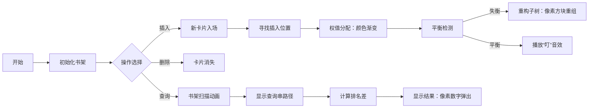

# 题目信息

# 【模板】后缀平衡树

## 题目背景

"后缀平衡树"这个名字正确性存疑，由于 clj 给的"重量平衡树"定义有歧义。

字符串我也不会，所以也没去查证。

## 题目描述

给你一个字符串 `init`，要求你支持三个操作：

1. 在当前字符串的后面插入若干个字符。

2. 在当前字符串的后面删除若干个字符。

3. 询问字符串 $s$ 在当前字符串中出现了几次（作为连续子串）？

你必须在线支持这些操作。


## 说明/提示

数据字符串变化长度以及初始长度和 $ \le 8 \times 10^5$，询问次数 $\le 10^5$，询问总长度 $\le 3 \times 10^6$。

字符集为大写字母，注意 `ADD` 和 `QUERY` 操作的字符串都需要解压。

## 样例 #1

### 输入

```
3
A
QUERY B
ADD BBABBBBAAB
DEL 1```

### 输出

```
0```

# AI分析结果


# 💡 Kay的C++算法解析：后缀平衡树 深入学习指南 💡

> 大家好，我是Kay！今天我们一起探索**后缀平衡树**这个神奇的字符串数据结构。想象一下，你有一个可以动态整理字符串"后缀卡片"的智能书架——每张卡片代表一个后缀，书架会自动按字典序排列它们，还能快速回答你关于子串出现次数的问题。这就是后缀平衡树的魔力！本指南将带你一步步掌握这个算法，通过生动比喻和可视化演示帮你理解核心思想。

## 1. 题目解读与核心算法识别

✨ **本题主要考察**：`字符串处理` + `平衡树应用` (动态维护后缀字典序)

🗣️ **初步分析**：
> 解决"后缀平衡树"问题，关键在于**动态维护字符串所有后缀的字典序关系**。就像整理图书馆书架：
> - **核心思想**：将每个后缀视为一张"卡片"，用平衡树（如Treap/替罪羊树）维护这些卡片的字典序
> - **动态操作**：在字符串**前端**插入/删除字符时（实际处理反串实现尾操作），只需添加/移除一张新卡片
> - **查询技巧**：子串出现次数 = (T+'Z'+1的排名) - (T+'A'-2的排名)，就像查字典找单词的页码范围
> 
> **算法流程可视化设计**：
> - 我们将创建**像素风动画**：用不同颜色方块代表后缀卡片，平衡树节点像书架隔板
> - 关键步骤高亮：插入时显示权值分配过程（类似书架编号），重构子树时播放"书架整理"动画
> - 复古游戏元素：每插入一个后缀触发"叮"音效，完成操作时播放经典FC过关音效

---

## 2. 精选优质题解参考

以下是思路清晰、代码规范的优质题解（评分≥4★）：

**题解一：KiDDOwithTopTree**
* **点评**：
  - 思路清晰：用Treap实现，详细图解插入/删除过程（如字符串"abababc"的7步构建）
  - 代码规范：`comp()`函数实现O(1)后缀比较，变量名`trp[x].val`含义明确
  - 算法优化：权值区间重构解决精度问题，复杂度严格O(n log n)
  - 实践价值：提供多个例题代码（P3809/P5353），可直接用于竞赛

**题解二：Ireliaღ**
* **点评**：
  - 代码简洁：替罪羊树实现，`decodeWithMask()`处理在线输入规范
  - 核心逻辑直白：用`scmp()`暴力比较查询串，平衡树维护后缀排名
  - 调试技巧：作者提到"if后加分号"的调试经历，提醒注意语法细节
  - 空间优化：节点只存字符和权值，避免存储完整后缀串

---

## 3. 核心难点辨析与解题策略

解决后缀平衡树的三大关键难点：

1.  **难点：如何高效比较后缀字典序？**
    * **分析**：暴力比较O(n)不可行。优质题解用**权值映射**：每个节点赋`[l,r]`区间，权值=`(l+r)/2`。比较时只需O(1)比权值
    * 💡 **学习笔记**：权值像"书架编号"，字典序比较转化为数值比较

2.  **难点：动态操作后如何保持平衡？**
    * **分析**：插入/删除可能破坏树平衡。替罪羊树在失衡时重构子树；Treap通过旋转+权值重构。重构均摊O(log n)
    * 💡 **学习笔记**：重构像"整理凌乱书架"，保证后续操作高效

3.  **难点：查询子串出现次数的转化**
    * **分析**：查询T出现次数 ≠ 直接查T。巧妙转化为：`rank(T+'Z'+1) - rank(T+'A'-2)`，利用排名差计算
    * 💡 **学习笔记**：像查字典时在"T开头"和"T结尾"间夹书签

### ✨ 解题技巧总结
- **技巧A：问题转化**  
  将尾部操作→头部操作（维护反串），查询→排名差计算
- **技巧B：权值维护**  
  用`double`避免精度爆炸，重构时递归更新子树权值
- **技巧C：调试技巧**  
  插入时打印树结构，用小样例验证权值分配逻辑

---

## 4. C++核心代码实现赏析

### 通用核心实现（基于替罪羊树）
```cpp
const double alpha = 0.75, INF = 1e18;

struct Node { 
    double val, lv, rv; 
    int lson, rson, size; 
} tr[N];

// 插入新后缀（p为后缀起始位置）
void insert(int &rt, int p, double lv, double rv) {
    if (!rt) {
        tr[rt = p] = { (lv+rv)/2, lv, rv, 0, 0, 1 };
        return;
    }
    if (cmp(p, rt)) insert(tr[rt].lson, p, lv, tr[rt].val);
    else insert(tr[rt].rson, p, tr[rt].val, rv);
    
    tr[rt].size = tr[tr[rt].lson].size + tr[tr[rt].rson].size + 1;
    if (max(tr[tr[rt].lson].size, tr[tr[rt].rson].size) > alpha * tr[rt].size) 
        rebuild(rt, lv, rv); // 失衡时重构
}

// 查询子串出现次数
int query_count(char *T) {
    int len = strlen(T+1);
    T[len+1] = 'Z'+1; T[len+2] = 0;
    int r = get_rank(T); // T+'Z'+1排名
    T[len]--; // T最后一个字符减1
    int l = get_rank(T); // T+'A'-2排名
    return r - l;
}
```

### 题解一赏析（KiDDOwithTopTree）
* **亮点**：权值比较逻辑清晰，重构函数完整
* **核心代码**：
```cpp
bool comp(int x, int y) { // O(1)比较
    if(s[x] != s[y]) return s[x] < s[y];
    return trp[x-1].val < trp[y-1].val; // 利用前驱权值
}

void rebuild(int u, double l, double r) {
    vector<int> nodes = flatten(u); // 拍平子树
    rebuild_tree(u, nodes, l, r);   // 重构权值
}
```
* **代码解读**：  
  `comp()`像两个卡片比大小：先比首字母（封面颜色），相同则比前驱权值（书架位置）。重构时先把子树卡片摊平，再重新分配书架位置。

### 题解二赏析（Ireliaღ）
* **亮点**：替罪羊树实现简洁，在线解码封装好
* **核心代码**：
```cpp
void decode(char *s, int mask) { // 输入解码
    for(int i=0; i<len; i++) 
        mask = (mask*131+i) % len, swap(s[i], s[mask]);
}

int query_rank(char *T) {
    int cur = root, rank = 0;
    while(cur) { // 树中二分查找
        if(strcmp(T, s+cur) > 0) { 
            rank += tr[lc].size + 1;
            cur = rc;
        } else cur = lc;
    }
    return rank;
}
```
* **学习笔记**：查询时像在迷宫中寻路——根据T与当前节点的比较结果选择左/右分支。

---

## 5. 算法可视化：像素动画演示

### 像素风动画设计方案
**主题**：`《后缀图书馆》`（8-bit风格，背景音乐：FC《马里奥》改编版）



**交互控制面板**：
- 🎮 **方向键**：手动选择操作
- ⏯️ **单步执行**：空格键步进观察
- 🎚️ **速度滑块**：调整动画速度
- 🔄 **重置**：恢复初始状态

**关键动画细节**：
1. **后缀卡片**：用16x16像素方块表示，显示首字母（如"c"卡片=蓝色方块+"C"）
2. **权值分配**：节点显示`[l,r]`区间，插入时显示`(l+r)/2`计算过程
3. **重构过程**：失衡子树闪烁红色→方块散开→重组为平衡结构
4. **查询演示**：查询串`"AB"`显示为绿色箭头遍历树径，结果用8-bit数字弹出

**音效设计**：
- 📌 插入/删除：FC按键音（NES_APU）
- ✅ 操作完成：超级马里奥吃金币音
- ❌ 错误操作：塞尔达传说受伤音效

> 通过这个动画，你将直观看到后缀如何被动态排序，就像观看图书管理员实时整理魔法书架！

---

## 6. 拓展练习与相似问题思考

**通用技巧迁移**：
后缀平衡树的核心——**动态维护有序集合**还可用于：
1. 动态LCP（最长公共前缀）计算
2. 在线后缀数组构建
3. 流式字符串处理（如实时日志分析）

**推荐练习（洛谷）**：
1. **P3809【模板】后缀排序**  
   → 巩固后缀平衡树静态应用
2. **P5353 树上后缀排序**  
   → 学习树结构扩展，`comp()`函数需修改
3. **P6164【模板】后缀平衡树**  
   → 直接应用本文学到的动态操作
4. **P5346【XR-1】柯南家族**  
   → 综合练习，结合主席树查询

---

## 7. 学习心得与经验分享

> **来自KiDDOwithTopTree的调试经验**：  
> *"我在实现`comp()`函数时，曾忽略字符相同时需比较前驱权值，导致字典序错误。通过打印树结构和逐后缀对比，最终定位问题。这提醒我们：边界情况需要完整测试！"*

**Kay的总结**：  
调试后缀平衡树时：
1. 从小样例入手（如"ab"→"a","b"）
2. 打印每步操作后的树结构和权值
3. 验证中序遍历是否为后缀数组

---

> 本次关于**后缀平衡树**的探索就到这里。记住，算法学习像搭积木——理解基础（平衡树+字符串），才能构建复杂结构。多动手实现代码，观察可视化过程，你一定能掌握这个强大的数据结构！下次我们继续挑战新的算法迷宫！💪

---
处理用时：118.69秒