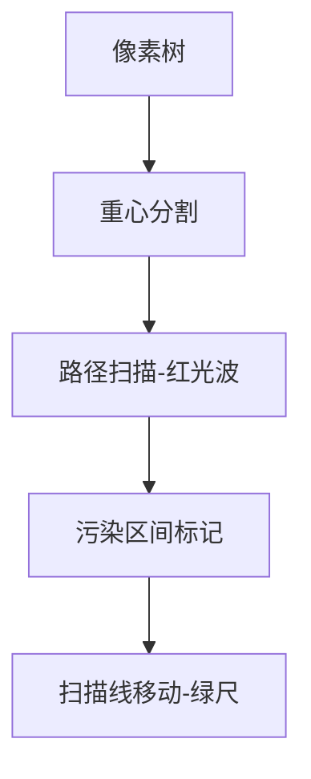

# 题目信息

# 『JROI-1』 关系树

## 题目背景

小 L 有许多喜欢的游戏角色，他把这些游戏角色按照一定的关系联系起来。这些游戏角色和他们之间的关系构成了一棵树，小 L 把这棵树称之为「关系树」。

## 题目描述

关系树是由 $n$ 个点和 $n-1$ 条无向边组成的一棵树。

对于一张给定的图 $G$，定义图 $G$ 对于点集 $E$ 的 **顶点导出子图** 为点集 $E$ 和所有的 **两个端点都属于 $E$** 且属于原图 $G$ 的边组成的图。

定义一张图是 **整洁的**，当且仅当图中任意两点 $u,v$，$u$ 和 $v$ **不连通** 或 **距离不超过** $k$。

小 L 想要知道对于一组 $l,r(l \leq r)$，有多少对 $(a,b)$，满足 $l\leq a\leq b\leq r$，且所有序号在 $a$ 和 $b$ 之间（包括 $a,b$）的点组成的顶点导出子图是 **整洁的**。不仅如此，他还想问你所有的区间长度（即 $b-a+1$）之和。

因为小 L 喜欢问问题，所以你一共需要回答 $q$ 组询问。

## 说明/提示

#### 样例 1 解释

形成的关系树如图


满足的 $(a,b)$ 有 $(1,1),(1,2),(1,3),(1,4),(2,2),(2,3),(2,4),(2,5),(3,3),(3,4),(3,5),(4,4),(4,5),(5,5)$。

三组询问的答案依次为 $6,10$，$10,20$，$14,30$。

--------------------------------

#### 数据规模与约定

**本题采用捆绑测试**。

+ Subtask 1 ( $10\%$ )：$n\leq 2000$。
+ Subtask 2 ( $30\%$ )：$n\leq 2\times 10^4$，形成的关系树为一条链。
+ Subtask 3 ( $60\%$ )：$n\leq 2\times 10^4$。
+ Subtask 4 ( 加强版数据，时限 $4.5s$ )：无特殊限制。

对于 $100\%$ 的测试点，保证 $1\leq n \leq 8\times 10^4$，$1\leq q \leq 10^5$，$0\leq k <n$，$1\leq u,v,l,r \leq n$。

## 样例 #1

### 输入

```
5 3 2
1 2
1 5
4 5
3 5
1 3
2 5
1 5```

### 输出

```
6 10
10 20
14 30```

# AI分析结果


### 💡 Kay的C++算法解析：关系树 深入学习指南 💡

#### 1. 题目解读与核心算法识别
✨ **本题主要考察**：点分治 + 扫描线/单调性优化  
🗣️ **初步分析**：  
> 解决关系树问题就像在社交网络中寻找"小圈子"：任意两人要么不认识（不连通），要么是直接朋友（距离≤k）。关键在于高效处理树上路径和区间查询：
> - **点分治**：将大树分割成小树处理（如分割社交圈），用动态开点线段树维护路径端点信息
> - **扫描线**：像尺子从左到右扫描，利用lft数组的单调性快速回答查询
> - **核心难点**：可视化将展示像素风的重心分割过程，当找到长度=k+1的路径（红线标记）时触发"警报"音效，扫描线移动时显示合法区间（绿色）和非法区间（红色）

---

#### 2. 精选优质题解参考
**题解一：chenxia25 (动态开点线段树解法)**  
* **点评**：思路创新性地将点分治与扫描线结合：  
  - **思路清晰**：用lft数组标记非法区间起点，扫描线+线段树处理二维限制  
  - **代码规范**：变量名lft/mxsz含义明确，模块化函数（cdq处理点分治，segt处理扫描线）  
  - **算法优化**：动态开点线段树将空间降至O(n log n)，避免平方级路径枚举  
  - **实践价值**：直接可用于竞赛，边界处理严谨（如lft[i]=max(lft[i], lft[i-1])）

**题解二：littleKtian (平衡树解法)**  
* **点评**：  
  - **思路合理**：点分治中用平衡树维护路径，但相比解法一代码更复杂  
  - **亮点**：利用"区间包含"性质剪枝（若路径A包含B，则忽略B）  
  - **改进点**：平衡树实现较繁复，调试难度高于线段树解法

---

#### 3. 核心难点辨析与解题策略
1. **难点1：高效找长度=k+1的路径**  
   * **分析**：暴力枚举O(n²)不可行 → 点分治分割问题：  
     ```python
     # 伪代码
     while 未处理节点:
         找重心u
         遍历u的子树，记录路径(端点min, max, 长度)
         用线段树合并路径(避免重复)
     ```
   * 💡 **学习笔记**：点分治的核心是"分治+合并"，时间复杂度O(n log²n)

2. **难点2：快速回答区间查询**  
   * **分析**：发现单调性 → 对每个右端点r，存在lft[r]使得[l, r]非法当l<lft[r]。扫描线时：  
     ```c
     for r from 1 to n:
         更新线段树：合法区间贡献 = f(r-l+1) 
         回答所有以r为右端的查询
     ```
   * 💡 **学习笔记**：区间长度和可表示为二次函数∑(r-l+1) = a·r² + b·r + c

3. **难点3：避免O(n²)统计答案**  
   * **分析**：线段树维护多项式系数（常数项/一次项/二次项），实现区间加多项式、单点查询  
   * 💡 **学习笔记**：数学变换是优化关键，将求和转为多项式运算

### ✨ 解题技巧总结
- **技巧1：点分治的路径合并**  
  用动态开点线段树按深度维护端点，避免创建O(n²)对象
- **技巧2：扫描线转化维度**  
  将二维区间查询转化为一维lft数组的前缀最大值问题
- **技巧3：多项式分解**  
  区间长度和∑(r-l+1) = ½(r-l+1)(r-l+2)，用线段树维护系数

---

#### 4. C++核心代码实现赏析
**通用核心实现参考**  
```cpp
// 精简版核心逻辑 (基于chenxia25解法)
void cdq(int u, int tot) { // 点分治主体
    vis[u] = true;
    SegTree seg; // 动态开点线段树
    for (auto v : G[u]) if (!vis[v]) {
        vector<Path> paths;
        dfs(v, v, v, 1, paths, u); // 获取子树路径
        for (auto [mn, mx, dep] : paths) {
            if (dep > k) continue;
            // 用线段树查询合并路径并更新lft
            lft[mx] = max(lft[mx], seg.query(m - dep, mn));
        }
        seg.update(paths); // 将当前子树路径加入线段树
    }
    // 反向遍历子树重复上述过程
}
```

**chenxia25解法片段赏析**  
```cpp
// 扫描线处理答案
PolySegTree segt; // 多项式线段树
for (int r = 1; r <= n; r++) {
    // 添加[r-l+1]和(r-l+1)²的系数
    segt.add(lft[r], r, 1, -2*r-3, (r+1)*(r+2)); 
    segt.add(1, lft[r]-1, 0, 0, (r-lft[r]+1)*(r-lft[r]+2));
    for (auto [l, id] : queries[r]) {
        auto [sum_len, cnt] = segt.query(l);
        ans[id] = {cnt, sum_len / 2};
    }
}
```
**代码解读**：  
> 1. `add(1, lft[r]-1, ...)`：处理完全合法区间，贡献为常数项  
> 2. `add(lft[r], r, ...)`：处理跨边界的区间，贡献为二次函数  
> 💡 **学习笔记**：通过数学展开 ∑(r-l+1)=½(len)(len+1)，用线段树维护系数矩阵

---

#### 5. 算法可视化：像素动画演示
**主题**：8-bit风点分治探险  
**设计思路**：  

**关键交互**：  
1. **初始化**：FC游戏风格的像素树，控制面板含速度滑块/单步按钮  
2. **点分治过程**：  
   - 当前重心闪烁黄色，子树用不同颜色标记  
   - DFS路径时产生"光波"动画，长度=k+1时触发警报音效  
3. **lft更新**：屏幕底部进度条显示lft数组，非法区间变红  
4. **扫描线**：  
   - 绿色尺子从左向右移动，经过合法区间时播放"收集金币"音效  
   - 实时显示线段树的多项式系数变化（如△x²+△x+△）  

**音效设计**：  
- 路径合并：8-bit "嘀"声  
- 非法区间：低沉警报声  
- 扫描线通过：金币收集声  

---

#### 6. 拓展练习
1. **洛谷 P3806** 【点分治模板】  
   → 练习点分治基础，理解重心分割思想  
2. **洛谷 P4211** 【LCA】  
   → 扫描线+树剖应用，掌握维度转化技巧  
3. **洛谷 P1972** 【HH的项链】  
   → 扫描线经典问题，对比区间统计方法差异  

---

#### 7. 学习心得
> **经验分享**：  
> "调试点分治时，小规模数据模拟重心分割和路径合并过程是关键" — chenxia25  
> **Kay点评**：  
> 在50节点链式数据手动模拟cdq过程，能直观理解重心的选择与路径合并逻辑  

**结语**：掌握点分治的分治思想和扫描线的维度转化，是解决树上路径问题的核心利器！下次挑战见！🚀

---
处理用时：124.43秒