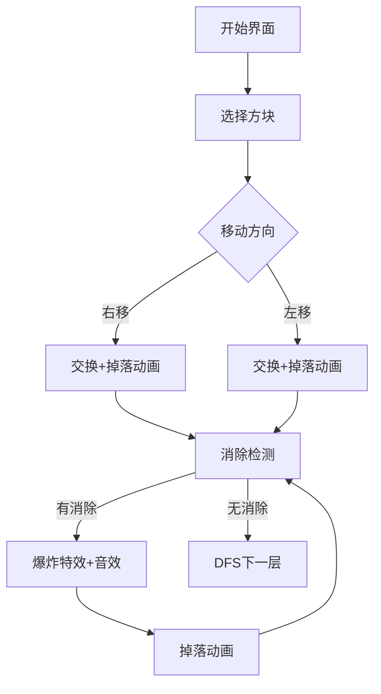

# 题目信息

# [NOIP 2011 提高组] Mayan 游戏

## 题目描述

Mayan puzzle 是最近流行起来的一个游戏。游戏界面是一个$7$ 行 $\times5$ 列的棋盘，上面堆放着一些方块，方块不能悬空堆放，即方块必须放在最下面一行，或者放在其他方块之上。游戏通关是指在规定的步数内消除所有的方块，消除方块的规则如下：

1. 每步移动可以且仅可以沿横向（即向左或向右）拖动某一方块一格：当拖动这一方块时，如果拖动后到达的位置（以下称目标位置）也有方块，那么这两个方块将交换位置（参见输入输出样例说明中的图 $6$ 到图 $7$）；如果目标位置上没有方块，那么被拖动的方块将从原来的竖列中抽出，并从目标位置上掉落（直到不悬空，参见下面图 $1$ 和图 $2$）；


2. 任一时刻，如果在一横行或者竖列上有连续三个或者三个以上相同颜色的方块，则它们将立即被消除（参见图1 到图3）。


注意：

a) 如果同时有多组方块满足消除条件，几组方块会同时被消除（例如下面图 $4$，三个颜色为 $1$ 的方块和三个颜色为 $2$ 的方块会同时被消除，最后剩下一个颜色为 $2$ 的方块）。

b) 当出现行和列都满足消除条件且行列共享某个方块时，行和列上满足消除条件的所有方块会被同时消除（例如下面图5 所示的情形，$5$ 个方块会同时被消除）。

3. 方块消除之后，消除位置之上的方块将掉落，掉落后可能会引起新的方块消除。注意：掉落的过程中将不会有方块的消除。

上面图 $1$ 到图 $3$ 给出了在棋盘上移动一块方块之后棋盘的变化。棋盘的左下角方块的坐标为 $(0,0)$，将位于 $(3,3)$ 的方块向左移动之后，游戏界面从图 $1$ 变成图 $2$ 所示的状态，此时在一竖列上有连续三块颜色为 $4$ 的方块，满足消除条件，消除连续 $3$ 块颜色为 $4$ 的方块后，上方的颜色为 $3$ 的方块掉落，形成图 $3$ 所示的局面。


## 说明/提示

**【输入输出样例说明】**

按箭头方向的顺序分别为图 $6$ 到图 $11$


样例输入的游戏局面如上面第一个图片所示，依次移动的三步是：$(2,1)$ 处的方格向右移动，$(3,1)$ 处的方格向右移动，$(3,0)$ 处的方格向右移动，最后可以将棋盘上所有方块消除。

**【数据范围】**

对于 $30\%$ 的数据，初始棋盘上的方块都在棋盘的最下面一行；

对于 $100\%$ 的数据，$0<n \le 5$。

## 样例 #1

### 输入

```
3
1 0
2 1 0
2 3 4 0
3 1 0
2 4 3 4 0```

### 输出

```
2 1 1
3 1 1
3 0 1```

# AI分析结果


# 💡 Kay的C++算法解析：Mayan游戏 深入学习指南 💡

## 1. 题目解读与核心算法识别

✨ **本题主要考察**：`DFS搜索` + `模拟` + `剪枝优化`

🗣️ **初步分析**：
> 解决"Mayan游戏"就像在玩一个需要精密规划的像素拼图。核心思路是用**DFS搜索**枚举所有可能的移动序列，配合**模拟**处理方块掉落和消除，再通过**剪枝**避免无效搜索。想象你在一个迷宫中寻找最短路径，但每一步都会改变迷宫结构！

- **解题思路**：DFS遍历所有移动可能（优先右移保证字典序），每一步后模拟方块掉落和连锁消除（关键难点），并用剪枝优化搜索空间
- **核心难点**：① 连锁消除的模拟实现 ② 剪枝策略设计 ③ 状态回溯
- **可视化设计**：在像素动画中，我们将用不同颜色方块表示不同颜色，高亮当前移动的方块，展示掉落动画（自由落体效果），消除时触发爆炸特效。当检测到连锁反应时，会播放连续音效（叮→咚→轰）

---

## 2. 精选优质题解参考

**题解一（作者：坏耶）**
* **点评**：思路清晰直击核心，创新性地提出"相同颜色交换优化"剪枝（只保留字典序最小的首次交换），代码中`flag`变量的使用十分巧妙。变量命名规范（如`memo`表示记忆化数组），边界处理严谨，特别适合竞赛实战。作者提到"被Hack数据卡过"，提醒我们要注意特殊边界。

**题解二（作者：lihongru）**
* **点评**：模块化设计堪称教科书级，将移动/掉落/消除分离为独立函数（`move()`/`down()`/`remove()`）。代码可读性强，用`memcpy`高效处理状态回溯，注释详细解释"为何不能直接删除方块"。实践价值极高，特别适合初学者学习代码组织。

**题解三（作者：hexuchen）**
* **点评**：对DFS搜索顺序的优化处理到位（按列优先+从下往上保证字典序）。亮点在于专门处理了Hack数据，强调"无效交换"的剪枝必要性。代码中`a_to_b()`函数封装了状态备份，体现了良好的工程思维。

---

## 3. 核心难点辨析与解题策略

1. **难点：连锁消除的模拟实现**  
   *分析*：移动后可能引发多次消除-掉落循环，如"消除→掉落→新消除"。优质解法则用`while(eliminate()) down()`循环处理，并用辅助数组标记待消除块避免直接修改原数组  
   💡 **学习笔记**：消除和掉落必须循环处理直到稳定状态！

2. **难点：DFS剪枝优化**  
   *分析*：关键剪枝包括：① 左移时若左边有方块则跳过（右移更优）② 相同颜色交换只保留第一次 ③ 提前检测颜色数量<3的方块  
   💡 **学习笔记**：好的剪枝能让搜索效率提升百倍！

3. **难点：状态回溯的实现**  
   *分析*：必须备份移动前的棋盘状态。高效做法是用`memcpy`或三维数组`backup[step][x][y]`，避免手动复制  
   💡 **学习笔记**：状态备份是回溯法的生命线！

### ✨ 解题技巧总结
- **模块化拆分**：分离移动/掉落/消除逻辑
- **搜索顺序优化**：从左到右、从下到上枚举保证字典序
- **边界防御**：数组开大+严格检查边界索引
- **连锁反应处理**：`while(eliminate()) down()`循环结构
- **剪枝先行**：在DFS递归前先做有效性检查

---

## 4. C++核心代码实现赏析

**本题通用核心C++实现**
```cpp
#include <iostream>
#include <cstring>
using namespace std;

int n, grid[5][7], backup[6][5][7]; // 棋盘+回溯数组
struct Move { int x, y, dir; } ans[5]; // 移动记录

// 掉落处理：让方块沉底
void down() {
    for (int i = 0; i < 5; i++) {
        int cnt = 0;
        for (int j = 0; j < 7; j++) 
            if (grid[i][j]) swap(grid[i][j], grid[i][cnt++]);
    }
}

// 消除检测：返回是否发生消除
bool eliminate() {
    bool mark[5][7] = {false}, flag = false;
    // 检测横向/纵向连续三个
    for (int i = 0; i < 5; i++)
        for (int j = 0; j < 7; j++) 
            if (grid[i][j]) {
                // 横向检测
                if (i >= 2 && grid[i][j] == grid[i-1][j] && grid[i][j] == grid[i-2][j])
                    mark[i][j] = mark[i-1][j] = mark[i-2][j] = flag = true;
                // 纵向检测
                if (j >= 2 && grid[i][j] == grid[i][j-1] && grid[i][j] == grid[i][j-2])
                    mark[i][j] = mark[i][j-1] = mark[i][j-2] = flag = true;
            }
    // 执行消除
    if (flag) 
        for (int i = 0; i < 5; i++)
            for (int j = 0; j < 7; j++)
                if (mark[i][j]) grid[i][j] = 0;
    return flag;
}

// 移动处理（核心逻辑）
void process() {
    down();
    while (eliminate()) down(); // 关键：循环处理连锁反应
}

void dfs(int step) {
    if (step == n) {
        // 检查是否全部消除...
        return;
    }
    memcpy(backup[step], grid, sizeof grid); // 状态备份
    for (int x = 0; x < 5; x++)
        for (int y = 0; y < 7; y++)
            if (grid[x][y]) {
                if (x < 4) { // 右移优先
                    swap(grid[x][y], grid[x+1][y]);
                    ans[step] = {x, y, 1};
                    process();
                    dfs(step + 1);
                    memcpy(grid, backup[step], sizeof grid); // 回溯
                }
                if (x > 0 && !grid[x-1][y]) { // 左移条件
                    swap(grid[x][y], grid[x-1][y]);
                    ans[step] = {x, y, -1};
                    process();
                    dfs(step + 1);
                    memcpy(grid, backup[step], sizeof grid);
                }
            }
}

int main() {
    cin >> n;
    // 输入处理...
    dfs(0);
    cout << -1 << endl;
}
```

**题解一核心赏析（坏耶）**
```cpp
// 亮点：相同颜色交换剪枝
bool flag = false;
for (int i = 1; i <= 5; i++) {
    for (int j = 1; j <= 7; j++) {
        if (grid[i][j]) {
            if (i < 5) {
                if (grid[i][j] == grid[i+1][j] && flag) continue; // 剪枝关键
                if (grid[i][j] == grid[i+1][j]) flag = true; // 标记首次出现
                // ...执行移动
            }
        }
    }
}
```
> 这段代码通过`flag`变量确保相同颜色交换只处理第一次，避免重复状态搜索。就像吃自助餐时，同款蛋糕只取第一块保证效率！

**题解二核心赏析（lihongru）**
```cpp
// 亮点：模块化消除检测
bool remove() {
    bool mark[5][7] = {false};
    // 检测可消除块（横向+纵向）...
    // 执行消除
    for (int i = 0; i < 5; i++)
        for (int j = 0; j < 7; j++)
            if (mark[i][j]) grid[i][j] = 0;
    return !mark_empty;
}
```
> 将消除逻辑封装为独立函数，使用辅助数组避免直接修改原棋盘，体现了"防御式编程"思想

**题解三核心赏析（hexuchen）**
```cpp
// 亮点：搜索顺序优化
for (int j = 1; j <= 5; j++) {   // 列优先
    for (int i = 7; i >= 1; i--) { // 从下往上
        if (!grid[i][j]) continue;
        // 先处理右移再处理左移...
    }
}
```
> 通过列优先+从下往上的搜索顺序，天然保证找到的解是字典序最小的，就像读书时从左到右、从下到上自然阅读顺序

---

## 5. 算法可视化：像素动画演示

**主题**："方块大冒险"复古像素游戏  
**核心演示**：DFS搜索过程 + 方块移动/掉落/消除的连锁反应  



**动画设计细节**：
1. **像素风格**：8-bit风格棋盘，每个方块16x16像素，配经典8位音效
2. **移动演示**：
   - 选中方块闪烁（黄色边框）
   - 交换动画：两个方块沿移动方向滑动，伴随"嗖"音效
3. **掉落处理**：
   - 自由落体动画：每帧下落2像素
   - 落地时触发"咚"音效
4. **消除特效**：
   - 三连方块闪烁三次后爆炸（像素粒子效果）
   - 不同颜色对应不同音效（Do/Re/Mi）
5. **连锁反应**：
   - 连续消除时音调升高（Do→Re→Mi→Fa）
   - 屏幕震动加强特效
6. **控制面板**：
   - 步进控制：←→键单步移动
   - 速度滑块：0.5x~2x速度调节
   - AI演示模式：自动播放最优解（像贪吃蛇AI）

---

## 6. 拓展练习与相似问题思考

**通用技巧迁移**：
1. 状态空间搜索：华容道/八数码问题
2. 连锁反应模拟：泡泡龙/消消乐游戏
3. 剪枝优化应用：数独/皇后问题

**洛谷题目推荐**：
1. [P1074] 靶形数独  
   → **推荐理由**：强化DFS剪枝技巧，学习启发式搜索
2. [P1443] 马的遍历  
   → **推荐理由**：练习BFS模拟棋盘移动，理解最短路算法
3. [P1120] 小木棍  
   → **推荐理由**：进阶剪枝训练，培养优化思维敏感度

---

## 7. 学习心得与经验分享

> **来自坏耶的调试经验**："我在处理连锁消除时，曾因直接修改原数组导致状态错误。最终通过备份数组和逐步打印中间状态才定位问题"  
> **Kay点评**：这提醒我们两点：① 重要操作前必须备份状态 ② 打印中间变量是调试递归的神器！当你的程序出现灵异现象时，不妨输出每一步的棋盘状态，就像用X光检查身体。

---

本次关于"Mayan游戏"的解析就到这里。记住：编程如搭积木，既要大胆尝试，也要精心设计。多动手实现可视化算法，你会感受到代码与艺术结合的魅力！下次挑战再见！🚀

---
处理用时：199.11秒