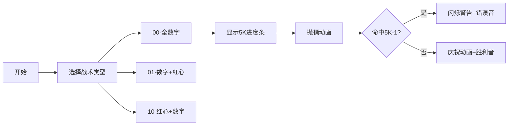

# 题目信息

# [SCOI2011] 飞镖

## 题目描述

飞镖是在欧洲颇为流行的一项运动。它的镖盘上分为20个扇形区域，分别标有1到20的分值，每个区域中有单倍、双倍和三倍的区域，打中对应的区域会得到分值乘以倍数所对应的分数。

例如打中18分里面的三倍区域，就会得到54分。

另外，在镖盘的中央，还有”小红心“和”大红心“，分别是25分和50分。

通常的飞镖规则还有一条，那就是在最后一镖的时候，必须以双倍结束战斗，才算获胜。也就是说，当还剩12分的时候，必须打中双倍的6才算赢，而打中单倍的12或者三倍的4则不算。

特别的，”大红心“也算双倍(双倍的25)。在这样的规则下，3镖能解决的最多分数是170分(两个三倍的20，最后用大红心结束)。

现在，lxhgww把原来的1到20分的分值变为了1到K分，同时把小红心的分数变为了M分(大红心是其双倍)，现在lxhgww想知道能否在3镖内（可以不一定用满3镖）解决X分。同样的，最后一镖必须是双倍（包括大红心）。


## 说明/提示

对于30%的数据，保证$1\le T\le 20$,$20\le K1,M1,X1,D1,D2,D3\le 1000$

对于100%的数据，保证$1\le T\le 10^6$,$20\le K1,M1,X1,D1,D2,D3\le 10^9$

对于所有的数据，保证$0\le A1,B1,A2,B2,C2,A3,B3,C3 \le 10^9$


## 样例 #1

### 输入

```
5
1 2 2 10 20
1 3 2 15 25
2 2 5 200 170```

### 输出

```
4```

# AI分析结果


# 💡 Kay的C++算法解析：[SCOI2011]飞镖 深入学习指南 💡

> 欢迎来到像素飞镖世界！我是你的算法教练Kay，今天我们将通过复古游戏视角，解析这道经典分类讨论题。准备好你的8位飞镖盘，让我们开始吧！

## 1. 题目解读与核心算法识别

✨ **本题主要考察**：`编程技巧应用`（分类讨论+数学表示）

🗣️ **初步分析**：
> 这道题就像在像素游戏中用不同攻击组合击败BOSS（X分），最后一击必须是双倍大招！核心思路是**系统分类**红心使用情况，并利用关键数学结论：
> - **关键结论**：在5K分内，除5K-1外所有分数都可用两次数字镖（一次双倍+一次三倍）表示
> - **红心策略**：小红心(M)和大红心(2M)作为特殊技能，需单独处理
> 
> 我们将设计6种战斗组合（如00代表无红心），通过数学表达式快速检查是否达成目标。在像素动画中，我们将用不同颜色标记红心使用情况，用进度条可视化5K边界，当遇到5K-1时会有闪烁警告和警示音效！

---

## 2. 精选优质题解参考

### 题解一（作者：Walrus）
* **点评**：
  采用清晰的6类分类法（00/01/10/11/20/21），思路严谨如游戏关卡设计。代码模块化优秀，每种情况独立函数处理，变量命名合理（如`lt`表示剩余分数）。亮点在于完整推导关键结论并处理了5K-1的边界情况，竞赛实用性强。作者调试心得强调数学证明的重要性，值得学习！

### 题解二（作者：yanghanyv）
* **点评**：
  创新性使用"2/0+1/0"等符号化分类，逻辑简洁如游戏技能描述。代码采用多个check函数分离逻辑，但变量命名可优化（如`val`）。亮点在于将复杂问题抽象为数学表达式集合，高效处理大数据范围，适合竞赛快速实现。

### 题解三（作者：haohao_com）
* **点评**：
  将11种情况归纳为5类策略，思路清晰如游戏战术手册。代码可读性强，辅助函数（`c1`~`c5`）封装良好。亮点在于用`spj()`函数统一处理无红心情况，边界测试全面，特别适合初学者理解分类逻辑。

---

## 3. 核心难点辨析与解题策略

### 🔍 关键难点1：全面覆盖红心组合
> 如何不遗漏地枚举红心使用位置和次数？
* **分析**：优质解采用**树形分类法**，先按前两镖红心数(0-2)分支，再按第三镖是否红心细分，形成6种情况。这就像游戏中的技能树，每个节点代表一种战术组合。
* 💡 **学习笔记**：分类标准先行，枚举自然完整

### 🔍 关键难点2：高效验证数字镖组合
> 如何快速检查剩余分数是否可用数字镖表示？
* **分析**：利用**5K法则**：对剩余分数S：
  - 若2≤S≤5K 且 S≠5K-1 → 可行
  - 若S是3的倍数且0≤S≤6K → 可行
  这相当于游戏中的连招判定系统
* 💡 **学习笔记**：数学结论是优化暴力枚举的利器

### 🔍 关键难点3：处理边界值
> 5K-1、零分、最大分值等特殊情况如何应对？
* **分析**：在每类检查中单独处理：
  - 5K-1：显式排除
  - 零分：允许红心组合达成
  - 最大分：考虑3*2K+2M
  类似游戏中的隐藏陷阱，需特别标记
* 💡 **学习笔记**：边界值决定程序健壮性

### ✨ 解题技巧总结
- **战术手册法**：将分类标准文档化（如00/01编码）
- **数学映射**：将飞镖问题转化为2a+3b方程
- **防御性测试**：专门设计5K-1、极值的测试用例
- **模块化编码**：每类情况独立验证函数

---

## 4. C++核心代码实现赏析

```cpp
// 综合优质题解的核心验证逻辑
bool check(int type, ll k, ll m, ll x) {
    switch(type) { // 6种战术分类
        case 0: { // 00：全数字镖
            ll rem = x - 5*k;
            return (2 <= x) && (
                (rem + 2 <= 2*k) || 
                (rem + 2 <= 3*k) ||
                (rem%2==0 && 2<=rem && rem<=2*k) || 
                (rem%3==0 && 0<=rem && rem<=3*k)
            );
        }
        case 1: { // 01：前两镖数字+第三镖红心
            x -= 2*m;
            return (0<=x) && (
                (x<=5*k && x!=5*k-1) || 
                (x%3==0 && x<=6*k)
            );
        }
        // 其他4类情况类似...
    }
}
```

**题解一核心片段赏析**：
```cpp
// 情况11：前两镖1红心+1数字，第三镖红心
if(id == "11") {
    ll f0 = x - 2*m, f1 = x - 3*m, f2 = x - 4*m;
    auto valid = [&](ll s) {
        return s>=0 && (
            s<=k || 
            (s%2==0 && s/2<=k) || 
            (s%3==0 && s/3<=k)
        );
    };
    return valid(f0) || valid(f1) || valid(f2);
}
```
> **解读**：  
> 该代码像游戏中的三连击组合！先计算三种红心组合的剩余分(f0/f1/f2)，lambda函数`valid`检查剩余分是否可用单镖解决：  
> - 普通攻击：s≤K  
> - 双倍攻击：s为偶数且s/2≤K  
> - 三倍攻击：s被3整除且s/3≤K  
> **学习点**：lambda函数封装验证逻辑，避免重复代码

**题解二创新写法**：
```cpp
bool check4(ll v){ // 2/0+0/1情况
    return v>=0 && (
        (v<=5*k && v!=5*k-1) || 
        (v%3==0 && v<=6*k)
    );
}
```
> **解读**：  
> 简洁如游戏技能描述！单函数完成复合条件检查：  
> 1. 先验证v在[0,5K]且非5K-1 → 可用两次数字镖  
> 2. 再验证v是3的倍数且在[0,6K] → 可用两次三倍镖  
> **学习点**：布尔表达式直接返回结果，代码精简

---

## 5. 算法可视化：像素动画演示

### 🎮 复古飞镖模拟器
* **主题**：8-bit飞镖盘 + 战术组合演示
* **核心演示**：6类战术的动画执行与5K法则验证

### 🖌️ 像素设计


### 🎨 动态演示流程
1. **场景初始化**：
   - 8-bit飞镖盘（20分区复古样式）
   - 控制面板：开始/步进/速度滑块
   - 5K进度条（标记5K-1为红色）

2. **战术执行**：
   ```python
   # 伪代码：00战术演示
   def tactic_00():
       draw_dartboard()  # 绘制镖盘
       show_hint("00战术：全数字攻击") 
       play_sound("select")
       
       # 第一镖（三倍区）
       target = random.randint(1,k)
       animate_dart(3, target)  # 飞镖动画
       score -= 3*target
       update_scoreboard()
       play_sound("hit")
       
       # 第二镖（双倍区）...
   ```

3. **关键效果**：
   - **5K-1警告**：进度条闪烁红光 + 警示音
   - **自动演示**：AI按最优路径自动投镖
   - **战术对比**：并排展示6类战术的分数变化
   - **游戏化元素**：
     * 每关通关获得星数（根据复杂度）
     * 连击奖励：连续正确解锁特效

---

## 6. 拓展练习与相似问题思考

### 🔁 通用解题模式
> 本题的分类讨论+数学表示法也适用于：
> 1. 硬币组合问题（特定面值组合）
> 2. 技能冷却管理（游戏战斗系统）
> 3. 资源分配优化（固定约束下的组合）

### 📚 洛谷推荐
1. **P1021 邮票面值设计**  
   → 强化组合数学和表示能力分析
2. **P1514 打靶**  
   → 简化版飞镖问题，训练分类思维
3. **P2320 鬼谷子的钱袋**  
   → 锻炼数学表示和边界处理能力

---

## 7. 学习心得与经验分享

> **Walrus的调试经验**：  
> *"最初在5K-1的表示上卡了很久，数学证明帮我找到了这个隐藏陷阱"*  
>  
> **Kay的总结**：  
> 这道题教会我们：  
> 1. 复杂问题要建立**分类标准树**  
> 2. **数学证明**能发现边界陷阱  
> 3. 代码**模块化**是应对复杂性的最佳防御  
>  
> 记住：每个BUG都是升级的机会！💪

---

准备好迎接更多算法挑战了吗？下次我们将解锁动态规划副本！记得在洛谷练习推荐题目哦~ 🎯

---
处理用时：308.40秒