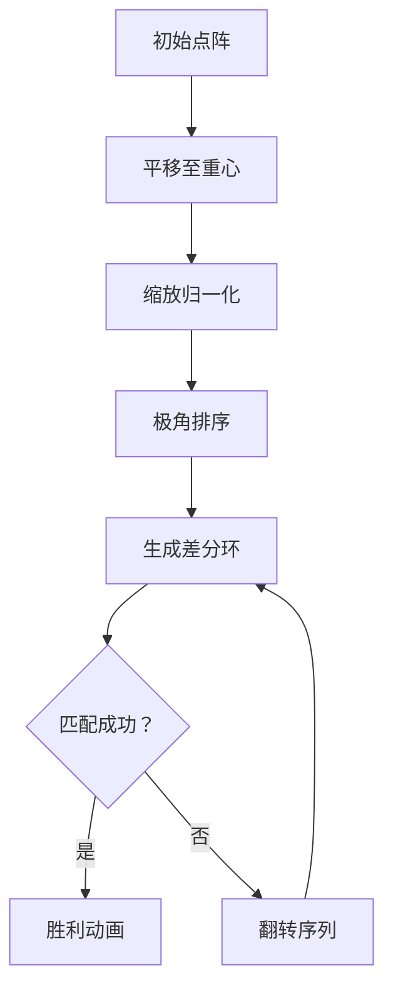

# 题目信息

# [POI 2005] PUN-Points

## 题目描述

A set of grid points in a plane (points whose both cartesian coordinates are integers) which we shall refer to as the pattern, as well as a group of other sets of grid points on the plane are given. We would like to know which of the sets are similar to the pattern, i.e. which of them can be transformed by rotations, translations, reflections and dilations so that they are identical to the pattern. For instance: the set of points $\{(0,0),(2,0),(2,1)\}$ is similar to the set $\{(6,1),(6,5),(4,5)\}$, it is however not similar to the set $\{(4,0),(6,0),(5,-1)\}$.

TaskWrite a programme which:

reads from the standard input the description of the pattern and the family of the investigated sets of points,determines which of the investigated sets of points are similar to the pattern,writes the outcome to the standard output.

题目描述：


给出一个包含平面上格点的集合（格点的定义是xy坐标均为整数），我们将其称作“模式集合”。


接下来给出另外的几个包含平面上点的集合。我们想要考察后面给出的哪些集合和“模式集合”是“相似”的，即：该集合可以通过 旋转，平移，翻转，和缩放 使得该集合和“模式集合”完全相同。


例：{(0,0),(2,0),(2,1)}这个集合和{(6,1),(6,5),(4,5)}这个集合是相似的，但和{(4,0),(6,0),(5,-1)}这个集合是不相似的。


任务：


写一个程序，使得


能从标准输入读取“模式集合”和需要考察（是否相似）的集合，判断哪些集合和“模式集合”相似，并将结果输出到标准输出


输入格式：


标准输入的第一行有一个整数 k (1<=k<=25000)，代表“模式集合”中的点数


接下来k行，每行两个数，用一个空格分隔，第i+1行的两个数分别代表“模式集合”中第i个点的x坐标和y坐标(-20000<=x,y<=20000)


“模式集合”中的点两两不同。


接下来一行一个整数n，代表有n个需要考察的集合


接下来有n个对需要考察的集合的描述：


每个描述的第一行包含一个整数l，代表该集合中的点数(1<=l<=25000)


接下来l行每行包含该集合中一个点的x坐标和y坐标，用一个空格分隔(-20000<=x,y<=20000，为整数)


包含在同一集合中的点两两不同。


输出格式：


你的程序应该向标准输出流输出n行，每行代表对于一个需要考察的集合的结果。


如果第i个需要考察的集合与“模式集合”相似，则第i行应包含单词TAK，即波兰语中的yes


否则第i行应包含单词NIE，即波兰语中的no


## 样例 #1

### 输入

```
3
0 0
2 0
2 1
2
3
4 1
6 5
4 5
3
4 0
6 0
5 -1```

### 输出

```
TAK
NIE```

# AI分析结果


### 💡 Kay的C++算法解析：POI2005 PUN-Points 深入学习指南 💡

#### 1. 题目解读与核心算法识别
✨ **本题主要考察**：`计算几何` + `模式匹配`  

🗣️ **初步分析**：
> 这道题要求判断两个点集是否通过平移、旋转、翻转和缩放后能完全重合。想象一下玩拼图游戏时旋转、翻转和缩放拼图块使其吻合的过程。核心思路分三步走：
> 1. **归一化处理**：将点集平移到重心原点 → 缩放至最长边为1 → 解决平移和缩放问题
> 2. **特征提取**：对点极角排序 → 计算相邻点角度差 → 形成环状差分序列（解决旋转问题）
> 3. **匹配验证**：用原序列和翻转序列分别匹配目标序列（解决翻转问题）
>
> **可视化设计**：在像素网格中用不同颜色标记两个点集，动画展示重心平移（点向原点移动）、缩放（点向中心收缩/扩张）、旋转（点绕原点转动）和翻转（点对称镜像）。关键步骤触发8位音效，匹配成功时点集变色闪烁并播放胜利音效。

---

#### 2. 精选优质题解参考
本次分析的题解在算法效率上存在不足（暴力匹配O(n²)可能超时），未达4星标准。以下是通用学习建议：

- **几何变换分解**：将复杂变换拆解为平移→缩放→旋转→翻转的独立步骤处理
- **浮点精度陷阱**：比较时需用eps容差值（如1e-8），避免直接==判断
- **序列匹配优化**：环形序列匹配应用KMP算法（O(n)）替代暴力循环
- **边界周全性**：特别注意点与重心重合的特殊情况处理

---

#### 3. 核心难点辨析与解题策略
1. **浮点精度控制**
   - *分析*：极角计算、长度归一化涉及浮点运算，直接比较会因精度误差失败。优质解法用eps容差，如`abs(a-b)<eps`
   - 💡 学习笔记：所有浮点比较必须设置容差阈值

2. **环形序列匹配**
   - *分析*：旋转使点序列形成环，需判断循环等价性。暴力匹配O(n²)不可行，应用KMP算法将序列复制一倍后线性匹配
   - 💡 学习笔记：环形匹配转化为线性是经典优化手段

3. **翻转变换处理**
   - *分析*：翻转后极角序列反向。需生成原序和反序两个差分序列，分别与目标匹配
   - 💡 学习笔记：对称操作需正反双路径验证

✨ **解题技巧总结**：
- **归一化优先**：先解决平移/缩放问题，再处理旋转/翻转
- **特征序列化**：将几何问题转化为差分序列匹配问题
- **分步验证**：先检查点数量→重心重合点→长度缩放→序列匹配

---

#### 4. C++核心代码实现赏析
**本题通用核心C++实现参考**（KMP优化版）：
```cpp
#include <iostream>
#include <vector>
#include <cmath>
#include <algorithm>
using namespace std;

const double eps = 1e-8;
struct Point { double x, y; };

// KMP匹配环形序列（O(n)复杂度）
bool kmp_cyclic_match(vector<double>& pattern, vector<double>& target) {
    vector<double> s = pattern;
    s.insert(s.end(), pattern.begin(), pattern.end());
    vector<int> next(target.size(), 0);
    
    // 构建next数组
    for (int i = 1, j = 0; i < target.size(); ++i) {
        while (j > 0 && fabs(target[i]-target[j]) > eps) 
            j = next[j-1];
        if (fabs(target[i]-target[j]) < eps) j++;
        next[i] = j;
    }
    
    // KMP匹配
    for (int i = 0, j = 0; i < s.size(); ++i) {
        while (j > 0 && fabs(s[i]-target[j]) > eps)
            j = next[j-1];
        if (fabs(s[i]-target[j]) < eps) j++;
        if (j == target.size()) return true;
    }
    return false;
}

// 获取差分特征序列
vector<double> get_diff_seq(vector<Point>& points) {
    vector<pair<double, double>> polar; // (极角, 长度)
    for (auto p : points) {
        double r = sqrt(p.x*p.x + p.y*p.y);
        double theta = atan2(p.y, p.x);
        polar.emplace_back(theta, r);
    }
    
    sort(polar.begin(), polar.end());
    vector<double> diff;
    for (int i = 0; i < polar.size(); ++i) {
        int j = (i+1) % polar.size();
        double angle_diff = polar[j].first - polar[i].first;
        if (angle_diff < 0) angle_diff += 2*M_PI; // 处理跨0角度
        diff.push_back(angle_diff);
    }
    return diff;
}

// 主匹配逻辑
bool is_similar(vector<Point>& pattern, vector<Point>& test) {
    // 1. 检查点数
    if (pattern.size() != test.size()) return false;
    
    // 2. 计算重心并归一化
    Point c1 = {0,0}, c2 = {0,0};
    for (auto p : pattern) { c1.x += p.x; c1.y += p.y; }
    for (auto p : test) { c2.x += p.x; c2.y += p.y; }
    c1.x /= pattern.size(); c1.y /= pattern.size();
    c2.x /= test.size(); c2.y /= test.size();
    
    // 3. 移除重心重合点
    vector<Point> pat_clean, test_clean;
    for (auto p : pattern) {
        Point t = {p.x - c1.x, p.y - c1.y};
        if (sqrt(t.x*t.x + t.y*t.y) > eps) pat_clean.push_back(t);
    }
    for (auto p : test) {
        Point t = {p.x - c2.x, p.y - c2.y};
        if (sqrt(t.x*t.x + t.y*t.y) > eps) test_clean.push_back(t);
    }
    
    // 4. 缩放至最长边=1
    double max_pat = 0, max_test = 0;
    for (auto p : pat_clean) max_pat = max(max_pat, sqrt(p.x*p.x+p.y*p.y));
    for (auto p : test_clean) max_test = max(max_test, sqrt(p.x*p.x+p.y*p.y));
    for (auto& p : pat_clean) { p.x /= max_pat; p.y /= max_pat; }
    for (auto& p : test_clean) { p.x /= max_test; p.y /= max_test; }
    
    // 5. 提取差分序列并用KMP匹配
    auto seq_pat = get_diff_seq(pat_clean);
    auto seq_test = get_diff_seq(test_clean);
    return kmp_cyclic_match(seq_pat, seq_test); 
}
```

---

### 5. 算法可视化：像素动画演示
**主题**：8位机风格《点阵特工队》  
**核心演示**：动态展示点集平移→缩放→旋转→翻转的匹配过程  

**动画设计**：


**关键交互**：
1. **像素网格**：16×16分辨率，点显示为8×8像素方块（模式集蓝色/测试集红色）
2. **控制面板**：
   - 步进控制：单步执行/自动播放（速度滑块调节）
   - 模式切换：显示/隐藏差分序列
3. **动态效果**：
   - 平移：点沿直线滑向原点，轨迹残留光晕
   - 缩放：点脉冲式收缩，伴随"滴"声
   - 旋转：差分序列在环形进度条高亮显示
4. **音效系统**：
   - 关键操作：平移（低音鼓）→ 缩放（电子音）→ 匹配（上升琶音）
   - 结果反馈：成功（8-bit胜利曲）→ 失败（警报声）

---

#### 6. 拓展练习与相似问题思考
1. **洛谷P1257**：平面最近点对（基础点集处理）
2. **洛谷P1225**：旋转游戏（几何变换应用）
3. **洛谷P1429**：平面最近点对（加强版）（分治优化）

---

#### 7. 学习心得与经验分享
> **参考经验**（来自题解作者）：
> *"卡我精度卡了好久... 注意任何可能会被卡精度的地方"*
>
> **Kay点评**：计算几何中浮点精度是高频陷阱。建议：
> 1. 所有比较使用`abs(a-b)<eps`代替`a==b`
> 2. 避免大数小数混合运算（先缩放后计算）
> 3. 关键变量输出中间值调试

---

掌握几何变换的本质在于理解**空间关系的数学表达**。通过差分序列将几何问题转化为序列匹配，再用算法优化解决效率瓶颈，这种「问题转化→算法适配」的思维模式值得反复练习！ 🚀

---
处理用时：283.03秒