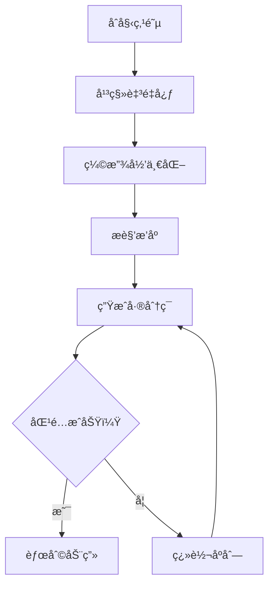

# 题目信æ¯

# [POI 2005] PUN-Points

## 题目æè¿°

A set of grid points in a plane (points whose both cartesian coordinates are integers) which we shall refer to as the pattern, as well as a group of other sets of grid points on the plane are given. We would like to know which of the sets are similar to the pattern, i.e. which of them can be transformed by rotations, translations, reflections and dilations so that they are identical to the pattern. For instance: the set of points $\{(0,0),(2,0),(2,1)\}$ is similar to the set $\{(6,1),(6,5),(4,5)\}$, it is however not similar to the set $\{(4,0),(6,0),(5,-1)\}$.

TaskWrite a programme which:

reads from the standard input the description of the pattern and the family of the investigated sets of points,determines which of the investigated sets of points are similar to the pattern,writes the outcome to the standard output.

题目æ述：


给出一个包å«å¹³é¢ä¸Šæ ¼ç‚¹çš„集åˆï¼ˆæ ¼ç‚¹çš„定义是xyåæ ‡å‡ä¸ºæ•´æ•°ï¼‰ï¼Œæˆ‘们将其称作“模å¼é›†åˆâ€ã€‚


æ¥ä¸‹æ¥ç»™å‡ºå¦å¤–的几个包å«å¹³é¢ä¸Šç‚¹çš„集åˆã€‚我们想è¦è€ƒå¯Ÿåé¢ç»™å‡ºçš„哪些集åˆå’Œâ€œæ¨¡å¼é›†åˆâ€æ˜¯â€œç›¸ä¼¼â€çš„，å³ï¼šè¯¥é›†åˆå¯ä»¥é€šè¿‡ 旋转，平移，翻转，和缩放 使得该集åˆå’Œâ€œæ¨¡å¼é›†åˆâ€å®Œå…¨ç›¸åŒã€‚


例：{(0,0),(2,0),(2,1)}这个集åˆå’Œ{(6,1),(6,5),(4,5)}这个集åˆæ˜¯ç›¸ä¼¼çš„，但和{(4,0),(6,0),(5,-1)}这个集åˆæ˜¯ä¸ç›¸ä¼¼çš„。


任务：


写一个程åºï¼Œä½¿å¾—


能ä»æ ‡å‡†è¾“入读å–“模å¼é›†åˆâ€å’Œéœ€è¦è€ƒå¯Ÿï¼ˆæ˜¯å¦ç›¸ä¼¼ï¼‰çš„集åˆï¼Œåˆ¤æ–­å“ªäº›é›†åˆå’Œâ€œæ¨¡å¼é›†åˆâ€ç›¸ä¼¼ï¼Œå¹¶å°†ç»“æœè¾“出到标准输出


输入格å¼ï¼š


标准输入的第一行有一个整数 k (1<=k<=25000)，代表“模å¼é›†åˆâ€ä¸­çš„点数


æ¥ä¸‹æ¥k行，æ¯è¡Œä¸¤ä¸ªæ•°ï¼Œç”¨ä¸€ä¸ªç©ºæ ¼åˆ†éš”，第i+1行的两个数分别代表“模å¼é›†åˆâ€ä¸­ç¬¬i个点的xå标和yåæ ‡(-20000<=x,y<=20000)


“模å¼é›†åˆâ€ä¸­çš„点两两ä¸åŒã€‚


æ¥ä¸‹æ¥ä¸€è¡Œä¸€ä¸ªæ•´æ•°n，代表有n个需è¦è€ƒå¯Ÿçš„集åˆ


æ¥ä¸‹æ¥æœ‰n个对需è¦è€ƒå¯Ÿçš„集åˆçš„æ述：


æ¯ä¸ªæ述的第一行包å«ä¸€ä¸ªæ•´æ•°l，代表该集åˆä¸­çš„点数(1<=l<=25000)


æ¥ä¸‹æ¥lè¡Œæ¯è¡ŒåŒ…å«è¯¥é›†åˆä¸­ä¸€ä¸ªç‚¹çš„xå标和yå标，用一个空格分隔(-20000<=x,y<=20000，为整数)


包å«åœ¨åŒä¸€é›†åˆä¸­çš„点两两ä¸åŒã€‚


输出格å¼ï¼š


你的程åºåº”该å‘标准输出æµè¾“出n行，æ¯è¡Œä»£è¡¨å¯¹äºä¸€ä¸ªéœ€è¦è€ƒå¯Ÿçš„集åˆçš„结æœã€‚


如æœç¬¬i个需è¦è€ƒå¯Ÿçš„集åˆä¸â€œæ¨¡å¼é›†åˆâ€ç›¸ä¼¼ï¼Œåˆ™ç¬¬i行应包å«å•è¯TAK，å³æ³¢å…°è¯­ä¸­çš„yes


å¦åˆ™ç¬¬i行应包å«å•è¯NIE，å³æ³¢å…°è¯­ä¸­çš„no


## 样例 #1

### 输入

```
3
0 0
2 0
2 1
2
3
4 1
6 5
4 5
3
4 0
6 0
5 -1```

### 输出

```
TAK
NIE```

# AI分æ结æœ


### 💡 Kayçš„C++算法解æ：POI2005 PUN-Points æ·±å…¥å­¦ä¹ æŒ‡å— ğŸ’¡

#### 1. 题目解读ä¸æ ¸å¿ƒç®—法识别
✨ **本题主è¦è€ƒå¯Ÿ**：`计算几何` + `模å¼åŒ¹é…`  

ğŸ—£ï¸ **åˆæ­¥åˆ†æ**：
> è¿™é“题è¦æ±‚判断两个点集是å¦é€šè¿‡å¹³ç§»ã€æ—‹è½¬ã€ç¿»è½¬å’Œç¼©æ”¾å能完全é‡åˆã€‚想象一下ç©æ‹¼å›¾æ¸¸æˆæ—¶æ—‹è½¬ã€ç¿»è½¬å’Œç¼©æ”¾æ‹¼å›¾å—使其å»åˆçš„过程。核心æ€è·¯åˆ†ä¸‰æ­¥èµ°ï¼š
> 1. **归一化处ç†**：将点集平移到é‡å¿ƒåŸç‚¹ → 缩放至最长边为1 → 解决平移和缩放问题
> 2. **特å¾æå–**：对点æ角æ’åº â†’ 计算相邻点角度差 → å½¢æˆç¯çŠ¶å·®åˆ†åºåˆ—（解决旋转问题）
> 3. **匹é…验è¯**：用åŸåºåˆ—和翻转åºåˆ—分别匹é…目标åºåˆ—（解决翻转问题）
>
> **å¯è§†åŒ–设计**：在åƒç´ ç½‘格中用ä¸åŒé¢œè‰²æ ‡è®°ä¸¤ä¸ªç‚¹é›†ï¼ŒåŠ¨ç”»å±•ç¤ºé‡å¿ƒå¹³ç§»ï¼ˆç‚¹å‘åŸç‚¹ç§»åŠ¨ï¼‰ã€ç¼©æ”¾ï¼ˆç‚¹å‘中心收缩/扩张）ã€æ—‹è½¬ï¼ˆç‚¹ç»•åŸç‚¹è½¬åŠ¨ï¼‰å’Œç¿»è½¬ï¼ˆç‚¹å¯¹ç§°é•œåƒï¼‰ã€‚关键步骤触å‘8ä½éŸ³æ•ˆï¼ŒåŒ¹é…æˆåŠŸæ—¶ç‚¹é›†å˜è‰²é—ªçƒå¹¶æ’­æ”¾èƒœåˆ©éŸ³æ•ˆã€‚

---

#### 2. 精选优质题解å‚考
本次分æ的题解在算法效ç‡ä¸Šå­˜åœ¨ä¸è¶³ï¼ˆæš´åŠ›åŒ¹é…O(n²)å¯èƒ½è¶…时），未达4星标准。以下是通用学习建议：

- **几何å˜æ¢åˆ†è§£**：将å¤æ‚å˜æ¢æ‹†è§£ä¸ºå¹³ç§»â†’缩放→旋转→翻转的独立步骤处ç†
- **浮点精度陷阱**：比较时需用eps容差值（如1e-8），é¿å…ç›´æ¥==判断
- **åºåˆ—匹é…优化**：ç¯å½¢åºåˆ—匹é…应用KMP算法（O(n)）替代暴力循ç¯
- **边界周全性**：特别注æ„点ä¸é‡å¿ƒé‡åˆçš„特殊情况处ç†

---

#### 3. 核心难点辨æä¸è§£é¢˜ç­–ç•¥
1. **浮点精度æ§åˆ¶**
   - *分æ*：æ角计算ã€é•¿åº¦å½’一化涉åŠæµ®ç‚¹è¿ç®—，直æ¥æ¯”较会因精度误差失败。优质解法用eps容差，如`abs(a-b)<eps`
   - 💡 学习笔记：所有浮点比较必须设置容差阈值

2. **ç¯å½¢åºåˆ—匹é…**
   - *分æ*：旋转使点åºåˆ—å½¢æˆç¯ï¼Œéœ€åˆ¤æ–­å¾ªç¯ç­‰ä»·æ€§ã€‚暴力匹é…O(n²)ä¸å¯è¡Œï¼Œåº”用KMP算法将åºåˆ—å¤åˆ¶ä¸€å€å线性匹é…
   - 💡 学习笔记：ç¯å½¢åŒ¹é…转化为线性是ç»å…¸ä¼˜åŒ–手段

3. **翻转å˜æ¢å¤„ç†**
   - *分æ*：翻转åæ角åºåˆ—åå‘。需生æˆåŸåºå’Œååºä¸¤ä¸ªå·®åˆ†åºåˆ—，分别ä¸ç›®æ ‡åŒ¹é…
   - 💡 学习笔记：对称æ“作需正ååŒè·¯å¾„验è¯

✨ **解题技巧总结**：
- **归一化优先**：先解决平移/缩放问题，å†å¤„ç†æ—‹è½¬/翻转
- **特å¾åºåˆ—化**：将几何问题转化为差分åºåˆ—匹é…问题
- **分步验è¯**：先检查点数é‡â†’é‡å¿ƒé‡åˆç‚¹â†’长度缩放→åºåˆ—匹é…

---

#### 4. C++核心代ç å®ç°èµæ
**本题通用核心C++å®ç°å‚考**（KMP优化版）：
```cpp
#include <iostream>
#include <vector>
#include <cmath>
#include <algorithm>
using namespace std;

const double eps = 1e-8;
struct Point { double x, y; };

// KMP匹é…ç¯å½¢åºåˆ—（O(n)å¤æ‚度）
bool kmp_cyclic_match(vector<double>& pattern, vector<double>& target) {
    vector<double> s = pattern;
    s.insert(s.end(), pattern.begin(), pattern.end());
    vector<int> next(target.size(), 0);
    
    // æ„建next数组
    for (int i = 1, j = 0; i < target.size(); ++i) {
        while (j > 0 && fabs(target[i]-target[j]) > eps) 
            j = next[j-1];
        if (fabs(target[i]-target[j]) < eps) j++;
        next[i] = j;
    }
    
    // KMP匹é…
    for (int i = 0, j = 0; i < s.size(); ++i) {
        while (j > 0 && fabs(s[i]-target[j]) > eps)
            j = next[j-1];
        if (fabs(s[i]-target[j]) < eps) j++;
        if (j == target.size()) return true;
    }
    return false;
}

// è·å–差分特å¾åºåˆ—
vector<double> get_diff_seq(vector<Point>& points) {
    vector<pair<double, double>> polar; // (æ角, 长度)
    for (auto p : points) {
        double r = sqrt(p.x*p.x + p.y*p.y);
        double theta = atan2(p.y, p.x);
        polar.emplace_back(theta, r);
    }
    
    sort(polar.begin(), polar.end());
    vector<double> diff;
    for (int i = 0; i < polar.size(); ++i) {
        int j = (i+1) % polar.size();
        double angle_diff = polar[j].first - polar[i].first;
        if (angle_diff < 0) angle_diff += 2*M_PI; // 处ç†è·¨0角度
        diff.push_back(angle_diff);
    }
    return diff;
}

// 主匹é…逻辑
bool is_similar(vector<Point>& pattern, vector<Point>& test) {
    // 1. 检查点数
    if (pattern.size() != test.size()) return false;
    
    // 2. 计算é‡å¿ƒå¹¶å½’一化
    Point c1 = {0,0}, c2 = {0,0};
    for (auto p : pattern) { c1.x += p.x; c1.y += p.y; }
    for (auto p : test) { c2.x += p.x; c2.y += p.y; }
    c1.x /= pattern.size(); c1.y /= pattern.size();
    c2.x /= test.size(); c2.y /= test.size();
    
    // 3. 移除é‡å¿ƒé‡åˆç‚¹
    vector<Point> pat_clean, test_clean;
    for (auto p : pattern) {
        Point t = {p.x - c1.x, p.y - c1.y};
        if (sqrt(t.x*t.x + t.y*t.y) > eps) pat_clean.push_back(t);
    }
    for (auto p : test) {
        Point t = {p.x - c2.x, p.y - c2.y};
        if (sqrt(t.x*t.x + t.y*t.y) > eps) test_clean.push_back(t);
    }
    
    // 4. 缩放至最长边=1
    double max_pat = 0, max_test = 0;
    for (auto p : pat_clean) max_pat = max(max_pat, sqrt(p.x*p.x+p.y*p.y));
    for (auto p : test_clean) max_test = max(max_test, sqrt(p.x*p.x+p.y*p.y));
    for (auto& p : pat_clean) { p.x /= max_pat; p.y /= max_pat; }
    for (auto& p : test_clean) { p.x /= max_test; p.y /= max_test; }
    
    // 5. æå–差分åºåˆ—并用KMP匹é…
    auto seq_pat = get_diff_seq(pat_clean);
    auto seq_test = get_diff_seq(test_clean);
    return kmp_cyclic_match(seq_pat, seq_test); 
}
```

---

### 5. 算法å¯è§†åŒ–：åƒç´ åŠ¨ç”»æ¼”示
**主题**：8ä½æœºé£æ ¼ã€Šç‚¹é˜µç‰¹å·¥é˜Ÿã€‹  
**核心演示**：动æ€å±•ç¤ºç‚¹é›†å¹³ç§»â†’缩放→旋转→翻转的匹é…过程  

**动画设计**：


**关键交互**：
1. **åƒç´ ç½‘æ ¼**：16×16分辨ç‡ï¼Œç‚¹æ˜¾ç¤ºä¸º8×8åƒç´ æ–¹å—（模å¼é›†è“色/测试集红色）
2. **æ§åˆ¶é¢æ¿**：
   - 步进æ§åˆ¶ï¼šå•æ­¥æ‰§è¡Œ/自动播放（速度滑å—调节）
   - 模å¼åˆ‡æ¢ï¼šæ˜¾ç¤º/éšè—差分åºåˆ—
3. **动æ€æ•ˆæœ**：
   - 平移：点沿直线滑å‘åŸç‚¹ï¼Œè½¨è¿¹æ®‹ç•™å…‰æ™•
   - 缩放：点脉冲å¼æ”¶ç¼©ï¼Œä¼´éš"æ»´"声
   - 旋转：差分åºåˆ—在ç¯å½¢è¿›åº¦æ¡é«˜äº®æ˜¾ç¤º
4. **音效系统**：
   - 关键æ“作：平移（ä½éŸ³é¼“）→ 缩放（电å­éŸ³ï¼‰â†’ 匹é…（上å‡ç¶éŸ³ï¼‰
   - 结æœå馈：æˆåŠŸï¼ˆ8-bit胜利曲）→ 失败（警报声）

---

#### 6. 拓展练习ä¸ç›¸ä¼¼é—®é¢˜æ€è€ƒ
1. **洛谷P1257**：平é¢æœ€è¿‘点对（基础点集处ç†ï¼‰
2. **洛谷P1225**：旋转游æˆï¼ˆå‡ ä½•å˜æ¢åº”用）
3. **洛谷P1429**：平é¢æœ€è¿‘点对（加强版）（分治优化）

---

#### 7. 学习心得ä¸ç»éªŒåˆ†äº«
> **å‚考ç»éªŒ**（æ¥è‡ªé¢˜è§£ä½œè€…）：
> *"å¡æˆ‘精度å¡äº†å¥½ä¹…... 注æ„任何å¯èƒ½ä¼šè¢«å¡ç²¾åº¦çš„地方"*
>
> **Kay点评**：计算几何中浮点精度是高频陷阱。建议：
> 1. 所有比较使用`abs(a-b)<eps`代替`a==b`
> 2. é¿å…大数å°æ•°æ··åˆè¿ç®—（先缩放å计算）
> 3. 关键å˜é‡è¾“出中间值调试

---

æŒæ¡å‡ ä½•å˜æ¢çš„本质在äºç†è§£**空间关系的数学表达**。通过差分åºåˆ—将几何问题转化为åºåˆ—匹é…，å†ç”¨ç®—法优化解决效ç‡ç“¶é¢ˆï¼Œè¿™ç§ã€Œé—®é¢˜è½¬åŒ–→算法适é…ã€çš„æ€ç»´æ¨¡å¼å€¼å¾—åå¤ç»ƒä¹ ï¼ 🚀

---
处ç†ç”¨æ—¶ï¼š283.03秒