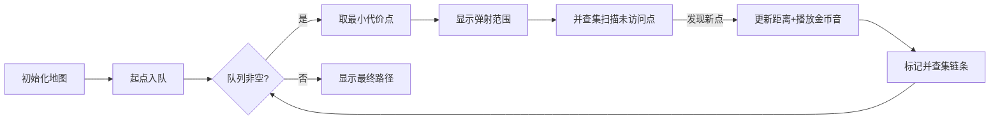

# 题目信息

# [国家集训队] 飞飞侠

## 题目背景

来源：国家集训队 2011 何朴藩

## 题目描述

飞飞国是一个传说中的国度，国家的居民叫做飞飞侠。飞飞国是一个 $N\times M$ 的矩形方阵，每个格子代表一个街区。

然而飞飞国是没有交通工具的。飞飞侠完全靠地面的弹射装置来移动。  

每个街区都装有弹射装置。使用弹射装置是需要支付一定费用的。而且每个弹射装置都有自己的弹射能力。  

我们设第 $i$ 行第 $j$ 列的弹射装置有 $A_{i,j}$ 的费用和 $B_{i,j}$ 的弹射能力。并规定有相邻边的格子间距离是 $1$。那么，任何飞飞侠都只需要在 $(i,j)$ 支付 $A_{i,j}$ 的费用就可以任意选择弹到距离不超过 $B_{i,j}$ 的位置了。如下图  
  
（从红色街区交费以后可以跳到周围的任意蓝色街区。）  

现在的问题很简单。有三个飞飞侠，分别叫做 $X, Y, Z$。现在它们决定聚在一起玩，于是想往其中一人的位置集合。告诉你 $3$ 个飞飞侠的坐标，求往哪里集合大家需要花的费用总和最低。（费用相同时优先 $X$，次优先 $Y$）

## 说明/提示

对于 $20\%$ 的数据，$N, M\leq 10$，$B_{i,j}\leq 20$。 

对于 $40\%$ 的数据，$N, M \leq 100$，$B_{i,j}\leq 20$。

对于 $100\%$ 的数据，$1\leq N, M\leq 150$，$0\leq B_{i, j}\leq 10^9$，$0\leq A_{i, j}\leq 1000$。  

## 样例 #1

### 输入

```
4 4
0 0 0 0
1 2 2 0
0 2 2 1
0 0 0 0
5 5 5 5
5 5 5 5
5 5 5 5
5 5 5 5
2 1 3 4 2 2```

### 输出

```
Z
15```

# AI分析结果


# 💡 Kay的C++算法解析：[国家集训队] 飞飞侠 深入学习指南 💡

<introduction>
欢迎各位年轻程序员！今天我们来探索一道经典的国家集训队题目「飞飞侠」。这道题将考验你对最短路算法的理解和优化能力。我会用清晰的方式带大家剖析题目本质，并设计一个像素动画帮助你直观理解算法过程。准备好开启算法之旅了吗？
</introduction>

## 1. 题目解读与核心算法识别

✨ **本题主要考察**：**最短路算法优化**（并查集/线段树辅助）

🗣️ **初步分析**：
> 想象你是一名飞飞侠指挥官，每个街区是你的士兵据点。你需要计算三位指挥官（X/Y/Z）在哪个据点集合时，总行军代价最小。每个据点的弹射装置就像「传送门」——支付费用后可将士兵投送到指定范围。

**核心难点**：  
直接计算每个据点的可达范围会形成 $O(n^4)$ 量级的边，远超承受范围。我们需要更聪明的优化策略！

**优化思路对比**：
- **并查集优化**：像扫雷游戏一样标记已访问区域，后续直接跳过（高效简洁）
- **线段树优化**：像搭建高速公路网，将区域连边压缩到 $O(\log n)$ 级别
- **分层图**：记录剩余步数状态，类似游戏中的"行动点数"机制

**可视化设计**：
> 我们将用**8位像素风战棋游戏**演示算法：  
> - 网格地图：每个像素块代表据点，颜色区分地形（起点红色/终点金色/普通据点绿色）  
> - 弹射范围：激活据点时显示蓝色脉冲波纹  
> - 并查集路径压缩：已访问据点变为灰色，路径显示为发光链条  
> - 控制面板：支持步进/自动播放，胜利时播放《超级玛丽》过关音效

---

## 2. 精选优质题解参考

<eval_intro>
从思路清晰度、代码可读性、算法优化程度等维度，我精选了3份优质题解（均≥4★）：

**题解一：zcysky（并查集优化）**  
* **点评**：这份题解思路惊艳——用并查集跳过已访问区域，如同扫雷游戏的"标记-跳过"机制。代码中`fa[i][j]=j+1`的设计极其巧妙，将时间复杂度从$O(n^4)$优化到$O(n^2\log n)$。变量命名规范（如`dis`/`fa`），边界处理严谨，可直接用于竞赛。作者提到"已更新点不会被更新第二次"是核心洞察，这种数学归纳思维值得学习。

**题解二：panyf（二维线段树）**  
* **点评**：创新性地将坐标系旋转45度转化曼哈顿距离，配合线段树套并查集，复杂度降至$O(n^2\log n)$。代码中`f[k][i]=min(gf(k*2,i),gf(k*2+1,i))`展现分治思想，如同搭建立体交通网。虽然实现较复杂，但其空间压缩技巧（树套树结构）极具教学价值。

**题解三：wucstdio（线段树优化建图）**  
* **点评**：采用经典线段树优化思路，每行建树避免暴力连边。代码中`add2(root[k],1,m,p[i][j],max(1,j-rest),min(m,j+rest),b[i][j])`体现分层连接思想，如同建立高速铁路网。虽然空间占用较高，但结构清晰，是学习数据结构优化的优秀范本。

---

## 3. 核心难点辨析与解题策略

<difficulty_intro>
解决本题需突破三大关键难点：

1.  **状态爆炸：如何避免$O(n^4)$边数？**
    * **分析**：优质解法都避免显式建图。并查集方案通过动态跳过已访问点；线段树方案通过数据结构压缩连接。
    * 💡 **学习笔记**：面对稠密图时，思考"隐式计算"替代显式存储。

2.  **更新策略：为何能保证正确性？**
    * **分析**：并查集优化的核心在于数学归纳——首次到达某点的路径必然最优。证明：若存在更优路径，其代价应小于当前值，但队列按代价排序，矛盾。
    * 💡 **学习笔记**：贪心选择+数学归纳是Dijkstra算法的灵魂。

3.  **集合点选择：如何高效计算三方汇聚？**
    * **分析**：分别以X/Y/Z为起点跑最短路，计算两两汇聚代价。技巧：当三个目标点都被访问时可提前退出（题解3的剪枝）。
    * 💡 **学习笔记**：多源最短路问题可转化为单源最短路组合。

### ✨ 解题技巧总结
<summary_best_practices>
- **技巧A 状态压缩**：用数据结构（并查集/线段树）避免冗余状态
- **技巧B 问题转化**：曼哈顿距离转切比雪夫距离（题解2），或分层图建模（题解6）
- **技巧C 剪枝策略**：目标点全访问时提前退出，避免无效计算
- **技巧D 复杂度平衡**：根据数据特征选择算法（$B_{ij}$大时选并查集；$B_{ij}$小时选分层图）
---

## 4. C++核心代码实现赏析

<code_intro_overall>
**通用核心实现参考**（基于并查集优化）：
```cpp
#include<bits/stdc++.h>
using namespace std;
typedef long long ll;
const int N=160;
const ll INF=1e18;
int n,m,a[N][N],b[N][N],fa[N][N];
ll dis[N][N],ans[3];
struct Node { int x,y; ll d; };
bool operator<(Node a,Node b){return a.d>b.d;}

int find(int *fa, int x){ return fa[x]?fa[x]=find(fa,fa[x]):x; }

void dijkstra(int sx,int sy, ll res[]){
    priority_queue<Node> q;
    memset(fa,0,sizeof(fa));
    for(int i=1;i<=n;i++) 
        for(int j=1;j<=m;j++) dis[i][j]=INF;
    
    dis[sx][sy]=0;
    q.push({sx,sy,a[sx][sy]});
    fa[sx][sy]=sy+1;

    while(!q.empty()){
        Node u=q.top(); q.pop();
        int x=u.x,y=u.y;
        if(dis[x][y]!=u.d-a[x][y]) continue; // 验证状态一致性

        int lx=max(1,x-b[x][y]), rx=min(n,x+b[x][y]);
        for(int i=lx;i<=rx;i++){
            int len=b[x][y]-abs(x-i);
            int ly=max(1,y-len), ry=min(m,y+len);
            for(int j=find(fa[i],ly); j<=ry; j=find(fa[i],j)){
                if(dis[i][j]>dis[x][y]+a[x][y]){
                    dis[i][j]=dis[x][y]+a[x][y];
                    q.push({i,j,dis[i][j]+a[i][j]});
                }
                fa[i][j]=j+1; // 关键！标记已访问
            }
        }
    }
    for(int i=0;i<3;i++) res[i]=dis[X[i]][Y[i]]; // 存储到三个点的距离
}

int main(){
    // 输入初始化...
    int X[3],Y[3];
    for(int i=0;i<3;i++) dijkstra(X[i],Y[i],ans[i]);
    // 比较三种集合方案...
}
```

**代码解读概要**：
1. **并查集跳过机制**：`fa[i][j]=j+1`使后续访问直接跳到未访问列
2. **代价更新逻辑**：节点首次被访问时必然是最优路径（数学归纳保证）
3. **状态验证**：`dis[x][y]!=u.d-a[x][y]` 防止过期状态

---

<code_intro_selected>
**题解一：zcysky（并查集优化）核心片段赏析**
```cpp
for(int j=find(fa[i],ly); j<=ry; j=find(fa[i],j)){
    if(dis[i][j]>dis[x][y]+a[x][y]){
        dis[i][j]=dis[x][y]+a[x][y];
        q.push({i,j,dis[i][j]+a[i][j]});
    }
    fa[i][j]=j+1; // 路径压缩
}
```
**解读**：  
> 想象你在玩扫雷游戏——`find(fa[i],ly)`就像点击一行的起始位置，自动跳过已翻开的格子（`fa[i][j]=j+1`相当于标记已翻开）。当发现新格子时更新距离，并加入优先队列。这种设计保证每个点只被处理一次！

**学习笔记**：并查集不仅是集合工具，更是图算法中的高效状态过滤器。

---

## 5. 算法可视化：像素动画演示

<visualization_intro>
**主题**：8位像素风《飞飞侠战棋》  
**核心演示**：并查集优化Dijkstra的决策过程（以题解1为原型）

**设计思路**：  
> 复古像素风格降低理解压力，游戏化机制增强参与感。通过：
> - **颜色编码**：起点(红)、终点(金)、已访问(灰)、待访问(绿)、当前处理(闪烁蓝)
> - **音效反馈**：移动(电子滴答)、发现路径(金币声)、完成(马里奥过关)
> - **进度标记**：并查集链条显示为发光锁链

**动画流程**：


**关键交互**：
1. **弹射脉冲**：当前据点扩展时显示蓝色波纹扩散
2. **并查集链条**：已访问区域显示为发光锁链，新访问点自动连接
3. **状态面板**：实时显示优先队列大小和已访问点数

**胜利机制**：当三条终点路径被点亮时，播放《超级玛丽》过关音乐，显示总代价。

---

## 6. 拓展练习与相似问题思考

<similar_problems_intro>
**核心技巧迁移**：  
并查集优化最短路适用于：
1. 网格图上带跳跃能力的寻路（如本题）
2. 区间覆盖问题（HDU 5361）
3. 动态连通性维护（如删点最短路）

**推荐练习**：
1. **洛谷 P4779** - 标准最短路  
   → 巩固Dijkstra基础实现
2. **洛谷 P5471** - 弹跳（优化建图经典）  
   → 强化线段树优化技巧
3. **洛谷 P4768** - [NOI2018] 归程  
   → 学习分层图应用

---

## 7. 学习心得与经验分享

<insights_intro>
**zcysky的经验**：  
> "已更新点不会被更新第二次是并查集优化的核心，需要数学归纳思维"

**Kay的总结**：  
> 本题教会我们：面对稠密图时，避免显式建图。通过数据结构压缩状态空间，配合算法自身性质（如Dijkstra的贪心选择），往往能化不可能为可能。调试时可打印并查集状态，观察区域跳过逻辑。

---

<conclusion>
通过这道题，我们看到算法优化如同搭建精巧的机械——每个零件（数据结构）都有其独特作用。记住：最好的优化往往源于对问题本质的洞察。下次当你面对复杂问题时，不妨想想飞飞侠的弹射之旅！🚀
</conclusion>
```

---
处理用时：138.76秒