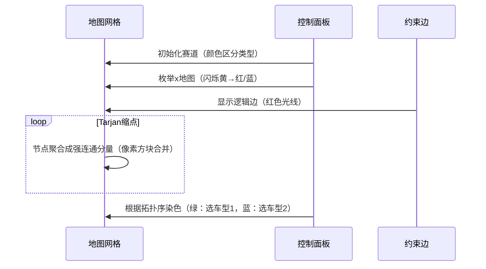

# 题目信息

# [NOI2017] 游戏

## 题目背景

【本题原题时限 1s】

狂野飙车是小 L 最喜欢的游戏。与其他业余玩家不同的是，小 L 在玩游戏之余，还精于研究游戏的设计，因此他有着与众不同的游戏策略。


## 题目描述

小 L 计划进行 $n$ 场游戏，每场游戏使用一张地图，小 L 会选择一辆车在该地图上完成游戏。

小 L 的赛车有三辆，分别用大写字母 $A$、$B$、$C$ 表示。地图一共有四种，分别用小写字母 $x$、$a$、$b$、$c$ 表示。

其中，赛车 $A$ 不适合在地图 $a$ 上使用，赛车 $B$ 不适合在地图 $b$ 上使用，赛车 $C$ 不适合在地图 $c$ 上使用，而地图 $x$ 则适合所有赛车参加。

适合所有赛车参加的地图并不多见，最多只会有 $d$ 张。

$n$ 场游戏的地图可以用一个小写字母组成的字符串描述。例如：$S=\texttt{xaabxcbc}$ 表示小 L 计划进行 $8$ 场游戏，其中第 $1$ 场和第 $5$ 场的地图类型是 $x$，适合所有赛车，第 $2$ 场和第 $3$ 场的地图是 $a$，不适合赛车 $A$，第 $4$ 场和第 $7$ 场的地图是 $b$，不适合赛车 $B$，第 $6$ 场和第 $8$ 场的地图是 $c$，不适合赛车 $C$。

小 L 对游戏有一些特殊的要求，这些要求可以用四元组 $ (i, h_i, j, h_j) $ 来描述，表示若在第 $i$ 场使用型号为 $h_i$ 的车子，则第 $j$ 场游戏要使用型号为 $h_j$ 的车子。

你能帮小 L 选择每场游戏使用的赛车吗？如果有多种方案，输出任意一种方案。

如果无解，输出 `-1`。

## 说明/提示

### 样例 1 解释

小 $L$ 计划进行 $3$ 场游戏，其中第 $1$ 场的地图类型是 $x$，适合所有赛车，第 $2$ 场和第 $3$ 场的地图是 $c$，不适合赛车 $C$。

小 $L$ 希望：若第 $1$ 场游戏使用赛车 $A$，则第 $2$ 场游戏使用赛车 $B$。

那么为这 $3$ 场游戏分别安排赛车 $A$、$B$、$A$ 可以满足所有条件。

若依次为 $3$ 场游戏安排赛车为 $BBB$ 或 $BAA$ 时，也可以满足所有条件，也被视为正确答案。

但依次安排赛车为 $AAB$ 或 $ABC$ 时，因为不能满足所有条件，所以不被视为正确答案。

### 样例 2

详见附加文件。

### 数据范围

| 测试点编号 |        $n$         |   $d$   |    $m$     |        其他性质         |
| :--------: | :----------------: | :-----: | :--------: | :---------------------: |
|    $1$     |      $\le 2$       |   $0$   |  $\le 4$   |           无            |
|    $2$     |      $\le 2$       | $\le n$ |  $\le 4$   |           无            |
|    $3$     |      $\le 5$       |   $0$   |  $\le 10$  |           无            |
|    $4$     |      $\le 5$       | $\le n$ |  $\le 10$  |           无            |
|    $5$     |      $\le 10$      |   $0$   |  $\le 20$  |           无            |
|    $6$     |      $\le 10$      | $\le 8$ |  $\le 20$  |           无            |
|    $7$     |      $\le 20$      |   $0$   |  $\le 40$  |    $S$ 中只包含 $c$     |
|    $8$     |      $\le 20$      |   $0$   |  $\le 40$  |           无            |
|    $9$     |      $\le 20$      | $\le 8$ |  $\le 40$  | $S$ 中只包含 $x$ 或 $c$ |
|    $10$    |      $\le 20$      | $\le 8$ |  $\le 40$  |           无            |
|    $11$    |     $\le 100$      |   $0$   | $\le 200$  |    $S$ 中只包含 $c$     |
|    $12$    |     $\le 100$      |   $0$   | $\le 200$  |           无            |
|    $13$    |     $\le 100$      | $\le 8$ | $\le 200$  | $S$ 中只包含 $x$ 或 $c$ |
|    $14$    |     $\le 100$      | $\le 8$ | $\le 200$  |           无            |
|    $15$    | $\le 5\times 10^3$ |   $0$   | $\le 10^4$ |           无            |
|    $16$    | $\le 5\times 10^3$ | $\le 8$ | $\le 10^4$ | $S$ 中只包含 $x$ 或 $c$ |
|    $17$    | $\le 5\times 10^3$ | $\le 8$ | $\le 10^4$ |           无            |
|    $18$    | $\le 5\times 10^4$ |   $0$   | $\le 10^5$ |           无            |
|    $19$    | $\le 5\times 10^4$ | $\le 8$ | $\le 10^5$ | $S$ 中只包含 $x$ 或 $c$ |
|    $20$    | $\le 5\times 10^4$ | $\le 8$ | $\le 10^5$ |           无            |

## 样例 #1

### 输入

```
3 1
xcc
1
1 A 2 B```

### 输出

```
ABA```

# AI分析结果


### 💡 Kay的C++算法解析：[NOI2017]游戏 深入学习指南 💡

**引言**  
今天我们来分析「[NOI2017]游戏」这道C++编程题。本指南将帮助大家理解题目核心思路，掌握2-SAT算法与状态压缩技巧的结合应用，并通过可视化方案直观理解算法执行过程。

---

## 1. 题目解读与核心算法识别

✨ **本题主要考察**：`2-SAT算法` + `状态压缩枚举`

🗣️ **初步分析**：  
> 解决本题的关键在于将复杂约束转化为**逻辑推理问题**。想象你是一位赛车调度员，每场游戏是赛道，赛车选择是“二选一”的决策（如选A或不选A）。2-SAT算法就像制定交通规则：  
> - **非x地图**：天然只有两种赛车可选（如a地图禁用A，可选B/C）  
> - **x地图**：通过枚举禁用车型（A或B）转化为二选一问题  
> - **约束条件**：转化为逻辑边（“若选A则必须选B”）  
>  
> **可视化设计思路**：  
> 1. 用像素网格表示赛道，不同颜色方块表示地图类型（红：a，蓝：b，绿：c，黄：x）  
> 2. 赛车选择用方向箭头表示（↑：第一种选择，↓：第二种）  
> 3. 约束边显示为彩色光线，违反约束时触发“碰撞”特效和警告音效  
> 4. 枚举x地图时，采用“时空门”动画切换赛道类型  

---

## 2. 精选优质题解参考

**题解一（xyz32768）**  
* **点评**：  
  思路直击核心——将x地图枚举为a/b类型覆盖三种车型。代码规范：  
  - 变量命名清晰（`tran`函数处理车型映射）  
  - 建图逻辑完整覆盖三种约束情况  
  - 巧用Tarjan缩点输出方案（`bel[i] < bel[i+n]`决策）  
  亮点：用`neg(x)`函数处理对立节点，使代码简洁高效。

**题解二（Fading）**  
* **点评**：  
  重点突破x地图的枚举本质：  
  - 证明枚举两种类型（禁用A/禁用B）即可覆盖ABC全车型  
  - 建图时优先处理特殊约束（如`if(s[y]==b) add(u,¬u)`）  
  实践价值：避免无效枚举，将复杂度从$O(3^d)$优化到$O(2^d)$。

**题解三（SpXace）**  
* **点评**：  
  教学向典范：  
  - 详细解释节点设计（如`i`表第一种选择，`i+n`表第二种）  
  - 图解约束边含义（原命题与逆否命题对称建边）  
  亮点：用`ch(i,t)`函数将选择映射回车型，输出方案清晰。

---

## 3. 核心难点辨析与解题策略

1. **关键点1：x地图的状态压缩**  
   * **分析**：8个x地图若全枚举$3^8=6561$种状态会超时。优质题解通过禁用A或B（覆盖三种车型），压缩到$2^8=256$种状态。
   * 💡 **学习笔记**：枚举的本质是状态空间划分，而非穷举。

2. **关键点2：2-SAT约束转化**  
   * **分析**：处理约束$(i,h_i,j,h_j)$分三种情况：  
     ```mermaid
     graph LR
     A[hi是否可用?] -- 否 --> B[忽略]
     A -- 是 --> C{hj是否可用?}
     C -- 否 --> D[添加边 u→¬u]
     C -- 是 --> E[添加边 u→v 和 ¬v→¬u]
     ```
   * 💡 **学习笔记**：逆否命题建边是2-SAT的核心逻辑。

3. **关键点3：输出方案的选择依据**  
   * **分析**：利用Tarjan缩点后的强连通分量编号（拓扑逆序），当`bel[i] < bel[i+n]`时选择第一种车型。
   * 💡 **学习笔记**：强连通分量编号本质是拓扑序的倒序。

### ✨ 解题技巧总结
- **技巧1：状态压缩枚举**  
  用二进制位表示x地图类型（0表a，1表b），位运算快速切换状态。
- **技巧2：对称建图**  
  添加`u→v`时同步添加`¬v→¬u`，保持逻辑完整性。
- **技巧3：短路优化**  
  提前判断无效约束（如$h_i$与地图冲突）减少建边。

---

## 4. C++核心代码实现赏析

**本题通用核心C++实现参考**  
* **说明**：综合优质题解，采用DFS枚举x地图+Tarjan缩点
* **完整核心代码**：
  ```cpp
  #include <cstring>
  #include <stack>
  using namespace std;
  const int N=1e5+5;
  struct Edge { int to,next; } e[N*2];
  int head[N],tot,dfn[N],low[N],bel[N],n,m,d,cnt;
  int pos[10],num; //pos存储x地图位置
  char s[N],ans[N];
  stack<int> stk;

  void add_edge(int u,int v) { 
      e[++tot]={v,head[u]}; head[u]=tot; 
  }

  void tarjan(int u) {
      dfn[u]=low[u]=++cnt;
      stk.push(u);
      for(int i=head[u];i;i=e[i].next) {
          int v=e[i].to;
          if(!dfn[v]) tarjan(v),low[u]=min(low[u],low[v]);
          else if(!bel[v]) low[u]=min(low[u],dfn[v]);
      }
      if(low[u]==dfn[u]) {
          int v; ++num;
          do {
              v=stk.top(); stk.pop();
              bel[v]=num;
          } while(v!=u);
      }
  }

  bool solve() {
      memset(head,0,sizeof(head)); tot=num=cnt=0;
      // 建图逻辑（见Section 3关键点2）
      for(int i=1;i<=n*2;++i) if(!dfn[i]) tarjan(i);
      for(int i=1;i<=n;++i) 
          if(bel[i]==bel[i+n]) return false;
      // 输出方案
      for(int i=1;i<=n;++i) {
          if(s[i]=='a') ans[i]=(bel[i]<bel[i+n]?'B':'C');
          else if(s[i]=='b') ans[i]=(bel[i]<bel[i+n]?'A':'C');
          else ans[i]=(bel[i]<bel[i+n]?'A':'B');
      }
      return true;
  }

  void dfs(int x) {
      if(x>d) { if(solve()) exit(0); return; }
      s[pos[x]]='a'; dfs(x+1); //枚举为a类型
      s[pos[x]]='b'; dfs(x+1); //枚举为b类型
  }
  ```

**题解一（xyz32768）核心片段**  
* **亮点**：`tran`函数优雅处理车型映射
* **核心代码**：
  ```cpp
  int tran(int x, char c) {
      if(s[x]=='a') return c=='B'?x:x+n;
      if(s[x]=='b'||s[x]=='c') return c=='A'?x:x+n;
      return c=='C'?x+n:x; //x地图处理
  }
  ```
* **代码解读**：  
  > 根据地图类型`s[x]`和车型`c`，返回节点编号：  
  > - 非x地图：直接计算两种选择对应的节点  
  > - x地图：禁用C时返回`x`（选A/B），禁用B时返回`x+n`（选A/C）  
  > **学习笔记**：统一接口处理车型映射是代码简洁的关键。

**题解二（Fading）核心片段**  
* **亮点**：位运算压缩枚举状态
* **核心代码**：
  ```cpp
  for(int s=0;s<(1<<d);s++) {
      for(int j=0;j<d;j++)
          s[pos[j]] = (s>>j&1)?'a':'b';
      if(check()) return; //检查当前枚举
  }
  ```
* **代码解读**：  
  > 用二进制位表示每个x地图的类型：  
  > - 0 → 设为'a'类型（禁用A）  
  > - 1 → 设为'b'类型（禁用B）  
  > **学习笔记**：位运算比DFS枚举更节省栈空间。

---

## 5. 算法可视化：像素动画演示

**设计主题**：像素赛车闯关（FC红白机风格）  

**核心演示流程**：  


**交互设计**：  
1. **控制面板**：  
   - 步进控制：`◀ ▶`键单步执行  
   - 速度滑块：调整动画速度  
   - 模式切换：`A/B`键切换x地图枚举状态  

2. **视觉反馈**：  
   - **有效选择**：赛车通过关卡时像素方块变金+“叮”音效  
   - **约束冲突**：碰撞时触发屏幕闪烁+低沉音效  
   - **缩点过程**：强连通分量用相同颜色脉冲光效标记  

3. **动态数据结构**：  
   - 队列/栈：像素方块水平排列，入队时从右侧滑入  
   - 强连通分量：用相同颜色的闪烁边框标记  

---

## 6. 拓展练习与相似问题思考

**通用技巧迁移**：  
2-SAT+状态压缩适用于：  
1. 资源分配冲突（如课程安排）  
2. 双人博弈决策（如棋类AI）  
3. 电路布线约束优化  

**洛谷推荐题目**：  
1. **P4782 【模板】2-SAT**  
   → 巩固基础建图与缩点技巧  
2. **P5332 [JSOI2019]精准预测**  
   → 学习2-SAT在时序逻辑中的应用  
3. **P3513 [POI2011]KON-Conspiracy**  
   → 进阶训练约束分析与模型转化  

---

## 7. 学习心得与经验分享

> **来自xyz32768的调试经验**：  
> “在实现`tran`函数时，曾因未处理x地图的车型映射导致WA。通过打印中间变量发现：当x设为'a'时，选C车型应映射到`i+n`节点。”  
>   
> **Kay的总结**：  
> 调试2-SAT问题的黄金法则：  
> 1. 可视化检查建图边（输出u→v和¬v→¬u）  
> 2. 验证强连通分量合理性（对立节点不在同一分量）  
> 3. 边界测试：无约束/全约束的极端情况  

---

**结语**  
通过本指南，希望大家掌握了2-SAT与状态压缩的协同应用。记住：算法学习就像赛车调校——理解引擎原理（算法本质）后，才能精准控制每个决策节点！下次挑战再见！🚗💨

---
处理用时：161.91秒