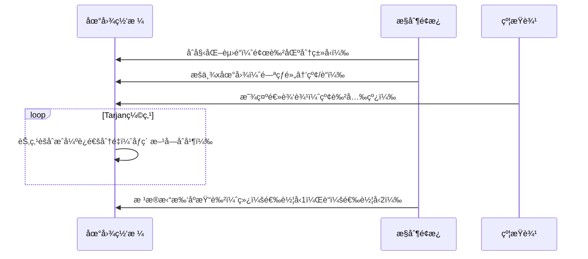

# 题目信æ¯

# [NOI2017] 游æˆ

## 题目背景

ã€æœ¬é¢˜åŸé¢˜æ—¶é™ 1s】

ç‹‚é‡é£™è½¦æ˜¯å° L 最喜欢的游æˆã€‚ä¸å…¶ä»–业余ç©å®¶ä¸åŒçš„æ˜¯ï¼Œå° L 在ç©æ¸¸æˆä¹‹ä½™ï¼Œè¿˜ç²¾äºç ”究游æˆçš„设计，因此他有ç€ä¸ä¼—ä¸åŒçš„游æˆç­–略。


## 题目æè¿°

å° L 计划进行 $n$ 场游æˆï¼Œæ¯åœºæ¸¸æˆä½¿ç”¨ä¸€å¼ åœ°å›¾ï¼Œå° L 会选择一辆车在该地图上完æˆæ¸¸æˆã€‚

å° L çš„èµ›è½¦æœ‰ä¸‰è¾†ï¼Œåˆ†åˆ«ç”¨å¤§å†™å­—æ¯ $A$ã€$B$ã€$C$ 表示。地图一共有四ç§ï¼Œåˆ†åˆ«ç”¨å°å†™å­—æ¯ $x$ã€$a$ã€$b$ã€$c$ 表示。

其中，赛车 $A$ ä¸é€‚åˆåœ¨åœ°å›¾ $a$ 上使用，赛车 $B$ ä¸é€‚åˆåœ¨åœ°å›¾ $b$ 上使用，赛车 $C$ ä¸é€‚åˆåœ¨åœ°å›¾ $c$ 上使用，而地图 $x$ 则适åˆæ‰€æœ‰èµ›è½¦å‚加。

适åˆæ‰€æœ‰èµ›è½¦å‚加的地图并ä¸å¤šè§ï¼Œæœ€å¤šåªä¼šæœ‰ $d$ 张。

$n$ 场游æˆçš„地图å¯ä»¥ç”¨ä¸€ä¸ªå°å†™å­—æ¯ç»„æˆçš„字符串æ述。例如：$S=\texttt{xaabxcbc}$ è¡¨ç¤ºå° L 计划进行 $8$ 场游æˆï¼Œå…¶ä¸­ç¬¬ $1$ 场和第 $5$ 场的地图类å‹æ˜¯ $x$，适åˆæ‰€æœ‰èµ›è½¦ï¼Œç¬¬ $2$ 场和第 $3$ 场的地图是 $a$，ä¸é€‚åˆèµ›è½¦ $A$，第 $4$ 场和第 $7$ 场的地图是 $b$，ä¸é€‚åˆèµ›è½¦ $B$，第 $6$ 场和第 $8$ 场的地图是 $c$，ä¸é€‚åˆèµ›è½¦ $C$。

å° L 对游æˆæœ‰ä¸€äº›ç‰¹æ®Šçš„è¦æ±‚，这些è¦æ±‚å¯ä»¥ç”¨å››å…ƒç»„ $ (i, h_i, j, h_j) $ æ¥æ述，表示若在第 $i$ 场使用å‹å·ä¸º $h_i$ 的车å­ï¼Œåˆ™ç¬¬ $j$ 场游æˆè¦ä½¿ç”¨å‹å·ä¸º $h_j$ 的车å­ã€‚

ä½ èƒ½å¸®å° L 选择æ¯åœºæ¸¸æˆä½¿ç”¨çš„赛车å—？如æœæœ‰å¤šç§æ–¹æ¡ˆï¼Œè¾“出任æ„一ç§æ–¹æ¡ˆã€‚

如æœæ— è§£ï¼Œè¾“出 `-1`。

## 说æ˜/æ示

### 样例 1 解释

å° $L$ 计划进行 $3$ 场游æˆï¼Œå…¶ä¸­ç¬¬ $1$ 场的地图类å‹æ˜¯ $x$，适åˆæ‰€æœ‰èµ›è½¦ï¼Œç¬¬ $2$ 场和第 $3$ 场的地图是 $c$，ä¸é€‚åˆèµ›è½¦ $C$。

å° $L$ 希望：若第 $1$ 场游æˆä½¿ç”¨èµ›è½¦ $A$，则第 $2$ 场游æˆä½¿ç”¨èµ›è½¦ $B$。

那么为这 $3$ 场游æˆåˆ†åˆ«å®‰æ’赛车 $A$ã€$B$ã€$A$ å¯ä»¥æ»¡è¶³æ‰€æœ‰æ¡ä»¶ã€‚

è‹¥ä¾æ¬¡ä¸º $3$ 场游æˆå®‰æ’赛车为 $BBB$ 或 $BAA$ 时，也å¯ä»¥æ»¡è¶³æ‰€æœ‰æ¡ä»¶ï¼Œä¹Ÿè¢«è§†ä¸ºæ­£ç¡®ç­”案。

但ä¾æ¬¡å®‰æ’赛车为 $AAB$ 或 $ABC$ 时，因为ä¸èƒ½æ»¡è¶³æ‰€æœ‰æ¡ä»¶ï¼Œæ‰€ä»¥ä¸è¢«è§†ä¸ºæ­£ç¡®ç­”案。

### 样例 2

详è§é™„加文件。

### æ•°æ®èŒƒå›´

| æµ‹è¯•ç‚¹ç¼–å· |        $n$         |   $d$   |    $m$     |        其他性质         |
| :--------: | :----------------: | :-----: | :--------: | :---------------------: |
|    $1$     |      $\le 2$       |   $0$   |  $\le 4$   |           æ—             |
|    $2$     |      $\le 2$       | $\le n$ |  $\le 4$   |           æ—             |
|    $3$     |      $\le 5$       |   $0$   |  $\le 10$  |           æ—             |
|    $4$     |      $\le 5$       | $\le n$ |  $\le 10$  |           æ—             |
|    $5$     |      $\le 10$      |   $0$   |  $\le 20$  |           æ—             |
|    $6$     |      $\le 10$      | $\le 8$ |  $\le 20$  |           æ—             |
|    $7$     |      $\le 20$      |   $0$   |  $\le 40$  |    $S$ 中åªåŒ…å« $c$     |
|    $8$     |      $\le 20$      |   $0$   |  $\le 40$  |           æ—             |
|    $9$     |      $\le 20$      | $\le 8$ |  $\le 40$  | $S$ 中åªåŒ…å« $x$ 或 $c$ |
|    $10$    |      $\le 20$      | $\le 8$ |  $\le 40$  |           æ—             |
|    $11$    |     $\le 100$      |   $0$   | $\le 200$  |    $S$ 中åªåŒ…å« $c$     |
|    $12$    |     $\le 100$      |   $0$   | $\le 200$  |           æ—             |
|    $13$    |     $\le 100$      | $\le 8$ | $\le 200$  | $S$ 中åªåŒ…å« $x$ 或 $c$ |
|    $14$    |     $\le 100$      | $\le 8$ | $\le 200$  |           æ—             |
|    $15$    | $\le 5\times 10^3$ |   $0$   | $\le 10^4$ |           æ—             |
|    $16$    | $\le 5\times 10^3$ | $\le 8$ | $\le 10^4$ | $S$ 中åªåŒ…å« $x$ 或 $c$ |
|    $17$    | $\le 5\times 10^3$ | $\le 8$ | $\le 10^4$ |           æ—             |
|    $18$    | $\le 5\times 10^4$ |   $0$   | $\le 10^5$ |           æ—             |
|    $19$    | $\le 5\times 10^4$ | $\le 8$ | $\le 10^5$ | $S$ 中åªåŒ…å« $x$ 或 $c$ |
|    $20$    | $\le 5\times 10^4$ | $\le 8$ | $\le 10^5$ |           æ—             |

## 样例 #1

### 输入

```
3 1
xcc
1
1 A 2 B```

### 输出

```
ABA```

# AI分æ结æœ


### 💡 Kayçš„C++算法解æ：[NOI2017]æ¸¸æˆ æ·±å…¥å­¦ä¹ æŒ‡å— ğŸ’¡

**引言**  
今天我们æ¥åˆ†æ「[NOI2017]游æˆã€è¿™é“C++编程题。本指å—将帮助大家ç†è§£é¢˜ç›®æ ¸å¿ƒæ€è·¯ï¼ŒæŒæ¡2-SAT算法ä¸çŠ¶æ€å‹ç¼©æŠ€å·§çš„结åˆåº”用，并通过å¯è§†åŒ–方案直观ç†è§£ç®—法执行过程。

---

## 1. 题目解读ä¸æ ¸å¿ƒç®—法识别

✨ **本题主è¦è€ƒå¯Ÿ**：`2-SAT算法` + `状æ€å‹ç¼©æšä¸¾`

ğŸ—£ï¸ **åˆæ­¥åˆ†æ**：  
> 解决本题的关键在äºå°†å¤æ‚约æŸè½¬åŒ–为**逻辑æ¨ç†é—®é¢˜**。想象你是一ä½èµ›è½¦è°ƒåº¦å‘˜ï¼Œæ¯åœºæ¸¸æˆæ˜¯èµ›é“，赛车选择是“二选一â€çš„决策（如选A或ä¸é€‰A）。2-SAT算法就åƒåˆ¶å®šäº¤é€šè§„则：  
> - **éx地图**：天然åªæœ‰ä¸¤ç§èµ›è½¦å¯é€‰ï¼ˆå¦‚a地图ç¦ç”¨A，å¯é€‰B/C）  
> - **x地图**：通过æšä¸¾ç¦ç”¨è½¦å‹ï¼ˆA或B）转化为二选一问题  
> - **约æŸæ¡ä»¶**：转化为逻辑边（“若选A则必须选Bâ€ï¼‰  
>  
> **å¯è§†åŒ–设计æ€è·¯**：  
> 1. 用åƒç´ ç½‘格表示赛é“，ä¸åŒé¢œè‰²æ–¹å—表示地图类å‹ï¼ˆçº¢ï¼ša，è“：b，绿：c，黄：x）  
> 2. 赛车选择用方å‘箭头表示（↑：第一ç§é€‰æ‹©ï¼Œâ†“：第二ç§ï¼‰  
> 3. 约æŸè¾¹æ˜¾ç¤ºä¸ºå½©è‰²å…‰çº¿ï¼Œè¿å约æŸæ—¶è§¦å‘“碰æ’â€ç‰¹æ•ˆå’Œè­¦å‘ŠéŸ³æ•ˆ  
> 4. æšä¸¾x地图时，采用“时空门â€åŠ¨ç”»åˆ‡æ¢èµ›é“ç±»å‹  

---

## 2. 精选优质题解å‚考

**题解一（xyz32768）**  
* **点评**：  
  æ€è·¯ç›´å‡»æ ¸å¿ƒâ€”—将x地图æšä¸¾ä¸ºa/bç±»å‹è¦†ç›–三ç§è½¦å‹ã€‚代ç è§„范：  
  - å˜é‡å‘½å清晰（`tran`函数处ç†è½¦å‹æ˜ å°„）  
  - 建图逻辑完整覆盖三ç§çº¦æŸæƒ…况  
  - 巧用Tarjan缩点输出方案（`bel[i] < bel[i+n]`决策）  
  亮点：用`neg(x)`函数处ç†å¯¹ç«‹èŠ‚点，使代ç ç®€æ´é«˜æ•ˆã€‚

**题解二（Fading）**  
* **点评**：  
  é‡ç‚¹çªç ´x地图的æšä¸¾æœ¬è´¨ï¼š  
  - è¯æ˜æšä¸¾ä¸¤ç§ç±»å‹ï¼ˆç¦ç”¨A/ç¦ç”¨B）å³å¯è¦†ç›–ABCå…¨è½¦å‹  
  - 建图时优先处ç†ç‰¹æ®Šçº¦æŸï¼ˆå¦‚`if(s[y]==b) add(u,¬u)`）  
  å®è·µä»·å€¼ï¼šé¿å…无效æšä¸¾ï¼Œå°†å¤æ‚度ä»$O(3^d)$优化到$O(2^d)$。

**题解三（SpXace）**  
* **点评**：  
  教学å‘典范：  
  - 详细解释节点设计（如`i`表第一ç§é€‰æ‹©ï¼Œ`i+n`表第二ç§ï¼‰  
  - 图解约æŸè¾¹å«ä¹‰ï¼ˆåŸå‘½é¢˜ä¸é€†å¦å‘½é¢˜å¯¹ç§°å»ºè¾¹ï¼‰  
  亮点：用`ch(i,t)`函数将选择映射å›è½¦å‹ï¼Œè¾“出方案清晰。

---

## 3. 核心难点辨æä¸è§£é¢˜ç­–ç•¥

1. **关键点1：x地图的状æ€å‹ç¼©**  
   * **分æ**：8个x地图若全æšä¸¾$3^8=6561$ç§çŠ¶æ€ä¼šè¶…时。优质题解通过ç¦ç”¨A或B（覆盖三ç§è½¦å‹ï¼‰ï¼Œå‹ç¼©åˆ°$2^8=256$ç§çŠ¶æ€ã€‚
   * 💡 **学习笔记**：æšä¸¾çš„本质是状æ€ç©ºé—´åˆ’分，而é穷举。

2. **关键点2：2-SAT约æŸè½¬åŒ–**  
   * **分æ**：处ç†çº¦æŸ$(i,h_i,j,h_j)$分三ç§æƒ…况：  
     ```mermaid
     graph LR
     A[hi是å¦å¯ç”¨?] -- å¦ --> B[忽略]
     A -- 是 --> C{hj是å¦å¯ç”¨?}
     C -- å¦ --> D[添加边 u→¬u]
     C -- 是 --> E[添加边 u→v 和 ¬v→¬u]
     ```
   * 💡 **学习笔记**：逆å¦å‘½é¢˜å»ºè¾¹æ˜¯2-SAT的核心逻辑。

3. **关键点3：输出方案的选择ä¾æ®**  
   * **分æ**：利用Tarjan缩点å的强è¿é€šåˆ†é‡ç¼–å·ï¼ˆæ‹“扑逆åºï¼‰ï¼Œå½“`bel[i] < bel[i+n]`时选择第一ç§è½¦å‹ã€‚
   * 💡 **学习笔记**：强è¿é€šåˆ†é‡ç¼–å·æœ¬è´¨æ˜¯æ‹“扑åºçš„倒åºã€‚

### ✨ 解题技巧总结
- **技巧1：状æ€å‹ç¼©æšä¸¾**  
  用二进制ä½è¡¨ç¤ºx地图类å‹ï¼ˆ0表a，1表b），ä½è¿ç®—快速切æ¢çŠ¶æ€ã€‚
- **技巧2：对称建图**  
  添加`u→v`æ—¶åŒæ­¥æ·»åŠ `¬v→¬u`，ä¿æŒé€»è¾‘完整性。
- **技巧3：短路优化**  
  æå‰åˆ¤æ–­æ— æ•ˆçº¦æŸï¼ˆå¦‚$h_i$ä¸åœ°å›¾å†²çªï¼‰å‡å°‘建边。

---

## 4. C++核心代ç å®ç°èµæ

**本题通用核心C++å®ç°å‚考**  
* **说æ˜**：综åˆä¼˜è´¨é¢˜è§£ï¼Œé‡‡ç”¨DFSæšä¸¾x地图+Tarjan缩点
* **完整核心代ç **：
  ```cpp
  #include <cstring>
  #include <stack>
  using namespace std;
  const int N=1e5+5;
  struct Edge { int to,next; } e[N*2];
  int head[N],tot,dfn[N],low[N],bel[N],n,m,d,cnt;
  int pos[10],num; //pos存储x地图ä½ç½®
  char s[N],ans[N];
  stack<int> stk;

  void add_edge(int u,int v) { 
      e[++tot]={v,head[u]}; head[u]=tot; 
  }

  void tarjan(int u) {
      dfn[u]=low[u]=++cnt;
      stk.push(u);
      for(int i=head[u];i;i=e[i].next) {
          int v=e[i].to;
          if(!dfn[v]) tarjan(v),low[u]=min(low[u],low[v]);
          else if(!bel[v]) low[u]=min(low[u],dfn[v]);
      }
      if(low[u]==dfn[u]) {
          int v; ++num;
          do {
              v=stk.top(); stk.pop();
              bel[v]=num;
          } while(v!=u);
      }
  }

  bool solve() {
      memset(head,0,sizeof(head)); tot=num=cnt=0;
      // 建图逻辑（è§Section 3关键点2）
      for(int i=1;i<=n*2;++i) if(!dfn[i]) tarjan(i);
      for(int i=1;i<=n;++i) 
          if(bel[i]==bel[i+n]) return false;
      // 输出方案
      for(int i=1;i<=n;++i) {
          if(s[i]=='a') ans[i]=(bel[i]<bel[i+n]?'B':'C');
          else if(s[i]=='b') ans[i]=(bel[i]<bel[i+n]?'A':'C');
          else ans[i]=(bel[i]<bel[i+n]?'A':'B');
      }
      return true;
  }

  void dfs(int x) {
      if(x>d) { if(solve()) exit(0); return; }
      s[pos[x]]='a'; dfs(x+1); //æšä¸¾ä¸ºaç±»å‹
      s[pos[x]]='b'; dfs(x+1); //æšä¸¾ä¸ºbç±»å‹
  }
  ```

**题解一（xyz32768）核心片段**  
* **亮点**：`tran`函数优雅处ç†è½¦å‹æ˜ å°„
* **核心代ç **：
  ```cpp
  int tran(int x, char c) {
      if(s[x]=='a') return c=='B'?x:x+n;
      if(s[x]=='b'||s[x]=='c') return c=='A'?x:x+n;
      return c=='C'?x+n:x; //x地图处ç†
  }
  ```
* **代ç è§£è¯»**：  
  > æ ¹æ®åœ°å›¾ç±»å‹`s[x]`和车å‹`c`，返å›èŠ‚点编å·ï¼š  
  > - éx地图：直æ¥è®¡ç®—两ç§é€‰æ‹©å¯¹åº”的节点  
  > - x地图：ç¦ç”¨C时返å›`x`（选A/B），ç¦ç”¨B时返å›`x+n`（选A/C）  
  > **学习笔记**：统一æ¥å£å¤„ç†è½¦å‹æ˜ å°„是代ç ç®€æ´çš„关键。

**题解二（Fading）核心片段**  
* **亮点**：ä½è¿ç®—å‹ç¼©æšä¸¾çŠ¶æ€
* **核心代ç **：
  ```cpp
  for(int s=0;s<(1<<d);s++) {
      for(int j=0;j<d;j++)
          s[pos[j]] = (s>>j&1)?'a':'b';
      if(check()) return; //检查当å‰æšä¸¾
  }
  ```
* **代ç è§£è¯»**：  
  > 用二进制ä½è¡¨ç¤ºæ¯ä¸ªx地图的类å‹ï¼š  
  > - 0 → 设为'a'ç±»å‹ï¼ˆç¦ç”¨A）  
  > - 1 → 设为'b'ç±»å‹ï¼ˆç¦ç”¨B）  
  > **学习笔记**：ä½è¿ç®—比DFSæšä¸¾æ›´èŠ‚çœæ ˆç©ºé—´ã€‚

---

## 5. 算法å¯è§†åŒ–：åƒç´ åŠ¨ç”»æ¼”示

**设计主题**：åƒç´ èµ›è½¦é—¯å…³ï¼ˆFC红白机é£æ ¼ï¼‰  

**核心演示æµç¨‹**：  


**交互设计**：  
1. **æ§åˆ¶é¢æ¿**：  
   - 步进æ§åˆ¶ï¼š`â—€ â–¶`é”®å•æ­¥æ‰§è¡Œ  
   - 速度滑å—：调整动画速度  
   - 模å¼åˆ‡æ¢ï¼š`A/B`键切æ¢x地图æšä¸¾çŠ¶æ€  

2. **视觉å馈**：  
   - **有效选择**：赛车通过关å¡æ—¶åƒç´ æ–¹å—å˜é‡‘+“å®â€éŸ³æ•ˆ  
   - **约æŸå†²çª**：碰æ’时触å‘å±å¹•é—ªçƒ+ä½æ²‰éŸ³æ•ˆ  
   - **缩点过程**：强è¿é€šåˆ†é‡ç”¨ç›¸åŒé¢œè‰²è„‰å†²å…‰æ•ˆæ ‡è®°  

3. **动æ€æ•°æ®ç»“æ„**：  
   - 队列/栈：åƒç´ æ–¹å—æ°´å¹³æ’列，入队时ä»å³ä¾§æ»‘å…¥  
   - 强è¿é€šåˆ†é‡ï¼šç”¨ç›¸åŒé¢œè‰²çš„é—ªçƒè¾¹æ¡†æ ‡è®°  

---

## 6. 拓展练习ä¸ç›¸ä¼¼é—®é¢˜æ€è€ƒ

**通用技巧è¿ç§»**：  
2-SAT+状æ€å‹ç¼©é€‚用äºï¼š  
1. 资æºåˆ†é…冲çªï¼ˆå¦‚课程安æ’）  
2. åŒäººåšå¼ˆå†³ç­–（如棋类AI）  
3. 电路布线约æŸä¼˜åŒ–  

**洛谷æ¨è题目**：  
1. **P4782 ã€æ¨¡æ¿ã€‘2-SAT**  
   → 巩固基础建图ä¸ç¼©ç‚¹æŠ€å·§  
2. **P5332 [JSOI2019]精准预测**  
   → 学习2-SAT在时åºé€»è¾‘中的应用  
3. **P3513 [POI2011]KON-Conspiracy**  
   → 进阶训练约æŸåˆ†æä¸æ¨¡å‹è½¬åŒ–  

---

## 7. 学习心得ä¸ç»éªŒåˆ†äº«

> **æ¥è‡ªxyz32768的调试ç»éªŒ**：  
> “在å®ç°`tran`函数时，曾因未处ç†x地图的车å‹æ˜ å°„导致WA。通过打å°ä¸­é—´å˜é‡å‘ç°ï¼šå½“x设为'a'时，选C车å‹åº”映射到`i+n`节点。† 
>   
> **Kay的总结**：  
> 调试2-SAT问题的黄金法则：  
> 1. å¯è§†åŒ–检查建图边（输出u→v和¬v→¬u）  
> 2. 验è¯å¼ºè¿é€šåˆ†é‡åˆç†æ€§ï¼ˆå¯¹ç«‹èŠ‚点ä¸åœ¨åŒä¸€åˆ†é‡ï¼‰  
> 3. 边界测试：无约æŸ/全约æŸçš„æ端情况  

---

**结语**  
通过本指å—，希望大家æŒæ¡äº†2-SATä¸çŠ¶æ€å‹ç¼©çš„ååŒåº”用。记ä½ï¼šç®—法学习就åƒèµ›è½¦è°ƒæ ¡â€”—ç†è§£å¼•æ“åŸç†ï¼ˆç®—法本质）å，æ‰èƒ½ç²¾å‡†æ§åˆ¶æ¯ä¸ªå†³ç­–节点ï¼ä¸‹æ¬¡æŒ‘战å†è§ï¼ğŸš—💨

---
处ç†ç”¨æ—¶ï¼š161.91秒