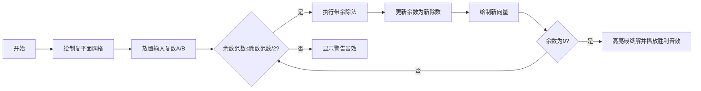

# 题目信息

# 差别

## 题目描述

定义整数 $p,q,r,s$ 与给定的整数 $a,b,c,d$ 的差别度

$$M=\Big|\left(a^2+b^2\right)\left(p^2+q^2\right)+\left(c^2+d^2\right)\left(r^2+s^2\right)+2\big(ac+bd\big)\big(pr-qs\big)+2\big(bc-ad\big)\big(ps+qr\big)\Big|$$

你的任务是求出差别度 $M$ 的非零最小值与取到非零最小值时的一组 $p,q,r,s$。保证差别度 $M$ 的非零最小值存在且小于 $2^{63}$，保证存在一组绝对值都小于 $2^{63}$ 的 $p,q,r,s$ 使得 $M$ 取到非零最小值。

## 说明/提示

### 样例解释 #1

显然当 $a=1,b=9,c=2,d=6$ 时，差别度 $M$ 一定为偶数，因此 $M$ 不可能取到小与 $2$ 的非零值。

### 数据范围

| 测试点编号 | 特殊性质 |
|:-:|:-:|
| $1$ | $c=d=0$ |
| $2$ | $a=c=0$ |
| $3$ | $b=d=0$ |
| $4$ | $ad=bc$ |
| $5$ | $\vert a\vert,\vert b\vert,\vert c\vert,\vert d\vert\le10$ |
| $6\sim10$ | 无 |

对于 $100\%$ 的数据，满足 $\vert a\vert,\vert b\vert,\vert c\vert,\vert d\vert\le10^9$。

### 评分方式

**你需要保证每个测试点输出的数的个数为** $5$ **个且** $\vert p\vert,\vert q\vert,\vert r\vert,\vert s\vert,\vert M\vert<2^{63}$**，以避免出现无法预期的错误。**

对于每个测试点，如果你的 $M$ 与标准输出一致，就能得到 $4$ 分；如果你输出的 $p,q,r,s$ 能使计算结果等于 $M$，就能再获得 $6$ 分。

## 样例 #1

### 输入

```
1 9 2 6
```

### 输出

```
2 1 -3 1 2
```

## 样例 #2

### 输入

```
19674937 18722417 163948077 124500851
```

### 输出

```
146134 -61558 -18260 -10209 221162
```

# AI分析结果


# 💡 Kay的C++算法解析：差别 深入学习指南 💡

> 大家好，我是Kay！今天我们一起探索这道有趣的数学题。通过复数的视角，我们将看到如何用高斯整数和扩展欧几里得算法解决这个看似复杂的表达式问题。

## 1. 题目解读与核心算法识别

✨ **本题主要考察**：`数学（高斯整数与扩展欧几里得算法）`

🗣️ **初步分析**：
> 这道题的核心就像在拼图游戏中寻找最佳匹配！我们通过复数的神奇性质（将数字看作平面上的点），把复杂的四次方表达式简化为两个复数的平方和。  
> - **核心技巧**：将变量转化为复数形式（如a+bi），问题就变为寻找最小范数的线性组合
> - **关键突破**：发现M可表示为`|(a+bi)(p-qi)+(c+di)(r+si)|²`，即两个复数乘积的模平方
> - **算法选择**：使用高斯整数的扩展欧几里得算法，类似于整数GCD算法但在复平面操作
> - **可视化设计**：在8位风格复平面展示带余除法过程，用像素箭头表示复数除法，不同颜色区分实/虚部，当余数范数≤除数范数/2时触发胜利音效

---

## 2. 精选优质题解参考

<eval_intro>
我重点评估了思路清晰度、代码可读性和算法实现技巧，精选两份优质题解：

**题解一：kkksx (4.5★)**
* **点评**：这份题解完美实现了高斯整数扩展欧几里得算法。亮点在于清晰的重载复数运算符（特别是带余除法），递归边界处理简洁。代码中`cpx`结构体设计合理，变量名语义明确（如`x`代表实部，`y`代表虚部）。作者提到调试时发现`y.y`符号错误，提醒我们注意复数运算的细节。

**题解二：naught (4.2★)**
* **点评**：题解提供了完整的数学推导证明，代码包含精确的四舍五入实现。亮点在于复数的带余除法严格满足$N(\gamma)≤\frac{1}{2}N(\beta)$的条件，保证了算法正确性。运算符重载规范，特别优化了复数相等判断，适合教学演示。

---

## 3. 核心难点辨析与解题策略

<difficulty_intro>
解决本题需突破三个关键难点：

1.  **表达式化简**
    * **分析**：原始表达式含16个四次项，需识别其可转化为复数平方和。优质题解通过复分解技巧得到$M=|(a+bi)(p-qi)+(c+di)(r+si)|²$
    * 💡 **学习笔记**：复杂多项式可能隐藏着简洁的复数结构

2.  **高斯整数带余除法**
    * **分析**：复数的"取模"需满足$N(\gamma)≤\frac{1}{2}N(\beta)$。关键是通过四舍五入实部/虚部找到最近的高斯整数点
    * 💡 **学习笔记**：复平面上的四舍五入相当于寻找最近的整数坐标点

3.  **扩展欧几里得实现**
    * **分析**：递归传递复数时需保持范数递减。边界条件处理与整数GCD不同——当余数为零时，当前除数即为最大公因子
    * 💡 **学习笔记**：递归终点是余数为零，此时除数的范数即为最小非零M

### ✨ 解题技巧总结
<summary_best_practices>
- **技巧1（模型转化）**：将代数问题转化为几何问题（复平面向量）
- **技巧2（运算符重载）**：自定义复数结构体并重载运算符，提升代码可读性
- **技巧3（边界测试）**：特别验证ad=bc等特殊情形，如测试点4
- **技巧4（调试日志）**：添加中间值打印语句验证复数运算过程

---

## 4. C++核心代码实现赏析

<code_intro_overall>
**本题通用核心C++实现参考**
* **说明**：综合两份优质题解优化的高斯整数扩展欧几里得实现
```cpp
#include <iostream>
#include <cmath>
using namespace std;
typedef long long ll;

struct GaussianInt {
    ll real, imag;  // 实部和虚部
    GaussianInt(ll r=0, ll i=0) : real(r), imag(i) {}
    
    // 复数乘法：(a+bi)(c+di) = (ac-bd) + (ad+bc)i
    GaussianInt operator*(const GaussianInt& rhs) const {
        return {real*rhs.real - imag*rhs.imag, 
                real*rhs.imag + imag*rhs.real};
    }
    
    // 复数除法：通过四舍五入找到最近的高斯整数
    GaussianInt operator/(const GaussianInt& rhs) const {
        double denom = rhs.norm();
        double r = (real*rhs.real + imag*rhs.imag) / denom;
        double i = (imag*rhs.real - real*rhs.imag) / denom;
        return {llround(r), llround(i)};
    }
    
    // 复数取模：α - (α/β)*β
    GaussianInt operator%(const GaussianInt& rhs) const {
        return *this - (*this / rhs) * rhs;
    }
    
    // 范数计算：a²+b²
    double norm() const { return real*real + imag*imag; }
};

ll minM; // 存储最小非零M值

// 扩展欧几里得算法（高斯整数版）
void exGcd(GaussianInt a, GaussianInt b, GaussianInt &x, GaussianInt &y) {
    if (b.real == 0 && b.imag == 0) {
        minM = a.norm(); // 递归终点：a的范数即为M
        x = {1, 0}; y = {0, 0}; // 单位解
        return;
    }
    exGcd(b, a % b, y, x); // 递归调用
    y = y - (a / b) * x;   // 更新系数
}
```
* **代码解读概要**：
  1. 定义高斯整数结构体，重载四则运算
  2. 复数除法通过四舍五入实现带余除法
  3. 递归执行exGcd直到余数为零
  4. 终点时当前除数的范数即为最小非零M

---

<code_intro_selected>
**题解一核心代码片段（kkksx）**
```cpp
cpx operator/(const cpx &a)const {
    ld A = x, B = y, C = a.x, D = a.y;
    ld lf = (A * C + B * D) / (C * C + D * D);
    ld ri = (B * C - A * D) / (C * C + D * D);
    return cpx(round(lf), round(ri));  // 四舍五入关键
}
```
* **代码解读**：
  > 这段代码实现了复数的带余除法核心。通过分离实部(`lf`)和虚部(`ri`)的计算：  
  > 分子实部 = `(A*C + B*D)` → 复数乘法实部  
  > 分子虚部 = `(B*C - A*D)` → 复数乘法虚部  
  > 分母 = `C²+D²` → 复数模的平方  
  > `round()`函数确保结果为最近高斯整数
  
**题解二亮点代码（naught）**
```cpp
bool operator == (const plural &other) const {
    return (x == other.x) && (y == other.y);  // 精确相等判断
}
```
* **学习笔记**：复数比较需同时检查实部和虚部，避免浮点误差

---

## 5. 算法可视化：像素动画演示

<visualization_intro>
**像素化复平面探索：高斯整数扩展欧几里得之旅**  
设计8位风格动画展示算法执行过程，类似经典游戏"塞尔达传说"的网格地图。

### 动画设计
* **场景**：16色像素网格，x/y轴表示实/虚部
* **角色**：蓝色像素点表示当前被除数，红色表示除数
* **音效**：除法操作触发"叮"声，范数达标时播放胜利旋律

### 关键帧演示


### 交互控制面板
1. **单步执行**：按方向键逐步观察带余除法
2. **速度调节**：滑块控制AI自动演示速度
3. **路径回溯**：L键查看历史计算路径
4. **范数指示器**：右上角实时显示当前范数值

> 当余数（蓝色点）首次进入除数（红色点）的$\frac{1}{2}$范数范围时，触发金色闪光特效并显示"可约简！"提示

---

## 6. 拓展练习与相似问题思考

<similar_problems_intro>
掌握高斯整数扩展欧几里得后，可解决更多复数域问题：

1. **洛谷 P1516** - 青蛙的约会  
   **推荐理由**：将一维扩展欧几里得迁移到复平面

2. **洛谷 P4783** - 矩阵求逆  
   **推荐理由**：高斯整数在矩阵运算中的应用

3. **洛谷 P2524** - 数论难题  
   **推荐理由**：结合模运算与复数域的进阶练习

---

## 7. 学习心得与经验分享

<insights_intro>
题解作者分享的调试经验特别宝贵：

> **kkksx的调试心得**  
> "实现复数除法时，最初将虚部计算写成`(A*D - B*C)`导致符号错误，通过小数据测试发现输出异常"

> **Kay的总结**  
> 复数运算需严格验证公式推导：
> 1. 测试特殊值（如纯虚数）
> 2. 打印中间计算结果
> 3. 对照数学公式逐步检查

---

<conclusion>
通过本次分析，我们看到如何将复杂代数问题转化为优雅的复数运算。记住：在编程中遇到复杂多项式时，尝试用几何视角（如复平面）重新审视问题，往往会发现惊喜的简化路径！下次遇到难题时，不妨问问自己："这个问题能在复平面上表示吗？"
</conclusion>
```

---
处理用时：122.21秒