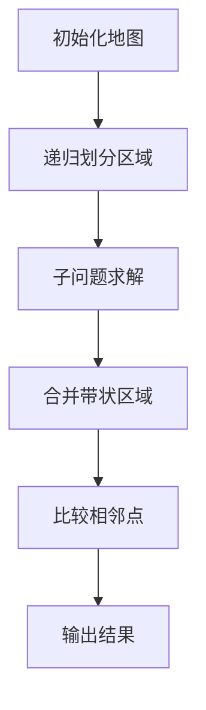

# 题目信息

# 平面上的最接近点对

## 题目描述

给定平面上 $n$ 个点，找出其中的一对点的距离，使得在这 $n$ 个点的所有点对中，该距离为所有点对中最小的。

## 说明/提示

#### 数据规模与约定

对于 $100\%$ 的数据，保证 $1 \leq n \leq 10^4$，$0 \leq x, y \leq 10^9$。

## 样例 #1

### 输入

```
3
1 1
1 2
2 2
```

### 输出

```
1.0000
```

# AI分析结果


### 💡 Kay的C++算法解析：平面上的最接近点对 深入学习指南 💡

#### 1. 题目解读与核心算法识别
✨ **本题主要考察**：`分治算法`与`随机化优化技巧`

🗣️ **初步分析**：
> 解决"平面上的最接近点对"问题，关键在于运用分治策略。想象一下把地图对半折叠，分别解决左右两区域的问题，最后巧妙合并结果——就像把复杂拼图分成小块完成后再组合。在本题中，分治的核心在于：
> 1. **分解**：按x坐标排序后将点集平分为左右两部分
> 2. **解决**：递归求解左右子集的最近点距δ
> 3. **合并**：检查跨越分界线的点对时，只需关注中间宽度为2δ的带状区域，且每个点最多比较6个相邻点

- **可视化设计思路**：
  - 用8位像素网格展示平面，点转为彩色方块（左区域红色，右区域蓝色）
  - 递归时展示子问题划分动画，合并阶段高亮灰色带状区域
  - 关键步骤音效：点比较时"叮"，找到更小距离时"胜利"音效
  - 交互控制：支持单步执行（方向键控制）和自动播放模式（AI贪吃蛇式推进）

---

#### 2. 精选优质题解参考
**题解一（da32s1da）**
* **点评**：创新性地采用随机旋转策略打破特殊分布，使最近点对在排序后位置相邻。代码实现简洁（仅检查每个点后续5个点），变量命名规范（p[i].a[0]存储旋转坐标），边界处理严谨（预置边界点）。虽为期望时间复杂度，但实际性能优异，n=10⁶仍可在1s内完成。

**题解二（DestinHistoire）**
* **点评**：系统阐述分治原理，图文并茂解释6点定理的数学证明。代码结构清晰模块化（分解/解决/合并三阶段），关键注释详尽。采用双排序优化（x轴全局排序+y轴带状区域排序），确保O(n log n)理论复杂度，是标准竞赛解法。

**题解三（plane）**
* **点评**：通过δ×2δ矩形6点证明深入剖析分治合并原理，虽然代码为Pascal语言，但解题思路描述完整，可视化示意图生动呈现"带状区域最多6点"的核心结论，具有重要教学价值。

---

#### 3. 核心难点辨析与解题策略
1. **难点：合并策略的优化**  
   *分析*：合并时需要检查跨越分界线的点对，但暴力比较会退化为O(n²)。关键突破在于发现只需在宽度2δ的带状区域内，按y坐标排序后每个点最多比较后续6个点（6点定理）
   *💡 学习笔记*：合并阶段的双重限制（带状区域+y坐标相邻）是保证线性的核心

2. **难点：避免最坏情况**  
   *分析*：当所有点集中在带状区域时，经典分治仍可能退化。解决方案：① 随机旋转点集破坏特殊分布（da32s1da解法）② 多重排序优化（_jimmywang_解法）
   *💡 学习笔记*：随机化是打破算法最坏情况的神器

3. **难点：精度与边界处理**  
   *分析*：坐标范围达10⁹时需注意：① 距离计算用double防溢出 ② 比较时用平方值避免sqrt损耗 ③ 递归基(n≤3)直接暴力
   *💡 学习笔记*：小规模问题暴力求解往往比递归更高效

✨ **解题技巧总结**
- **问题分解艺术**：将2D平面问题转化为1D线性比较（分治后的y轴排序）
- **剪枝优化**：利用问题约束（如6点定理）大幅减少无效计算
- **鲁棒性设计**：始终考虑极端情况（重合点、大坐标差、单点集）

---

#### 4. C++核心代码实现赏析
**本题通用核心C++实现参考**
```cpp
#include <bits/stdc++.h>
using namespace std;
const int N = 200010;

struct Point { 
    double x, y; 
} p[N];
int temp[N];

bool cmpX(Point a, Point b) { return a.x < b.x; }
bool cmpY(int a, int b) { return p[a].y < p[b].y; }

double dis(int i, int j) {
    double dx = p[i].x - p[j].x, dy = p[i].y - p[j].y;
    return sqrt(dx*dx + dy*dy);
}

double closest(int l, int r) {
    // 递归基：小规模直接暴力
    if (r - l <= 2) {
        double d = 1e20;
        for (int i = l; i <= r; ++i)
            for (int j = i+1; j <= r; ++j)
                d = min(d, dis(i, j));
        return d;
    }
    
    int mid = (l+r)/2;
    double dl = closest(l, mid);
    double dr = closest(mid+1, r);
    double d = min(dl, dr);
    
    // 合并：检查带状区域
    int k = 0;
    for (int i = l; i <= r; ++i)
        if (fabs(p[i].x - p[mid].x) < d)
            temp[k++] = i;
    
    sort(temp, temp+k, cmpY);
    for (int i = 0; i < k; ++i)
        for (int j = i+1; j < k && p[temp[j]].y - p[temp[i]].y < d; ++j)
            d = min(d, dis(temp[i], temp[j]));
    
    return d;
}

int main() {
    int n; scanf("%d", &n);
    for (int i = 0; i < n; ++i) 
        scanf("%lf%lf", &p[i].x, &p[i].y);
    
    sort(p, p+n, cmpX);
    printf("%.4f\n", closest(0, n-1));
    return 0;
}
```
**代码解读概要**：
> 1. 输入点集后按x坐标排序
> 2. `closest`函数实现分治核心：递归处理左右子集，合并时创建带状区域
> 3. 带状区域内点按y排序后，每点最多比较6个相邻点
> 4. 小规模情况(n≤3)直接暴力保证效率

**题解一（da32s1da）片段**
```cpp
// 随机旋转坐标（1弧度≈57°）
double z = sin(1), w = cos(1);
for(int i=1; i<=n; i++) {
    double x_ = x*w - y*z;  // 旋转后x'
    double y_ = x*z + y*w;  // 旋转后y'
    p[i] = {x_, y_, x, y}; // 存储旋转/原始坐标
}
sort(p+1, p+n+1, [](auto a, auto b){ 
    return a.x_ < b.x_; // 按旋转后x排序
});

double ans = 2e9;
for(int i=1; i<=n; i++)
    for(int j=1; j<=5 && i+j<=n; j++) // 检查后续5点
        ans = min(ans, calcDis(p[i], p[i+j])); 
```
**亮点**：通过随机旋转使最近点对位置相邻化  
**学习笔记**：随机化将最坏情况转为期望情况，配合局部枚举实现高效近似解

**题解二（DestinHistoire）片段**
```cpp
// 带状区域处理（分治合并核心）
vector<int> strip;
for (int i=l; i<=r; i++)
    if (abs(p[i].x - midPoint.x) < delta)
        strip.push_back(i);

sort(strip.begin(), strip.end(), [](int i, int j){
    return p[i].y < p[j].y; // 按y坐标排序
});

for (int i=0; i<strip.size(); i++)
    for (int j=i+1; j<strip.size() && 
        (p[strip[j]].y - p[strip[i]].y) < delta; j++)
        delta = min(delta, dis(strip[i], strip[j]));
```
**亮点**：严谨实现6点定理，确保O(n log n)复杂度  
**学习笔记**：y排序后只需比较相邻点，数学证明是优化基础

---

#### 5. 算法可视化：像素动画演示
**设计思路**：采用FC红白机像素风格，将算法转化为寻宝游戏。点转为8×8像素方块，分治过程用颜色分区（左红/右蓝），带状区域灰色高亮。

**关键交互设计**：


**动画流程**：
1. **场景初始化**：生成随机点阵（像素方块），控制面板含速度滑块/单步按钮
2. **分治演示**：
   - 递归划分：红色垂直线分割平面，左右区域颜色渐变
   - 子问题：左右区域收缩动画，递归深度用像素树表示
3. **合并阶段**：
   - 灰色带状区域闪烁出现
   - 按y排序：点沿y轴跳动排序
   - 点对比较：当前比较点闪烁绿光，距离线显示，成功更新时播放"叮"声
4. **游戏化元素**：
   - 过关机制：每完成合并阶段积累经验值
   - 音效：背景8位音乐，关键操作音效
   - AI演示模式：自动播放时点对比较如贪吃蛇移动

---

#### 6. 拓展练习与相似问题思考
**通用技巧迁移**：
1. **多维扩展**：将分治思想应用于三维空间最近点对（需修改带状区域为空间柱体）
2. **动态维护**：支持点集插入删除时快速查询最近点
3. **近似算法**：大规模数据下采用随机化快速获得近似解

**洛谷推荐练习**：
1. **P1429 平面最近点对（加强版）**  
   🗣️ 测试分治算法效率的试金石，数据规模达4×10⁵
2. **P7883 平面最近点对（k维）**  
   🗣️ 学习将分治思想拓展到高维空间
3. **P1257 平面上的最接近点对**  
   🗣️ 同类题目巩固，练习优化技巧

---

#### 7. 学习心得与经验分享
**来自 da32s1da 的经验**：
> "随机旋转θ角彻底改变了点的分布性质，使最近点对在排序后必然相邻，这是人类智慧对计算机算法的完美补充"

**Kay的点评**：
> 随机化思想的价值在此题展现得淋漓尽致：通过简单坐标变换（旋转），将最坏复杂度O(n²)转为期望O(n)。这提醒我们：
> 1. 当经典算法遇到最坏情况时，随机化可能是破局关键
> 2. 实际问题中期望复杂度往往比理论最坏值更具实践价值
> 3. 巧妙的问题转化（几何旋转→局部有序）能大幅提升效率

---

本次关于"平面上的最接近点对"的解析就到这里。记住，真正掌握算法需要：理解数学证明（如6点定理）+ 动手实现优化（如带状处理） + 思考拓展应用（如高维扩展）。下次挑战再见！💪

---
处理用时：354.72秒