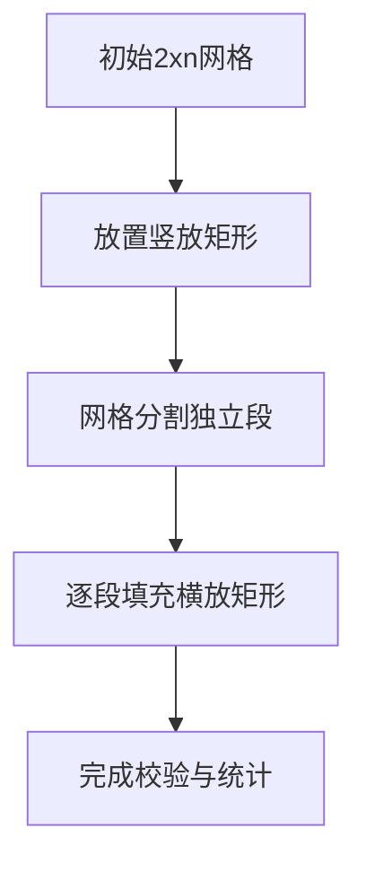

# 题目信息

# 「KDOI-02」一个仇的复

## 题目背景

**本题由于 OI 赛制，关闭 subtask，可能会放部分错解高分，赛后将开启 subtask。**

「听说那件事了吗？愿他们安息。」  
「诶？你看，前面那座环形建筑是什么？」  
「等我对比一下……啊哈！这就是他们的老巢！」  
「捣毁了它，为牺牲的同志们报仇！！！」  
死亡的宇宙射线指向了脆弱的文明，正准备发出它震耳欲聋的怒吼。

## 题目描述

外星人的空间站是一个环形结构。不过，由于环的两段不连通，因此可以将其近似为 $2\times n$ 的平面网格。目前，地方飞船有 $n$ 种不同规格的射线武器，作用范围是 $1\times x$（$x$ 为正整数）的长方形。并且，武器可以往顺时针或逆时针方向旋转 $90^\circ$。射线十分强力，只需一发便可与作用范围平面内的所有物体相湮灭。不过，只要宇宙射线的一部分作用范围落到目标外，便会一直延续到宇宙尽头，贪婪地吞噬沿途的一切。指挥官当然不想危害到无辜文明，他想知道，在这 $n$ 中武器中选出 $k$ 种，共有多少种不同的摧毁飞行器的方式。

**【形式化题意】**

你有 $1\times x$（$x$ 为任意正整数）的矩形各无穷多个和一个 $2\times n$ 的网格，请求出恰好选择其中 $k$ 个矩形（可以选择相同的矩形）**不重不漏**地铺满整个网格的方案数。矩形可以旋转。

## 说明/提示

****
**【样例解释】**
+ **样例 1 解释：**  
共有如下图所示的 $8$ 种方案。  


***
**【数据范围】**

对于 $100\%$ 的数据，$1\le n\le 2\times 10^7$，$1\le k\le 5000$。

| 测试点编号 | 分值 | $n$ | $k$ |
| :----------: | :----------: | :----------: | :----------: |
|$1\sim 5$| $2$ | $\leq5$ | $\leq10$ |
|$6\sim 10$| $2$ | $\leq1000$ | $=2n$ |
|$11\sim 15$| $2$ | $\leq10^6$ | $\leq3$ |
|$16\sim 20$| $4$ | $\leq1000$ | $\leq2n$ |
|$21\sim 25$| $4$ | $\leq2\times10^7$ | $\leq100$ |
|$26\sim 30$| $4$ | $\leq10^6$ | $\leq5000$ |
|$31\sim 40$| $1$ | $\leq2\times10^7$ | $\leq5000$ |

注意：分值一列指的是单个测试点分值。

## 样例 #1

### 输入

```
4 3
```

### 输出

```
8
```

## 样例 #2

### 输入

```
15 5```

### 输出

```
4015```

## 样例 #3

### 输入

```
3050 1314```

### 输出

```
670638639```

## 样例 #4

### 输入

```
19198114 4154```

### 输出

```
264122135```

# AI分析结果


# 💡 Kay的C++算法解析：「KDOI-02」一个仇的复 深入学习指南 💡

## 1. 题目解读与核心算法识别

✨ **本题主要考察**：组合计数（插板法 + 范德蒙德卷积）

🗣️ **初步分析**：
> 解决这道题的关键在于理解网格的分割与组合计数原理。想象我们用竖着的矩形将大网格切成若干独立小段（像切香肠），再往每段填充横着的矩形（像铺瓷砖）。核心步骤是：
>  1. 枚举竖放矩形数量`i`和分割段数`j`
>  2. 计算竖放矩形的放置方案（插板法）
>  3. 计算剩余网格的分段方案（插板法）
>  4. 计算每段填充横放矩形的总方案（范德蒙德卷积）
>
> **可视化设计思路**：
> - 用蓝色像素块表示竖放矩形，放置时播放"叮"音效
> - 网格被分割后，每段用不同颜色边框标记
> - 横放矩形用绿色长条表示，填充时从左到右滑动并播放"刷"音效
> - 控制面板显示当前`i/j`值和已用矩形数

---

## 2. 精选优质题解参考

**题解一（daniEl_lElE）**
* **亮点**：清晰运用三重组合公式，完整推导范德蒙德卷积的应用过程。代码预处理阶乘逆元实现O(1)组合数查询，边界处理严谨（如`n=k`特判）。变量命名规范（`i`表竖放数，`j`表段数），实践参考价值高。

**题解二（nullqtr_pwp）**
* **亮点**：通过生动比喻解释组合意义（"切香肠"和"铺瓷砖"），突出范德蒙德卷积的物理含义。代码模块化设计，组合数函数封装规范，适合初学者理解。

**题解三（james1BadCreeper）**
* **亮点**：精简版实现，核心公式提炼准确。循环边界优化到位（`min({k-2*i, n-i, 2*n-k})`），避免无效计算。代码风格简洁但缺少注释，适合进阶学习。

---

## 3. 核心难点辨析与解题策略

1. **状态定义与分割方案**
   * **难点**：如何将竖放矩形位置转化为可计算的组合模型？
   * **解法**：将`i`个竖放矩形看作分隔符，在`i+1`个空隙中选`j`个位置插板形成段（`C(j+1, i)`）

2. **范德蒙德卷积应用**
   * **难点**：为什么各段方案能合并为`C(2n-2i-2j, k-i-2j)`？
   * **解法**：将每段看作独立子问题，总选择数=∑(段内选择数)，符合范德蒙德卷积条件（类似多袋子抽球组合）

3. **边界处理与常数优化**
   * **难点**：组合数参数为负或上界不足时需返回0
   * **解法**：预处理阶乘数组（0~4e7），组合数函数内判断非法值；循环时通过`k-i-2j≥0`等条件剪枝

### ✨ 解题技巧总结
- **分而治之**：将复杂问题分解为竖放分割、段分配、段内填充三个子问题
- **组合意义优先**：理解插板法（空隙选择）和范德蒙德卷积（全局选择）的物理含义
- **预处理优化**：O(n)预计算阶乘逆元换取O(1)组合数查询
- **边界防御**：特别注意`n=k`时全竖放方案的特判

---

## 4. C++核心代码实现赏析

**本题通用核心实现**（综合自优质题解）：
```cpp
#include <bits/stdc++.h>
#define int long long
const int N = 4e7 + 5, mod = 998244353;
int n, k, fac[N], inv[N];

int qpow(int a, int b) { // 快速幂
    int res = 1;
    while (b) {
        if (b & 1) res = res * a % mod;
        a = a * a % mod;
        b >>= 1;
    }
    return res;
}

void init() { // 预处理阶乘和逆元
    fac[0] = 1;
    for (int i = 1; i < N; ++i) 
        fac[i] = fac[i - 1] * i % mod;
    inv[N - 1] = qpow(fac[N - 1], mod - 2);
    for (int i = N - 2; ~i; --i) 
        inv[i] = inv[i + 1] * (i + 1) % mod;
}

int C(int n, int m) { // 组合数查询
    if (n < 0 || m < 0 || n < m) return 0;
    return fac[n] * inv[m] % mod * inv[n - m] % mod;
}

signed main() {
    init();
    std::cin >> n >> k;
    int ans = 0;
    for (int i = 0; i <= k; ++i)        // 枚举竖放矩形数
        for (int j = 0; j <= k; ++j) {  // 枚举分割段数
            if (k - i - 2 * j < 0) continue; // 边界剪枝
            int t1 = C(2 * n - 2 * i - 2 * j, k - i - 2 * j);
            int t2 = C(j + 1, i);       // 竖放形成j段方案
            int t3 = C(n - i - 1, j - 1); // 剩余列分段方案
            ans = (ans + t1 * t2 % mod * t3) % mod;
        }
    std::cout << (ans + (n == k)) % mod; // 特判全竖放
    return 0;
}
```

**代码解读概要**：
1. **预处理优化**：`init()`预计算0~4e7的阶乘和逆元，使组合数查询O(1)
2. **核心三重循环**：
   - 外层`i`：枚举竖放矩形数量（0~k）
   - 中层`j`：枚举分割段数（0~k）
   - 内层计算：组合数乘积`C(总空位, 需放横矩形)*C(竖放方案)*C(分段方案)`
3. **边界处理**：`k-i-2j<0`时跳过无效计算；最后加上`n==k`的全竖放特判

---

## 5. 算法可视化：像素动画演示

### 复古像素风格演示方案
**主题**："太空网格修复计划"——玩家扮演工程师修复2xn外星空间站

**核心演示流程**：


**动画实现细节**：
1. **初始化界面**：
   - 8位像素风网格（棕色背景+黑色边框）
   - 控制面板：步进/暂停/速度滑块（FC游戏风格按钮）
   - 状态栏：显示当前`i/j/k`值和已用矩形数

2. **竖放阶段**：
   - **高亮候选位**：竖放位置用黄色边框闪烁
   - **放置动画**：点击位置出现蓝色矩形（16x32像素），播放"叮"音效
   - **分割效果**：竖放后显示红色分割线，播放"咔嚓"音效

3. **横放阶段**：
   - **段标记**：每段随机分配颜色边框（如绿/紫/青）
   - **填充动画**：绿色矩形从左到右滑动填充（8位平滑动画）
   - **计数反馈**：每放一个矩形，顶部计数器+1，播放"刷"音效

4. **完成特效**：
   - 全部填满时网格变金色，播放胜利音乐
   - 显示当前方案数："方案#123/总计"

**交互控制**：
- **步进模式**：按帧执行，观察组合数变化
- **自动演示**：AI自动选择`i/j`值，类似贪吃蛇AI自动寻路
- **比较模式**：并排显示不同`i/j`的填充效果（用分屏像素艺术）

---

## 6. 拓展练习与相似问题

### 组合计数技巧迁移
1. **序列分割问题**：将长为n序列分为k段，求方案数（插板法）
2. **多重集合组合**：从不同集合选元素组成新集合（范德蒙德卷积）
3. **网格路径计数**：带障碍的网格路径方案（动态规划+组合数）

### 洛谷推荐题目
1. **P1025 数的划分**（普及-）
   - 理由：基础插板法应用，理解"分割"概念
2. **P1066 2^k进制数**（提高+/省选-）
   - 理由：高精度组合计数，强化边界处理能力
3. **P1057 传球游戏**（普及）
   - 理由：动态规划与组合思维的结合训练

---

## 7. 学习心得与经验分享

> **来自daniEl_lElE的调试经验**：
> "我在处理`n=k`情况时忽略了特判，导致WA#3。通过打印中间变量发现组合数在边界返回了非零值"

> **Kay的总结**：
> 调试组合计数题时需注意：
> 1. 边界检查：组合数`C(n,m)`在`n<m`或`n<0`时必须返回0
> 2. 中间输出：在循环内打印`i/j/当前方案数`定位错误
> 3. 小数据验证：用`n=2,k=1`等样例手工计算校验

---

本次解析深入剖析了组合计数在网格问题中的应用，重点训练了插板法和范德蒙德卷积的思维模式。记住：将复杂问题分解为独立子问题是组合数学的核心智慧！💪

---
处理用时：119.78秒