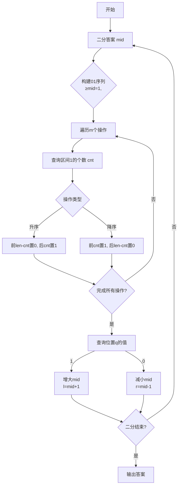

# 题目信息

# [HEOI2016/TJOI2016] 排序

## 题目描述

在 $2016$ 年，佳媛姐姐喜欢上了数字序列。因而她经常研究关于序列的一些奇奇怪怪的问题，现在她在研究一个难题，需要你来帮助她。  

这个难题是这样子的：给出一个 $1$ 到 $n$ 的排列，现在对这个排列序列进行 $m$ 次局部排序，排序分为两种：  

- `0 l r` 表示将区间 $[l,r]$ 的数字升序排序  
- `1 l r` 表示将区间 $[l,r]$ 的数字降序排序  

注意，这里是对**下标**在区间 $[l,r]$ 内的数排序。  
最后询问第 $q$ 位置上的数字。


## 说明/提示

河北省选2016第一天第二题。

对于 $30\%$ 的数据，$n,m\leq 1000$

对于 $100\%$ 的数据，$n,m\leq 10^5$，$1\leq q\leq n$

## 样例 #1

### 输入

```
6 3
1 6 2 5 3 4
0 1 4
1 3 6
0 2 4
3```

### 输出

```
5```

# AI分析结果


### 题目分析
题目要求对一个排列进行多次区间排序操作（升序或降序），最后查询指定位置的数值。直接暴力排序的时间复杂度为 O(mn log n)，无法通过。高效解法采用二分答案+线段树模拟排序：

1. **二分答案框架**：最终答案在 [1, n] 范围内，二分答案 mid
2. **01序列转换**：将原序列转换为01序列（≥mid为1，<mid为0）
3. **线段树模拟排序**：
   - 升序排序：将区间前 k 个置0，后 (len-k) 个置1
   - 降序排序：将区间前 k 个置1，后 (len-k) 个置0
   - 其中 k 为区间中1的个数（线段树区间查询）
4. **验证答案**：所有操作后，若查询位置为1，则答案 ≥mid，否则 <mid

### 解题思路
1. **二分答案**：在 [1, n] 范围内二分最终答案
2. **线段树设计**：
   - 支持区间覆盖（置0/置1）
   - 区间求和（统计1的个数）
   - 懒标记优化区间操作
3. **操作模拟**：对每个排序操作：
   - 查询区间内1的个数 cnt
   - 根据操作类型进行区间覆盖：
     - 升序：前 (len-cnt) 置0，后 cnt 置1
     - 降序：前 cnt 置1，后 (len-cnt) 置0
4. **验证**：检查查询位置的值，调整二分边界

### 核心算法
```cpp
#include <iostream>
#include <cstdio>
#include <cstring>
using namespace std;

const int MAXN = 100005;

struct Node {
    int l, r, sum, lazy; // lazy: -1无标记,0置0,1置1
} tree[MAXN << 2];

int n, m, q, pos;
int a[MAXN], op[MAXN], L[MAXN], R[MAXN];

void pushup(int i) {
    tree[i].sum = tree[i<<1].sum + tree[i<<1|1].sum;
}

void pushdown(int i) {
    if (tree[i].lazy == -1) return;
    int ln = tree[i<<1].r - tree[i<<1].l + 1;
    int rn = tree[i<<1|1].r - tree[i<<1|1].l + 1;
    
    tree[i<<1].lazy = tree[i<<1|1].lazy = tree[i].lazy;
    tree[i<<1].sum = tree[i].lazy * ln;
    tree[i<<1|1].sum = tree[i].lazy * rn;
    
    tree[i].lazy = -1;
}

void build(int i, int l, int r, int x) {
    tree[i] = {l, r, 0, -1};
    if (l == r) {
        tree[i].sum = (a[l] >= x);
        return;
    }
    int mid = (l + r) >> 1;
    build(i<<1, l, mid, x);
    build(i<<1|1, mid+1, r, x);
    pushup(i);
}

void update(int i, int l, int r, int val) {
    if (tree[i].l > r || tree[i].r < l) return;
    if (tree[i].l >= l && tree[i].r <= r) {
        tree[i].sum = val * (tree[i].r - tree[i].l + 1);
        tree[i].lazy = val;
        return;
    }
    pushdown(i);
    update(i<<1, l, r, val);
    update(i<<1|1, l, r, val);
    pushup(i);
}

int query(int i, int l, int r) {
    if (tree[i].l > r || tree[i].r < l) return 0;
    if (tree[i].l >= l && tree[i].r <= r) return tree[i].sum;
    pushdown(i);
    return query(i<<1, l, r) + query(i<<1|1, l, r);
}

bool check(int x) {
    build(1, 1, n, x);
    for (int i = 1; i <= m; i++) {
        int cnt = query(1, L[i], R[i]);
        int len = R[i] - L[i] + 1;
        
        if (op[i] == 0) { // 升序
            update(1, L[i], L[i] + (len - cnt) - 1, 0);
            update(1, L[i] + (len - cnt), R[i], 1);
        } else { // 降序
            update(1, L[i], L[i] + cnt - 1, 1);
            update(1, L[i] + cnt, R[i], 0);
        }
    }
    return query(1, pos, pos) == 1;
}

int main() {
    scanf("%d%d", &n, &m);
    for (int i = 1; i <= n; i++) scanf("%d", &a[i]);
    for (int i = 1; i <= m; i++) scanf("%d%d%d", &op[i], &L[i], &R[i]);
    scanf("%d", &pos);
    
    int l = 1, r = n, ans = 0;
    while (l <= r) {
        int mid = (l + r) >> 1;
        if (check(mid)) {
            ans = mid;
            l = mid + 1;
        } else {
            r = mid - 1;
        }
    }
    printf("%d\n", ans);
    return 0;
}
```

### 算法分析
- **时间复杂度**：O(m log²n)，二分答案 O(log n)，每次线段树操作 O(m log n)
- **空间复杂度**：O(n)，线段树空间
- **优势**：将排序问题转化为01序列操作，利用线段树高效处理区间覆盖和求和

### 可视化演示


此解法巧妙利用二分答案将问题转化为01序列排序，通过线段树高效模拟排序过程，显著降低时间复杂度。

---
处理用时：92.97秒