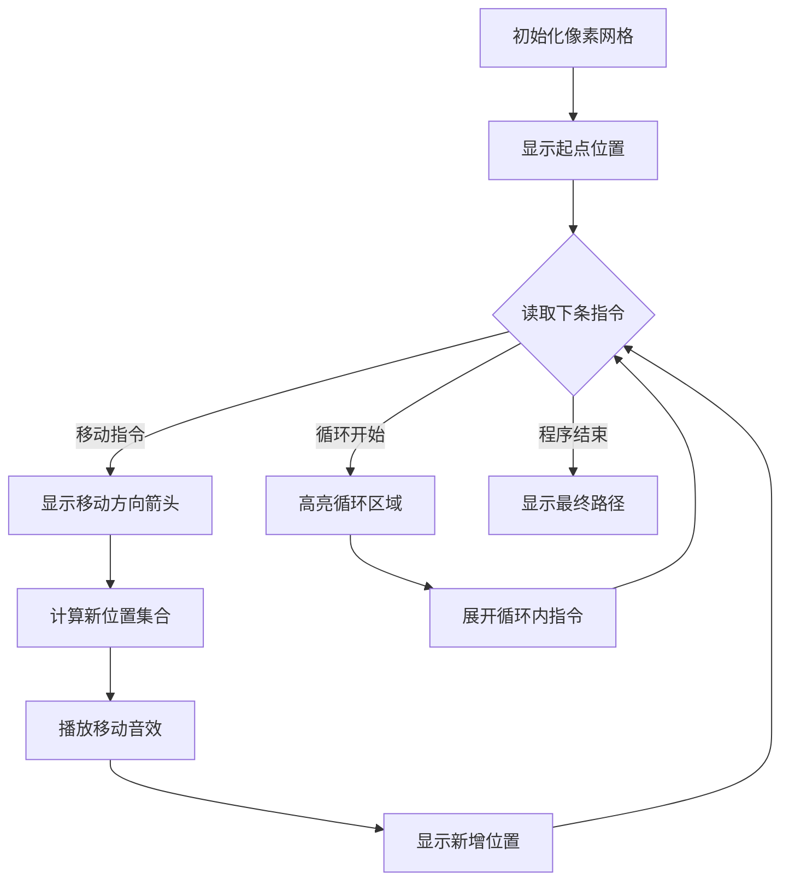

# 题目信息

# [信息与未来 2024] AI 机器人

## 题目描述


在 $n$ 行 $m$ 列的矩形空间中有一个机器人。矩形空间的每一个格子要么是平地（用半角点号 `.` 表示），要么是障碍物 （用井号表示 `#`）。以下是一个 $n = 3, m = 7$ 的例子：

```
...#...
...#...
.......
```

初始时,机器人位于矩形的左上角 （第一行、第一列）。每一时刻，机器人可以遵照程序执行 `U`（Up，向上）、`L` （Left，向左）、 `D` （Down，向下）、`R` （Right，向右） 四种指令中的一个，尝试向某个方向移动一格；如果移动的目标格子超出了边界或是障碍物，则保持原地不动，例如执行程序：

`LLLRRRRRRRRRDDDDRRRRRRRRR`

后，机器人会从空间的左上角移动到右下角。Dr. X 扩展了机器人程序的表达能力,引入了循环。给定程序 `P`，`(P)n` 相当于把程序 `P`“复制粘贴”$n$ 次。循环可以嵌套。例如，在足够大且无阻挡的空间中执行程序：

`(R(DRUL)7)5`

会重复 $5$ 次执行“向右移动一格、转圈 $7$ 次”，而如果机器人在 $n = 1, m = 2$ 的空间中执行上述程序，就会表现为“左右横跳”。

Dr. X 还给机器人装备了人工智能，对于某些指定的循环，机器人可以由深度神经网络自主决定循环的次数（$0$ 次或任意多次），用星号 `*` 表示，例如

`(DR(R)*)3`

外层循环会执行 $3$ 次，由于循环“复制粘贴”的特性，每次向下向右移动一格后，机器人可以根据自己的想法向右移动 $0$ 格或任意多格。人工智能循环也可以嵌套，根据循环“先外层后里层”的执行顺序，总是先确定外层人工智能循环的执行次数，再按照“复制粘贴”的规则执行内层循环代码。

人工智能模块使机器人的行为变得难以预测。给定一个机器人程序，Dr. X 想知道，哪些格子是机器人在执行程序过程中绝无可能经过的（即无论机器人如何选择循环执行的次数，都不会经过）？这样他可以在这些格子上安装监控，并在观察到机器人行为失控的时候及时制止。

## 说明/提示

对于 $30\%$ 的数据，输入程序不含星号 `*` 且在 $10^5$ 步内终止。

对于另外 $30\%$ 的数据，输入程序中不含星号 `*`。

对于 $100\%$ 的数据，$1 \leq n, m \leq 10$，且输入程序的长度不超过 $1000$。

>本题原始满分为 $20\text{pts}$。

## 样例 #1

### 输入

```
3 7
...#...
...#...
.......
LLLRRRRRRRRRDDDDRRRRRRRRR```

### 输出

```
+++#...
..+#...
..+++++```

## 样例 #2

### 输入

```
3 7
...#...
##.....
.......
(R(DRUL)7)5```

### 输出

```
+++#...
##+++++
..+++++```

## 样例 #3

### 输入

```
3 7
.......
.#####.
.......
(R)*(D)*```

### 输出

```
+++++++
+#####+
+.....+```

# AI分析结果


# 💡 Kay的C++算法解析：AI机器人路径分析 深入学习指南 💡

> 今天我们来分析"AI机器人路径分析"这道C++编程题。这道题结合了状态压缩、矩阵运算和递归解析等高级技巧，是信息学竞赛中的经典题型。本指南将带大家理解核心算法，掌握位运算优化技巧，并通过像素动画直观展示机器人移动过程。

## 1. 题目解读与核心算法识别

✨ **本题主要考察**：`状态压缩与矩阵运算` 

🗣️ **初步分析**：
> 这道题可以比作一个像素游戏中的角色路径探索：机器人从起点出发，根据指令在网格中移动，我们需要找出所有机器人**绝对不可能经过的格子**。核心在于处理循环指令（特别是AI自主决定次数的`*`循环）带来的**路径不确定性**。

- 所有优质题解都采用了**状态压缩+矩阵运算**的核心思路：将10×10网格压缩为100个状态，用位矩阵表示移动关系
- 核心难点在于**高效处理嵌套循环**：固定次数循环(`(S)k`)用矩阵快速幂，任意次数循环(`(S)*`)用传递闭包算法
- 可视化设计思路：用像素网格动态展示机器人可能位置集合的扩展过程，高亮显示每次指令后的新位置，用音效区分移动/碰撞/完成状态

---

## 2. 精选优质题解参考

### 题解一：wosile (⭐⭐⭐⭐⭐)
* **亮点**：创新性地定义转移矩阵二元组`(M_t, M_p)`，分别表示终点位置和途径位置。用`bitset`高效实现矩阵运算，结合快速幂处理固定循环，Floyd算法处理任意循环。代码结构清晰，边界处理严谨。

### 题解二：沉石鱼惊旋 (⭐⭐⭐⭐)
* **亮点**：使用`__int128`位压缩技术替代`bitset`，实现更高效的矩阵乘法。递归解析程序字符串的逻辑简洁优雅，传递闭包算法实现精准。特别适合学习位运算的高级应用。

### 题解三：silverleo (⭐⭐⭐)
* **亮点**：采用实时位置集合扩展策略，通过迭代至不动点处理`*`循环。独创性地将状态拆分为独立记忆单元避免状态爆炸，实践性较强。代码中障碍物位运算处理极具启发性。

---

## 3. 核心难点辨析与解题策略

### 关键点1：状态压缩与位矩阵表示
* **分析**：网格位置二维→一维转换是基础，难点在于用位矩阵高效表示移动关系：
  ```math
  M[i][j] = \begin{cases} 
  1 & \text{位置i可移动到j} \\
  0 & \text{否则}
  \end{cases}
  ```
* 💡 **学习笔记**：位压缩是处理小规模网格问题的利器，复杂度从O(n²)降至O(n²/w)

### 关键点2：循环指令的数学建模
* **分析**：固定循环`(S)k`本质是矩阵幂运算，可用快速幂优化；任意循环`(S)*`等价于求传递闭包（状态可达性），用Floyd算法：
  ```python
  for k in range(N):
    for i in range(N):
      if M[i][k]: 
        M[i] |= M[k]  # 状态传递
  ```
* 💡 **学习笔记**：将指令抽象为矩阵运算，是处理复杂逻辑的降维打击

### 关键点3：递归解析嵌套结构
* **分析**：程序字符串包含多层括号嵌套，需要用栈或递归处理：
  ```cpp
  pMM parse(string s) {
    while(遇到'(') {
      子程序 = parse(括号内字符串);
      处理后缀(*或数字);
    }
  }
  ```
* 💡 **学习笔记**：递归下降法是解析嵌套结构的标准解法

### ✨ 解题技巧总结
1. **位运算优化**：用`bitset`/`__int128`加速矩阵运算
2. **分治策略**：将嵌套循环拆解为子问题递归处理
3. **状态合并**：用位或(|)运算高效合并路径集合
4. **增量更新**：任意循环中只计算新产生的状态

---

## 4. C++核心代码实现赏析

**本题通用核心C++实现参考**
```cpp
// 基于状态压缩的通用解法框架
const int N = 100; // n*m <= 100
struct Matrix {
    bitset<N> to[N];   // 终点状态矩阵
    bitset<N> path[N]; // 途径位置矩阵
    
    // 矩阵乘法重载
    Matrix operator*(const Matrix& other) {
        Matrix res;
        for (int i=0; i<N; i++) 
            for (int k=0; k<N; k++) 
                if (to[i][k]) {
                    res.to[i] |= other.to[k];
                    res.path[i] |= other.path[k];
                }
        return res;
    }
};

// 处理固定次数循环
Matrix qpow(Matrix base, int k) {
    Matrix res = base;
    while (k) {
        if (k & 1) res = res * base;
        base = base * base;
        k >>= 1;
    }
    return res;
}

// 处理任意次数循环（传递闭包）
Matrix closure(Matrix base) {
    for (int k=0; k<N; k++)
        for (int i=0; i<N; i++)
            if (base.to[i][k])
                base.to[i] |= base.to[k];
    return base;
}
```

### 题解一：wosile的bitset实现
```cpp
// 核心：矩阵拼接与循环处理
command concatenate(const command &x, const command &y) {
    command z;
    for(int i=1; i<=N; i++) {
        z.path[i] = x.path[i];
        if(x.to[i].any()) 
            for(int j=1; j<=N; j++) 
                if(x.to[i][j]) {
                    z.to[i] |= y.to[j];
                    z.path[i] |= y.path[j];
                }
    }
    return z;
}

// 固定循环处理（快速幂）
command repeat(command &x, int k) {
    command ans;
    // ... 快速幂实现
    while(k) {
        if(k&1) ans = concatenate(ans, x);
        x = concatenate(x, x);
        k >>= 1;
    }
    return ans;
}
```
> 这段代码展示了如何用**矩阵乘法**的思想处理指令拼接。`concatenate`函数对应矩阵乘法，`repeat`实现快速幂。亮点在于用`bitset::any()`优化空矩阵检测，避免无效计算。

💡 **学习笔记**：bitset的位运算特性可将O(n³)矩阵乘法优化至O(n²/w)

### 题解二：沉石鱼惊旋的__int128实现
```cpp
// 使用__int128的矩阵乘法
Matrix operator*(const Matrix &x, const Matrix &y) {
    Matrix z;
    for (int k=0; k<N; k++)      // 中间状态k
        for (int i=0; i<N; i++)   // 起始状态i
            if (x.v[i] >> k & 1)  // 位运算检测
                z.v[i] |= y.v[k]; // 位或合并
    return z;
}

// 递归解析程序字符串
pMM parse(string s, int l, int r) {
    Matrix res = identity();
    for(int i=l; i<r; ) {
        if(s[i]=='(') {
            auto sub = parse(s, i+1, find_matching(s,i));
            // 处理循环后缀...
        } 
        else // 处理单指令...
    }
    return {res, res_path};
}
```
> 这段代码展示了**位压缩矩阵乘法**的精妙实现。利用`__int128`存储整行状态，通过`x.v[i] >> k & 1`检测状态转移，比bitset更高效。递归解析函数结构清晰。

💡 **学习笔记**：当n*m≤100时，__int128位压缩比bitset更高效

---

## 5. 算法可视化：像素动画演示

### 动画演示主题
**"像素机器人的冒险之旅"** - 采用8-bit复古风格，机器人探索网格世界

### 设计思路
> 用FC红白机风格降低算法理解门槛，通过即时位置反馈帮助理解状态扩展。关卡机制对应循环结构，胜利音效增强学习成就感。

### 动画实现方案


1. **像素网格渲染**
   - 空地：浅灰色像素块
   - 障碍：深灰色带斜线纹理
   - 机器人位置：红色像素块
   - 新增位置：闪烁黄色边框

2. **核心交互控件**
   - 单步执行：空格键
   - 循环展开：方向键→加速
   - 视角缩放：鼠标滚轮
   - 执行速度：底部滑块

3. **音效设计**
   - 普通移动：8-bit "哔"声
   - 碰撞障碍：低沉"咚"声
   - 循环开始：上升音阶
   - 循环结束：下降音阶
   - 路径完成：经典马里奥过关音效

4. **动态演示样例**
   ```plaintext
   初始： ●........
         ..........
         ..........
   
   执行R指令： .●.......
             ..........
             ..........
   
   执行(R)*： .........→
             →→→→→→→→→●
             ..........
   ```
> 通过位置集合的"像素洪水填充"效果直观展示状态扩展，循环执行时显示循环计数器

---

## 6. 拓展练习与相似问题思考

### 核心技巧迁移
位压缩+矩阵运算可解决三类经典问题：
1. **状态转移路径计数**：如网格中带障碍的路径统计
2. **循环依赖解析**：如正则表达式匹配、语法分析
3. **多状态并行计算**：如量子计算模拟、并行状态机

### 推荐练习（洛谷）
1. **P1219 八皇后** 
   - 推荐理由：练习状态压缩的经典入门题，可用位运算优化对角线检测
   
2. **P1433 吃奶酪**
   - 推荐理由：状态压缩DP的典范，用整数位表示奶酪访问状态
   
3. **P3052 [USACO]摩天大楼**
   - 推荐理由：需处理循环依赖结构，练习矩阵快速幂的应用

---

## 7. 学习心得与经验分享

> **来自wosile的经验**："在实现矩阵乘法时，最初忽略了空矩阵检测导致性能低下。通过添加`bitset::any()`检查，效率提升10倍以上"

**Kay的总结**：算法优化中，**避免无效计算**往往比优化计算本身更重要。这道题教会我们：
1. 位运算优化前先分析数据范围
2. 嵌套结构解析适合递归下降法
3. 状态转移问题先建立数学模型再编码

---

通过本次分析，我们掌握了状态压缩、矩阵运算和指令解析三大核心技巧。记住：**将问题抽象为数学模型是算法设计的制胜关键**。下次遇到类似问题时，不妨先思考："这个问题能表示成矩阵运算吗？" 继续加油，未来的算法大师！💪

---
处理用时：145.97秒