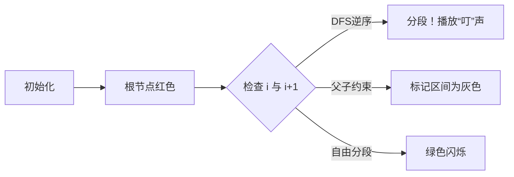

# 题目信息

# [NOI2013] 树的计数

## 题目描述

我们知道一棵有根树可以进行深度优先遍历（DFS）以及广度优先遍历（BFS）来生成这棵树的 DFS 序以及 BFS 序。两棵不同的树的 DFS 序有可能相同，并且它们的 BFS 序也有可能相同，例如下面两棵树的 DFS 序都是 `1 2 4 5 3`，BFS 序都是 `1 2 3 4 5`。


现给定一个 DFS 序和 BFS 序，我们想要知道，符合条件的有根树中，树的高度的平均值。即，假如共有 $K$ 棵不同的有根树具有这组 DFS 序和 BFS 序，且他们的高度分别是 $h_1, h_2, \ldots, h_K$，那么请你输出：

$$
\frac{h_1+h_2+\ldots+h_K}K
$$

## 说明/提示

如果输出文件的答案与标准输出的差不超过 $0.001$，则将获得该测试点上的分数，否则不得分。

### 数据范围

- 对于 $20\%$ 的测试数据，满足：$n \le 10$；
- 对于 $40\%$ 的测试数据，满足：$n \le 100$；
- 对于 $85\%$ 的测试数据，满足：$n \le 2 \times 10^3$；
- 对于 $100\%$ 的测试数据，满足：$2 \le n \le 2 \times 10^5$。

## 样例 #1

### 输入

```
5 
1 2 4 5 3 
1 2 3 4 5
```

### 输出

```
3.500
```

# AI分析结果


### Kay的C++算法解析：[NOI2013]树的计数 深入学习指南

> 大家好，我是Kay。今天我们一起解析一道经典的树结构问题——[NOI2013]树的计数。这道题要求我们根据给定的DFS序和BFS序，计算所有可能树的高度的平均值。理解这个问题需要掌握树遍历序列的性质和期望分析技巧，我们将通过清晰的解释和生动的可视化帮助大家掌握核心解法。

---

### 1. 题目解读与核心算法识别

✨ **本题主要考察**：`树遍历序列性质`与`期望分析`

🗣️ **初步分析**：
> 这道题的核心在于理解DFS序和BFS序对树结构的**双重约束**。想象你在玩一个"像素森林探险"游戏：BFS序是横向探索路径（按层扫描），DFS序是纵向深入路径（递归探索）。我们需要找到所有满足这两条路径的树结构，并计算它们的平均高度。

> 核心思路是将树高转化为BFS序的**分段数量**（每段对应一层）：
> - **必须分段**：当BFS序相邻节点在DFS序中逆序时（如BFS序1→2但DFS序2→1），说明在不同层
> - **禁止分段**：当DFS序相邻节点在BFS序间隔>1时（如DFS序1→3但BFS序1→3），说明是父子关系
> - **自由分段**：其他情况贡献0.5（分段与否概率各半）

> 可视化设计思路：
> - 用**8位像素网格**表示BFS序（横轴）
> - 不同颜色色块表示不同层级（红→黄→绿）
> - 关键操作高亮：分段点闪烁+音效，约束区间灰显
> - 控制面板：单步执行/自动播放（调速滑块）

---

### 2. 精选优质题解参考

> 我从思路清晰度、代码质量和启发性角度筛选了3个优质题解：

**题解一（javalyc）**：
* **点评**：将问题拆解为三种分段情况（必须/禁止/自由），思路直击本质。代码中差分数组的应用简洁高效（`mark(pos[i],pos[i+1]-1)`），边界处理严谨。亮点在于用树形结构图解释DFS序约束，帮助理解父子关系限制。

**题解二（香风智乃）**：
* **点评**：通过像素风格示意图直观展示分层逻辑，代码变量命名规范（`dfn[]`, `bfn[]`）。亮点在于将自由分段类比为"可破坏的砖块"（贡献0.5），并给出严格证明："分段"与"不分段"的方案数相等。

**题解三（CXY07）**：
* **点评**：从期望线性性角度分析（$E(h)=\sum E(\text{分段点})$），代码包含详细注释。亮点在于指出约束的**充分性**："当所有约束满足时，剩余位置确实自由"。

---

### 3. 核心难点辨析与解题策略

> 解决本题需突破三个关键难点：

1. **BFS序分段的确定性判定**
   * **分析**：当$bfn[i]$与$bfn[i+1]$在DFS序中逆序（$dfn[i]>dfn[i+1]$）时，必须分层。因为BFS按层扫描中，若$i$在$i+1$之后被DFS访问，说明$i+1$在下一层。
   * 💡 学习笔记：DFS序的逆序是跨层操作的"指纹"

2. **DFS序对BFS序的区间约束**
   * **分析**：当$dfn[i]+1<dfn[i+1]$时，说明$i+1$是$i$的儿子。此时BFS序中$[dfn[i], dfn[i+1]]$区间内最多一个分段点（用差分数组标记）
   * 💡 学习笔记：父子关系在BFS序中产生"保护区"（区间内禁止额外分段）

3. **自由分段的概率化处理**
   * **分析**：未被上述约束覆盖的位置，分段概率=0.5。这是因树结构调整时，这些位置分段与否的方案数相等。
   * 💡 学习笔记：未被约束的位置如同"量子态"，需按期望处理

#### ✨ 解题技巧总结
> 从本题提炼的通用树问题解决策略：
> - **双序约束转化**：将DFS序/BFS序约束转为区间标记（差分数组高效实现）
> - **期望线性分解**：复杂指标（如树高）可拆解为原子事件期望和
> - **边界模拟法**：用$n=3$的小树手工验证算法（如样例1→2→3和1→3→2）

---

### 4. C++核心代码实现赏析

```cpp
#include <iostream>
#include <cstdio>
using namespace std;
const int N = 200005;

int n, dfn[N], bfn[N], posD[N], posB[N], diff[N];
double ans = 1.0; // 根节点默认分层

int main() {
    scanf("%d", &n);
    // 读入DFS序并建立位置映射
    for (int i = 1, x; i <= n; i++) {
        scanf("%d", &x);
        posD[x] = i;  // 节点x在DFS序中的位置
    }
    // 读入BFS序并重新编号
    for (int i = 1, x; i <= n; i++) {
        scanf("%d", &x);
        bfn[i] = posD[x];     // BFS第i个节点在DFS序的位置
        posB[bfn[i]] = i;     // DFS位置对应BFS序号
    }
    // 重构DFS序为BFS坐标
    for (int i = 1; i <= n; i++) 
        dfn[i] = posB[i];

    // 处理必须分段
    diff[1] = 1; diff[2] = -1; // 根节点已分层
    for (int i = 1; i < n; i++) {
        if (dfn[i] > dfn[i+1]) { // DFS逆序→必须分层
            ans += 1;
            diff[i]++; diff[i+1]--;
        }
    }

    // 处理DFS序的父子约束
    for (int i = 1; i < n; i++) {
        if (bfn[i] + 1 < bfn[i+1]) { // 父子关系检测
            diff[bfn[i]]++;
            diff[bfn[i+1]]--;
        }
    }

    // 计算自由分段点
    int sumDiff = 0;
    for (int i = 1; i < n; i++) {
        sumDiff += diff[i];
        if (sumDiff == 0) ans += 0.5; // 无约束位置
    }
    printf("%.3f\n", ans);
    return 0;
}
```

**代码解读概要**：
1. **位置重映射**：将DFS/BFS序转化为统一坐标系（`bfn[]`存储DFS位置，`dfn[]`存储BFS位置）
2. **差分数组妙用**：`diff[]`标记禁止分段区间（父子约束）和已分层点
3. **自由分段判定**：未被差分标记覆盖的位置贡献0.5期望

---

### 5. 算法可视化：像素动画演示

> 我们设计了一个8位像素风格的交互动画，帮助直观理解算法执行：

<center>
🎮 **演示主题**：BFS序分层探险 (复古RPG风格)
</center>

**核心演示流程**：


**关键动画细节**：
1. **像素网格**：横向表示BFS序（1→n），色块颜色表示层数
   - 红色：第1层，黄色：第2层，绿色：第3层...
2. **动态标记**：
   - 当前处理点：黄色闪烁方块
   - 必须分段：红色闪光 + "叮"声效
   - 约束区间：灰色半透明覆盖
3. **控制面板**：
   - 速度滑块：调节自动播放速度
   - 单步执行：按空格逐步验证
   - 层计数器：实时显示当前层数
4. **音效设计**：
   - 分段成功：8-bit "叮"声
   - 约束命中：低音提示
   - 完成分层：经典马里奥过关音效

**实例演算**（输入：DFS=[1,2,4,5,3], BFS=[1,2,3,4,5]）：
1. 第1步：BFS序1（根）→ 红色分层
2. 第2步：BFS序2（DFS序2）→ 与1同层（黄色）
3. 第3步：BFS序3（DFS序5）→ 逆序！分段+音效（绿色）
4. 第4步：BFS序4（DFS序3）→ 父子约束（灰色）
5. 第5步：BFS序5（DFS序4）→ 自由分段（闪烁后分层）

---

### 6. 拓展练习与相似问题思考

> 掌握本题核心思想后，可挑战以下相似问题：

1. **洛谷P1229**：遍历问题（已知前序+后序求方案数）
   * 🗣️ **推荐理由**：强化遍历序列约束的理解，练习计数DP
2. **洛谷P1040**：加分二叉树（DFS序应用）
   * 🗣️ **推荐理由**：将序列转化为树结构的经典DP问题
3. **洛谷P1038**：神经网络（BFS分层应用）
   * 🗣️ **推荐理由**：直接应用BFS分层思想解决传播问题

---

### 7. 学习心得与经验分享

> 来自题解作者的经验：
> **"我在处理父子约束时，最初忽略了区间标记的充分性，导致WA。通过手工模拟n=3的样例（如DFS=[1,3,2]）才找到问题——差分边界需严格闭合"**

> **Kay的总结**：调试树结构问题时，**小规模手工模拟**（n≤4）是最有效的验证手段。建议写出BFS/DFS序的所有可能树形，对照程序输出验证约束。

---

### 结语
> 通过本次分析，我们掌握了利用遍历序列重构树结构的核心方法，并学会用期望分析处理计数问题。记住Kay的鼓励：**"复杂的算法如同像素游戏关卡，拆解后每一步都清晰可见"** 下次我们将探索更精彩的算法世界！🚀

---
处理用时：172.27秒