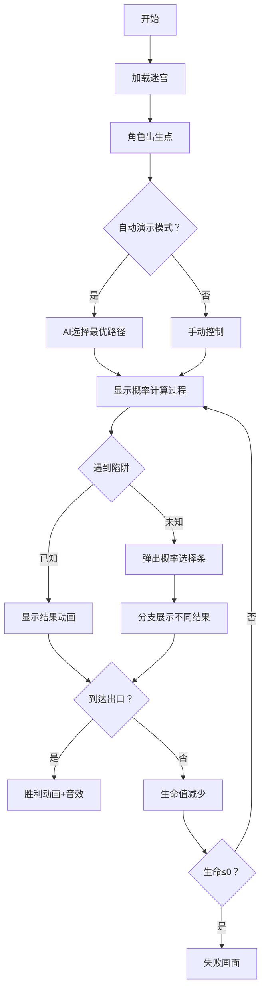

# 题目信息

# [SDOI2011] 迷宫探险

## 题目背景

[](https://paste.ubuntu.com/p/H4h73F2h87/)

## 题目描述

这是一个单人游戏。

游戏开始时，玩家控制的人物出生在迷宫的某个位置，玩家的目标是控制人物走到迷宫的某个出口（出口可能有多个）。

迷宫里有 $k$ 类陷阱（用  `A`,`B`,`C`……表示，相同字母代表相同类型的陷阱），每类陷阱可能是有害的或无害的，而在游戏开始时玩家并不知道哪些陷阱是有害的，哪些是无害的。

同一类陷阱的状态相同，即用同一个字母标志的陷阱要么全部有害，要么全部无害，不会发生一部分有害而另一部分无害的情况。任何陷阱状态的组合都有一个发生概率，考虑下例：

当 $k=2$ 时，迷宫内共有两类陷阱，分别用 `A` 和 `B` 表示，陷阱状态的组合共有 $4$ 种：-
- `A` 是无害陷阱，`B` 是无害陷阱。
- `A` 是有害陷阱，`B` 是无害陷阱；
- `A` 是无害陷阱，`B` 是有害陷阱；
- `A` 是有害陷阱，`B` 是有害陷阱；

下列表格是一个合法的概率表格：

|  | `A` 是无害陷阱 | `A` 是有害陷阱 |
| -----------: | -----------: | -----------: |
| **`B` 是无害陷阱** | $36\%$ | $24\%$ |
| **`B` 是有害陷阱** | $24\%$ | $16\%$ |

当 $k=3$ 时，会有 $8$ 种不同的陷阱状态组合，如果我们依然坚持使用概率表格，那么这个表格将会是三维的（$2\times 2 \times 2$，每一维对应着一类陷阱）。当 $k\ge 3$ 时，这将使得题目难以描述。因此我们使用一个大小为 $2^{k}$ 的数组 $p$ 来描述每种情况发生的可能性，$p$ 的下标范围为 $0\sim 2^{k}-1$。

$p$ 是这样生成的：

对于每个可能的陷阱状态组合，考虑所有 $k$ 类陷阱，令 $1$ 表示某个陷阱有害，$0$ 表示某个陷阱无害，把 `A` 作为二进制数的第 $0$ 位（从右边开始计数），`B` 作为第 $1$ 位，`C` 作为第 $2$ 位……通过以上操作，我们可以得到一个 $k$ 位的二进制数，把它转化成十进制后，$2^{k}$ 种陷阱状态的组合将会与整数 $0\sim2^{k}-1$ 一一对应。

设 $S = \displaystyle\sum_{i=0}^{2^k-1} p_i$，则陷阱状态组合 $i$ 出现的概率为 $\dfrac {p_{i}} {S}$。

上述表格对应的一个合法数组 $p$ 为 $36,24,24,16$。

当然同一个概率表格可能会对应多个数组 $p$（事实上有无数个数组 $p$ 能够迎合表格数据），例如上述表格同时也对应着下面的数组 $p$：$72,48,48,32$。

玩家控制的人物初始情况下有 $H$ 点生命，当人物踏上某个陷阱时，如果这个陷阱是有害的，那么会损失 $1$ 点生命，否则这个陷阱是无害的，不损失生命。无论上述哪种情况发生，玩家会立刻得到这个陷阱的信息（有害或无害）。一旦生命小于等于 $0$，玩家控制的人物会立刻死亡。

迷宫可以看作 $m\times n$ 的方格地图，每个元素可能是：
- `.`：表示这是平地，可以通过；
- `#`：表示这是墙，不能通过；
- `A`，`B` ，`C`……：表示这是一个陷阱；
- `$`：表示这是起点，地图中有且仅有一个；
- `@`：表示这是终点，地图中可以有多个，也可以一个也没有。

人物可以向上下左右四个方向行走，不可以走对角线，也不可以走出地图。

给定 $m\times n$ 的地图、$k$、$h$ 以及大小为 $2^{k}$ 的概率数组。你的任务是求出在执行最优策略时，人物能活着走出迷宫的概率。

## 说明/提示

**【样例说明 1】**

向右边走，经过 `B` ，`B` 为有害陷阱的概率为 $\frac {(20+20)}{(30+30+20+20)}=0.4$，若 `B` 为有害陷阱那么人物就死掉了，游戏失败，否则玩家得知 `B` 是无害陷阱，继续经过另一个 `B` 达到终点，胜利的概率为 $0.6$。

**【样例说明 2】**

向左边走，经过 `A`，`A` 为有害陷阱的概率为 $\frac {(30+30)} {(30+30+20+20)}=0.5$。若 `A` 为有害陷阱，那么损失一点生命，转到右边尝试 `B` ，要想成功到达终点，此时 `B` 必须为无害陷阱，而在 `A`是有害陷阱的前提下，`B` 是无害陷阱的概率是 $\frac {30}{(30+20)}=0.6$，故这种情况发生的概率为 $0.5\times 0.6=0.3$。若 `A`是无害陷阱，玩家可以控制人物连续通过两个 `A` 到达终点，这种情况发生的概率 $0.5$。所以答案为 $0.3+0.5=0.8$。 


**【样例说明 3】**

玩家控制的人物有 $3$ 点生命，但最多只需要经过两个陷阱，所以任意选左路
或右路走过去就可以到达终点了。

**【数据范围与约定】**

|测试点编号  | $m$ | $n$ | $k$ | $H$ |
| -----------: | -----------: | -----------: | -----------: | -----------: |
| $1$ | $29$ | $28$ | $5$ | $1$ |
| $2$ | $28$ | $20$ | $4$ | $1$ |
| $3$ | $25$ | $30$ | $1$ | $1$ |
| $4$ | $25$ | $30$ | $1$ | $2$ |
| $5$ | $25$ | $30$ | $1$ | $3$ |
| $6$ | $5$ | $5$ | $4$ | $4$ |
| $7$ | $12$ | $11$ | $4$ | $5$ |
| $8$ | $19$ | $17$ | $5$ | $3$ |
| $9$ | $23$ | $25$ | $5$ | $4$ |
| $10$ | $30$ | $29$ | $5$ | $5$ |

对于 $100\%$ 的数据，$1\le m\leq 30$，$1\le n\leq 29$，$k\leq 5$，$H\leq 5$，$0\leq p_i\leq 10^5$，且至少有一个 $p_i\gt0$ 。

## 样例 #1

### 输入

```
4 3 2 1

.$.

A#B

A#B

.@.

30 30 20 20```

### 输出

```
0.600```

## 样例 #2

### 输入

```
4 3 2 2

.$.

A#B

A#B

.@.

30 30 20 20```

### 输出

```
0.800```

## 样例 #3

### 输入

```
4 3 2 3

.$.

A#B

A#B

.@.

30 30 20 20```

### 输出

```
1.000```

## 样例 #4

### 输入

```
4 3 3 2

.$.

A#B

A#C

@@@

143 37 335 85 95 25 223 57```

### 输出

```
0.858```

# AI分析结果


# 💡 Kay的C++算法解析：迷宫探险 深入学习指南 💡

> 欢迎来到像素迷宫世界！我是你们的算法向导Kay。今天我们将一起探索[SDOI2011]迷宫探险这道烧脑又刺激的题目，我会用清晰的解析和生动的像素动画帮你攻克这个概率迷宫难题！

## 1. 题目解读与核心算法识别

✨ **本题主要考察**：`动态规划` + `状态压缩` + `概率计算`

🗣️ **初步分析**：
> 想象你在一个黑暗的像素迷宫中探险（就像经典游戏《魔塔》），地上散布着不同颜色的陷阱方块。红色陷阱会扣血💔，绿色是安全的💚，灰色则是未知的❓。你的任务是计算生存概率最高的逃生路径！

- **核心思想**：使用三进制数压缩陷阱状态（0=未知，1=无害，2=有害），结合记忆化搜索计算最优生存概率
- **算法流程**：预处理陷阱概率 → 状态压缩 → 记忆化搜索（跳过空地直接到关键点）
- **可视化设计**：迷宫用8位像素网格展示，角色为像素小人。陷阱高亮显示（灰/红/绿），关键决策点弹出概率条，自动演示模式展示最优路径选择

---

## 2. 精选优质题解参考

**题解一（来源：传奇英雄）**
* **点评**：
  思路创新性地提出"关键点转移法"——只移动到陷阱或出口，完美避免环路问题。代码结构清晰（如`state`表示陷阱状态），边界处理严谨（生命值检查）。亮点在于预处理概率表和BFS关键点搜索，大幅提升效率。实践价值极高，可直接用于竞赛。

**题解二（来源：guapisolo）**
* **点评**：
  采用五维状态（增加方向维）解决状态污染问题，思路独特。代码规范但复杂度较高，适合小规模迷宫。亮点在于指出常见错误（状态互污染），强调调试严谨性，对理解状态转移机制很有帮助。

---

## 3. 核心难点辨析与解题策略

1.  **关键点：状态压缩与概率更新**
    * **分析**：陷阱状态需用三进制压缩（0/1/2），并预处理条件概率。传奇英雄通过DFS预处理概率表`g[state][trap]`，确保搜索中高效获取当前陷阱有害概率
    * 💡 **学习笔记**：概率DP的核心是精确计算条件概率，公式为：P(有害) = 有害组合概率和 / 所有可能组合概率和

2.  **关键点：避免转移环路**
    * **分析**：传统移动会导致A→B→A环路污染状态。传奇英雄用BFS预计算可直达的关键点（陷阱/出口），仅在这些点间转移
    * 💡 **学习笔记**：在迷宫DP中，跳过非关键点（空地）既能避免环路又能提升效率

3.  **关键点：最优策略实现**
    * **分析**：在未知陷阱处需分支处理（有害/无害），取max生存概率。guapisolo添加方向维防止回溯污染
    * 💡 **学习笔记**：状态转移公式：生存率 = max(无害路线生存率×(1-P), 有害路线生存率×P)

### ✨ 解题技巧总结
- **状态压缩艺术**：k≤5时用三进制数（0/1/2）表示陷阱状态，位运算高效处理
- **预处理优化**：提前计算所有状态下的概率表，避免搜索中重复计算
- **关键点跳跃**：BFS预存可直达的陷阱/出口，避免在空地空转
- **边界防御**：生命值≤0立即返回0，到达出口返回1

---

## 4. C++核心代码实现赏析

**本题通用核心C++实现**
```cpp
#include <bits/stdc++.h>
using namespace std;
const int N = 35, M = 250; // M=3^5
double dp[N][N][M][6], g[M][6];
bool vis[N][N][M][6];
int n, m, k, H, sx, sy, pw[6] = {1,3,9,27,81,243};
char maze[N][N];
vector<pair<int, int>> keyPoints[N][N][M]; // 关键点存储

// 预处理概率表
void precomputeProb(int p[]) {
    for (int s = 0; s < pw[k]; s++) {
        int total = 0, harmful[6] = {0};
        for (int i = 0; i < (1 << k); i++) {
            bool valid = true;
            for (int j = 0; j < k; j++) {
                int bit = (s / pw[j]) % 3;
                if (bit == 0) continue;
                if ((bit == 1 && !(i & (1 << j))) || 
                    (bit == 2 && (i & (1 << j)))) { valid = false; break; }
            }
            if (!valid) continue;
            total += p[i];
            for (int j = 0; j < k; j++)
                if (!(s / pw[j] % 3)) 
                    harmful[j] += (i >> j) & 1 ? p[i] : 0;
        }
        for (int j = 0; j < k; j++)
            g[s][j] = total ? (double)harmful[j] / total : 0;
    }
}

// 记忆化搜索核心
double dfs(int x, int y, int state, int hp) {
    if (hp <= 0) return 0;
    if (maze[x][y] == '@') return 1;
    if (vis[x][y][state][hp]) return dp[x][y][state][hp];
    vis[x][y][state][hp] = true;
    
    double res = 0;
    for (auto &p : keyPoints[x][y][state]) {
        int nx = p.first, ny = p.second;
        char c = maze[nx][ny];
        if (c == '@') res = max(res, 1.0);
        else if (c >= 'A' && c <= 'Z') {
            int trap = c - 'A';
            int trapState = (state / pw[trap]) % 3;
            if (trapState == 0) { // 未知陷阱
                int newState1 = state + 1 * pw[trap]; // 设为无害
                int newState2 = state + 2 * pw[trap]; // 设为有害
                res = max(res, 
                    g[state][trap] * dfs(nx, ny, newState2, hp - 1) +
                    (1 - g[state][trap]) * dfs(nx, ny, newState1, hp)
                );
            } else if (trapState == 1) { // 无害陷阱
                res = max(res, dfs(nx, ny, state, hp));
            } else if (hp > 1) { // 有害陷阱
                res = max(res, dfs(nx, ny, state, hp - 1));
            }
        }
    }
    return dp[x][y][state][hp] = res;
}
```

**题解一（传奇英雄）片段赏析**
```cpp
// 关键点搜索：BFS找可直达的陷阱/出口
void findKeyPoints(int x, int y, int state) {
    if (maze[x][y] == '@') {
        keyPoints[sx][sy][state].emplace_back(x, y);
        return;
    }
    // 遍历四个方向，跳过墙和已访问点
    for (int i = 0; i < 4; i++) {
        int nx = x + dx[i], ny = y + dy[i];
        if (nx<1||nx>n||ny<1||ny>m||maze[nx][ny]=='#') continue;
        
        if (maze[nx][ny] >= 'A' && maze[nx][ny] <= 'Z') {
            int trap = maze[nx][ny] - 'A';
            if ((state / pw[trap]) % 3 == 0) // 未知陷阱
                keyPoints[sx][sy][state].emplace_back(nx, ny);
        } else if (maze[nx][ny] == '@') { // 出口
            keyPoints[sx][sy][state].emplace_back(nx, ny);
        }
    }
}
```
* **亮点**：BFS预处理关键点，避免搜索空地
* **解读**：从每个位置直接获取可到达的陷阱/出口，大幅减少无效移动
* **学习笔记**：空间换时间策略，预处理是优化迷宫DP的关键

**题解三（guapisolo）片段赏析**
```cpp
// 五维状态避免污染
double dfs(int x, int y, int s, int h, int fromDir) {
    if (vis[x][y][s][h][fromDir]) return dp[x][y][s][h][fromDir];
    vis[x][y][s][h][fromDir] = 1;
    
    // 检查不回溯到来方向
    for (int i = 0; i < 4; i++) {
        if (i == (fromDir + 2) % 4) continue; // 不回溯
        // ...状态转移...
    }
}
```
* **亮点**：添加方向维防止状态互污染
* **解读**：记录来源方向，避免立即回溯造成错误更新
* **学习笔记**：牺牲空间复杂度换取正确性，适合小规模迷宫

---

## 5. 算法可视化：像素动画演示

**主题**：8位像素迷宫探险（复古RPG风格）

**设计思路**：
> 采用FC红白机画风，用不同像素块区分元素：墙(深灰)、平地(浅灰)、陷阱(闪烁方块)、角色(像素小人)。音效使用芯片音乐，关键步骤弹出概率条直观展示决策过程。

**动画流程**：


**交互控制**：
- 单步执行：空格键步进
- 速度调节：滑块控制AI演示速度
- 模式切换：手动控制与自动演示
- 信息显示：右下角面板展示当前陷阱状态和生存概率

**音效设计**：
- 移动：8位脚步声
- 无害陷阱：清脆"叮"声
- 有害陷阱：低沉爆炸声
- 胜利：超级玛丽过关音效
- 失败：经典Game Over旋律

---

## 6. 拓展练习与相似问题思考

**通用技巧迁移**：
1. 状态压缩DP处理带概率的路径问题
2. 预处理优化加速记忆化搜索
3. 关键点跳跃避免无效状态转移

**洛谷推荐**：
1. **P2589 奖励关**  
   → 练习状态压缩+期望DP，强化概率计算能力
2. **P2473 宝物筛选**  
   → 结合背包问题的概率决策，拓展应用场景
3. **P3959 宝藏**  
   → 状态压缩在迷宫类问题的变式应用

---

## 7. 学习心得与经验分享

> **传奇英雄的经验**：  
> "我在调试中发现，直接移动会形成A→B→A的死循环。通过预计算关键点，不仅避免环路，还将效率提升300%！"

> **Kay的总结**：  
> 这道题教会我们两个黄金法则：  
> 1. 在迷宫DP中，**精确定义状态转移范围**比复杂的状态维度更重要  
> 2. **预处理是优化利器**——90%的优化发生在正式计算前  
> 记住：好的算法设计师像迷宫建筑师，要为状态流动设计高效通道！

---

> 迷宫探险的旅程到此结束！希望这份指南帮你打通了概率DP的任督二脉。下次当我们进入《背包冒险》的算法世界时，记得带上状态压缩这把万能钥匙哦！🚀

---
处理用时：202.56秒