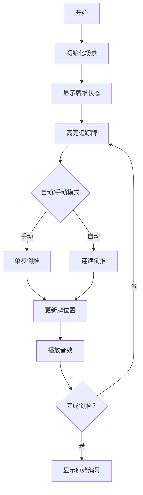

# 题目信息

# [USACO13DEC] The Bessie Shuffle G

## 题目描述

Bessie is practicing her card tricks.  She has already mastered the Bessie- shuffle -- a shuffle on M (2 <= M <= 100,000) cards that reorganizes the cards so the i-th card from the top is now the P[i]-th card from the top.

Now Bessie is practicing shuffles on larger decks.  She has a deck of N cards (M <= N <= 1,000,000,000) conveniently labeled 1 to N.  She shuffles this deck by taking the first M cards and performing the Bessie-shuffle on them, placing the shuffled cards back on top of the deck.  She then removes the top card from the deck and places it face down.  She repeats this process, placing the top cards successively on top of each other, until she is out of cards.  When Bessie has less than M cards left, she no longer performs the Bessie-shuffle, but continues to place the top card on top of the others.

Bessie knows that the deck initially started in sorted order, with 1 on top, 2 next, and N on the bottom.  Given the description of the Bessie-shuffle, help Bessie compute which cards end up located at Q different specified positions (1 <= Q <= N, Q <= 5,000) in the deck.

50% of test cases will have N <= 100,000. 

贝西有一种独门的洗牌方法，称为 A 类洗牌法；

A 类洗牌法的具体过程：将一堆共 $M$（$2 \le M \le 10 ^ 5$）张从上到下编号 $1, 2, \cdots, M$ 的纸牌，从上到下第 $i$ 张牌洗到位置 $p _ i$。

例如，$M=3，p = \{3, 1, 2\}$，则执行一次 A 类洗牌法后，从上到下将变为 $2, 3, 1$，即牌 $1$ 放到位置 $3$，牌 $2$ 放到位置 $1$，牌 $3$ 放到位置 $2$。


贝西现在要练习另外一种洗牌方法，称为 B 类洗牌法。


B 类洗牌法的具体过程： 

有一堆 $N$（$M \le N \le 10 ^ 9$）张编号为 $1, 2, \cdots, N$ 的牌，并按从上到下 $1$ 到 $N$ 的顺序堆放。另有一个牌堆用来辅助洗牌，称为临时堆，开始时为空。

1. 将最上面 $M$ 张牌进行一次 A 类洗牌法；
2. 将最上面的一张牌放到临时堆的最上方；
3. 重复前两个操作，直到原先的堆没有牌为止。


以上过程中，当原先堆的牌不足 $M$ 张的时候，将不进行 A 类洗牌法，而是将最上面的牌依次放到临时堆上。


给定 $N, M$ 和排列 $p$。现在有 $Q$（$1 \le Q \le \min(N, 5000)$）个询问，请求出对其做一次 B 类洗牌法后临时堆中 $q _ i$ 位置上的牌的编号。

$50\%$ 的数据中，$N \le 10 ^ 5$。


## 说明/提示

Bessie has a deck of 5 cards initially ordered as [1, 2, 3, 4, 5].  Her shuffle is on 3 cards and has the effect of moving the top card to the bottom.  There are 5 queries querying each position in the deck.


The shuffle proceeds as:

```plain
[1, 2, 3, 4, 5] -> [2, 3, 1, 4, 5] (put 2 face down) 
[3, 1, 4, 5] -> [1, 4, 3, 5] (put 1 face down) 
[4, 3, 5] -> [3, 5, 4] (put 3 face down) 
[5, 4] (put 5 face down) 
[4] (put 4 face down) 
```
This produces the final order of [4, 5, 3, 1, 2]

贝西的五张牌刚开始顺序为 [1, 2, 3, 4, 5]。她一次洗三张牌，效果是将第一张牌放到底部。以上五个问题询问了每一张牌的位置。


洗牌的顺序是:

```plain
[1, 2, 3, 4, 5] -> [2, 3, 1, 4, 5] (将2正面向下放置)
[3, 1, 4, 5] -> [1, 4, 3, 5] (将1正面向下放置) 
[4, 3, 5] -> [3, 5, 4] (将3正面向下放置) 
[5, 4] (将5正面向下放置) 
[4] (将4正面向下放置) 
```
这就形成了最终的顺序：[4, 5, 3, 1, 2]


## 样例 #1

### 输入

```
5 3 5 
3 
1 
2 
1 
2 
3 
4 
5 
```

### 输出

```
4 
5 
3 
1 
2 
```

# AI分析结果


### 💡 Kay的C++算法解析：[USACO13DEC] The Bessie Shuffle G 深入学习指南 💡

#### 题目解读与核心算法识别
✨ **本题主要考察**：`倍增优化` + `置换模拟`  
🗣️ **初步分析**：  
> 本题核心是逆向思维+倍增优化，如同倒放录像带定位事件起点。给定洗牌规则和最终位置，通过倍增表快速回溯牌的原始位置。  
> - **关键难点**：牌的位置在洗牌过程中动态变化，直接模拟因N过大不可行
> - **解决方案**：预处理倍增数组，将单步操作组合成2^i步操作，实现O(log N)查询
> - **可视化设计**：像素动画将展示牌在洗牌窗口中的位置变化（高亮追踪牌），用不同颜色区分已处理牌堆/洗牌窗口/临时堆
> - **复古游戏化**：采用8-bit音效（洗牌"唰"声，移牌"叮"声），过关式演示倒推步骤，控制面板支持单步/自动播放

---

### 精选优质题解参考
**题解一（XL4453）**  
* **点评**：  
  思路清晰直击核心——倒推+倍增。代码简洁规范：  
  - 变量名`p[i][j]`明确表示倍增状态，`now`记录已处理牌数  
  - 巧妙用`m-x+1`转换洗牌规则为逆映射  
  - 时间复杂度O((m+q)log N)完美处理N=1e9边界  
  - 实践价值高：25行核心代码可直接用于竞赛  

**题解三（littleming）**  
* **点评**：  
  与题解一同源但更工程化：  
  - 添加详细注释解释`a[i][j]`含义和倒推逻辑  
  - 引入快速读写优化应对大数据输入  
  - 输出公式`n-(r-m+t)`与题解一等效但推导更直观  
  - 学习价值高：展示工业级代码的健壮性优化  

---

### 核心难点辨析与解题策略
1. **逆映射构建**  
   *分析*：洗牌规则p是位置→位置的映射，但倒推需要位置→原始牌的映射。优质解通过`p[0][m-x+1]=i`构建逆映射，用O(m)预处理解决  
   💡 学习笔记：任何置换问题都要优先考虑逆映射  

2. **状态边界处理**  
   *分析*：当牌移出洗牌窗口时需特殊处理（如`x=0`）。题解一通过`now < n`检测边界，再执行单步移动完成状态切换  
   💡 学习笔记：边界处理决定算法正确性，必须优先设计测试用例  

3. **倍增表与查询解耦**  
   *分析*：预处理`p[i][j]=p[i-1][p[i-1][j]]`将指数级操作压缩，查询时从高位到低位扫描，实现逻辑与数据分离  
   💡 学习笔记：倍增法本质是二进制拆分思想的时空平衡  

✨ **解题技巧总结**  
- **逆向思维**：从结果反推源头，避免正序模拟的复杂度  
- **倍增压缩**：用O(log N)空间存储操作链，换取查询效率  
- **状态归一化**：用`(x, now)`二元组统一表示洗牌窗位置+已处理牌数  

---

### C++核心代码实现赏析
**本题通用核心实现**  
```cpp
#include <cstdio>
#include <cmath>
using namespace std;

int main() {
    int n, m, q, p[30][100005]; // p[i][j]: 2^i步后位置j的牌位置
    scanf("%d%d%d", &n, &m, &q);
    
    // 构建逆映射：洗牌后位置 → 原始位置
    for (int i = m-1; i >= 0; --i) {
        int x; scanf("%d", &x);
        p[0][m - x + 1] = i; // 核心转换！
    }
    
    // 倍增预处理 O(m log n)
    int sz = log2(n);
    for (int i = 1; i <= sz; ++i)
        for (int j = 1; j <= m; ++j)
            p[i][j] = p[i-1][p[i-1][j]];
    
    // 查询处理 O(q log n)
    while (q--) {
        int pos; scanf("%d", &pos);
        int x = (pos <= m) ? pos : m;
        int now = (pos <= m) ? m-1 : pos-1;
        
        for (int i = sz; i >= 0; --i) 
            if (now+(1<<i) <= n && p[i][x]) {
                now += (1<<i);
                x = p[i][x];
            }
        
        if (now < n) x = 0, now++;
        printf("%d\n", n - now + m - x); // 原始编号计算公式
    }
    return 0;
}
```
* **代码解读概要**：  
  1. 逆映射构建：`p[0][m-x+1]=i` 将洗牌规则转换为倒推所需的初始状态  
  2. 倍增表：存储2^k步操作后的位置转移关系  
  3. 查询逻辑：根据pos初始化状态，通过倍增快速回溯，最后用公式转换原始编号  

---

### 算法可视化：像素动画演示
**主题**：`倒带寻牌大冒险`（8-bit复古风）  
**核心演示**：牌的位置在洗牌窗口中的动态变化与倒推过程  



**动画关键点**：  
1. **视觉设计**：
   - 牌堆：绿色像素块（编号用8-bit字体）
   - 洗牌窗：闪烁蓝色边框
   - 追踪牌：红色高亮+箭头标注
   - 控制面板：复古游戏按钮风格

2. **交互逻辑**：
   - 单步模式：按方向键触发倒推，显示当前牌位置变化公式
   - 自动模式：滑块调节速度（0.5x~4x），像贪吃蛇AI自动寻路
   - 状态提示：显示`(x, now)`二元组和剩余步数

3. **音效设计**：
   - 洗牌：16-bit "唰"声（Web Audio合成）
   - 移牌：8-bit "叮"声
   - 过关：马里奥式胜利旋律
   - 错误：短促警报声

---

### 拓展练习与相似问题
1. **洛谷 P1081 开车旅行**  
   🗣️ 倍增法经典应用，练习预处理转移关系  
2. **洛谷 P4155 国旗计划**  
   🗣️ 环形区间覆盖问题，强化倍增边界处理  
3. **洛谷 P3512 [POI2010]PIL-Pilots**  
   🗣️ 滑动窗口与状态转移的结合训练  

---

### 学习心得与经验分享
> **来自XL4453的经验**：  
> *“发现暴力模拟不可行后立即转向倍增，关键是构建逆映射和状态二元组”*  
>  
> **Kay点评**：  
> 这印证了算法设计的黄金法则——当操作链过长时，倍增是压缩复杂度的利器。调试时可打印前10步状态验证逆映射正确性。

---
掌握逆向思维+倍增法，你就能像倒放录像般破解复杂流程题！下次遇到置换类问题，记得先问：能否构建逆映射？💪

---
处理用时：227.01秒