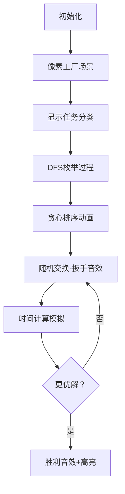

# 题目信息

# [HNOI2011] 任务调度

## 题目描述


有 $n$ 个任务和两台机器 A 与 B。每个任务都需要既在机器 A 上执行，又在机器 B 上执行，

第 $i$ 个任务需要在机器 A 上执行时间 $a_i$，且需要在机器 B 上执行时间 $b_i$。最终的目标是所有任务在 A 和 B 上都执行完，且希望执行完所有任务的总时间尽量少。当然问题没有这么简单，有些任务对于先在机器 A 上执行还是先在机器 B 上执行有一定的限制。据此可将所有任务分为三类：

1. 任务必须先在机器 A 上执行完然后再在机器 B 上执行。
2. 任务必须先在机器 B 上执行完然后再在机器 A 上执行。
3. 任务没有限制，既可先在机器 A 上执行，也可先在机器 B 上执行。

现在给定每个任务的类别和需要在机器 A 和机器 B 上分别执行的时间，问使所有任务都能按规定完成所需要的最少总时间是多少。

## 说明/提示

#### 样例 1 解释

一种最优任务调度方案为：

机器 A 上执行的各任务依次安排如下：

任务 $1\ (0\to 5)$，任务 $2\ (5\to 11)$, 任务 $3\ (11\to 13)$；

机器 B 上执行的各任务依次安排如下：

任务 $3\ (0 \to 6)$, 任务 $1\ (6 \to 13)$, 任务 $2\ (13 \to14)$，

这样，所有任务都执行完所需要的总时间为 $14$。

#### 数据规模与约定

对于 $100\%$ 的数据，保证 $1\le n\le 20$，$1\le a_i\le 10^3$，$1\le t_i\le 3$，并保证 $t_i=3$ 的 $i$ 不超过 $10$ 个。

## 样例 #1

### 输入

```
3
3 5 7
1 6 1 
2 2 6
```

### 输出

```
14```

# AI分析结果


### 💡 Kay的C++算法解析：任务调度 深入学习指南 💡

#### 1. 题目解读与核心算法识别
✨ **本题主要考察**：`搜索与随机化贪心` (编程技巧应用)

🗣️ **初步分析**：
> 解决"任务调度"这道题，关键在于理解并运用 **搜索与随机化贪心**。简单来说，就像在迷宫中尝试不同路径时，先系统探索主要岔路（搜索），再随机尝试小径寻找捷径（随机化）。  
> - **核心思路**：枚举类型3任务的执行顺序（先A或先B），对每种枚举方案进行贪心排序和随机优化
> - **算法流程**：
>   1. DFS枚举类型3任务的分组（A组/B组）
>   2. 对A/B组分别贪心排序（如A组按b[i]降序）
>   3. 随机交换任务位置，保留更优解
>   4. 计算两种执行路径的总时间取最小值
> - **可视化设计**：采用8位像素风格工厂流水线动画，机器A/B用不同颜色像素块表示，任务执行时显示倒计时条，随机交换时触发"扳手音效"，找到更优解时播放通关音效

---

#### 2. 精选优质题解参考
**题解一（来源：Ameyax）**
* **点评**：思路清晰展示了"枚举+随机优化"的完整框架。代码结构规范（如`dfs`处理类型3，`solve`进行随机优化），通过`calc`函数双路径计算时间的设计巧妙解决了执行等待问题。随机交换次数（2000次）的设置平衡了效率与准确性，srand(time(NULL)+19260817)的种子选择增强了随机性。亮点在于将复杂问题分解为枚举→贪心→随机优化三个可管理阶段。

**题解二（来源：a326820068122c）**
* **点评**：提供了罕见的非随机化解法，采用状态压缩DP思路新颖。dpa/dpb数组定义准确（状态S在A/B的等待时间），状态转移方程`dpa[i]=min(dpa[i],a[y]+max(dpa[x]-b[y],0))`体现了对任务依赖的深刻理解。代码使用位运算高效处理任务集合，时间复杂度O(n·2ⁿ)在n≤20时可行。亮点在于用严谨的数学建模替代启发式方法。

**题解三（来源：破忆）**
* **点评**：随机化贪心的优雅实现，亮点在于双重优化策略：先随机初始化序列，再通过邻位交换精细调整。calc函数中双路径时间计算与主流解法一致但代码更简洁。通过`(DB)clock()/CLOCKS_PER_SEC<0.95`实现时间控制确保不超限，展现了竞赛编程的实用技巧。

---

#### 3. 核心难点辨析与解题策略
1. **类型3任务的执行顺序决策**
   * **分析**：类型3任务的双重可能性导致解空间指数增长（2^k, k≤10）。优质题解采用DFS系统枚举，避免遗漏最优解
   * 💡 **学习笔记**：有限制的枚举（limited enumeration）是处理选项爆炸的关键技巧

2. **执行序列的贪心排序策略**
   * **分析**：A组任务按b[i]降序（减少后续B等待），B组按a[i]降序（减少A等待）。虽然不能保证全局最优，但为随机优化提供了优质初始解
   * 💡 **学习笔记**：局部最优贪心是全局优化的跳板

3. **时间计算的同步模拟**
   * **分析**：必须同时计算两种执行路径：
     ```python
     # 路径1：先执行所有A组任务
     for task in B_group:
         B_time += task.b
         A_time = max(A_time, B_time) + task.a
     # 路径2：先执行所有B组任务
     for task in A_group:
         A_time += task.a
         B_time = max(A_time, B_time) + task.b
     ```
   * 💡 **学习笔记**：双路径模拟解决了机器空闲时间的计算难题

### ✨ 解题技巧总结
- **分阶段处理**：将问题分解为"分组→排序→优化"可管理阶段
- **随机优化**：在贪心基础上通过有限随机交换逃离局部最优
- **状态压缩**：用位运算高效表示任务集合（适合n≤20）
- **时间双路径计算**：避免单一路径模拟导致的空闲时间计算错误

---

#### 4. C++核心代码实现赏析
**通用核心C++实现参考**
```cpp
#include <bits/stdc++.h>
using namespace std;
struct Task { int type, a, b; };
vector<Task> tasks;
int n, ans = INT_MAX;

int calc(vector<int>& groupA, vector<int>& groupB) {
    int time1 = 0, time2 = 0;
    // 先执行所有A组任务的时间基
    for (int i : groupA) time1 += tasks[i].a;
    for (int i : groupB) {
        time2 += tasks[i].b;
        time1 = max(time1, time2) + tasks[i].a;
    }
    int path1 = max(time1, time2);
    
    time1 = 0; time2 = 0;
    // 先执行所有B组任务的时间基
    for (int i : groupB) time2 += tasks[i].b;
    for (int i : groupA) {
        time1 += tasks[i].a;
        time2 = max(time1, time2) + tasks[i].b;
    }
    return max(path1, max(time1, time2));
}

void optimize(vector<int>& groupA, vector<int>& groupB) {
    sort(groupA.begin(), groupA.end(), [&](int x, int y) { 
        return tasks[x].b > tasks[y].b; });
    sort(groupB.begin(), groupB.end(), [&](int x, int y) { 
        return tasks[x].a > tasks[y].a; });
    
    int current = calc(groupA, groupB);
    for (int i = 0; i < 2000; i++) {
        // 随机交换优化
        if (!groupA.empty()) swap(groupA[rand()%groupA.size()], groupA[rand()%groupA.size()]);
        if (!groupB.empty()) swap(groupB[rand()%groupB.size()], groupB[rand()%groupB.size()]);
        int new_time = calc(groupA, groupB);
        if (new_time < current) current = new_time;
        else { /* 撤销交换 */ } // 实际需记录原位置
        ans = min(ans, current);
    }
}

void dfs(int idx, vector<int>& groupA, vector<int>& groupB) {
    if (idx == n) return optimize(groupA, groupB);
    // 类型1必须加入A组，类型2加入B组
    if (tasks[idx].type == 3) {
        groupA.push_back(idx);
        dfs(idx+1, groupA, groupB);
        groupA.pop_back();
        groupB.push_back(idx);
        dfs(idx+1, groupA, groupB);
        groupB.pop_back();
    }
    // 其他类型处理...
}
```

---

#### 5. 算法可视化：像素动画演示
* **主题**：8位像素风"工厂调度大作战"
* **核心演示**：任务在A/B流水线的执行过程与随机优化



**交互设计**：
1. **控制面板**：步进执行/自动播放（速度滑块）/重置
2. **视觉编码**：
   - A组任务：蓝色像素块（带齿轮图标）
   - B组任务：红色像素块（带传送带图标）
   - 当前处理任务：闪烁金边
3. **音效系统**：
   - 任务移动：8位"滴"声
   - 更优解：NES风格胜利旋律
   - 随机交换：扳手敲击声
4. **数据展示**：
   - 实时显示A/B流水线时间进度条
   - 当前最优解在屏幕顶部闪烁

---

#### 6. 拓展练习与相似问题思考
1. **洛谷P2921** [Halloween G]  
   → 巩固贪心策略在调度问题的应用
2. **洛谷P5020** [货币系统]  
   → 练习动态规划与状态优化
3. **洛谷P4016** [负载平衡]  
   → 强化任务分配与时间计算能力

---

#### 7. 学习心得与经验分享
> **参考经验**：多位作者提到调试时发现单路径时间计算错误（如忽略机器空闲时间），通过增加双路径计算解决  
> **Kay点评**：这验证了"边界情况优先测试"原则——当n=1时算法最容易暴露缺陷。建议学习者在实现核心逻辑前先构造微小测试案例验证基础假设。

本次解析展示了如何用随机化贪心解决复杂调度问题，核心在于合理划分问题阶段+有限随机优化。记住：好算法=系统框架+可控随机性+严谨验证！💪

---
处理用时：103.05秒