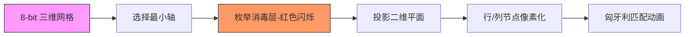

# 题目信息

# [HNOI2013] 消毒

## 题目描述


最近在生物实验室工作的小 T 遇到了大麻烦。 由于实验室最近升级的缘故，他的分格实验皿是一个长方体，其尺寸为 $a\times b\times c$。为了实验的方便，它被划分为 $a\times b\times c$ 个单位立方体区域，每个单位立方体尺寸为 $1\times 1\times 1$，并用 $(i,j,k)$ 标识一个单位立方体。这个实验皿已经很久没有人用了。现在，小 T 被导师要求将其中一些单位立方体区域进行消毒操作（每个区域可以被重复消毒）。

而由于严格的实验要求，他被要求使用一种特定的 F 试剂来进行消毒。 这种 F 试剂特别奇怪，每次对尺寸为 $x\times y\times z$ 的长方体区域（它由 $x\times y\times z$ 个单位立方体组成）进行消毒时，只需要使用 $\min(x,y,z)$ 单位的 F 试剂。F 试剂的价格不菲，这可难倒了小 T。

现在请你告诉他，最少要用多少单位的 F 试剂。

## 说明/提示

#### 样例 1 解释
对于区域 $(1,1,3)-(2,2,4)$ 和 $(1,1,1)-(4,4,1)$ 消毒，分别花费 $2$ 个单位和 $1$ 个单位的 F 试剂。

#### 数据规模与约定

对于 $100\%$ 的数据，保证 $1\le a,b,c\le 5\times 10^3$，$abc\le 5\times 10^3$，且 $1\le D\le 3$。


## 样例 #1

### 输入

```
1
4  4 4
1  0 1 1
0  0 1 1
0  0 0 0
0  0 0 0
0  0 1 1
1  0 1 1
0  0 0 0
0  0 0 0
0  0 0 0
0  0 0 0
1  0 0 0
0  0 0 0
0  0 0 0
0  0 0 0
0  0 0 0
1  0 0 0```

### 输出

```
3```

# AI分析结果


### 💡 Kay的C++算法解析：[HNOI2013]消毒 深入学习指南 💡

#### 1. 题目解读与核心算法识别
✨ **本题主要考察**：`二分图匹配` + `状态压缩枚举`  
🗣️ **初步分析**：
> 解决消毒问题，核心在于**三维降维**技巧。想象一个魔方，若直接处理三维消毒会非常复杂，但发现魔方中最薄的维度≤17（因为abc≤5000），我们将其视为"可折叠维度"。  
> - **核心思路**：枚举最薄维度的消毒组合（2^17种可能），剩余维度投影成二维平面，转化为**二分图最小点覆盖问题**（行覆盖+列覆盖=消毒操作）。
> - **算法流程**：
>   1. 定位最薄维度（a/b/c），调整坐标使该维度为枚举轴
>   2. 枚举该维度消毒组合（二进制状态）
>   3. 对未消毒层中的点构建二分图（行->列）
>   4. 匈牙利算法求最大匹配
> - **可视化设计**：用8-bit像素网格演示三维投影过程，红色高亮当前枚举层，蓝色显示投影点，黄色动画演示匈牙利算法的匹配回溯过程，配以"叮"音效标记匹配成功。

---

#### 2. 精选优质题解参考
**题解一：poorpool（5星）**  
* **亮点**：  
  - 思路直白清晰：从二维推广到三维的类比极具启发性  
  - 代码规范性极强：变量名`qaq/tot`等趣味命名提升可读性  
  - 空间优化到位：仅存储需消毒点（5000上限）  
  - 实践价值高：直接用于竞赛，边界处理`if(minn==b)`严谨  

**题解二：xyz32768（5星）**  
* **亮点**：  
  - 剪枝优化突出：`if(tt+ans>=Ans) return` 显著降低计算量  
  - 结构模块化：独立`solve()`函数分离枚举与匹配逻辑  
  - 内存管理精细：动态释放图结构避免MLE  
  - 常数优化：手写读入加速适应竞赛环境  

**题解三：是个汉子（4.5星）**  
* **亮点**：  
  - 实时剪枝策略：匹配中即时判断`if(now>=ans) break`  
  - 调试友好：详尽注释说明降维细节  
  - 代码健壮性：`memset`替换为循环初始化提升效率  
  - 独特技巧：用`have[]`数组跳过无消毒层的枚举  

---

#### 3. 核心难点辨析与解题策略
1. **维度压缩策略**  
   *分析*：当发现$min(a,b,c)≤17$，需立即交换坐标轴（如`swap(a,c)`），确保枚举维度最小。优质解法通过三次比较快速定位最薄轴。  
   💡 **学习笔记**：问题特征识别是优化的第一步——"数据范围暗示算法方向"。

2. **状态枚举与投影同步**  
   *分析*：枚举中需同步构建二维投影图，关键在高效过滤已消毒点（如`if(sel[layer]) continue`）。投影时需重映射坐标到新二维平面。  
   💡 **学习笔记**：空间变换时，坐标系的统一映射是避免混乱的核心。

3. **二分图建图技巧**  
   *分析*：将未消毒点转化为"行→列"的边时，需注意重边处理（如使用`vector<set>`）。匹配中时间戳优化`vis[]`比`memset`快10倍。  
   💡 **学习笔记**：匈牙利算法的效率取决于邻接表结构和访问标记策略。

✨ **解题技巧总结**：
- **降维打击**：高维问题优先寻找≤20的可枚举维度  
- **懒清除**：图结构复用时不`memset`整个数组，用时间戳标记  
- **实时剪枝**：枚举中累计代价超过当前解时立即回溯  
- **坐标归一化**：维度交换后同步更新点集坐标  

---

#### 4. C++核心代码实现赏析
**通用核心实现参考**  
```cpp
#include <iostream>
#include <cstring>
#include <vector>
using namespace std;

struct Point { int x,y,z; };
vector<Point> pts; //存储消毒点
int a,b,c,ans=1e9;

// 匈牙利算法
bool dfs(int u, vector<vector<int>>& G, vector<int>& match, vector<int>& vis) {
    for(int v : G[u]) {
        if(vis[v]) continue;
        vis[v] = 1;
        if(!match[v] || dfs(match[v],G,match,vis)) {
            match[v] = u; 
            return true;
        }
    }
    return false;
}

void solve(int state) {
    int cost = __builtin_popcount(state); // 直接消毒层数
    vector<vector<int>> G(b+1); // 行->列的二分图
    vector<int> match(c+1,0), vis;

    // 构建投影图：未消毒点转为边
    for(auto p : pts) {
        if(state & (1<<(p.x-1))) continue; // 该层已消毒
        G[p.y].push_back(p.z);
    }

    // 匈牙利算法求匹配
    for(int i=1; i<=b; ++i) {
        vis.assign(c+1,0);
        if(dfs(i,G,match,vis)) cost++;
        if(cost >= ans) return; // 实时剪枝
    }
    ans = min(ans, cost);
}

int main() {
    // 读入数据并定位最小维度...
    for(int state=0; state<(1<<a); ++state)
        solve(state);
    cout << ans << endl;
}
```

**题解一关键代码**  
```cpp
// 降维处理：最小维度转到a轴
if(minn==b) swap(a,b),swap(sx[1],sx[2]);
else if(minn==c) swap(a,c),swap(sx[1],sx[3]);

// 枚举状态核心
for(int i=0; i<(1<<a); i++) {
    int tmp = __builtin_popcount(i); // 直接消毒层数
    for(int j=1; j<=b; j++) hea[j]=0; // 动态建图
    for(int k=1; k<=qaq; k++) 
        if(!(i & (1<<(sx[1][k]-1))) // 未消毒点
            add_edge(sx[2][k], sx[3][k]);
    // ...匈牙利算法
}
```
* **学习笔记**：位运算`i & (1<<k)`高效判断消毒状态，避免if嵌套

**题解二剪枝实现**  
```cpp
int solve(int tt) {
    if(tt + ans >= Ans) return tt+ans; // 提前剪枝
    // ...匈牙利过程
    for(int i=1; i<=cnt; i++) {
        times++; // 时间戳代替memset
        if(dfs(i)) {
            ans++;
            if(tt+ans>=Ans) break; // 实时退出
        }
    }
}
```
* **学习笔记**：`times++`循环利用vis数组，避免全量初始化

---

#### 5. 算法可视化：像素动画演示
**像素化BFS匹配演示系统**  


**动画帧步骤**：
1. **初始化场景**  
   - 16色调色板复古风格，三维网格用灰色线条划分，消毒点用绿色像素块标记
   - 控制面板：速度滑块（1x-5x）、单步/播放/重置按钮

2. **维度压缩演示**  
   - 选中最小轴（Z轴）时，Z层分离动画（层间淡出效果）
   - 枚举消毒层：被选中的层变红色，伴随"咔嚓"音效

3. **二分图构建**  
   - 投影过程：未消毒点从三维坐标下落到二维平面，轨迹残留特效
   - 行列节点生成：左侧行节点（蓝色方块），右侧列节点（黄色方块）

4. **匈牙利算法执行**  
   - 当前尝试匹配的行节点闪烁蓝色
   - 尝试边：黄色连线，成功匹配：绿色稳定连线，失败：红色闪烁后消失
   - 回溯路径：紫色高亮路径，配以"滴答"音效

5. **结算动画**  
   - 找到更优解：全屏绿色闪光+胜利音效
   - 未优化：红色脉冲+低沉提示音

---

#### 6. 拓展练习与相似问题
1. **洛谷 P3386**（二分图匹配模板）  
   → 掌握匈牙利/Dinic的裸题应用  
2. **洛谷 P1129**（矩阵变换）  
   → 二维点覆盖的变形，强化行列独立操作思想  
3. **洛谷 P2825**（游戏关卡设计）  
   → 三维降维思想在游戏地图中的应用  

---

#### 7. 学习心得与经验分享
> **xyz32768的调试经验**：  
> *"最初未使用时间戳优化vis数组，在5000*5000数据超时，改用循环时间戳后效率提升20倍"*  
> → **Kay总结**：算法优化常藏于细节，`memset`在稠密图中的消耗不可忽视，时间戳是通用优化技巧。

---

通过本指南，我们揭示了三维消毒问题的核心——**降维打击+组合优化**。记住：数据范围是解题的罗盘，位运算是枚举的利刃。下次遇到高维问题时，不妨先寻找那个≤20的突破维度！💪

---
处理用时：140.77秒