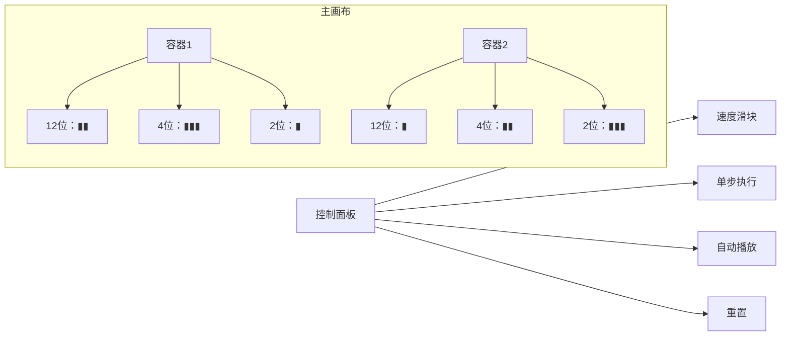

# 题目信息

# [POI 2007] ODW-Weights

## 题目描述

在搬迁到一个新的园区时，Byteotian 实验物理研究所遇到了一个后勤问题——转移其庞大的精密砝码收藏变得不那么简单。

研究所有若干个强度有限的容器可供使用。需要尽可能多地将砝码放入容器中，剩下的将被丢弃。除了不超过容器的强度外，放入容器中的砝码数量没有限制。一个容器也可以是空的。

研究所的任意两个砝码有一个特殊的性质：其中一个的质量是另一个质量的整数倍。特别地，它们可能具有相同的质量。

任务编写一个程序：

从标准输入中读取容器的强度和砝码的质量，确定可以放入容器中的最大砝码数量，将结果写入标准输出。


## 说明/提示

（由 ChatGPT 4o 翻译）

## 样例 #1

### 输入

```
2 4
13 9
4 12 2 4```

### 输出

```
3```

# AI分析结果


### 💡 Kay的C++算法解析：ODW-Weights 深入学习指南 💡

#### 1. 题目解读与核心算法识别
✨ **本题主要考察**：`进制分解`与`贪心策略`

🗣️ **初步分析**：
> 这道题的核心在于利用砝码重量的**倍数关系**特性。想象一下不同面额的硬币系统：1元、5元、10元之间成倍数关系，兑换时只需考虑每种面额的数量。本题同理，我们将容器容量转化为砝码重量的"特殊进制"（如[3,9,18]对应进制基数为3），通过**进制分解+借位机制**模拟砝码放置过程。
> - **核心思路**：将容器容量按砝码重量进制分解（如13=1×12+0×4+0×2+1），舍弃余数后合并所有容器的进制位。从小砝码开始放置，若当前位不足则向高位借位（类似减法借位）。
> - **关键难点**：借位时需计算高位1单位相当于当前位多少单位（如18借位到9时，1个18=2个9）。
> - **可视化设计**：采用8位像素风格，用彩色方块堆叠表示进制位容量。放置砝码时方块减少并播放"叮"音效；借位时高位方块下坠分裂成低位方块，伴随"咔嚓"音效。控制面板支持单步/自动播放，速度可调。

---

#### 2. 精选优质题解参考
**题解一：VioletIsMyLove（9赞）**
* **点评**：思路清晰直击本质，将容器容量转化为砝码进制（`c[]`数组存储进制基数，`cnt[]`存储各位容量）。亮点在于借位逻辑：通过`DFS`函数实现递归借位，代码简洁高效（仅20行核心逻辑）。变量命名规范（`cnt`表容量，`c`表基数），边界处理完整，可直接用于竞赛。

**题解二：TheLostWeak（4赞）**
* **点评**：博客题解详解进制原理，独创性实现借位函数`Dec()`。亮点在于分离砝码统计（`b[]`）与进制处理（`p[]`），代码模块化程度高。实践价值突出：容器容量分解时直接累加不进位，省去合并步骤。

**题解三：离散小波变换°（3赞）**
* **点评**：提供独特反悔贪心视角。亮点在于两阶段处理：先按重量降序放置砝码，再从小砝码开始替换大砝码腾空间。代码中`fg[][]`数组记录容器内砝码分布，虽实现较复杂但思路具有启发性。

---

#### 3. 核心难点辨析与解题策略
1.  **难点1：进制分解的数学转化**
    * **分析**：需将容器容量转化为砝码重量的进制表示。优质解法都采用**从大到小取模**：对每个容器，用砝码重量依次整除取余（如13÷12=1余1，1÷4=0余1）。关键变量：`c[]`（砝码基数）、`cnt[]`（各位总容量）。
    * 💡 **学习笔记**：进制分解是处理倍数关系的利器

2.  **难点2：递归借位实现**
    * **分析**：当小砝码位容量不足时，需向高位借位。Violet解法用`DFS`递归查找可借位的高位：高位借1位后，将其值除以当前砝码重量转化为低位容量（如18位借到9位时，1个18→2个9）。关键技巧：借位后高位容量减1，当前位容量增加`c[高位]/c[当前]`。
    * 💡 **学习笔记**：借位本质是进制系统的位值转换

3.  **难点3：贪心顺序的选择**
    * **分析**：必须**从小到大**使用砝码。反悔贪心解法（如离散小波变换°）虽从大到小放置，但需额外替换步骤修正。数据结构选择：`vector`存储砝码基数，数组`cnt`跟踪各位容量。
    * 💡 **学习笔记**：小砝码优先最大化空间利用率

### ✨ 解题技巧总结
- **技巧1：数学转化** - 将倍数关系转化为进制系统
- **技巧2：递归借位** - 用DFS实现高效借位
- **技巧3：贪心验证** - 小砝码优先放置，失败即终止

---

#### 4. C++核心代码实现赏析
**通用核心参考（综合Violet/TheLostWeak解法）**
```cpp
#include <iostream>
#include <algorithm>
using namespace std;
const int MAXN=1e5+5, MAXM=35;
int n, m, c[MAXM], cnt[MAXM], tot;

bool borrow(int pos) { // 借位函数
    if (pos > tot) return false;
    if (cnt[pos]) { cnt[pos]--; return true; }
    if (borrow(pos+1)) {
        cnt[pos] += c[pos+1] / c[pos]; // 高位转低位
        cnt[pos]--; // 使用当前位
        return true;
    }
    return false;
}

int main() {
    cin >> n >> m;
    vector<int> containers(n), weights(m);
    for (int i=0; i<n; i++) cin >> containers[i];
    for (int i=0; i<m; i++) cin >> weights[i];
    
    sort(weights.begin(), weights.end());
    for (int w : weights) // 砝码去重
        if (w != c[tot]) c[++tot] = w;
    
    // 进制分解容器容量
    for (int cap : containers) 
        for (int i=tot; i>=1; i--) 
            cnt[i] += cap / c[i], cap %= c[i];
    
    // 尝试放置每个砝码
    for (int i=0; i<m; i++) {
        int pos = lower_bound(c+1, c+tot+1, weights[i]) - c;
        if (!borrow(pos)) { cout << i; return 0; } // 放置失败
    }
    cout << m;
}
```
**代码解读概要**：
> 1. 输入容器和砝码数据
> 2. 排序砝码并去重，生成进制基数`c[]`
> 3. 所有容器容量按`c[]`进制分解到`cnt[]`
> 4. 从小到大尝试放置砝码，借位失败时输出答案

**题解一：VioletIsMyLove**
* **亮点**：DFS递归借位逻辑简洁高效
* **核心片段**：
  ```cpp
  int DFS(int id) {
    if (id>tot) return 0; 
    if (cnt[id]) return cnt[id]--,1; // 当前位可用
    if (DFS(id+1)) { // 向高位借
      cnt[id] += c[id+1]/c[id]; // 高位转低位
      cnt[id]--; // 使用当前位
      return 1;
    }
    return 0; 
  }
  ```
* **代码解读**：
  > 函数尝试在`id`位放置砝码：若当前位有容量则直接使用；否则递归向更高位借位。借位成功后将高位单位转换为多个低位单位（如18→2个9），再使用其中一个单位。
* 💡 **学习笔记**：递归借位优雅处理多级借位场景

**题解二：TheLostWeak**
* **亮点**：独立借位函数实现模块化
* **核心片段**：
  ```cpp
  bool Dec(int x) { // 借位函数
    for(int i=x; i<=k && !p[i]; i++); // 找可借高位
    if(i>k) return false;
    p[i]--; // 高位减1
    for(int j=i-1; j>=x; j--) // 高位转低位
      p[j] += c[j+1]/c[j] - 1;
    return true;
  }
  ```
* **代码解读**：
  > `Dec(x)`尝试为第`x`位借位：先线性查找可借高位，借位后将高位值转化为低位容量（注意转换时需减1表示当前位已被使用）。
* 💡 **学习笔记**：线性搜索借位更易理解，适合初学者

**题解三：离散小波变换°**
* **亮点**：两阶段反悔贪心思路独特
* **核心片段**：
  ```cpp
  dn(t, 1, i) { // 阶段1：从大到小放砝码
    up(1, n, j) if(a[j] >= W[i]) {
      int a = min(H[i], a[j]/W[i]); // 能放的数量
      H[i] -= a; G[i] += a; // 更新剩余/已放
      a[j] -= a * W[i]; // 更新容器容量
    }
  }
  dn(t, 1, i) if(H[i]) { // 阶段2：反悔替换
    dn(t, i+1, j) if(G[j]) { 
      int k = W[j]/W[i]; // 大砝码换小砝码比例
      int v = min(1ll*H[i], 1ll*u*k); // 可换数量
      G[j] -= u; G[i] += v; // 更新已放数量
    }
  }
  ```
* **代码解读**：
  > 第一阶段从大到小尽可能放砝码；第二阶段将已放的大砝码替换为多个小砝码（如1个18换2个9）。`G[]`记录已放数量，`H[]`记录剩余数量。
* 💡 **学习笔记**：反悔贪心在优化问题中常见

---

#### 5. 算法可视化：像素动画演示
**主题**：像素炼金术士的砝码工坊（复古RPG风格）  
**核心演示**：进制位容量可视化+借位动态演示



**动画流程**：
1. **初始化**：8-bit风格界面，容器容量显示为彩色方块堆（如12位用金色方块，4位用银色）
2. **放置砝码**：
   - 放置重量2砝码：最低位方块减少1个，播放"叮"声
   - 当2位不足：向4位借位（金色方块下落分裂为2个银色方块），播放"咔嚓"声
3. **借位特效**：
   - 当前操作位闪烁红光
   - 被借高位方块变灰后分裂
   - 新生成低位方块绿色高亮
4. **交互控制**：
   - 速度滑块调节自动播放速度
   - "AI演示"模式自动完成全过程
   - 每成功放置5个砝码播放胜利音效
5. **状态显示**：
   - 侧边栏显示当前伪代码
   - 底部记录已放砝码数量（分数）

---

#### 6. 拓展练习与相似问题思考
1. **洛谷 P1080** - 国王游戏  
   🗣️ 推荐理由：同样涉及倍数关系贪心，练习数学转化能力
2. **洛谷 P1044** - 栈  
   🗣️ 推荐理由：训练递归与进制分解思想
3. **洛谷 P1068** - 分数线划定  
   🗣️ 推荐理由：巩固排序+贪心在实际问题中的应用

---

#### 7. 学习心得与经验分享
> **参考经验（来自 VioletIsMyLove）**：  
> "最初在借位递归终止条件上出错，导致死循环。通过打印`id`和`cnt[id]`的值快速定位问题"

> **点评**：  
> 调试时输出中间变量是黄金法则，尤其递归函数需关注：①终止条件 ②状态变更 ③返回值处理

---

通过本次分析，我们深入掌握了**进制分解+贪心**在倍数关系问题中的应用。记住：将复杂条件转化为数学模型是解题关键！下次挑战再见！💪

---
处理用时：140.94秒