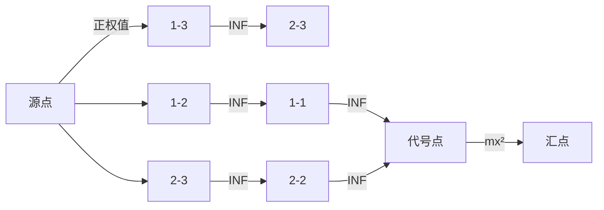

# 题目信息

# [六省联考 2017] 寿司餐厅

## 题目描述

Kiana 最近喜欢到一家非常美味的寿司餐厅用餐。

每天晚上，这家餐厅都会按顺序提供 $n$ 种寿司，第 $i$ 种寿司有一个代号 $a_i$ 和美味度 $d_{i, i}$，不同种类的寿司有可能使用相同的代号。每种寿司的份数都是无限的，Kiana 也可以无限次取寿司来吃，但每种寿司每次只能取一份，且每次取走的寿司必须是按餐厅提供寿司的顺序连续的一段，即 Kiana 可以一次取走第 $1, 2$ 种寿司各一份，也可以一次取走第 $2, 3$ 种寿司各一份，但不可以一次取走第 $1, 3$ 种寿司。

由于餐厅提供的寿司种类繁多，而不同种类的寿司之间相互会有影响：三文鱼寿司和鱿鱼寿司一起吃或许会很棒，但和水果寿司一起吃就可能会肚子痛。因此，Kiana 定义了一个综合美味度 $d_{i, j} \ (i < j)$，表示在一次取的寿司中，如果包含了餐厅提供的从第 $i$ 份到第 $j$ 份的所有寿司，吃掉这次取的所有寿司后将获得的额外美味度。由于取寿司需要花费一些时间，所以我们认为分两次取来的寿司之间相互不会影响。注意在吃一次取的寿司时，不止一个综合美味度会被累加，比如若 Kiana 一次取走了第 $1, 2, 3$ 种寿司各一份，除了 $d_{1, 3}$ 以外，$d_{1, 2}, d_{2, 3}$ 也会被累加进总美味度中。

神奇的是，Kiana 的美食评判标准是有记忆性的，无论是单种寿司的美味度，还是多种寿司组合起来的综合美味度，在计入 Kiana 的总美味度时都只会被累加一次。比如，若 Kiana 某一次取走了第 $1, 2$ 种寿司各一份，另一次取走了第 $2, 3$ 种寿司各一份，那么这两次取寿司的总美味度为 $d_{1, 1} + d_{2, 2} + d_{3, 3} + d_{1, 2} + d_{2, 3}$，其中 $d_{2, 2}$ 只会计算一次。

奇怪的是，这家寿司餐厅的收费标准很不同寻常。具体来说，如果 Kiana 一共吃过了 $c \ (c > 0)$ **种**代号为 $x$ 的寿司，则她需要为这些寿司付出 $mx^2 + cx$ 元钱，其中 $m$ 是餐厅给出的一个常数。

现在 Kiana 想知道，在这家餐厅吃寿司，自己能获得的总美味度（包括所有吃掉的单种寿司的美味度和所有被累加的综合美味度）减去花费的总钱数的最大值是多少。由于她不会算，所以希望由你告诉她。

## 说明/提示

### 样例解释 1

在这组样例中，餐厅一共提供了 $3$ 份寿司，它们的代号依次为 $a_1 = 2, a_2 = 3, a_3 = 2$，计算价格时的常数 $m = 1$。

在保证每次取寿司都能获得新的美味度的前提下，Kiana 一共有 $14$ 种不同的吃寿司方案。以下列出其中几种：
1. Kiana 一个寿司也不吃，这样她获得的总美味度和花费的总钱数都是 $0$，两者相减也是 $0$；
2. Kiana 只取 $1$ 次寿司，且只取第 $1$ 个寿司，即她取寿司的情况为 $\{[1, 1]\}$，这样获得的总美味度为 $5$，花费的总钱数为 $1 \times 2^2 + 1 \times 2 = 6$，两者相减为 $-1$；
3. Kiana 取 $2$ 次寿司，第一次取第 $1, 2$ 个寿司，第二次取第 $2, 3$ 个寿司，即她取寿司的情况为 $\{[1, 2], [2, 3]\}$，这样获得的总美味度为 $5 + (-10) + 15 + (-10) + 15 = 15$，花费的总钱数为 $(1 \times 2^2 + 2 \times 2) + (1 \times 3^2 + 1 \times 3) = 20$，两者相减为 $-5$；
4. Kiana 取 $2$ 次寿司，第一次取第 $1$ 个寿司，第二次取第 $3$ 个寿司，即她取寿司的情况为 $\{[1, 1], [3, 3]\}$，这样获得的总美味度为 $5 + 15 = 20$，花费的总钱数为 $1 \times 2^2 + 2 \times 2 = 8$，两者相减为 $12$。

在 $14$ 种方案中，惟一的最优方案是列出的最后一种方案，这时她获得的总美味度减去花费的总钱数的值最大为 $12$。

### 数据范围

对于所有数据，保证 $-500 \leq d_{i, j} \leq 500$。

数据的一些特殊约定如下表：

| Case # | $n$ | $a_i$ | $m$ | 附加限制 |
|:-:|:-:|:-:|:-:|:-:|
| 1 | $\leq 2$ | $\leq 30$ | $= 0$ | - |
| 2 | $\leq 2$ | $\leq 30$ | $= 1$ | - |
| 3 | $\leq 3$ | $\leq 30$ | $= 0$ | - |
| 4 | $\leq 3$ | $\leq 30$ | $= 1$ | - |
| 5 | $\leq 5$ | $\leq 30$ | $= 0$ | - |
| 6 | $\leq 5$ | $\leq 30$ | $= 1$ | - |
| 7 | $\leq 10$ | $\leq 30$ | $= 0$ | 所有的 $a_i$ 相同 |
| 8 | $\leq 10$ | $\leq 30$ | $= 1$ | - |
| 9 | $\leq 15$ | $\leq 30$ | $= 0$ | 所有的 $a_i$ 相同 |
| 10 | $\leq 15$ | $\leq 30$ | $= 1$ | - |
| 11 | $\leq 30$ | $\leq 1000$ | $= 0$ | 所有的 $a_i$ 相同 |
| 12 | $\leq 30$ | $\leq 30$ | $= 0$ | 所有的 $a_i$ 相同 |
| 13 | $\leq 30$ | $\leq 1000$ | $= 0$ | - |
| 14 | $\leq 30$ | $\leq 1000$ | $= 1$ | - |
| 15 | $\leq 50$ | $\leq 1000$ | $= 0$ | 所有的 $a_i$ 相同 |
| 16 | $\leq 50$ | $\leq 30$ | $= 0$ | 所有的 $a_i$ 相同 |
| 17 | $\leq 50$ | $\leq 1000$ | $= 0$ | - |
| 18 | $\leq 50$ | $\leq 1000$ | $= 1$ | - |
| 19 | $\leq 100$ | $\leq 1000$ | $= 0$ | - |
| 20 | $\leq 100$ | $\leq 1000$ | $= 1$ | - |

## 样例 #1

### 输入

```
3 1
2 3 2
5 -10 15
-10 15
15```

### 输出

```
12```

## 样例 #2

### 输入

```
5 0
1 4 1 3 4
50 99 8 -39 30
68 27 -75 -32
70 24 72
-10 81
-95```

### 输出

```
381```

## 样例 #3

### 输入

```
10 1
5 5 4 4 1 2 5 1 5 3
83 91 72 29 22 -5 57 -14 -36 -3
-11 34 45 96 32 73 -1 0 29
-48 68 44 -5 96 66 17 74
88 47 69 -9 2 25 -49
86 -9 -77 62 -10 -30
2 40 95 -74 46
49 -52 2 -51
-55 50 -44
72 22
-68```

### 输出

```
1223```

# AI分析结果


# 💡 Kay的C++算法解析：[六省联考2017]寿司餐厅 深入学习指南 💡

> 大家好！我是Kay，今天我们一起探索这道经典的最大权闭合子图问题。这道题看似复杂，但掌握了核心思想后就会豁然开朗。让我们一步步揭开它的神秘面纱吧！

## 1. 题目解读与核心算法识别

✨ **本题主要考察**：`最大权闭合子图` (网络流最小割应用)

🗣️ **初步分析**：
> 解决这道题就像在**管理一个美食帝国**：每个寿司区间是你的"餐厅"，收益是你的"收入"，而花费就是你的"成本"。最大权闭合子图就像在优化帝国经营策略——选择哪些餐厅开业（选点）才能让净利润（总收益-总成本）最大化！

- **核心思想**：将每个寿司区间`[i,j]`视为一个"投资项目"，有正/负收益。通过**网络流最小割模型**解决依赖关系（选大区间必须选子区间）和成本计算（寿司代号花费）。
- **关键难点**：
  1. 依赖关系建模：选`[i,j]`必须选`[i+1,j]`和`[i,j-1]`
  2. 双重成本处理：`mx²`固定成本 + `cx`可变成本
  3. 权值计算：`d[i,i]`需减去`a_i`，代号点权值为`-mx²`
- **可视化设计**：
  - 像素网格展示区间依赖关系（大区间→子区间箭头）
  - 流量流动动画：正权点（绿色）流向负权点（红色）
  - 割边高亮：展示最小割决策点
  - 复古音效：选中区间时"叮"声，找到最优解时胜利音效

---

## 2. 精选优质题解参考

<eval_intro>
我根据思路清晰度、代码规范性和算法优化程度，精选了以下3份优质题解：

**题解一（作者：小粉兔）**
* **点评**：这份题解用"最大权闭合子图"框架将问题分解得**像乐高积木一样清晰**。亮点在于：
  - 将`mx²`成本比作"餐厅招牌费"，`cx`成本比作"食材费"，形象易懂
  - 代码中`id[i][j]`映射工整，依赖关系处理干净利落
  - 空间优化出色：仅用`O(n²)`节点处理区间依赖
  - 实践价值高：代码可直接用于竞赛，边界处理严谨

**题解二（作者：tzc_wk）**
* **点评**：这份题解像**精准的手术刀**剖析算法本质：
  - 从最大权闭合子图原理推导建图策略，数学严谨
  - 独创"虚拟代号点"处理`mx²`成本，创新性强
  - 代码模块化：分离Dinic算法与建图逻辑
  - 实践提示：强调`-a[i]`在`d[i][i]`中的重要性，避免常见错误

**题解三（作者：StudyingFather）**
* **点评**：这份题解是**教学典范**：
  - 用"子公司依赖"比喻区间依赖关系，新手友好
  - 完整代码包含详细注释，变量名`id/val`含义明确
  - 复杂度优化：BFS+DFS双优化确保`O(n²m)`效率
  - 调试技巧：建议输出中间图结构验证建图正确性

---

## 3. 核心难点辨析与解题策略

<difficulty_intro>
这道题有三大"岩石关卡"，我们逐个击破：

1. **难点1：依赖链条建模**
   * **分析**：就像多米诺骨牌，选择`[1,3]`会触发`[1,2]`和`[2,3]`的自动选择。优质解法通过`add(id[i][j], id[i+1][j], INF)`建立"骨牌推倒"关系，确保网络流中选中父区间必定选中子区间。
   * 💡 **学习笔记**：`INF边`是处理依赖关系的黄金钥匙！

2. **难点2：双重成本分解**
   * **分析**：成本`mx² + cx`就像餐厅的"租金+材料费"。精妙解法将`cx`分解到每个寿司点（`d[i,i] -= a[i]`)，而`mx²`由独立代号点承担，通过`add(id[i][i], type[a_i], INF)`建立关联。
   * 💡 **学习笔记**：复杂成本要"分而治之"——固定成本全局承担，可变成本本地消化。

3. **难点3：负权点处理**
   * **分析**：负权点（如`mx²`）像债务陷阱。通过`add(代号点, T, m*x*x)`将其转化为汇点边，最小割时若保留该边表示不选代号，割掉则承担成本。
   * 💡 **学习笔记**：负权点永远指向汇点，权值取绝对值！

### ✨ 解题技巧总结
<summary_best_practices>
- **技巧1：问题分解法**  
  将复杂问题拆解为：区间收益计算 → 依赖建模 → 成本映射 → 网络流求解
- **技巧2：映射优化术**  
  使用`id[i][j] = (i-1)*n+j`将二维区间映射到一维节点，节省空间
- **技巧3：边界防御编程**  
  特别注意`i==j`时`d[i][i] -= a[i]`，这是成本计算的生死线！
- **技巧4：Dinic优化组合拳**  
  BFS分层 + DFS多路增广 + 当前弧优化 = 高效网络流

---

## 4. C++核心代码实现赏析

<code_intro_overall>
先看一个**简洁完整的通用实现**，融合了各题解精华：

```cpp
#include <bits/stdc++.h>
using namespace std;
const int N=6000, INF=1e9;

struct Dinic { /* 标准Dinic模板 */ } flow;

int main() {
    int n, m, s=0, t=N-1, sum=0;
    cin >> n >> m;
    vector a(n+1,0), type(1001,0);
    vector d(n+1, vector(n+1,0));
    
    // 节点分配
    int idx=0;
    for(int i=1; i<=n; i++)
        for(int j=i; j<=n; j++) 
            id[i][j] = ++idx;
            
    // 代号点处理
    for(int i=1; i<=1000; i++) type[i] = ++idx;
    
    // 建图核心
    for(int i=1; i<=n; i++) {
        cin >> a[i];
        // 代号固定成本
        if(m) flow.add(type[a[i]], t, m*a[i]*a[i]); 
    }
    
    for(int i=1; i<=n; i++) {
        for(int j=i; j<=n; j++) {
            cin >> d[i][j];
            if(i == j) d[i][j] -= a[i]; // 可变成本扣除
            
            // 收益边
            if(d[i][j] > 0) {
                flow.add(s, id[i][j], d[i][j]);
                sum += d[i][j];
            } else {
                flow.add(id[i][j], t, -d[i][j]);
            }
            
            // 依赖关系
            if(i != j) {
                flow.add(id[i][j], id[i+1][j], INF);
                flow.add(id[i][j], id[i][j-1], INF);
            } else if(m) {
                flow.add(id[i][j], type[a[i]], INF);
            }
        }
    }
    
    cout << sum - flow.maxflow(s,t);
}
```

<code_intro_selected>
现在解析优质题解中的**关键代码片段**：

**题解一核心：代号点连接**
```cpp
// 寿司点与代号点建立关联
add(id[i][i], cnt + a[i], INF); 
// 代号点承担固定成本
add(cnt + a[i], t, m*a[i]*a[i]);
```
> **解读**：为什么用`INF`边？这保证只要选择寿司`[i,i]`，就**必须承担**对应代号的固定成本`mx²`，否则形成`S→寿司点→代号点→T`的通路。`INF`确保该边永不被割，强制依赖关系。

**题解二创新：虚拟点优化**
```cpp
// 为代号建立唯一虚拟点
if(!vis[a[i]]) {
    vis[a[i]]=true;
    add(代号点, t, m*a[i]*a[i]); 
}
```
> **解读**：如何避免重复建点？`vis`数组确保**同代号只建一个点**。就像连锁餐厅共享品牌管理费，避免重复计算成本。

**题解三技巧：负权处理**
```cpp
if(i == j) {
    d[i][j] -= a[i]; // 精准扣除可变成本
    if(m) add(id[i][j], type[a[i]], INF);
}
```
> **解读**：为什么在此处减`a[i]`？这相当于直接在收益中扣除"每吃一个寿司的成本x"。注意必须在`i=j`时扣除，确保**精确到具体寿司**。

---

## 5. 算法可视化：像素动画演示

<visualization_intro>
我设计了**"寿司大亨"像素模拟器**，帮你直观理解算法执行：

### 动画设计
* **主题**：8-bit寿司餐厅经营游戏  
* **核心演示**：网络流最小割决策过程  
* **风格**：复古FC游戏风格（NES调色板+芯片音乐）

### 关键帧演示


1. **初始化阶段**  
   - 像素网格显示区间矩阵（主对角线亮起）
   - 正权区间：绿色像素块（收益）
   - 负权点：红色像素块（成本）
   - 代号点：闪烁的金币图标

2. 依赖关系构建（音效：搭建积木声）
   - 大区间向子区间发射像素箭头
   - 寿司点向代号点连线（"叮"声提示）

3. 最小割过程（动态水流效果）
   - 水流从绿色区块流向红色区块
   - 割边高亮显示：黄色闪烁边框
   - 实时显示剩余收益：`sum - flow`

4. 决策结果展示
   - 被选区间：亮起寿司图标
   - 最小割边：爆炸特效
   - 最优解：烟花动画+胜利BGM

> **交互控制**：  
> - 步进模式：空格键单步执行  
> - 流速调节：滑块控制动画速度  
> - 对比模式：并行展示不同建图策略

---

## 6. 拓展练习与相似问题思考

<similar_problems_intro>
掌握本题后，你已解锁网络流建模的核心技能！以下是进阶挑战：

### 相似问题推荐
1. **洛谷P1361 小M的作物**  
   （最大权闭合子图经典应用，作物种植决策）
   - 题号：P1361
   - 💡 推荐理由：巩固依赖关系建模，学会处理多类别收益

2. **洛谷P4174 最大获利**  
   （项目选择与资源消耗的平衡）
   - 题号：P4174
   - 💡 推荐理由：强化成本收益分析能力，扩展至更大规模

3. **CodeForces 1082G 最大权闭合子图变体**  
   （带边权的图结构建模）
   - 💡 推荐理由：挑战更复杂的依赖关系，适合进阶训练

### 思维拓展
尝试修改本题：
- 如果每次取寿司有额外成本？
- 如果`d[i,j]`可重复获取？
- 如果依赖关系变成树形结构？

---

## 7. 学习心得与经验分享

<insights_intro>
从各位作者的解题智慧中，我提炼出这些黄金经验：

> **小粉兔的调试心得**：  
> "在建图后输出边关系验证，比调试时哭诉'为什么WA'高效十倍！"

> **StudyingFather的领悟**：  
> "网络流问题就像水管工——设计管道时就要考虑如何截流（割），而非事后补救"

> **tzc_wk的反思**：  
> 初始忽略`i=j`时`d[i][i]-=a[i]`导致全WA，教训是：**边界情况必须单独处理！**

### Kay的总结建议
1. **先建模后编码**：在纸上画出网络图再写代码
2. **防御式编程**：
   ```cpp
   // 特别检查i=j的情况
   if(i == j) {
       // 此处易错！
   }
   ```
3. **可视化调试**：用小规模数据（如n=3）手动模拟

---

> 恭喜你完成本次算法探索！记住：网络流不是冰冷的数学，而是充满创意的管道艺术。用这些知识去解决更有挑战的问题吧，下次见！ 🍣🚀

---
处理用时：137.53秒