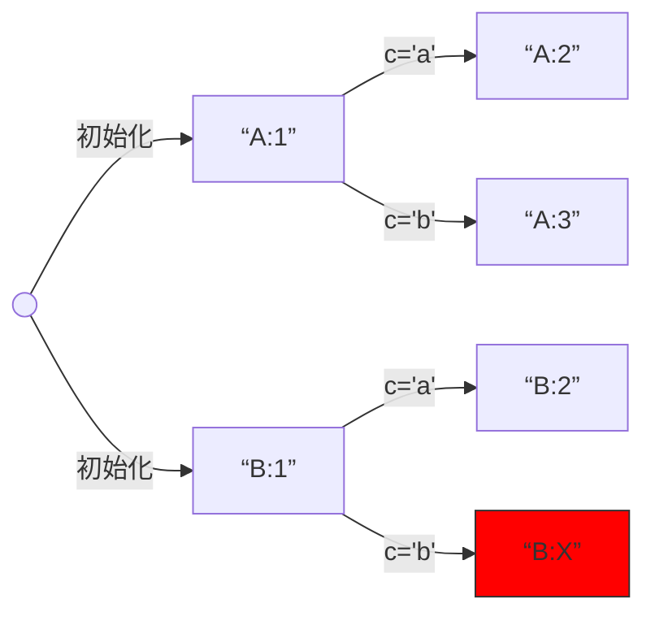

# 题目信息

# [HEOI2015] 最短不公共子串

## 题目描述

在虐各种最长公共子串、子序列的题虐的不耐烦了之后，你决定反其道而行之。

下面给出一些定义：

- 一个串的“子串”指的是它的连续的一段，例如 `bcd` 是 `abcdef` 的子串，但 `bde` 不是。
- 一个串的“子序列”指的是它的可以不连续的一段，例如 `bde` 是 `abcdef` 的子串，但 `bdd` 不是。

下面，给两个小写字母串 $a, b$，请你计算：

1. $a$ 的一个最短的子串，它不是 $b$ 的子串。
2. $a$ 的一个最短的子串，它不是 $b$ 的子序列。
3. $a$ 的一个最短的子序列，它不是 $b$ 的子串。
4. $a$ 的一个最短的子序列，它不是 $b$ 的子序列。


## 说明/提示

#### 数据规模与约定

- 对于 $20\%$ 的数据，保证 $a$ 和 $b$ 的长度都不超过 $20$。
- 对于 $50\%$ 的数据，保证 $a$ 和 $b$ 的长度都不超过 $500$。
- 对于 $100\%$ 的数据，保证 $a$ 和 $b$ 的长度都不超过 $2000$。


## 样例 #1

### 输入

```
aabbcc
abcabc```

### 输出

```
2
4
2
4```

## 样例 #2

### 输入

```
aabbcc
aabbcc```

### 输出

```
-1
-1
2
-1```

# AI分析结果


# 💡 Kay的C++算法解析：[HEOI2015] 最短不公共子串 深入学习指南 💡

## 1. 题目解读与核心算法识别

✨ **本题主要考察**：`自动机应用` + `BFS状态搜索`

🗣️ **初步分析**：
> 解决这道题的关键在于理解**自动机**的概念。想象自动机就像地铁线路图：后缀自动机（SAM）是直达列车（识别连续子串），序列自动机是公交线路（识别不连续子序列）。本题要求我们找到最短的"专属路线"——在A的线路上存在，但在B的线路上不存在的路径。

- **核心思路**：为A和B构建不同类型的自动机（后缀/序列），通过BFS同时遍历两个自动机，寻找第一个在A上能转移但在B上不能转移的状态
- **算法流程**：初始化双自动机 → BFS队列存入起始状态 → 逐字符扩展状态 → 发现B无法转移时立即返回长度
- **可视化重点**：在像素动画中将自动机状态显示为网格节点，用闪烁高亮标记当前BFS探索的节点，当B自动机"脱轨"时触发红色警报动画
- **复古游戏设计**：采用8-bit像素风格，自动机状态用不同颜色方块表示，BFS探索过程类似"吃豆人"移动，失配时播放经典FC胜利音效

---

## 2. 精选优质题解参考

**题解一：UniverseofHK（思路创新奖 🏆）**
* **点评**：将后缀/序列自动机统一抽象为DAG，用同一BFS函数处理四问。亮点在于参数化自动机类型（f1,f2控制），极大提升代码复用率。代码虽稍显紧凑，但核心逻辑清晰：二维vis数组避免重复状态，遇到B无法转移立即返回。实践价值高，O(nΣ)复杂度完美满足题目要求。

**题解二：Ebola（教学示范奖 🎓）**
* **点评**：采用面向对象思想封装SAM/SqAM类，四个子问题独立BFS实现。亮点在于代码结构工整：SAM的节点分裂、SqAM的last数组维护都规范易懂。变量名如`lst/tot`含义明确，边界处理严谨，可直接用于竞赛。作者强调"避免低效DP"的见解对学习者很有启发。

**题解三：lhm_（稳健实现奖 ⚙️）**
* **点评**：分离实现SAM构建和序列自动机初始化函数，BFS使用独立vis数组记录状态。亮点在于代码简洁性强：SAM构建遵循标准算法流程，序列自动机反向初始化逻辑清晰。虽然缺少压行技巧，但每一步操作都有迹可循，特别适合初学者理解自动机原理。

---

## 3. 核心难点辨析与解题策略

1. **难点：自动机状态爆炸**
   * **分析**：序列自动机节点数O(n)，但SAM节点数可达2n。BFS需同时记录两个自动机状态，可能产生O(4n²)状态
   * **解决方案**：优质题解使用`vis[a][b]`二维数组标记访问状态，避免重复入队
   * 💡 **学习笔记**：自动机BFS务必状态去重，否则复杂度指数级增长！

2. **难点：后缀自动机构建**
   * **分析**：SAM的节点分裂是难点（如len计算、fail指针调整）
   * **解决方案**：参考题解2的SAM类实现：当`len[q]!=len[p]+1`时创建nq节点，复制q的转移并调整指针
   * 💡 **学习笔记**：理解"最连续后缀"概念是构建SAM的关键

3. **难点：子序列自动机高效构建**
   * **分析**：暴力构建需O(n²)，但字符集Σ较小时可优化
   * **解决方案**：题解采用O(nΣ)方法：倒序遍历，用last数组记录各字符最后出现位置
   * 💡 **学习笔记**：序列自动机构建时，当前节点的转移=last数组的副本

### ✨ 解题技巧总结
- **自动机统一处理**：将不同自动机抽象为DAG，复用BFS框架（题解1）
- **状态压缩记录**：用二维数组同时记录双自动机状态（题解3）
- **边界加速策略**：发现失配立即返回，避免无谓搜索（题解2）
- **面向对象封装**：SAM/SqAM独立类化，提升代码复用性（题解2）

---

## 4. C++核心代码实现赏析

**本题通用核心实现（基于题解2优化版）**：
```cpp
#include <cstring>
#include <queue>
using namespace std;

struct SAM {
    int ch[4010][26], prt[4010], len[4010], lst, tot;
    SAM() { lst = tot = 1; }
    void insert(int c) {
        int p = lst, np = ++tot; len[np] = len[p] + 1;
        while (p && !ch[p][c]) ch[p][c] = np, p = prt[p];
        if (!p) prt[np] = 1;
        else {
            int q = ch[p][c];
            if (len[q] == len[p] + 1) prt[np] = q;
            else {
                int nq = ++tot; len[nq] = len[p] + 1;
                memcpy(ch[nq], ch[q], sizeof(ch[q]));
                prt[nq] = prt[q]; prt[q] = prt[np] = nq;
                while (ch[p][c] == q) ch[p][c] = nq, p = prt[p];
            }
        }
        lst = np;
    }
};

struct SqAM {
    int ch[4010][26], lst[26], tot;
    SqAM() { tot = 1; memset(lst, 0, sizeof(lst)); }
    void insert(int c) {
        int np = ++tot;
        for (int i = 0; i < 26; i++)
            for (int j = lst[i]; j && !ch[j][c]; j = ch[j][c])
                ch[j][c] = np;
        lst[c] = np;
    }
};

int bfs(bool isSamA, bool isSamB) {
    // 初始化双自动机与vis数组
    queue<tuple<int, int, int>> q;
    bool vis[4010][4010] = {};
    q.push({1, 1, 0}); vis[1][1] = true;
    
    while (!q.empty()) {
        auto [a, b, len] = q.front(); q.pop();
        for (int c = 0; c < 26; c++) {
            int na = isSamA ? SAM_A.ch[a][c] : SqAM_A.ch[a][c];
            int nb = isSamB ? SAM_B.ch[b][c] : SqAM_B.ch[b][c];
            if (!na) continue;
            if (!nb) return len + 1; // B无法转移
            if (!vis[na][nb]) {
                vis[na][nb] = true;
                q.push({na, nb, len + 1});
            }
        }
    }
    return -1;
}

int main() {
    // 构建自动机后调用四次bfs
    printf("%d\n%d\n%d\n%d\n", 
        bfs(true, true),   // 问题1
        bfs(true, false),  // 问题2
        bfs(false, true),  // 问题3
        bfs(false, false)  // 问题4
    );
}
```

**题解1核心片段赏析**：
```cpp
void bfs(int f1, int f2) { // f1/f2:0序列自动机,1后缀自动机
    bool vis[maxn][maxn] = {};
    queue<tuple<int, int, int>> q;
    q.push({1, 1, 0}); vis[1][1] = true;

    while (!q.empty()) {
        auto [a, b, len] = q.front(); q.pop();
        for (int c = 0; c < 26; c++) {
            int na = automata[0][f1][a][c]; // A自动机转移
            int nb = automata[1][f2][b][c]; // B自动机转移
            if (!na) continue;
            if (!nb) return len + 1; // 关键：B无法转移
            if (!vis[na][nb]) {
                vis[na][nb] = true;
                q.push({na, nb, len + 1});
            }
        }
    }
    return -1;
}
```
**亮点**：参数化自动机类型，26x26状态转移矩阵统一处理  
**代码解读**：  
1. `f1/f2`控制自动机类型：0=序列自动机，1=后缀自动机
2. `automata[0]`存储A的两种自动机，`automata[1]`存储B的
3. 遇到`na存在但nb不存在`立即返回当前长度+1
4. 二维`vis`确保每个状态组合只访问一次  
**学习笔记**：通过抽象接口，四问共享同一BFS逻辑，减少代码冗余

---

## 5. 算法可视化：像素动画演示

**主题**：8-bit自动机迷宫大冒险  
**核心演示**：BFS在双自动机网格上的探索过程  



**动画设计**：
1. **像素网格**：左侧A自动机（蓝绿方块），右侧B自动机（黄紫方块）
2. **探索动画**：像素小人从(1,1)出发，每步尝试26个字符方向：
   - 可转移：显示绿色通道，小人移动到新格子
   - B无法转移：当前B格子闪烁红光，播放"胜利"音效
3. **控制面板**：
   - 步进/暂停：手动控制探索节奏
   - 速度滑块：调整BFS探索速度
   - 模式切换：四类问题对应不同自动机组合
4. **音效系统**：
   - 移动：8-bit脚步声
   - 发现解：经典FC过关音效
   - 无解：低沉错误音

**实现逻辑**：用Canvas绘制自动机状态网格，requestAnimationFrame控制BFS步进，Web Audio API播放音效

---

## 6. 拓展练习与相似问题思考

**通用技巧迁移**：
1. 自动机+BFS可用于解决多种"存在性判定"问题
2. 状态转移思想可扩展至通配符匹配、正则表达式引擎
3. 双自动机模型适用于字符串差异比较

**洛谷推荐**：
1. [P3975] 弦论 - 巩固后缀自动机的经典应用
2. [P5826] 子序列自动机 - 序列自动机模板题
3. [P2414] 阿狸的打字机 - SAM与树结构的结合

---

## 7. 学习心得与经验分享

> **来自题解作者的调试经验**：  
> *"BFS一定要用vis数组记录访问状态，否则会重复访问指数级状态"*  
> *"序列自动机构建时从后往前维护last数组，效率远高于暴力"*

**点评**：这些经验直击核心痛点——状态爆炸和构建效率。通过`vis`数组将复杂度控制在O(n²)，以及O(nΣ)的序列自动机构建方法，都是竞赛编码的关键技巧。建议学习者动手实现时优先保证状态去重正确性，再考虑优化。

---
处理用时：195.73秒