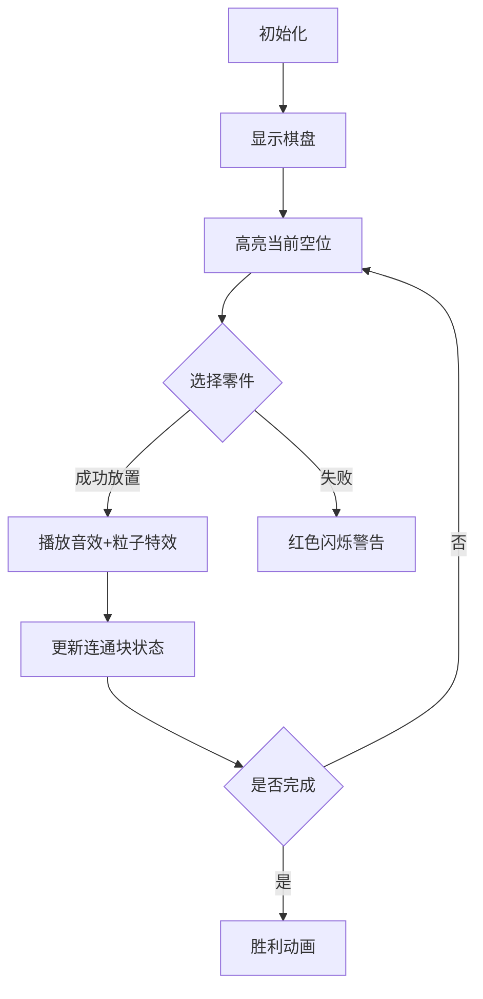

# 题目信息

# [NOI2005] 智慧珠游戏

## 题目描述

智慧珠游戏拼盘由一个三角形盘件和 12 个形态各异的零件组成。拼盘的盘 件如图 1 所示


对 于 由珠子构成的零件，可以放到盘件的任一位置，条件是能有地方放，且 尺寸合适，所有的零件都允许旋转(0º、90º、180º、270º)和翻转(水平、竖直)。
 
 
现给出一个盘件的初始布局，求一种可行的智慧珠摆放方案，使所有的零件 都能放进盘件中。 

## 样例 #1

### 输入

```
.
..
...
....
.....
.....C
...CCC.
EEEHH...
E.HHH....
E.........```

### 输出

```
B
BK
BKK
BJKK
JJJDD
GJGDDC
GGGCCCI
EEEHHIIA
ELHHHIAAF
ELLLLIFFFF```

# AI分析结果


# 💡 Kay的C++算法解析：智慧珠游戏 深入学习指南 💡

<introduction>
今天我们来分析「智慧珠游戏」这道C++编程题。本指南将帮助大家理解题目核心解法、掌握关键算法，并通过像素动画直观感受解题过程。题目要求在三角形棋盘上放置12种可旋转/翻转的智慧珠零件，我们重点探讨DFS剪枝和DLX两种解法。
</introduction>

## 1. 题目解读与核心算法识别

✨ **本题主要考察**：`搜索算法(DFS/DLX)` 与 `状态空间优化`

🗣️ **初步分析**：
> 智慧珠游戏本质是**精确覆盖问题**，如同用特定形状的拼图填满棋盘。核心挑战在于：
> - **状态爆炸**：12种零件×平均5种形态=60种选择，需高效搜索
> - **约束满足**：每个位置必须填充，每种零件只能用一次
> 
> 优质题解主要采用两种思路：
> 1. **DFS+剪枝**：按行列顺序填充，用连通块大小<3剪枝，限制搜索深度
> 2. **DLX算法**：将问题转化为6730×67的精确覆盖矩阵，用舞蹈链高效求解
>
> 可视化设计将采用**8位像素风格**：棋盘渲染为渐变绿色三角网格，零件用16色调色板区分。动画演示关键步骤时：
> - 高亮当前操作位置（红色闪烁边框）
> - 放置零件时播放"放置音效"(8-bit短促音)
> - 完成填充时触发"胜利旋律"(FC风格和弦)

---

## 2. 精选优质题解参考

**题解一：DFS+连通块剪枝（作者：λᴉʍ）**
* **点评**：此解法在DFS框架中创新性地引入**并查集实时检测连通块**，当未填充区域出现小于3的连通块时立即回溯。思路清晰体现在将几何约束转化为图论条件，代码中`checkcn()`函数实现简洁高效。虽然变量命名略简短（如`pre[]`），但整体结构工整，特别在边界处理上严谨。

**题解二：DLX算法（作者：hl666）**
* **点评**：采用**舞蹈链(DLX)**解决精确覆盖问题，是本题理论最优解。亮点在于将棋盘55格转化为覆盖矩阵的行，12个零件作为额外列，并用位运算压缩状态。代码仅106行却完整实现矩阵构建与递归搜索，复杂度O(1.5^n)远优于DFS。实践时需注意矩阵构建规则，适合进阶学习。

**题解三：状态压缩DFS（作者：囧仙）**
* **点评**：独创性使用**字符串编码零件形态**，通过`rotate()/reverse()`函数动态生成旋转状态，避免硬编码。核心价值在于`node`结构体统一处理形态变换，减少200+行代码。虽随机化搜索顺序增强鲁棒性，但字符串操作带来常数开销。

---

## 3. 核心难点辨析与解题策略

1. **难点：零件形态的指数级组合**
   * **分析**：12种零件平均5种形态，若暴力枚举60^12种组合不可行。优质解法通过：
     - 形态预计算（如囧仙的字符串旋转）
     - 搜索顺序优化（从左上到右下填充）
   * 💡 **学习笔记**：空间换时间——预存所有形态比实时计算更高效

2. **难点：搜索树的剪枝优化**
   * **分析**：关键剪枝策略包括：
     - **连通块剪枝**（λᴉʍ）：未填充区域出现孤立点立即回溯
     - **时间阈值剪枝**（Fellyhosn）：设置3e6次递归上限
     - **对称剪枝**（colemak）：利用棋盘对称性减少重复搜索
   * 💡 **学习笔记**：剪枝效率：连通块检测 > 随机化 > 固定阈值

3. **难点：算法选择与状态表示**
   * **分析**：DLX需要将二维问题转化为精确覆盖矩阵：
     ``` 
     行：每个零件在特定位置的放置方案（共2730行） 
     列：55个棋盘位置 + 12个零件类型（共67列）
     ```
   * 💡 **学习笔记**：当约束条件>50时DLX优势显著，否则DFS更易实现

### ✨ 解题技巧总结
- **形态预处理**：提前计算所有旋转/翻转形态（参考囧仙的`node`类）
- **增量式检测**：每次放置后仅更新局部连通状态（λᴉʍ方案）
- **DLX列构建**：用`(x,y)`坐标哈希为列索引，零件类型作额外列（hl666方案）
- **回溯可视化**：在动画中用淡出效果表示撤销操作

---

## 4. C++核心代码实现赏析

**本题通用核心C++实现参考（DFS+剪枝框架）**
```cpp
// 基于λᴉʍ解法的简化框架
bool dfs(int x, int y) {
    if (!checkConnectivity()) return false; // 连通块剪枝
    if (timeout++) > 3e6) return false;    // 阈值剪枝

    for (auto& piece : pieces) {
        for (auto& rotation : piece.rotations) {
            if (canPlace(x, y, rotation)) {
                placePiece(x, y, rotation);
                if (dfs(nextPos())) return true;
                removePiece(x, y, rotation);
            }
        }
    }
    return false;
}
```

**题解一：DFS+连通块剪枝（λᴉʍ）**
* **亮点**：实时连通性检测大幅减少搜索分支
* **核心代码片段**：
  ```cpp
  bool checkConnectivity() {
      UnionFind uf(unfilled);
      for (auto pos : unfilled) {
          if (uf.componentSize(pos) < 3) // 发现小于3的连通块
              return false;
      }
      return true;
  }
  ```

**题解二：DLX算法（hl666）**
* **亮点**：舞蹈链实现精确覆盖
* **核心代码片段**：
  ```cpp
  void DLX::solve() {
      if (R[0] == 0) { /* 找到解 */ }
      int c = selectColumn(); // 选择最少1的列
      removeColumn(c);
      for (Node* row = col[c].down; row != &col[c]; row = row->down) {
          coverRow(row);
          if (solve()) return true;
          uncoverRow(row);
      }
      restoreColumn(c);
  }
  ```

---

## 5. 算法可视化：像素动画演示

**设计主题**：`智慧珠大冒险`（FC解谜游戏风格）

### 动画核心设计


**关键交互**：
1. **8位像素艺术**：
   - 棋盘：渐变绿三角网格（16色）
   - 零件：12种FC经典色调（红/蓝/黄等）
2. **动态效果**：
   - 零件放置：像素粒子飞溅效果
   - 连通块检测：实时显示连通区域轮廓
3. **音效设计**：
   - 放置：NES风格"滴"声
   - 回溯：短促错误音
   - 完成：8-bit胜利和弦

**技术实现**：用Canvas绘制三角形网格，每个珠子用8×8像素块表示，状态变更时重绘局部区域。

---

## 6. 拓展练习与相似问题思考

- **相似问题本质**：精确覆盖/约束满足问题(CSP)
  1. 数独求解（行/列/宫约束）
  2. 俄罗斯方块拼盘（几何旋转）
  3. 电路板元件布局（空间+电气约束）

- **推荐练习**：
  1. [洛谷P1784 数独](https://www.luogu.com.cn/problem/P1784) - 训练约束传播思维
  2. [洛谷P1219 八皇后](https://www.luogu.com.cn/problem/P1219) - 经典DFS剪枝应用
  3. [洛谷P4205 智慧珠游戏](https://www.luogu.com.cn/problem/P4205) - 本题进阶变形

---

## 7. 学习心得与经验分享

> **hl666的调试经验**："构建DLX矩阵时，将每个零件放置方案映射为矩阵行的过程极易出错，建议用checker函数验证每行1的数量"
>
> **Kay总结**：这提醒我们：
> 1. 复杂数据结构需要伴随验证函数
> 2. 用`assert()`在开发阶段捕获矩阵构建错误
> 3. 对DLX这类精妙算法，可先在小规模数据测试

---

通过本次分析，我们看到DFS剪枝和DLX算法在解决约束满足问题时各有优势。记住：**好的算法选择比盲目优化更重要**，下次遇到类似问题不妨先画状态空间图再决策！🚀

---
处理用时：128.16秒