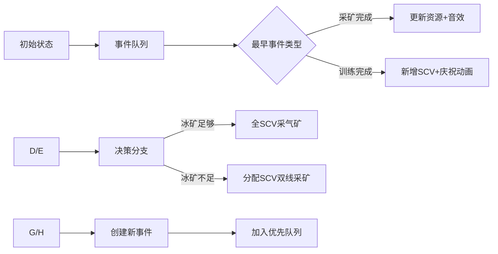

# 题目信息

# [CTSC2000] 采矿

## 题目背景

一架人类的航天飞机将人类基地建在了一个荒芜的星球上。面对紧缺的能源，他们只能在最短的时间内用 $\text{SCV}$ （一种智能机器人）采集必须的矿藏。对于这个艰巨的任务，他们希望得到编程高手们的帮助。

## 题目描述

在这个星球上，有着两种不同的矿。一种被称为“冰矿”，是一种类似 $\text{H}_{2}\text{O}$ 的凝固物的蓝色高能矿藏。另一种被称为“气矿”，是四氯化碳的一种异态形式。

人类通过这两种矿的提炼，获得可供生存的能源。 $\text{SCV}$ 是一种唯一可以采集这两种矿的智能机器人。他们每采集一次冰矿需要花费 $t_{1}$ 的时间，每采集一次气矿需要花费 $t_{2}$ 的时间。采集结束后，将得到 $8$ 个冰矿或者 $8$ 个气矿单位。**每一次 $\text{SCV}$ 只能采集冰矿或者是气矿中的一种**。

 $\text{SCV}$ 可以通过主基地制造。每制造一个 $\text{SCV}$ ，主基地将花费 $50$ 单位的冰矿。而主基地由于制造能力有限，在同一时间只能制造**一个** $\text{SCV}$ 。制造一个 $\text{SCV}$ 需要 $t_{3}$ 的时间。

在开始时，人类拥有 $50$ 个单位的冰矿和 $4$ 个 $\text{SCV}$ 。他们需要采集到 $p_{1}$ 单位的冰矿和 $p_{2}$ 单位的气矿。请计算出他们需要的**最短时间**。

## 说明/提示

$1 \leq t_{1},t_{2},t_{3} \leq 18$，$0 \leq p_{1},p_{2} \leq 150$。数据从合法数据中随机均匀选取。

## 样例 #1

### 输入

```
10 9 18 150 0```

### 输出

```
40```

# AI分析结果


# 💡 Kay的C++算法解析：采矿 深入学习指南 💡

**引言**  
今天我们来分析《采矿》这道策略优化题。本指南将帮助你理解资源调度与时间优化的核心算法，掌握BFS状态搜索技巧，并通过像素化演示直观感受算法执行过程。

## 1. 题目解读与核心算法识别

✨ **本题主要考察**：`BFS状态搜索` + `资源调度优化`

🗣️ **初步分析**：  
> 想象你是一位星际指挥官，需要调度矿工（SCV）在最短时间内采集指定数量的冰矿和气矿。这就像在即时战略游戏中平衡资源生产与单位训练：  
> - **核心挑战**：何时制造新SCV（消耗50冰矿）？如何分配SCV采集两种矿？  
> - **算法本质**：通过BFS遍历所有可能的"决策路径"，用优先队列处理并发事件  
> - **可视化设计**：我们将用像素风格展示SCV移动、采矿动画，用不同颜色区分事件类型（蓝=采矿，绿=训练），音效提示关键操作  

---

## 2. 精选优质题解参考

**题解（来源：幽灵特工）**  
* **点评**：  
  思路清晰度 ⭐⭐⭐⭐⭐  
  - 创新使用事件优先队列模拟并发操作，避免离散时间步的低效遍历  
  - 状态定义全面包含：资源存量、待收获量、SCV数量、事件队列  
  代码规范性 ⭐⭐⭐⭐  
  - 结构体封装状态和事件，命名规范（`MineralsWill`待收获冰矿）  
  - 状态转移逻辑分层明确（资源充足/不足分支）  
  算法有效性 ⭐⭐⭐⭐  
  - 贪心策略：优先满足冰矿需求（因训练SCV需冰矿）  
  - 剪枝优化：跳过超时路径，提前终止满足需求的状态  
  实践价值 ⭐⭐⭐⭐  
  - 可直接用于同类资源调度问题，但需注意数据边界争议  

---

## 3. 核心难点辨析与解题策略

1. **状态爆炸控制**  
   * **分析**：5个状态变量（冰矿/气矿存量+待收获量/SCV数/时间）导致状态空间巨大。优质解法通过：  
     - 事件队列合并同时刻操作  
     - 贪心剪枝（冰矿达标后全采气矿）  
     - 资源需求预估跳过无效路径  

2. **并发事件处理**  
   * **分析**：多个SCV可能同时完成不同任务。解法中：  
     - 优先队列按结束时间排序  
     - `sametimework`标签处理并发事件  
     - 状态更新后立即检查新事件  

3. **决策分支优化**  
   * **分析**：在制造SCV/分配采矿间权衡：  
     ```python
     if 冰矿足够 and 气矿不足:
         全SCV采气矿
         if 有50冰矿: 分支→制造新SCV
     else:
         计算需采冰矿的SCV数(x)
         x个SCV采冰矿, 其余采气矿
         if 有50冰矿: 分支→制造新SCV
     ```

### ✨ 解题技巧总结
- **事件驱动思维**：用优先队列替代离散时间步提升效率  
- **贪心剪枝**：根据当前需求动态调整SCV分工  
- **状态封装**：结构体整合相关变量保证原子性  
- **资源预估**：通过待收获量(pending)提前判断达标可能  

---

## 4. C++核心代码实现赏析

**通用核心实现参考**  
```cpp
#include <queue>
using namespace std;

struct Event {
    int endTime, type, scvCount; // 类型:1=冰矿 2=气矿 3=训练
    bool operator<(const Event& e) const { 
        return endTime > e.endTime; // 小根堆：结束时间早优先
    }
};

struct State {
    int minerals, gas, currentTime, totalSCV;
    int pendingMinerals, pendingGas;
    priority_queue<Event> events;
    // 构造函数处理初始化...
};
```

**题解片段赏析**  
```cpp
// 决策核心：资源分配与事件创建
if (sc.Minerals + sc.MineralsWill >= p1) { 
    if (sc.Vespene_Gas + sc.Vespene_GasWill >= p2) continue; // 剪枝：已达标
    sc.pq.push(work(sc.Time + t2, 2, SCV)); // 所有SCV采气矿
    sc.Vespene_GasWill += SCV * 8;          // 更新待收获气矿
    q.push(sc);
    if (sc.Minerals >= 50) {                // 制造SCV分支
        sc.Minerals -= 50;
        sc.pq.push(work(sc.Time + t3, 3, 0)); 
        q.push(sc);
    }
} else {
    // 计算需要多少SCV采冰矿（x）
    int x = min(SCV, (p1 - sc.Minerals - sc.MineralsWill + 7) / 8);
    sc.pq.push(work(sc.Time + t1, 1, x));      // x个采冰矿
    if (SCV > x) {                             // 剩余采气矿
        sc.pq.push(work(sc.Time + t2, 2, SCV - x));
        sc.Vespene_GasWill += (SCV - x) * 8;
    }
    sc.MineralsWill += x * 8;
    q.push(sc);
    // 制造SCV分支（类似上文）
}
```

**代码解读**：  
> 1. **事件优先队列**：`priority_queue<Event>`确保最早结束事件优先处理  
> 2. **状态转移**：分冰矿充足/不足两种情况优化SCV分配  
> 3. **贪心计算**：`(p1 - minerals + 7)/8`巧妙计算所需SCV数量  
> 4. **资源预记账**：`pendingMinerals`跟踪"运输中"资源  

---

## 5. 算法可视化：像素动画演示

**主题**：星际指挥官资源调度模拟（8-bit像素风）  

**动画流程**：  


**交互设计**：  
- **视觉元素**：  
  - SCV像素精灵：蓝色采矿车（冰矿）/绿色采矿车（气矿）  
  - 基地动画：训练SCV时显示进度条和齿轮动画  
  - 资源面板：实时显示冰矿/气矿数值跳动  
- **音效设计**：  
  - 采矿完成："叮！"（8-bit金属声）  
  - 训练完成："哔啵！"（机械合成音）  
  - 资源达标：胜利小调（16-bit音乐片段）  
- **控制面板**：  
  - 速度滑块：调整自动播放速度（1x-5x）  
  - 单步执行：空格键触发下一步  
  - 事件追踪：高亮显示当前处理的事件类型  

---

## 6. 拓展练习与相似问题

**通用技巧迁移**：  
1. 工厂生产调度（并行任务优化）  
2. 即时战略游戏单位训练序列  
3. 多线程任务分配  

**洛谷推荐**：  
1. **P1541 乌龟棋** - 状态转移与资源分配  
2. **P1063 能量项链** - 区间合并与决策序列  
3. **P1048 采药** - 时间约束下的优化采集  

---

## 7. 学习心得与经验分享

> **幽灵特工的调试经验**：  
> "最初在状态转移的分支处理上卡了很久，后来通过输出事件队列快照定位到并发事件处理漏洞"  
>   
> **Kay的总结**：  
> 1. 复杂状态机建议分步输出快照  
> 2. 优先队列需严格验证排序逻辑  
> 3. 资源类问题注意边界：零需求/最大需求  

---

**结语**  
通过BFS+优先队列解决资源调度问题，关键在于状态设计与事件驱动思维。记住：好指挥官不仅要采矿，更要优化采矿的效率！🚀

---
处理用时：122.15秒