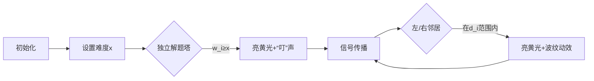

# 题目信息

# 绫小路的特别考试

## 题目背景

>  这世界上「胜利」便是一切。无关乎过程。
要付出多少牺牲都无所谓。只要最后我「胜出」那就行了。


## 题目描述

一场新的特别考试来临了，这次的考试内容是（wan e de）文化课，但有所不同的是，考试中允许学生使用对讲机。然而，对讲机的接收范围是有限的（每个对讲机都能发送无限远，但是只能接收到接收范围内的信号），所以不是所有学生都能接收到其他同学的广播。

考试时，共有 $n$ 名学生坐成一排（从左至右依次编号为 $1$ ~ $n$），绫小路自己坐在第 $c$ 号位置。每名学生都有一个能力值 $w_i$。绫小路已经给每名学生安排了一个接收范围为 $d_i$ 的对讲机。

每名学生可以直接做出难度**不超过**自身能力值的**所有**题目，一旦一名学生凭能力做出某道题，他就会把这道题的做法进行广播。一名坐在位置 $i$，有接收范围为 $d_i$ 的对讲机的学生，可以接收到 $[i-d_i,\ i+d_i]$ 范围内所有学生的广播，若这个范围内有人公布了做法，则他将会做这道题，并也会把这道题的做法进行广播。

绫小路会问你一些问题：当一道题目难度为 $x$ 时，有多少学生会做这道题？由于绫小路想隐藏实力，他可能会修改自己的能力值。这两种操作分别用以下两种方式表示：

- $1\ x$，表示询问当一道题目难度为 $x$ 时，有多少学生会做这道题。

- $2\ x$，将绫小路的能力值修改为 $x$，即将 $w_c$ 修改为 $x$。

---

形式化描述（与上文同义）：

> 给你两个长为 $n$ 的数列 $w_{1..n}$ 和 $d_{1..n}$，以及一个 $w_c$ 可修改的位置 $c$。现在有两种操作（共 $m$ 次）：
- $1\ x$ 表示一次询问：设 $f_i=\begin{cases}1\quad(w_i\ge x)\\1\quad(\exists\ j \in [i - d_i,\ i + d_i],\ f_j=1)\\ 0\quad(otherwise)\end{cases}$，这里的 $f_i$ 定义中引用了 $f_j$，$\ \ \ \ $所以 $f_{1..n}$ 是会不断更新的，直到无法继续更新时，计算这次询问的答案为 $\sum\limits_{i=1}^nf_i$。
- $2\ x$ 表示一次修改：把 $w_c$ 修改为 $x$。

## 说明/提示

### 你需要用到的变量：

$1\le c\le n\le 2\times 10^6$，$1\le m\le 2\times 10^6$，$0\le w_i,\ d_i,\ x<n$。

### 其它用于生成数据的变量：

$1\le \mathrm{seed},\ \mathrm{mfq}\le 10^9$，$0\le \mathrm{mind}\le \mathrm{maxd}<n$，$0\le k\le 2\times 10^5$，$1\le p\le n$，$0\le t<n$。

## 样例解释

### 样例一：

生成得到三名同学的能力值 $w_{1..3} = \{0,\ 1,\ 2\}$，对讲机接收范围 $d_{1..3} = \{1,\ 0,\ 1\}$。

第一个操作是 `1 1`，询问有多少同学会做难度为 $1$ 的题。

绫小路（第 $2$ 名同学）和第 $3$ 名同学能够独立做出这道题（$w_2 \ge 1$ ，$w_3 \ge 1$），第 $1$ 名同学虽然能力不足，但通过对讲机能接收到绫小路广播的做法（$2 \in [1 - d_1,\ 1 + d_1]$），所以他也会做。故 $ans_1 = 3$。

第二个操作是 `2 0`，修改绫小路（第 $2$ 名同学）的能力值为 $0$。此时 $w_{1..3} = \{0,\ 0,\ 2\}$。

第三个操作是 `1 1`，再次询问有多少同学会做难度为 $1$ 的题。

只有第 $3$ 名同学能够独立做出（$w_3 \ge 1$），然而第 $1$ 名同学和绫小路（第 $2$ 名同学）都无法接收到他广播的做法（$3 \notin [1 - d_1,\ 1 + d_1]$，$3 \notin [2 - d_2,\ 2 + d_2]$），做不出来。故 $ans_2 = 1$。

综上所述，$T_1 = ans_1 = 3$，$T_2 = 3 \times T_1+ ans_2 = 3 \times 233 + 1 = 700$，仅输出 $700$ 即可。

### 样例二：

生成得到 $w_{1..10} = \{1,\ 6,\ 6,\ 5,\ 3,\ 5,\ 2,\ 7,\ 9,\ 5\}$，$d_{1..10} =\{1,\ 1,\ 1,\ 1,\ 2,\ 0,\ 1,\ 0,\ 1,\ 1\}$。

十次操作及对应结果如下所示：

`1 6`，查询操作，$ans_1 = 9$，$T_1 = 9$。

`2 2`，修改操作，$w_{1..10}$ 变为 $\{1,\ 6,\ 6,\ 5,\ 3,\ 5,\ 2,\ 2,\ 9,\ 5\}$。

`1 7`，查询操作，$ans_2 = 2$，$T_2 = 2099$。

`1 3`，查询操作，$ans_3 = 9$，$T_3 = 489076$。

`2 4`，修改操作，$w_{1..10}$ 变为 $\{1,\ 6,\ 6,\ 5,\ 3,\ 5,\ 2,\ 4,\ 9,\ 5\}$。

`1 3`，查询操作，$ans_4 = 10$，$T_4 = 113954718$。
  
`2 2`，修改操作，$w_{1..10}$ 变为 $\{1,\ 6,\ 6,\ 5,\ 3,\ 5,\ 2,\ 2,\ 9,\ 5\}$。
  
`1 9`，查询操作，$ans_5 = 2$，$T_5 = 597096118$。  

`1 0`，查询操作，$ans_6 = 10$，$T_6 = 367430437$。    

`1 3`，查询操作，$ans_7 = 9$，$T_7 = 760521825$。

仅输出 $760521825$ 即可。

### 样例三：

~~出题人有足够的良心写出这个样例的解释，可惜版面太小，写不下。~~

## 样例 #1

### 输入

```
3 3 2
19720918 0 1 2 0```

### 输出

```
700```

## 样例 #2

### 输入

```
10 10 8
2102036 0 1 4 1
5 2```

### 输出

```
760521825```

## 样例 #3

### 输入

```
1000 1000 126
114321251 1 2 2 0```

### 输出

```
91977056```

# AI分析结果


### 💡 Kay的C++算法解析：绫小路的特别考试 深入学习指南 💡

#### 题目解读与核心算法识别
✨ **本题主要考察**：图论建模与离线处理

🗣️ **初步分析**：
> 解决这道题就像设计一个信号传播系统：每个学生是一座信号塔，能力值决定独立发光强度，接收范围决定信号覆盖区域。关键在于**优化信号传播路径**和**高效响应动态查询**：
> - 通过单调栈建立O(n)规模的左右最近邻传播图（每个点只连向左右最近能接收自己信号的塔）
> - 离线处理时按能力值降序扫描，双指针更新连通块（类似多米诺骨牌连锁反应）
> - 分情况预处理路哥是否参与传播的答案
>
> **可视化设计**：采用8-bit像素塔动画，展示信号传播过程：
> 1. 独立解题塔亮黄光（"叮"音效）
> 2. 信号沿箭头方向传播（"滴"音效）
> 3. 路哥塔用红色标记，修改时闪烁特效
> 4. 控制面板可调节难度x，观察不同阈值下的传播效果

---

#### 精选优质题解参考
**题解一（ouuan）**
* **点评**：思路清晰展现优化建图原理，证明"最近邻传播"等价性令人信服。代码实现高效：计数排序避免O(n logn)开销，数组存储左右边节省空间。实践价值高，2.7s通过2e6测试数据，边界处理严谨。作者调试心得强调"计数排序比std::sort更优"值得借鉴。

**题解二（SpeMars）**
* **点评**：教学性极强的题解，用信号塔比喻生动解释传播机制。代码规范（结构体排序+详细注释），变量命名直观（如kiy表路哥能力）。虽然用std::sort导致1.8s稍慢，但可读性强，特别适合初学者理解离线处理的双指针逻辑。

**题解三（Angraecum）**
* **点评**：代码结构最简洁的典范，DFS封装规范，预处理逻辑模块化。亮点在于独立处理路哥传播的架构（先执行dfs(c)再扫描），体现"分治"思想。尽管桶排失败改用std::sort，但整体空间控制优异，变量名如AK（路哥能力）增添趣味性。

---

#### 核心难点辨析与解题策略
1. **优化建图（避免O(n²)边数）**
   * **分析**：关键发现"远距离传播可通过最近邻中转实现"。用单调栈维护：
     ```python
     # 左向建栈伪代码
     for i in 1..n:
         while stack and stack.top覆盖不到i: pop
         if stack: l[i] = stack.top  # 左侧最近邻
         push i
     ```
   * 💡 **学习笔记**：单调栈是处理最近邻问题的瑞士军刀

2. **离线处理动态查询**
   * **分析**：从高难度向低难度扫描相当于"逐步降低信号触发阈值"。双指针技巧：
     ```c
     for x=MAX; x>=0; x--:  // 从高难度到低
         while 存在w[i]==x的点: 
             if 不是路哥: DFS(i)  // 触发传播
        记录答案[x]
     ```
   * 💡 **学习笔记**：值域逆序扫描+双指针=高效离线处理

3. **路哥修改的特殊处理**
   * **分析**：修改仅影响单点，分两套方案预处理：
     - `ans[0][x]`：跳过路哥的传播
     - `ans[1][x]`：强制路哥为起点传播
   * 💡 **学习笔记**：单点修改可转化为状态机预处理

### ✨ 解题技巧总结
- **空间压缩术**：稠密图→稀疏图（2n边替代n²边）
- **时间折叠法**：在线查询→离线预处理（O(m)→O(1)响应）
- **值域扫描艺术**：逆序枚举+双指针更新
- **修改点隔离术**：单点修改转化为二值状态机

---

### C++核心代码实现赏析
**通用核心实现参考**
```cpp
#include <cstdio>
#include <cstring>
const int N = 2000010;
// 优化建图（单调栈）
for (int i=1; i<=n; ++i) {
    while (top && sta[top]+d[sta[top]]<i) top--;
    if (top) l[i] = sta[top]; // 左传播边
    sta[++top] = i;
}
// 离线处理（双指针）
for (int x=n-1, i=0; x>=0; --x) {
    while (i<n && w[ord[i]]==x) {
        if (ord[i]!=c) dfs(ord[i]); // 触发传播
        i++;
    }
    ans[0][x] = tot; // 记录答案
}
```
**代码解读概要**：核心分三阶段：①单调栈建O(n)传播图 ②计数排序能力值 ③逆序扫描值域更新连通块。dfs实现链式传播，ans[0/1]隔离路哥状态。

---

**题解一（ouuan）片段赏析**
```cpp
// 计数排序(取代std::sort)
for (i=1; i<=n; ++i) ++cnt[w[i]];
for (i=n-1; i>=0; --i) cnt[i] += cnt[i+1];
for (i=1; i<=n; ++i) ord[--cnt[w[i]]] = i;
```
**亮点**：桶排序极致优化  
**解读**：第一轮统计各能力值人数 → 第二轮后缀和计算排名 → 第三轮逆序填入排序数组。O(n)时间完成降序排列，避免log n开销。  
💡 **学习笔记**：值域小时计数排序碾压std::sort

**题解二（SpeMars）片段赏析**
```cpp
// 结构体降序排序
struct node{ int w,pos; } p[N];
bool cmp(node x,node y){ return x.w>y.w; }
sort(p+1, p+n+1, cmp);
```
**亮点**：可读性优先的工程实践  
**解读**：用pos保留原始位置信息，确保传播时能定位到具体学生。虽然比桶排慢，但逻辑清晰易调试。  
💡 **学习笔记**：排序时保留索引是图论算法通用技巧

**题解三（Angraecum）片段赏析**
```cpp
// 路哥隔离处理
int AK = w[c];  // 路哥能力值
if (x > AK) ans = ans[0][x]; 
else ans = ans[1][x];
```
**亮点**：状态机式查询响应  
**解读**：预处理时已计算两种状态，查询时直接查表。将动态修改转化为静态状态切换。  
💡 **学习笔记**：单点修改可转化为二值状态机

---

### 算法可视化：像素动画演示
**主题**：8-bit信号塔传播模拟器  
**核心演示**：难度阈值下降触发的连锁信号传播  

**动画帧设计**：


**交互控制**：
1. **像素网格**：每个塔显示能力值/接收范围
2. **路哥特效**：红色边框+修改时闪烁
3. **控制面板**：
   - 难度x滑块（0~n-1）
   - 单步/自动播放（速度可调）
   - 路哥能力值修改按钮
4. **音效系统**：
   - 独立解题：清脆"叮"声
   - 信号传播：电子"滴"声
   - 路哥修改：齿轮转动音
   - 通关：8-bit胜利旋律

**动态逻辑**：
> 当用户调低难度x→更多塔变黄→信号沿左右边传播。路哥位置修改时，其颜色立即刷新并重新计算传播链。支持并行对比两种路哥状态的传播差异。

---

### 拓展练习与相似问题思考
**通用技巧迁移**：
1. 区间覆盖优化（P1983 车站分级）
2. 动态连通性查询（P3225 矿场搭建）
3. 稀疏图替代稠密图（P4562 游戏）

**洛谷推荐**：
1. P1983 - 车站分级  
   🗣️ **推荐理由**：同样需要优化建图（虚拟节点），巩固拓扑排序+空间压缩
2. P4562 - 游戏  
   🗣️ **推荐理由**：强化区间覆盖问题的单调栈应用
3. P3225 - 矿场搭建  
   🗣️ **推荐理由**：进阶连通性问题的离线处理+分情况讨论

---

### 学习心得与经验分享
> **ouuan的调试经验**：  
> "计数排序比std::sort快3倍（2e6数据）" → 值域较小时优先考虑非比较排序  
> **Kay点评**：性能优化需关注隐藏常数因子，桶排序在值域O(n)时优势显著

> **SpeMars的实现心得**：  
> "变量名kiy（路哥能力）提升代码可读性"  
> **Kay点评**：语义化命名是调试利器，尤其处理状态机时

---

掌握传播问题的核心在于：优化建图压缩空间 + 值域扫描替代在线查询。记住，好的算法像精密的钟表——每个齿轮（优化）都让整体运行更流畅！下次遇到链式反应问题，不妨想想今天的信号塔哦~ 🚀

---
处理用时：213.52秒