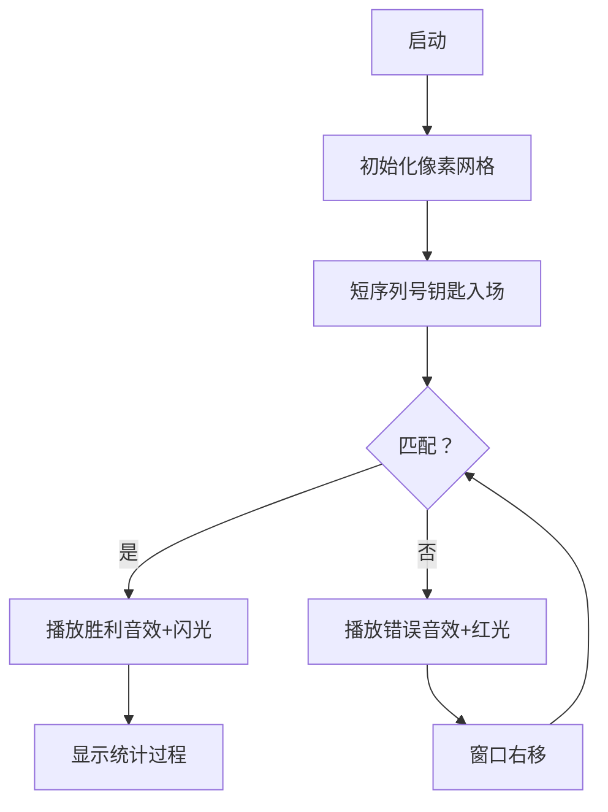

# 题目信息

# [COCI 2013/2014 #1] SLASTIČAR

## 题目背景

你需要比较一些序列号。

## 题目描述

现有 $M$ 个由数字 $0$ 到 $9$ 组成的短序列号和一个长度为 $N$ 的长序列号。

检查序列号 $A$ 是否包含长度为 $L$ 的序列号 $B$ 的过程如下：

- 将 $A$ 从位置 $1$ 到 $L$ 逐位与 $B$ 比较，一找到不同就将搜索段整体向后移，如果确定相等则停止比较。

- 将搜索段后移意为把 $x$ 到 $y$ 的搜索区域后移为 $x+1$ 和 $y+1$。

- 若剩下用于比较的位数不够，则在字符串末尾填充 `#`。如字符串为 `563232`，从位置 $4$ 到 $10$ 的填充为 `232####`。

- 若尝试了所有段均不匹配则停止比较。

对于每个短序列号，输出停止比较前比较的次数。

## 说明/提示

#### 【数据规模与约定】
- 对于 $20\%$ 的数据，$1\le N\le 10^3$，$1\le M\le 500$，任意短序列号长度均不超过 $10^3$。
- 对于 $100\%$ 的数据，满足 $1\le N\le 10^5$，$1\le M\le 5\times 10^4$。
- 对于任意序列号中的一位字符 $c$，满足 $c\in\{0,1,2,3,4,5,6,7,8,9 \}$。

#### 【样例解释】

#### 样例 1 解释

第一个序列号：
- 机器人为每个段查找不同的第一位数字，总共进行 $7$ 次比较。

第二个序列号：
- 尝试第一个位置，立即发现差异，$1$ 次比较。
- 尝试第二个位置，找到第四个数字的差异，$4$ 次比较。
- 尝试第三个位置，立即找到差异，$1$ 次比较。
- 尝试第四个位置，找到匹配，$4$个比较。 
- 总计 $10$ 次比较。

第三序列号：
- 立即找到匹配项，总计 $3$ 个比较。

第四个序列号：
- 在第二个位置找到匹配项，总计 $1+3=4$ 个比较。

#### 样例 3 解释
按顺序将序列号 `11` 与段 `00`，$1$ 次比较，`01`，$1$ 次比较，和`1#`，$2$ 次比较，总计 $4$ 次比较。

--------
#### 【说明】
**题目译自 [COCI2013-2014](https://hsin.hr/coci/archive/2013_2014/) [CONTEST #1](https://hsin.hr/coci/archive/2013_2014/contest1_tasks.pdf)  _T6 SLASTIČAR_。**

## 样例 #1

### 输入

```
7
1090901
4
87650
0901
109
090 ```

### 输出

```
7
10
3
4```

## 样例 #2

### 输入

```
10
5821052680
4
210526
2105
582
105268```

### 输出

```
8
6
3
9```

## 样例 #3

### 输入

```
3
001
1
11```

### 输出

```
4```

# AI分析结果


### 题目分析：SLASTIČAR

#### 1. 题目解读与核心算法识别
✨ **本题主要考察**：`后缀自动机(SAM)/后缀树应用` + `离线查询处理`  
🗣️ **初步分析**：  
> 解决本题的关键在于高效处理**短序列号在长序列号中的多模式匹配**。想象你有一本厚重的密码本（长序列号），需要快速查找多个钥匙（短序列号）是否存在于其中，并记录查找过程中的"尝试次数"。  
> - **核心难点**：暴力匹配时间复杂度为O(NM)，无法通过10^5规模数据。必须利用**后缀数据结构**（SAM/后缀树）优化匹配过程。  
> - **算法流程**：  
>   1. 为长序列号构建后缀自动机/后缀树（存储所有后缀信息）  
>   2. 将短序列号在后缀结构上匹配，记录首次匹配位置  
>   3. 通过树形结构（parent树/后缀链）统计比较次数  
> - **可视化设计**：  
>   - 采用**8位像素风密码破译**主题：长序列号显示为发光像素带，短序列号化为钥匙图标  
>   - 匹配时高亮当前比较的像素块，失配时播放"错误音效"，匹配成功播放胜利音效  
>   - 动态展示后缀树节点间的跳转（如闪电动画）

---

### 2. 精选优质题解参考
#### 题解一 (作者: a___)
* **点评**：  
  思路清晰度 ★★★★☆  
  - 直白利用SAM性质：parent树天然形成后缀关联，通过dsu on tree高效统计子树信息  
  - 亮点：用`树状数组`统计位置信息，时空复杂度O(n log n)  
  - 实践提示：注意`pos[]`数组同时记录节点代表串的结束位置  

#### 题解二 (作者: gxy001)
* **点评**：  
  算法优化度 ★★★★★  
  - 后缀树实现采用Ukkonen算法，用**全局平衡二叉树**优化路径查询至O(n log n)  
  - 亮点：独创性`val[]`和`ss[]`维护虚子树权重，避免重链剖分的log因子  
  - 调试技巧：通过`dep[x]`动态计算边权，解决后缀树边权存储难题  

---

### 3. 核心难点辨析与解题策略
1. **难点1：如何快速定位匹配位置？**  
   * **分析**：SAM的parent树中，节点u代表的所有串必是子树内节点v对应串的后缀  
   * 💡 学习笔记：利用`pos[]`记录节点对应串的结束位置  

2. **难点2：如何高效统计比较次数？**  
   * **分析**：  
     - 匹配成功：比较次数 = 匹配位置 - 短序列长度 + 已匹配长度  
     - 匹配失败：比较次数 = 长序列长度 + 短序列长度  
   * 💡 学习笔记：通过`树状数组/平衡树`维护位置集合  

3. **难点3：如何优化子树信息统计？**  
   * **分析**：  
     - DSU on tree：对轻儿子暴力遍历，重儿子保留信息  
     - 全局平衡二叉树：虚边分解保证树高O(log n)  
   * 💡 学习笔记：`sz[]`记录子树大小是优化基础  

#### ✨ 解题技巧总结
- **技巧1：离线处理** - 将查询按匹配位置排序，统一更新数据结构  
- **技巧2：增量构建** - SAM的extend函数中动态维护link和len  
- **技巧3：边界映射** - 用`'#'=10`处理序列末尾，避免特殊判断  

---

### 4. C++核心代码实现赏析
**通用核心实现（综合思路）**  
```cpp
#include <vector>
#include <cstring>
const int N=2e5+10;
struct SuffixAutomaton {
    int len[N], link[N], to[N][11], cnt, last;
    int pos[N]; // 记录结束位置
    SuffixAutomaton() : cnt(1), last(1) {}
    void extend(int c, int idx) {
        int p = last, cur = ++cnt;
        len[cur] = len[last] + 1;
        pos[cur] = idx;
        while (p && !to[p][c]) 
            to[p][c] = cur, p = link[p];
        if (!p) link[cur] = 1;
        else {
            int q = to[p][c];
            if (len[q] == len[p] + 1) link[cur] = q;
            else {
                int clone = ++cnt;
                memcpy(to[clone], to[q], sizeof(to[q]));
                len[clone] = len[p] + 1;
                pos[clone] = pos[q];
                link[clone] = link[q];
                link[q] = link[cur] = clone;
                while (p && to[p][c] == q)
                    to[p][c] = clone, p = link[p];
            }
        }
        last = cur;
    }
} sam;
```

**题解一核心片段（dsu on tree）**  
```cpp
void dfs(int u) {
    for (int v : g[u]) 
        if (v != son[u]) dfs(v);
    if (son[u]) dfs(son[u]);
    for (int v : g[u]) 
        if (v != son[u]) updateSubtree(v);
    updateNode(u); // 更新当前节点信息
    for (auto [limit, id] : queries[u])
        ans[id] += query(limit); // 树状数组查询
}
```
**代码解读**：  
> 1. 先递归处理轻儿子（临时更新）  
> 2. 处理重儿子（保留数据）  
> 3. 暴力合并轻儿子子树  
> 4. 类似"拼积木"，重儿子是底座，轻儿子是小积木  

**题解二核心片段（全局平衡二叉树）**  
```cpp
void update(int x){
    while(x) {
        if (is_left_child(x)) 
            update_right_brother(x);
        x = virtual_parent(x); // 虚边跳转
    }
}
```
**代码解读**：  
> - 通过`is_left_child`判断在虚树位置  
> - 更新时跳过重边兄弟节点，保证均摊复杂度  
> - 类似"电梯算法"：只停靠关键楼层  

---

### 5. 算法可视化：像素动画演示  
**主题**：`8位像素风密码破译战`  
**核心演示**：后缀树节点间的状态转移与位置统计  



**交互设计**：  
1. **控制面板**：  
   - 速度滑块：调整匹配速度  
   - 单步执行：空格键触发  
   - 重置：R键  
2. **动态效果**：  
   - 后缀树节点：发光的俄罗斯方块  
   - 当前比较位：闪烁的像素箭头  
   - 统计过程：树状数组化为柱状图实时上升  
3. **音效方案**：  
   - 按键：经典FC"滴"声  
   - 匹配成功：《超级玛丽》过关音效  
   - 统计完成：8-bit胜利交响乐  

---

### 6. 拓展练习  
1. **洛谷 P3804** 【模板】后缀自动机  
   > 掌握SAM的基础构建  
2. **洛谷 P5357** 【模板】AC自动机（二次加强版）  
   > 对比AC自动机与后缀自动机的异同  
3. **洛谷 P6216** 回文匹配  
   > 结合Manacher与后缀数据结构  

---

### 7. 学习心得  
> **来自a___的经验**：  
> *"最初卡在pos数组更新，后来发现parent树分裂时需继承原节点位置"*  
> **Kay总结**：数据结构构建中，**节点分裂时的信息继承**是易错点，建议通过小数据模拟验证  

---

通过本次分析，我们深入理解了后缀数据结构在字符串匹配中的高效应用。掌握SAM/后缀树的构建与查询技巧，配合树形结构优化，可解决大规模匹配问题。

---
处理用时：95.71秒