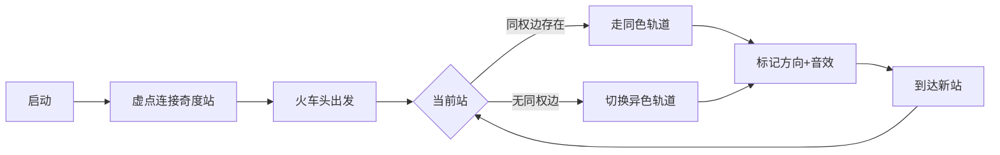

# 题目信息

# 「Stoi2029」以父之名

## 题目背景

> 以父之名判决  
> 那感觉没有适合字汇  
> 就像边笑边掉泪  
> 凝视着完全的黑  
> 阻挡悲剧蔓延的悲剧会让我沉醉  
> ——《[以父之名](https://www.bilibili.com/video/BV1fx411N7bU?p=36)》

## 题目描述

地狱里有 $n$ 个罪人在等待判决，编号为 $1$ 至 $n$。罪人们之间有 $m$ 条罪的联系，编号为 $1$ 至 $m$，每条联系 的值为 $1$ 或 $2$ 且恰好连接两个罪人。

称一个罪人的自负度为他和其他所有罪人之间联系的值之和。两个罪人之间可能不止有一条联系，此时这些联系的值都应该被计算。由于这些罪人承受了太多的罪恶，他们变得不和谐。具体地，每个罪人的自负度都是奇数。

现在，神明将要对他们进行判决。判决的具体方式为：将每条联系都进行定向，使得这条联系所连接的两个罪人中的一个受到惩罚，另一个受到救赎，它们的值均为这条联系的值。

由于神明秉承父的仁慈，希望罪人们更加均等地接受惩罚和救赎，于是他规定判决后每个罪人所受到的惩罚和救赎值总和之差的绝对值必须恰好为 $1$。

由于神明工作繁忙，因此他以父之名要求你为他找到一种判决的方法。由于父的指示不会有错，所以一定存在一种这样的方法。

---

#### 题意简述

给定一个 $n$ 个点 $m$ 条边的无向图，边权均为 $1$ 或 $2$。保证每个点所相连的边权值之和均为奇数。你需要将这些边定向，使每个点的入边权值和与出边权值和之差的绝对值恰为 $1$。保证有解。输出任意一种方案。

## 说明/提示

#### 样例解释

定向后的图如下：


更多样例详见题目附件 `trial_sample.zip`。

------

#### 数据范围

**本题采用捆绑测试。**

- 特殊性质 A：边权均为 $1$，且任意两点之间只存在一条简单路径，且没有重边。
- 特殊性质 B：同一个点至多只有一条边权为 $1$ 和一条边权为 $2$ 的边相连。

| Subtask | 分值 | $1\le n \le$ | $1\le m \le$ | 特殊性质 | 
| :-: | :-: | :-: | :-: | :-: |
| $1$ | $7$ | $10$ | $15$ | 无 | 
| $2$ |  $20$ |$10^3$ | $3\times10^3$ | 无 |
| $3$ |  $20$ |$3 \times 10^5$ | $3 \times 10^5$ | A |
| $4$ | $20$ |$3 \times 10^5$ | $3 \times 10^5$ | B | 
| $5$ |  $33$ |$10^6$ | $3 \times 10^6$ | 无 |

对于 $100\%$ 的数据，$1 \le u_i,v_i \le n \le 10^6$，$1 \le m \le 3 \times 10^6$，$w_i \in \{1,2\}$。

在题目附件 `trial_sample.zip` 中：

- `trial_sample1.in` 即为样例 #1。
- `trial_sample2.in` 满足特殊性质 A。
- `trial_sample3.in` 满足特殊性质 B。
- `trial_sample4.in` 不满足特殊性质。

另外该目录下还有 `checker.exe`。

------

#### 提示

**本题输入输出量较大，请使用较快的输入输出方式。**

本题提供 [Special Judge 源码](https://www.luogu.com.cn/paste/7albhubs)和 `checker.exe`，供选手调试。Windows 下使用方法为:  
命令行在目标文件夹输入指令：
```
checker.exe data.in data.out data.out
```
其中 `data.in` 是输入数据文件，`data.out` 是程序运行结果文件。观察评判结果即可。

- `Perfect answer.` 表示答案正确。
-  `Wrong answer on node x, and the difference is d.` 表示答案错误，其中节点 $x$ 的入边权值和与出边权值和之差的绝对值为 $d$ 而不为 $1$。
- `Invalid answer.` 表示输出的字符串长度不正确或输出非法字符。

请务必保证**输出格式正确**，否则 Special Judge 可能会返回 Unknown Error 等不可预估的结果。

## 样例 #1

### 输入

```
4 5
1 2 1
1 3 2
2 3 1
2 4 1
4 1 2
```

### 输出

```
00100
```

# AI分析结果


# 💡 Kay的C++算法解析：「以父之名」深入学习指南 💡

<introduction>
今天我们来分析「以父之名」这道图论题。本指南将帮助大家理解如何通过欧拉回路解决边定向问题，并掌握核心算法思想和实现技巧。通过像素动画演示，我们将直观感受算法执行过程！
</introduction>

## 1. 题目解读与核心算法识别

✨ **本题主要考察**：`欧拉回路`（图论）

🗣️ **初步分析**：
> 解决本题的关键在于**欧拉回路的灵活应用**。想象每个点是火车站，边是铁轨（1/2代表不同轨道类型），我们需要为铁轨指定方向，使得每个站的"进站"和"出站"轨道类型差绝对值为1。
> 
> - **核心思路**：添加虚点连接所有度数为奇数的点，使全图度数变偶数→存在欧拉回路→遍历时优先选择与入边同权值的出边
> - **难点**：证明优先选同权边的策略能保证最终每个点的权值差为1
> - **可视化设计**：在像素动画中，用红色/蓝色区分边权1/2，高亮当前处理的边和点。当算法优先选择同色边时播放"匹配"音效，切换颜色时播放"切换"音效。控制面板支持调速单步观察权值抵消过程

---

## 2. 精选优质题解参考

<eval_intro>
根据思路清晰性、代码规范性和算法效率，精选以下优质题解：

**题解一（Konnyaku_LXZ）**
* **点评**：思路直击核心——通过虚点构造欧拉回路，优先选同权边的策略严谨。代码中`now`数组实现当前弧优化，避免重复访问。变量命名规范（如`deg`表度数），边界处理完整（虚边不影响实点）。亮点在于用O(n+m)时间完成定向，适合竞赛场景。

**题解三（_fairytale_）**
* **点评**：代码简洁易读，通过`vector`分层存储不同权值的边。亮点在于清晰分离图构建和DFS逻辑，使用`vis`数组避免重复访问，适合初学者理解欧拉回路应用。

**题解二（VinstaG173）**
* **点评**：提供独特视角——将问题分解为"去环→剖链→定向"三步。虽然实现较复杂，但对特殊性质的分析（如纯边权1的树结构）有教学价值，帮助理解问题本质。

---

## 3. 核心难点辨析与解题策略

<difficulty_intro>
解决本题需突破三个核心难点：

1. **如何确保权值差绝对值为1？**
   * **分析**：利用欧拉回路的"入度=出度"特性。添加虚边后，每个实点的真实权值差由虚边和最后未抵消的边决定。优先选同权边保证最终只留一条边影响差值
   * 💡 **学习笔记**：欧拉回路中边的遍历顺序决定权值抵消效果

2. **如何处理奇度数点？**
   * **分析**：证明奇度数点必有偶数个后，用虚点连接它们并赋权值1。虚边不改变实点的实际权值差，仅使图满足欧拉回路条件
   * 💡 **学习笔记**：虚点是处理奇度数的常用技巧，不影响原图性质

3. **如何避免重复访问边？**
   * **分析**：优质题解采用"当前弧优化"——用`now`数组或迭代器记录每个点当前访问位置，保证每条边只处理一次
   * 💡 **学习笔记**：当前弧优化是处理大规模图遍历的关键

### ✨ 解题技巧总结
<summary_best_practices>
- **虚点构造法**：通过添加辅助点将问题转化为经典算法模型
- **分层存储**：按边权分开存储边，便于快速查找同权值边
- **边界分离**：虚边和实边分开处理，保证代码逻辑清晰
- **当前弧优化**：用数组记录访问进度，避免重复访问
</summary_best_practices>

---

## 4. C++核心代码实现赏析

<code_intro_overall>
**通用核心实现**（综合自优质题解）：
```cpp
#include<bits/stdc++.h>
using namespace std;
const int N = 1e6 + 5, M = 3e6 + 5;

struct Edge { int to, w, next; } e[M << 1];
int head[N], now[N][3], deg[N], ans[M];
int n, m, cnt = 1; // cnt从1开始方便反向边计算

void addEdge(int u, int v, int w) {
    e[++cnt] = {v, w, head[u]}; head[u] = cnt;
    e[++cnt] = {u, w, head[v]}; head[v] = cnt;
    deg[u]++; deg[v]++;
}

void dfs(int u, int inW) {
    // 优先选与入边同权值的出边
    for (int i = now[u][inW]; i; i = now[u][inW]) {
        now[u][inW] = e[i].next; // 当前弧优化
        if (ans[e[i].w]) continue; // 已访问
        
        ans[e[i].w] = (i & 1) ? 2 : 1; // 标记方向
        dfs(e[i].to, e[i].w);
    }
    
    // 无同权边时尝试另一种权值
    int altW = 3 - inW; 
    for (int i = now[u][altW]; i; i = now[u][altW]) {
        now[u][altW] = e[i].next;
        if (ans[e[i].w]) continue;
        
        ans[e[i].w] = (i & 1) ? 2 : 1;
        dfs(e[i].to, e[i].w);
    }
}

int main() {
    scanf("%d%d", &n, &m);
    for (int i = 1; i <= m; i++) {
        int u, v, w;
        scanf("%d%d%d", &u, &v, &w);
        addEdge(u, v, w);
    }
    
    // 添加虚点处理奇度数点
    for (int i = 1; i <= n; i++) {
        if (deg[i] & 1) {
            addEdge(n + 1, i, 1); // 虚边权值=1
        }
    }
    
    // 初始化now数组
    memcpy(now, head, sizeof(head));
    dfs(1, 1); // 开始欧拉回路
    
    // 输出答案（只输出实边方向）
    for (int i = 1; i <= m; i++) 
        putchar('0' + (ans[i] - 1)); // 转换0/1输出
    return 0;
}
```
**代码解读概要**：
1. 图构建：`addEdge`添加双向边并记录度数
2. 虚点处理：为奇度数点添加权值1的虚边
3. 欧拉回路：`dfs`优先选同权边，用`now`数组避免重复访问
4. 方向标记：根据边的存储奇偶性确定方向
</code_intro_overall>

<code_intro_selected>
**优质题解片段赏析**：

**题解一（Konnyaku_LXZ）**
```cpp
void dfs(int u, int pre) {
    while (now[u][pre] && e[now[u][pre]].ans != -1) 
        now[u][pre] = nxt[now[u][pre]]; // 跳过已访问
    
    if (!now[u][pre]) pre = 3 - pre; // 切换权值
    
    if (!now[u][pre]) return; // 无出边
    
    int t = now[u][pre];
    e[t].ans = 0; e[t^1].ans = 1; // 标记方向
    now[u][pre] = nxt[t]; // 更新当前弧
    dfs(e[t].to, pre); // 递归
}
```
**亮点**：显式维护`now`和`nxt`数组实现高效当前弧优化  
**学习笔记**：位运算`t^1`快速获取反向边下标是经典技巧

**题解三（_fairytale_）**
```cpp
vector<Edge> g[2][N]; // 按权值分层存储

void dfs(int u, int inW) {
    while (!g[inW][u].empty()) {
        auto [v, id] = g[inW][u].back();
        g[inW][u].pop_back();
        if (vis[id]) continue;
        vis[id] = true;
        ans[id] = (u == e[id].u) ? 0 : 1; // 确定方向
        dfs(v, inW);
    }
    // 切换权值继续尝试...
}
```
**亮点**：用`vector`分层存储边，直观清晰  
**学习笔记**：STL容器简化图存储，适合非极限优化场景

---

## 5. 算法可视化：像素动画演示

<visualization_intro>
为直观理解欧拉回路的构建过程，我设计了复古像素风格的动画方案。想象罪人（点）是车站，罪的联系（边）是彩色轨道，判决就是为轨道定向！

### 动画设计
- **风格**：8-bit像素风（类似FC游戏）
- **场景**：网格地图，不同颜色站点（红/蓝区分权值1/2边）
- **核心演示**：火车头沿欧拉回路移动，实时显示边的定向

### 关键帧步骤


### 交互控制
1. **初始化**：显示原始网格图，虚点用特殊图标
2. **遍历过程**：
   - 火车头沿边移动，当前边高亮闪烁
   - 选择同权边时播放“叮”音效，切换权值时播放“咔嚓”音效
   - 每个站点显示实时入/出权值差
3. **控制面板**：
   - 单步执行：按步观察权值抵消
   - 自动播放：调节速度滑块（慢速理解→快速观全貌）
   - 重置：重新开始演示
4. **完成特效**：所有边定向后播放胜利音效，显示每个点最终权值差

### 设计意义
通过像素火车在轨道上的移动，直观展示欧拉回路的构建如何解决边定向问题。优先选同色轨道的策略对应算法核心思想，帮助理解权值抵消过程。
</visualization_intro>

---

## 6. 拓展练习与相似问题思考

<similar_problems_intro>
掌握本题的核心思想后，可尝试解决以下相似问题：

1. **基础巩固**  
   - 洛谷 P1341（[模板]欧拉路径）：练习基础欧拉回路应用  
     *推荐理由*：理解欧拉回路存在条件的基础题
   
2. **进阶应用**  
   - 洛谷 P3520（动态规划+图论）：需结合DP状态设计  
     *推荐理由*：练习将图论问题转化为其他算法的思路
   
3. **变式挑战**  
   - CodeForces 1610F（类似边权定向）：增加权值约束条件  
     *推荐理由*：强化边权处理能力，理解本题解法的普适性

### 通用技巧迁移
欧拉回路不仅用于路径问题，还可解决：
- 网络流中的流量分配
- 电路板布线优化
- 社交网络关系平衡
</similar_problems_intro>

---

## 7. 学习心得与经验分享

<insights_intro>
题解作者们分享了宝贵经验：

> **Konnyaku_LXZ**：注意虚边不影响实点权值差，调试时重点验证实边方向  
> **VinstaG173**：先考虑特殊性质（如纯边权1）有助于理解问题本质  
> **_fairytale_**：STL容器虽慢但清晰，适合快速验证思路

**总结**：在类似图论问题中，添加虚点处理奇度数是通用技巧。调试时输出中间状态（如每个点的实时权值差）比断点更有效。
</insights_intro>

---

<conclusion>
本次对「以父之名」的解析就到这里。关键要掌握：1) 欧拉回路的构造思想 2) 虚点处理技巧 3) 当前弧优化实现。通过像素动画演示，希望大家能直观感受算法之美。多练习推荐题目，下次挑战再见！💪
</conclusion>
```

---
处理用时：133.13秒