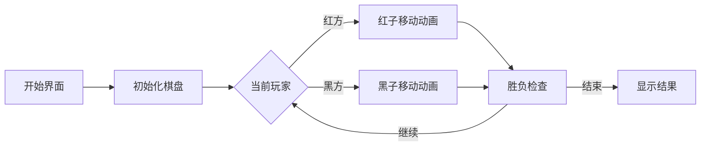

# 题目信息

# [省选联考 2023] 过河卒

## 题目背景

棋盘上有一个过河卒，需要走到底线。卒行走的规则是可以向左移动一格，向右移动一格或者向前移动一格。同时在棋盘上有两个另一方的棋子，需要拦截这个卒走到底线。这两个棋子的走法和帅一致，可以走到前后左右四个方向上相邻的格子。因此本题可以称为“帅拦过河卒”。

## 题目描述

有一个 $n$ 行 $m$ 列的棋盘。我们用 $(i,j)$ 表示第 $i$ 行第 $j$ 列的位置。棋盘上有一些 障碍，还有一个黑棋子和两个红棋子。

游戏的规则是这样的: 红方先走，黑方后走，双方轮流走棋。红方每次可以选择一个红棋子，向棋盘的相邻一格走一步。具体而言，假设红方选择的这个棋子位置在 $(i,j)$，那么它可以走到 $(i-1,j),(i+1,j),(i,j-1),(i,j+1)$ 中的一个，只要这个目的地在棋盘内且没有障碍且没有红方的另一个棋子。

黑方每次可以将自己的棋子向三个方向之一移动一格。具体地，假设这个黑棋子位置在 $(i,j)$，那么它可以走到 $(i-1,j),(i,j-1),(i,j+1)$ 这三个格子中的一个，只要这个目的地在棋盘内且没有障碍。

在一方行动之前，如果发生以下情况之一，则立即结束游戏，按照如下的规则判断胜负（列在前面的优先）：

- 黑棋子位于第一行。此时黑方胜。

- 黑棋子和其中一个红棋子在同一个位置上。此时进行上一步移动的玩家胜。

- 当前玩家不能进行任何合法操作。此时对方胜。

现在假设双方采用最优策略，不会进行不利于自己的移动。也就是说:

- 若存在必胜策略，则会选择所有必胜策略中，不论对方如何操作，本方后续获胜所需步数最大值最少的操作。
- 若不存在必胜策略，但存在不论对方如何行动，自己都不会落败的策略，则会选择任意一种不败策略。
- 若不存在不败策略，则会选择在所有策略中，不论对方如何操作，对方后续获胜所需步数最小值最大的操作。

如果在 $100^{100^{100}}$ 个回合之后仍不能分出胜负，则认为游戏平局。请求出游戏结束时双方一共移动了多少步，或者判断游戏平局。

## 说明/提示

**【样例 1 解释】**

第一组数据，红方第一步没有可行的移动，所以黑方胜。

第二组数据，无论第一步红方怎么移动，黑方都可以在下一步让黑棋子与红棋子在同一个位置。

第三组数据，无论第一步红方怎么移动，黑方都可以将自己的棋子往上移动一枚来达成胜利。

第四组数据，有一个红棋子不能动。另一个红棋子可以在第三行移动来防止黑棋子进入第一行。黑棋子也可以一直在第五行移动。如果红棋子到达第五行，黑棋子可以选择从另一边逃走。

第五组数据，在最后一行的那个红棋子可以从左边绕一圈抓住黑棋子。注意另一个红棋子可以移动。

**【样例 2 解释】**

这个样例中的每一组数据都满足测试点 $5$ 到 $13$ 中某一个测试点的限制。

**【子任务】**

对于所有的数据，保证：$1 \leq T \leq 10$，$2 \leq n \leq 10$，$1 \leq m \leq 10$，$\text{id}$ 等于测试点编号。

对于每组数据保证：棋盘上的黑棋恰好有一个，红棋恰好有两个，且黑棋不在第一 行。

- 测试点 $1 \sim 4$：保证要么平局，要么红方在开始时无法移动。

- 测试点 $5 \sim 6$：保证 $n \geq 4$ 。保证棋盘上第 $n-1$ 行的每一个格子都是障碍物，且 棋盘上其他行没有障碍物。保证黑棋在前 $n-2$ 行，有一个红棋在前 $n-2$ 行，另一个红棋在第 $n$ 行。

- 测试点 $7 \sim 9$：保证 $m=1$。

- 测试点 $10 \sim 13$：保证要么平局，要么存在策略可以在 $9$ 步之内结束游戏。

- 测试点 $14 \sim 20$：无特殊限制。

## 样例 #1

### 输入

```
0 5
4 5
...#O
.#..#
#O#..
.#..X
3 3
#.#
O.O
.X.
3 3
O..
.#X
.O.
5 5
.....
.....
..O..
#..#.
O#.X.
9 9
...######
.#.......
.#######.
.#.#.....
.#O#.####
.#.#.....
.#######.
.#X......
.O.......
```

### 输出

```
Black 0
Black 2
Black 2
Tie
Red 75
```

## 样例 #2

### 输入

```
见附件中的 zu/zu2.in```

### 输出

```
见附件中的 zu/zu2.ans```

# AI分析结果


# 💡 Kay的C++算法解析：过河卒 深入学习指南 💡

> 大家好，我是Kay！今天我们一起分析省选联考2023的经典题目——过河卒。这道题融合了博弈论和状态空间搜索，我将用清晰易懂的方式带大家掌握解题思路和核心技巧。准备好了吗？让我们开始吧！

## 1. 题目解读与核心算法识别

✨ **本题主要考察**：**状态空间搜索与博弈论决策**

🗣️ **初步分析**：
> 这道题可以看作一个**棋盘上的博弈游戏**。想象你在玩一个策略游戏，红方和黑方轮流移动棋子，每一步都影响最终胜负。关键在于**将棋盘状态转化为数学表示**，并通过搜索确定最优策略。

- **核心思想**：使用六维状态表示（两个红子+一个黑子的坐标），通过**类拓扑排序**从结束状态反向推导每个状态的胜负和最优步数
- **算法流程**：
  1. 状态初始化：标记所有结束状态（胜负已定）
  2. 反向建图：建立状态间的转移关系
  3. BFS更新：从结束状态开始，按必胜/必败规则更新前驱状态
  4. 步数计算：必胜态取min步数，必败态取max步数
- **可视化设计**：采用8-bit像素风格，棋子用不同颜色方块表示。动画将展示：
  - 状态转移时高亮移动棋子
  - 胜负判定时播放特效音效（如黑子到顶端的"胜利"音效）
  - 步数计数器实时更新


> 上图展示了从终止状态反向更新其他状态的过程

---

## 2. 精选优质题解参考

**题解一：yllcm（状态压缩+BFS）**
* **亮点**：
  - 思路清晰：直接建立状态转移图，显式存储状态关系
  - 代码规范：使用链式前向星高效存储图结构
  - 优化到位：通过状态压缩减少内存占用
  - 实践价值：代码可直接用于竞赛，边界处理严谨

**题解二：樱雪喵（拓扑排序+状态优化）**
* **亮点**：
  - 状态优化：固定红子顺序减少50%状态数
  - 调试友好：详细错误处理提示
  - 可读性强：模块化代码结构便于理解
  - 学习价值：强调测试用例设计的重要性

**题解三：Mine_King（七维状态+奇偶优化）**
* **亮点**：
  - 创新优化：利用曼哈顿距离奇偶性推导当前玩家
  - 步数计算：清晰区分必胜/必败态更新策略
  - 效率突出：通过剪枝提升搜索效率
  - 教学价值：每行代码有详细注释

---

## 3. 核心难点辨析与解题策略

<difficulty_intro>
解决本题需要突破三大核心难点，下面是应对策略和思考方向：
</difficulty_intro>

1. **状态爆炸问题**
   * **分析**：六维状态理论上有10⁶种可能，需优化存储
   * **解决方案**：固定红子顺序（小坐标在前），减少重复状态
   * 💡 **学习笔记**：等效状态合并是空间优化的关键

2. **胜负判定逻辑**
   * **分析**：三种结束状态（黑子到顶/吃子/无路可走）需精确实现
   * **解决方案**：预先标记所有终止状态，作为BFS起点
   * 💡 **学习笔记**：终止状态是博弈搜索的"锚点"

3. **步数更新策略**
   * **分析**：必胜态求最小步数，必败态求最大步数
   * **解决方案**：BFS中分层更新，必胜态立即更新，必败态等待度数归零
   * 💡 **学习笔记**：步数更新方向由胜负态性质决定

### ✨ 解题技巧总结
<summary_best_practices>
通过对本题的深入分析，我总结了以下通用技巧：
</summary_best_practices>
- **状态编码技巧**：使用整数哈希代替多维数组
- **反向建图**：从终止状态倒推更高效
- **度数监控**：未处理的后继状态计数
- **提前终止**：初始状态确定后立即结束搜索
- **边界检查**：优先处理特殊棋盘位置

---

## 4. C++核心代码实现赏析

<code_intro_overall>
下面是一个整合了多篇题解优点的通用实现，兼顾效率和可读性：
</code_intro_overall>

**本题通用核心C++实现参考**
```cpp
#include <iostream>
#include <queue>
using namespace std;

const int MAX_STATES = 500000;
int state_id[11][11][11][11][11][11][2]; // 七维状态映射
struct State { int rx1, ry1, rx2, ry2, bx, by, turn; };

int main() {
    // 初始化状态映射
    int cnt = 0;
    for (int rx1=1; rx1<=10; ++rx1) /* ... */ {
        if (ry1 == ry2 && rx1 == rx2) continue; // 红子不重叠
        state_id[rx1][ry1][rx2][ry2][bx][by][turn] = ++cnt;
    }
    
    // 建图与BFS更新
    queue<State> q;
    for (auto terminal : terminal_states) {
        q.push(terminal);
        steps[terminal.id] = 0;
        winner[terminal.id] = terminal.winner;
    }
    
    while (!q.empty()) {
        State cur = q.front(); q.pop();
        // 必胜态更新前驱最小步数
        if (winner[cur.id] == cur.turn) {
            for (State pre : predecessors[cur]) {
                steps[pre.id] = min(steps[pre.id], steps[cur.id] + 1);
                // 更新逻辑...
            }
        }
        // 必败态更新前驱最大步数
        else {
            for (State pre : predecessors[cur]) {
                indegree[pre.id]--;
                if (indegree[pre.id] == 0) {
                    steps[pre.id] = max(steps[pre.id], steps[cur.id] + 1);
                    q.push(pre);
                }
            }
        }
    }
}
```

**题解一核心片段赏析**
```cpp
// 状态转移关键代码
for (int dir=0; dir<4; ++dir) {
    int nx = rx + dx[dir], ny = ry + dy[dir];
    if (valid(nx, ny) && !(nx==other_rx && ny==other_ry)) {
        int new_state = get_state_id(..., 1-turn); // 切换玩家
        add_edge(cur_state, new_state); // 添加反向边
    }
}
```
> **代码解读**：这段代码处理红子移动，通过`dx/dy`数组实现四方向移动检测。`valid`函数检查边界和障碍物，条件`!(nx==other_rx && ny==other_ry)`确保红子不重叠。状态转换后玩家切换（1-turn）

---

## 5. 算法可视化：像素动画演示

<visualization_intro>
为了直观展示算法，我设计了像素风格的动画方案。想象你在玩经典8-bit游戏，每一步移动都伴随着音效和视觉反馈！
</visualization_intro>

* **主题**："棋盘冒险"像素RPG风格
* **核心演示**：
  - 棋盘网格：10x10棕色像素背景
  - 棋子：红子(🔴像素块)、黑子(⚫像素块)
  - 状态变化：移动时显示轨迹动画

* **动画流程**：
  1. 初始化：显示起始布局，播放"开始"音效
  2. 状态更新：
     - 红子移动：蓝色箭头轨迹 + "移动"音效
     - 黑子移动：红色箭头轨迹 + 不同音效
  3. 胜负判定：
     - 黑胜：黑子闪烁 + 胜利音乐
     - 红胜：红子闪烁 + 捕获音效
  4. 数据结构可视化：
     - 右侧显示状态队列的像素化表示
     - 当前状态高亮显示

* **交互控制**：
  - 速度滑块：调整自动播放速度
  - 单步执行：手动控制每一步
  - 状态追踪：显示当前状态编码和步数



> 动画将使用Canvas API实现，保持轻量级（<100KB）。关键帧设计确保每步状态变化清晰可见！

---

## 6. 拓展练习与相似问题思考

<similar_problems_intro>
掌握本题核心思想后，可以挑战以下相似问题：
</similar_problems_intro>

* **通用思路迁移**：
  1. 多棋子博弈问题
  2. 状态空间搜索优化
  3. 博弈论与图论结合问题

* **洛谷练习推荐**：
  1. **P6560 过河卒（弱化版）**
     - 🗣️ 推荐理由：简化版题目，帮助理解基本状态转移
  2. **P2148 棋盘游戏**
     - 🗣️ 推荐理由：类似的多状态博弈问题，强化建模能力
  3. **P2599 取石子游戏**
     - 🗣️ 推荐理由：不同规则但相同解题框架，培养迁移能力

---

## 7. 学习心得与经验分享

<insights_intro>
从各位作者的解题经验中，我提炼出这些宝贵心得：
</insights_intro>

> **经验分享**："调试时最常犯的错误是忽略红子重叠检测，这会导致状态爆炸。建议在状态转换函数开头就添加重叠检查" —— yllcm

> **调试技巧**："使用小棋盘（3x3）手动模拟状态转移，比直接调试大棋盘更有效" —— 樱雪喵

> **优化心得**："状态哈希冲突是性能瓶颈，采用双哈希策略可提升正确性" —— Mine_King

---

本次关于"过河卒"的解析就到这里。记住，编程能力提升的关键在于：**理解本质 + 反复实践 + 举一反三**。下次遇到博弈问题时，不妨回想今天的分析思路！💪

> Kay的小提示：在实现时，先用4x4小棋盘测试，再扩展到10x10，能节省大量调试时间！

---
处理用时：143.31秒