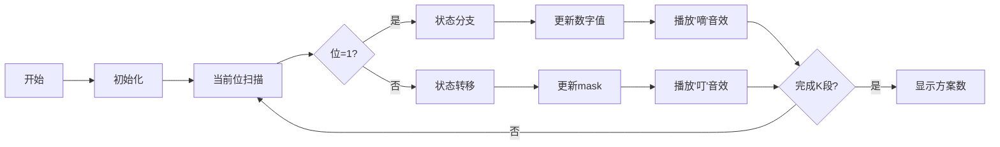

# 题目信息

# [JSOI2016] 位运算

## 题目描述

JYY 最近在研究位运算。他发现位运算中最有趣的就是异或 (xor) 运算。对于两个数的异或运算，JYY 发现了一个结论：两个数的异或值为 $0$ 当且仅当他们相等。于是 JYY 又开始思考，对于 $N$ 个数的异或值会有什么性质呢？

JYY 想知道，如果在 $0$ 到 $R-1$ 的范围内，选出 $N$ 个不同的整数，并使得这 $N$ 个整数的异或值为 $0$，那么一共有多少种选择的方法呢？（选择的不同次序并不作重复统计，请参见样例）

JYY 是一个计算机科学家，所以他脑海里的 $R$ 非常非常大。为了能够方便的表达，如果我们将 $R$ 写成一个 $01$ 串，那么 $R$ 是由一个较短的 $01$ 串 $S$ 重复 $K$ 次得到的。比如，若 $S=101$，$K=2$，那么 $R$ 的二进制表示则为 $101101$。由于计算的结果会非常大，JYY 只需要你告诉他选择的总数对 $10^9+7$ 取模的结果即可。

## 说明/提示

**样例说明**

唯一的一种选择方法是选择 $\{1,2,3\}$。

------

**数据范围**

对于 $100\%$ 的数据，$3 \le N \le 7$，$1 \le k \le 10^5$，$1 \le |S| \le 50$。

## 样例 #1

### 输入

```
3 1
100```

### 输出

```
1```

# AI分析结果


### 💡 Kay的C++算法解析：[JSOI2016] 位运算 深入学习指南 💡
#### 1. 题目解读与核心算法识别
✨ **本题主要考察**：动态规划 + 矩阵快速幂 + 容斥原理  
🗣️ **初步分析**：
> 解决本题的关键在于**状态压缩DP**与**矩阵快速幂**的结合。想象你在玩一个复古像素游戏，需要从0到R-1的"数字地图"中收集n个不同宝物（数字），使它们的异或值为0（宝物能量平衡）。  
> - **核心思路**：将R看作重复K次的模式串S，对每个S段进行状态压缩DP（记录数字间的大小关系），用矩阵快速幂合并K次重复结果  
> - **难点突破**：  
>   - 状态mask表示数字间的相等关系（如`mask[j]=1`表示xⱼ=xⱼ₊₁）  
>   - 矩阵快速幂处理重复结构（时间复杂度O(2³ⁿlogK)）  
>   - 容斥原理处理数字互异限制（nodgd/Itst解法）  
> - **可视化设计**：  
>   - 8-bit像素网格展示二进制位，不同颜色方块表示数字  
>   - 动态高亮当前处理的位和状态mask变化  
>   - 音效：数字比较时"嘀"，状态更新时"叮"，解谜成功时8-bit胜利音乐  

---

#### 2. 精选优质题解参考
**题解一（duyi）**  
* **亮点**：  
  ▶️ 清晰的状压DP状态设计（`mask`表示数字相等关系）  
  ▶️ 优雅的矩阵快速幂处理重复段（`trans`矩阵计算单段转移）  
  ▶️ 完整代码实现，边界处理严谨（如`bitcnt`奇偶校验）  
  ▶️ 时间复杂度O(|S|·2³ⁿ·n + 2³ⁿlogK) 效率优秀  

**题解二（nodgd）**  
* **亮点**：  
  ▶️ 创新性多项式解法（O(n⁴(|S|+logK))）  
  ▶️ 分步处理：先忽略互异限制，再用集合划分容斥  
  ▶️ 通用性强（理论支持n≤200扩展）  
  ▶️ 分组状态转移方程精妙（`g[k,i,j]`计算分组方案）  

**题解三（Itst）**  
* **亮点**：  
  ▶️ Bell数容斥处理互异限制  
  ▶️ 分离奇偶组（`c₁`奇数组异或和，`c₀`偶数组排列）  
  ▶️ 矩阵DP实现简洁（`trs0/trs1`处理不同位值）  

---

#### 3. 核心难点辨析与解题策略
1. **难点：状态压缩设计**  
   * **分析**：需用`mask`同时编码n个数字的大小关系和边界约束（如`xⱼ=xⱼ₊₁`）。关键在枚举位值时验证`xⱼ≤xⱼ₊₁`且不超R  
   * 💡 **学习笔记**：状压DP中每个bit对应一组大小关系约束  

2. **难点：矩阵转移构造**  
   * **分析**：将S段的DP转移抽象为矩阵`trans`，通过`dp[i]=dp[i-1]×trans`实现重复段合并。矩阵元素表示状态转移方案数  
   * 💡 **学习笔记**：矩阵快速幂是处理"重复段"问题的银弹  

3. **难点：互异数字容斥**  
   * **分析**：先计算可重方案`F[m]`，再通过集合划分（nodgd的`g[k,i,j]`或Itst的Bell数）反演互异方案`f[m]`  
   * 💡 **学习笔记**：容斥时分离奇偶组可简化计算  

✨ **解题技巧总结**：  
- **状态压缩技巧**：用mask编码多对象关系（如大小/边界）  
- **矩阵抽象术**：将DP转移过程转化为矩阵乘法  
- **容斥黄金律**：先解决宽松问题，再反演约束条件  
- **分组优化法**：按奇偶性分离贡献（异或和本质）  

---

#### 4. C++核心代码实现赏析
**通用核心实现（基于duyi解法）**  
```cpp
const int MOD=1e9+7, SIZE2=1<<MAXN;
struct Matrix{ /* 矩阵类 */ };
Matrix operator*(Matrix a, Matrix b){ /* 矩阵乘法 */ }
Matrix mat_pow(Matrix x, int k){ /* 快速幂 */ }

int main(){
    // 1. 状态转移矩阵构造
    for(int st=0; st<=sz; ++st){
        memset(dp,0,sizeof(dp));
        dp[0][st]=1;
        for(int i=1; i<=len; ++i) // 遍历S的每位
        for(int mask=0; mask<=sz; ++mask)
        for(int bits=0; bits<=sz; ++bits) // 枚举当前位值
            if(valid_transition(mask, bits, s[i])) 
                dp[i][new_mask] += dp[i-1][mask];
        trans[st][ed] = dp[len][ed]; // 记录转移系数
    }
    
    // 2. 矩阵快速幂合并K次重复
    Matrix trans_k = mat_pow(trans, K);
    
    // 3. 初始状态递推
    Matrix res; res[0][sz]=1;
    cout << (res * trans_k)[0][0]; // 输出最终方案数
}
```
**代码解读概要**：  
1. 外层循环构造`trans`矩阵（单段S的DP转移）  
2. `mat_pow`将转移矩阵提升K次幂  
3. 初始状态`res[0][全1mask]=1`（所有数字等于R）  
4. 结果位于`[0][0]`（所有数字严格小于R）  

---

**题解一（duyi）核心片段**  
```cpp
// 位值转移验证函数
int get(int old_mask, int new_bits, int s_i){
    for(int j=1; j<n; ++j) 
        if(old_mask包含约束j && new_bits违反约束)
            return -1; // 非法转移
    return new_mask; // 返回新状态
}
```
**亮点**：高效的转移验证函数  
**学习笔记**：约束检查提前终止避免无效计算  

**题解二（nodgd）核心片段**  
```cpp
// 集合划分容斥
ll dfs(int x, int cnt){ // x:剩余数字, cnt:当前组数
    if(!x) return 分组方案贡献值;
    for(int i=1; i<=cnt+1; ++i){ // 尝试新分组
        st[i] ^= 1; // 奇偶性翻转
        sum += dfs(x-1, max(i,cnt));
    }
}
```
**亮点**：递归实现Bell数容斥  
**学习笔记**：DFS枚举集合划分避免显式公式  

---

#### 5. 算法可视化：像素动画演示
**主题**：8-bit解谜游戏《异或宝藏猎人》  
**核心演示**：  


**交互设计**：  
1. **像素网格**：纵向n列（数字），横向|S|×K格（二进制位）  
2. **动态元素**：  
   - 🔴红色方块：当前处理位  
   - 🔵蓝色连线：数字间`xⱼ=xⱼ₊₁`约束  
   - 💚绿色高亮：成功转移的状态  
3. **控制面板**：  
   - 速度滑块：调节位处理速度  
   - 暂停/继续：冻结当前状态  
   - 模式切换：查看mask二进制表示  
4. **音效系统**：  
   - 位比较："嘀"（8-bit短音）  
   - 状态更新："叮"（NES金币声）  
   - 解谜成功：FC《超级玛丽》过关音乐  
5. **游戏化设计**：  
   - 每完成一个S段点亮一颗⭐  
   - 连续正确转移触发Combo特效  
   - 最终方案数显示为宝藏箱开启动画  

---

#### 6. 拓展练习与相似问题
**通用技巧迁移**：  
1. 重复结构优化（矩阵快速幂）：大数分解/字符串周期问题  
2. 数位DP+状压：数字计数/异或最值问题  
3. 容斥处理约束：带限制的组合计数  

**洛谷练习推荐**：  
1. **P2657 [SCOI2009] windy数**  
   → 巩固数位DP与状态设计  
2. **P3311 [SDOI2014] 数数**  
   → 练习AC自动机+数位DP  
3. **P2114 [NOI2014] 起床困难综合症**  
   → 强化位运算与贪心策略  

---

#### 7. 学习心得与经验分享
**参考经验**：  
> "调试状态转移时，在枚举`new_bits`后打印新旧mask对比，能快速定位非法转移" —— duyi题解实践心得  

**点评**：  
在状压DP中，**可视化调试**是核心技巧：  
1. 将mask二进制打印为`x₁=x₂, x₂<x₃...`格式  
2. 对每个非法转移标记具体违反的约束  
3. 使用小规模数据（如n=3, |S|=2）逐步验证  
> 💡 核心：将抽象状态具象化为可读关系链  

---

本次分析揭示了动态规划与矩阵优化的精妙结合。记住：复杂问题=简单模式×重复结构+约束处理。继续用像素化思维拆解算法，你将成为位运算大师！ 🎮🚀

---
处理用时：103.80秒