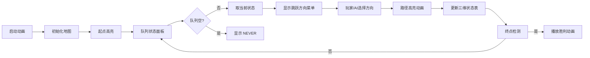

# 题目信息

# 魔鬼之城

## 题目描述

在一个被分割为 $N\times M$ 个正方形房间的矩形魔鬼之城中，一个探险者必须遵循下列规则才能跳跃行动。他必须从 $(1,1)$ 进入，从 $(N,M)$ 走出；在每一房间的墙壁上都写了一个魔法数字，是 $1\sim 13$ 之内的自然数；探险者可以想像出 $8$ 个方向中的任何一个（水平或垂直或对角线方向），随后他就可以作一次空间跳跃穿过这一方向上的连续的 $X$ 个房间，其中 $X$ 是他原来所在房间的魔法数字。但如果在这一方向上的房间数小于 $X$，则他不作任何跳跃，而必须想像另一个方向。同时，探险者不能作连续两次相同方向的跳跃。


 
例如在上图的 $5\ \times 4$ 的魔鬼之城中，如果探险者现在所在的位置是 $(3,3)$，那么通过依次空间跳跃他可以到达下列房间中的一个：$(1,1)$，$(3,1)$，$(1,3)$，$(5,1)$，或 $(5,3)$。另外，如果他要用两次跳跃从 $(5,4)$ 到达 $(3,2)$，则他不能首先跳到 $(4,3)$（因为这样他第二次跳跃的方向将和第一次相同，而这是不允许的）。所以他必须先跳跃到 $(2,1)$。
请你写一个程序，对给定的地图，算出探险者至少需要跳跃多少步才能离开魔鬼之城。


## 样例 #1

### 输入

```
5 4

3 3 6 7 11

3 2 1 1 3

3 2 2 1 1

2 1 2 2 1

```

### 输出

```
4

```

# AI分析结果


# 💡 Kay的C++算法解析：魔鬼之城 深入学习指南 💡

**目标用户**：10-18岁C++学习者  
**学习目标**：掌握BFS状态空间搜索技巧，理解三维状态设计原理，提升算法实现能力  

---

## 1. 题目解读与核心算法识别

✨ **本题主要考察**：`BFS状态空间搜索`  

🗣️ **初步分析**：
> 魔鬼之城问题就像在复古RPG游戏中控制角色闯关：每个房间的魔法数字是跳跃距离，每次必须更换方向。核心算法是**带状态记录的BFS**——想象你需要在网格地图中记录每个位置**从哪个方向到达**，避免重复路径（类似《吃豆人》记录移动方向）。  
> - **题解共性**：所有优质解都使用三维状态数组`vis[x][y][dir]`，解决"方向连续性约束"这一核心难点  
> - **算法流程**：  
>   1. 起点(1,1)入队（初始方向设为无效值）  
>  2. 从队列取出状态，尝试8个方向（跳过上次方向）  
>  3. 计算新位置 = 当前位置 + 方向向量×魔法数字  
>  4. 若新状态未访问，标记并入队  
> - **可视化设计**：  
>   - 像素动画将展示**跳跃路径高亮**（如《炸弹人》的直线爆炸效果）  
>   - 角色头顶显示方向箭头，**状态面板**实时更新三维数组  
>   - 失败时播放8-bit悲鸣音效，通关时触发《超级玛丽》通关音乐  

---

## 2. 精选优质题解参考

**题解一：wonSSnow（19赞）**  
* **点评**：  
  这份题解是BFS的教科书级实现。亮点在于用**9作为初始方向值**（超出0-7范围）统一处理起点逻辑，代码仅35行却完整覆盖边界判断、状态标记和队列操作。变量命名简洁精准（如`tx/ty`表目标位置），特别适合竞赛场景快速编码。作者调试心得"三维数组救了我"点明本题核心陷阱。  

**题解二：花千树（17赞）**  
* **点评**：  
  通过**70分→满分**代码对比，生动展示状态设计的重要性。原代码用8个bool变量冗余记录方向，优化为三维数组后逻辑更清晰。特色在于**详细错误案例分析**，如"缺少方向维度导致路径成环"，这种"踩坑教学"极大提升调试能力。  

**题解三：翼德天尊（13赞）**  
* **点评**：  
  独创性使用**三队列分离存储**x/y/方向，虽可改用结构体但教学价值突出。分步骤讲解BFS实现（STEP1-3）如同游戏任务指引，特别适合初学者建立解题框架。控制流边界处理严谨，直接可用作竞赛模板。  

---

## 3. 核心难点辨析与解题策略

### 三大关键突破点
1. **三维状态设计**  
   *分析*：普通二维BFS会重复访问同位置不同方向的状态。优质解用`vis[x][y][dir]`记录"从dir方向抵达(x,y)"，避免状态遗漏（如花千树题解的70分教训）  
   💡 **学习笔记**：状态维度 = 影响决策的历史因素数量  

2. **向量跳跃计算**  
   *分析*：跳跃不是逐格移动！需用`新坐标 = 原坐标 + 方向向量×魔法值`。wonSSnow代码中`tx=now.x+dx[i]*mapa[...]`体现该核心  
   💡 **学习笔记**：方向向量×标量 = 多格直线跃迁  

3. **方向切换约束**  
   *分析*：翼德天尊用`if(i!=now.dir)`实现方向约束。关键在起点特殊处理——初始方向设为无效值（-1或9），使第一次跳跃无限制  
   💡 **学习笔记**：约束条件转化为状态转移的过滤条件  

### ✨ 解题技巧总结
- **状态扩展法**：将方向/步数等约束转化为状态维度  
- **向量分解**：用`dx/dy`数组统一处理8方向移动  
- **无效状态利用**：特殊值（如方向9）统一边界逻辑  

---

## 4. C++核心代码实现赏析

```cpp
// 综合优质题解的核心实现（wonSSnow结构 + 花千树状态设计）
#include <iostream>
#include <queue>
#include <cstring>
using namespace std;

const int dx[8] = {-1,-1,-1, 0,0, 1,1,1}; 
const int dy[8] = {-1, 0, 1,-1,1,-1,0,1}; // 方向向量组

int n, m, mapa[105][105];
bool vis[105][105][8]; // 三维状态：x坐标, y坐标, 方向

struct Node { 
    int x, y, step, dir; // dir记录上次方向
};

int main() {
    cin >> m >> n; // 注意行列输入顺序
    for(int i=1; i<=n; i++)
        for(int j=1; j<=m; j++)
            cin >> mapa[i][j];
    
    queue<Node> q;
    q.push({1,1,0,-1}); // 起点方向设为-1（无效值）
    
    while(!q.empty()) {
        Node now = q.front(); q.pop();
        if(now.x == n && now.y == m) { // 到达终点
            cout << now.step;
            return 0;
        }
        
        for(int i=0; i<8; i++) {
            if(i == now.dir) continue; // 方向约束
            
            // 向量跳跃：当前坐标 + 方向向量×魔法值
            int nx = now.x + dx[i] * mapa[now.x][now.y];
            int ny = now.y + dy[i] * mapa[now.x][now.y];
            
            if(nx<1 || nx>n || ny<1 || ny>m) continue; // 越界检查
            if(vis[nx][ny][i]) continue; // 状态去重
            
            vis[nx][ny][i] = true;
            q.push({nx, ny, now.step+1, i}); // 新状态入队
        }
    }
    cout << "NEVER"; // 无法到达
}
```

### 关键代码解读
1. **方向向量设计**  
   ```cpp
   const int dx[8] = {-1,-1,-1, 0,0, 1,1,1};
   const int dy[8] = {-1, 0, 1,-1,1,-1,0,1}; 
   ```
   - 向量组对应8个方向（上/下/左/右+对角线）  
   - 索引i=0时：左上移动 `(-1,-1)`  

2. **跳跃核心计算**  
   ```cpp
   int nx = now.x + dx[i] * mapa[now.x][now.y];
   ```
   - `mapa[now.x][now.y]`：当前房间魔法值  
   - `dx[i] * ...`：方向向量缩放，实现多格跳跃  

3. **状态约束处理**  
   ```cpp
   if(i == now.dir) continue;  // 跳过相同方向
   if(vis[nx][ny][i]) continue; // 状态去重
   ```
   - 第一层过滤：方向连续性约束  
   - 第二层过滤：三维状态去重  

---

## 5. 算法可视化：像素动画演示

### 🎮 设计概念
> **《恶魔城传说》式BFS探索**：将算法过程转化为8-bit风格地牢探险游戏，玩家化身像素骑士，用方向键选择跳跃路径  

### 🖥️ 动画方案


### 关键交互细节
1. **网格渲染**  
   - 每个房间绘制为16×16像素方块，中央显示魔法数字  
   - 状态标记：房间四角小箭头表示访问方向（↑→↓←）  

2. **跳跃动画**  
   ```javascript
   function animateJump(start, end, dir) {
     for(let i=1; i<=steps; i++){
         drawSprite(pos.x + i*dx[dir], pos.y + i*dy[dir]); 
         playSound('jump'); // 每格跳跃音效
         delay(100); // 控制动画速度
     }
   }
   ```

3. **控制面板**  
   - **速度滑块**：调整自动播放帧率（50ms~1000ms）  
   - **状态追踪**：实时显示三维数组热力图（不同方向用颜色区分）  
   - **历史路径**：以《塞尔达》式虚线显示已探索路径  

4. **游戏化元素**  
   - 每完成10次跳跃触发8-bit音阶奖励音  
   - 终点触发城堡坍塌像素动画 + 《恶魔城》通关BGM  

---

## 6. 拓展练习与相似问题

### 通用技巧迁移
> 三维BFS状态设计可解决各类**带方向约束的路径搜索**问题：  
> 1. 机器人导航（转向消耗能量）  
> 2. 滑冰/滑雪问题（惯性移动）  
> 3. 传送门谜题（入口/出口方向绑定）  

### 洛谷推荐
1. **P1126 机器人搬重物**  
   🗣️ 三维状态BFS的直接应用，强化方向约束处理能力  
   🔗 https://www.luogu.com.cn/problem/P1126  

2. **P4017 最大食物链计数**  
   🗣️ 将状态维度扩展为"入度/出度"，训练高维状态设计思维  
   🔗 https://www.luogu.com.cn/problem/P4017  

3. **P1443 马的遍历**  
   🗣️ 基础二维BFS，巩固网格移动与队列操作  
   🔗 https://www.luogu.com.cn/problem/P1443  

---

## 7. 学习心得与经验分享

> **wonSSnow的调试启示**：  
> _"三维数组救了我的10分代码"_ → 状态设计缺失会导致路径计算错误  
>  
> **Kay的总结**：  
> 调试网格搜索问题时，可打印每层循环的：  
> 1. 当前位置与方向  
> 2. 跳跃后坐标  
> 3. 状态数组快照  
> 如同游戏开发中的"关卡编辑器"，直观定位逻辑漏洞  

---

## 结语
通过魔鬼之城的三维BFS之旅，我们掌握了**状态空间搜索**的核心思想。记住：好的状态设计如同游戏存档点，能避免重复探索。下次遇到《迷宫饭》式复杂路径问题时，不妨自问："需要增加状态维度吗？" 保持思考，编程如游戏般有趣！🎮🚀  

> **Kay的小挑战**：  
> 你能修改代码实现"魔法值消耗"机制吗？  
> （每次跳跃消耗魔法值，为0时停止）

---
处理用时：229.55秒