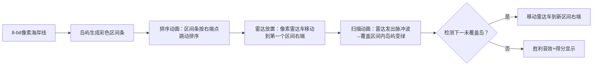

# 题目信息

# 雷达安装

## 题目描述

假设海岸线是一条无限延伸的直线。它的一侧是陆地，另一侧是海洋。每一座小岛是在海面上的一个点。雷达必须安装在陆地上（包括海岸线），并且每个雷达都有相同的扫描范围 $d$。你的任务是建立尽量少的雷达站，使所有小岛都在扫描范围之内。

数据使用笛卡尔坐标系，定义海岸线为 $x$ 轴。在 $x$ 轴上方为海洋，下方为陆地。


## 说明/提示

### 样例 1 解释


### 数据范围

对于全部数据，$n\le1000$，$ d \le 2\times 10^4$，$ | x_i | \le 2 \times 10^6 $，$ 0 \le y_i \le 2\times 10^4$。

## 样例 #1

### 输入

```
3 2
1 2
-3 1
2 1
```

### 输出

```
2```

# AI分析结果


### 💡 Kay的C++算法解析：雷达安装 深入学习指南 💡

#### 1. 题目解读与核心算法识别
✨ **本题主要考察**：`贪心算法（区间选点问题）`

🗣️ **初步分析**：
> 雷达安装问题本质是将几何问题转化为区间覆盖问题。想象你在一条海岸线上放置灯塔（雷达），每个灯塔能照亮一定范围的海域（半径d）。每个岛屿对应一段海岸线区间——只要灯塔落在这个区间内就能覆盖该岛。贪心策略就像玩"俄罗斯方块"：把区间按右端点排序后，在第一个区间最右端放灯塔（最大化覆盖右侧岛屿），然后跳过所有被覆盖的区间，重复直到覆盖所有岛屿。
> - **核心流程**：计算每个岛的覆盖区间→按右端点排序→贪心放置雷达
> - **可视化设计**：像素动画将展示岛屿生成区间线段→排序动画→雷达放置时播放"滴"音效→被覆盖岛屿变成绿色→新雷达放置时触发"叮"胜利音效
> - **复古游戏化**：采用8-bit像素风，雷达放置视为"关卡通关"，每关得分=覆盖岛屿数

---

#### 2. 精选优质题解参考
**题解一（弹星者）**
* **点评**：思路清晰直指贪心本质，用`temp`变量记录最后雷达位置是亮点。代码规范（结构体命名合理），排序后单次遍历O(n)高效。边界处理严谨（先判断y>d直接输出-1），竞赛实用性强。推导过程从几何到区间的转化解释透彻。

**题解二（Social_Zhao）**
* **点评**：创新使用`num`需求数组标记未覆盖区间，通过双重循环显式减少需求计数。虽然复杂度O(n²)但代码可读性极强，结构分明。亮点在将"区间需求"概念可视化，帮助理解贪心的覆盖过程。

**题解三（wzm2007）**
* **点评**：最接近直觉的实现，用`vis`数组显式标记覆盖状态。代码完整包含输入处理、无解判断和输出，适合初学者模仿。虽然效率不如单次遍历，但对贪心策略的"覆盖"动作演示最直观。

---

#### 3. 核心难点辨析与解题策略
1. **难点：几何问题转化为区间模型**
   * **分析**：岛屿(x,y)到雷达距离≤d ⇒ 雷达x坐标∈[x-√(d²-y²), x+√(d²-y²)]。优质题解都用结构体存储该区间，这是解题基石。
   * 💡 学习笔记：遇到几何约束时，思考能否转化为一维区间问题

2. **难点：贪心策略的证明与实现**
   * **分析**：为什么按右端点排序？因为当前雷达放在区间i右端时，能覆盖所有左端点≤此位置的区间（传递性）。弹星者用`temp`变量简洁实现该逻辑。
   * 💡 学习笔记：贪心问题排序方式决定策略有效性

3. **难点：边界与异常处理**
   * **分析**：当y>d时不存在解。所有优质题解都在计算区间前判断，避免无效计算。Social_Zhao的`exit(0)`确保立即退出。
   * 💡 学习笔记：先处理边界条件能提升代码鲁棒性

### ✨ 解题技巧总结
- **问题转化技巧**：将圆形覆盖域转化为线性区间
- **贪心实现范式**：排序→遍历→维护关键状态变量（如最后雷达位置）
- **调试技巧**：打印区间信息验证转化正确性
- **复杂度优化**：避免嵌套循环时及时break（如wzm2007的`continue`）

---

#### 4. C++核心代码实现赏析
**通用核心实现参考**
```cpp
#include <iostream>
#include <algorithm>
#include <cmath>
using namespace std;

struct Segment {
    double l, r;
    bool operator<(const Segment& s) const { 
        return r < s.r; // 按右端点排序
    }
};

int main() {
    int n, ans = 0;
    double d, last_radar = -1e9;
    cin >> n >> d;
    Segment seg[1005];
    
    for (int i = 0; i < n; i++) {
        double x, y;
        cin >> x >> y;
        if (y > d) {
            cout << -1;
            return 0;
        }
        double len = sqrt(d*d - y*y);
        seg[i] = {x - len, x + len};
    }
    
    sort(seg, seg + n);
    
    for (int i = 0; i < n; i++) {
        if (last_radar < seg[i].l) { 
            ans++;
            last_radar = seg[i].r; // 关键：在右端点放雷达
        }
    }
    cout << ans;
}
```
* **代码解读概要**：先处理无解情况→计算区间→排序→贪心遍历。`last_radar`记录最后雷达位置，仅在遇到未覆盖区间时更新。

**题解一核心片段（弹星者）**
```cpp
sort(a+1,a+n+1,cmp); // 按右端点排序
for(int i=1;i<=n;i++){
    if(i==1) temp=a[i].r,ans++; 
    else if(temp>a[i].l) continue; // 已覆盖
    else temp=a[i].r,ans++; // 新增雷达
}
```
* **代码解读**：`temp`像贪吃蛇的尾巴——记录雷达链末端。当新区间左端点在`temp`右侧时，说明需要新雷达，并让"尾巴"延伸到新区间右端。
* 💡 学习笔记：单变量维护状态是贪心算法的常见优化手段

**题解二核心片段（Social_Zhao）**
```cpp
for(int i=1;i<=n;i++){
    if(num[i]<=0) continue;
    num[i]--;
    for(int j=i+1;j<=n;j++){ 
        if(a[j].l<=nowr) num[j]--; // 减少需求计数
    }
    ans++;
}
```
* **代码解读**：`num`数组像任务清单，每放一个雷达就划掉能覆盖的区间。虽然效率低但过程可视化强。
* 💡 学习笔记：显式状态标记有助于理解算法过程

---

#### 5. 算法可视化：像素动画演示
* **主题**："雷达指挥官"复古像素游戏  
* **核心演示**：贪心覆盖过程（排序→放置→覆盖检测）



**交互设计**：
1. **控制面板**：步进/播放滑块、暂停/重置
2. **视觉反馈**：
   - 当前操作区间高亮闪烁
   - 雷达覆盖范围显示半透明圆
   - 被覆盖岛屿变成绿色像素块
3. **音效设计**：
   - 移动雷达："哔哔"电子音
   - 覆盖岛屿："叮"金币音
   - 关卡完成：8-bit胜利旋律
4. **游戏化元素**：
   - 每关目标：用≤k个雷达覆盖所有岛
   - 得分=覆盖岛屿数×剩余雷达数

---

#### 6. 拓展练习与相似问题思考
- **通用技巧迁移**：区间覆盖思想还适用于：
  1. 活动安排问题（最多不相交区间）
  2. 最小点覆盖区间
  3. 线段重叠检测

- **洛谷推荐**：
  1. **P1514 引水入城**  
     🗣️ 同样是区间覆盖+贪心，强化问题转化能力
  2. **P1250 种树**  
     🗣️ 变种区间选点问题，需处理区间约束
  3. **P1230 智力大冲浪**  
     🗣️ 带权区间调度，掌握贪心策略的灵活应用

---

#### 7. 学习心得与经验分享
> **经验摘录（弹星者）**：  
> *"把雷达放在区间右端就像站台等公交——选择最晚出发时间（右端点）能等到更多班次（覆盖更多岛屿）"*  
> **Kay点评**：生动诠释贪心策略本质，记住这个类比能快速解决同类问题！

---

通过本指南，相信大家已掌握雷达安装问题的核心解法。记住：将复杂问题转化为经典模型是算法设计的钥匙！下次遇到几何约束时，不妨思考能否像本题一样"降维打击"！🚀

---
处理用时：110.40秒