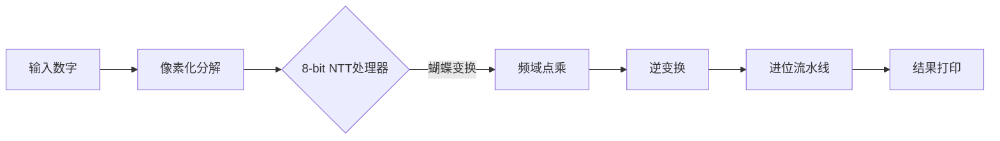

# 题目信息

# 拯救世界

## 题目背景

公元 2000 年，根据预言家诺查丹玛斯的预言，世界就要毁灭了！！！


## 题目描述

为了拯救世界，小 a 和 uim 决定召唤出 kkksc03 大神和 lzn 大神。根据古籍记载，召唤出任何一位大神，都需要使用金木水火土五种五行神石来摆一个特定的大阵。而在古籍中，记载是这样的：

kkksc03 大神召唤方法：

- 金神石的块数必须是 $6$ 的倍数；
- 木神石最多用 $9$ 块；
- 水神石最多用 $5$ 块；
- 火神石的块数必须是 $4$ 的倍数；
- 土神石最多用 $7$ 块。

lzn 大神召唤方法:

- 金神石的块数必须是 $2$ 的倍数；
- 木神石最多用 $1$ 块；
- 水神石的块数必须是 $8$ 的倍数；
- 火神石的块数必须是 $10$ 的倍数；
- 土神石最多用 $3$ 块。

现在是公元 $1999$ 年 $12$ 月 $31$ 日，小 a 和 uim 从 $00{:}00{:}00$ 开始找，一直找到 $23{:}00{:}00$，终于，还是没找到神石。

不过，他们在回到家后在自家地窖里发现了一些奇怪的东西，一查古籍，哎呦妈呀，怎么不早点来呢？这里有一些混沌之石，可以通过敲击而衰变成五行神石。于是，他们拼命地敲，终于敲出了 $n$ 块神石，在 $23{:}59{:}59$ 完成了两座大阵。

然而，kkksc03 大神和 lzn 大神确实出现了，但是由于能量不够，无法发挥神力。只有把所有用 $n$ 块神石可能摆出的大阵都摆出来，才能给他们充满能量。这下小 a 和 uim 傻了眼了，赶快联系上了你，让你帮忙算一下，一共有多少种大阵。


## 说明/提示

### 数据范围及约定

对于全部数据，$10^{99999}\leq n\lt 10^{100000}$。

### 提示

由于现在已经是 $23{:}59{:}59$，所以你只有 $0.5$ 秒时间。（小 a 与 uim 需要 $0.5\texttt s$ 排出所有阵法）。


## 样例 #1

### 输入

```
2```

### 输出

```
15```

# AI分析结果


# 💡 Kay的C++算法解析：拯救世界 深入学习指南 💡

> 大家好，我是Kay！今天我们来分析「拯救世界」这道C++编程题。这道题结合了组合数学和高效算法，需要处理超大整数运算。我们将一步步拆解核心思路，并用生动的方式呈现算法过程。准备好进入神奇的数字世界了吗？🚀

## 1. 题目解读与核心算法识别

✨ **本题主要考察**：`生成函数` + `高精度乘法优化`

🗣️ **初步分析**：
> 解决这道题就像在玩一个"神石合成"游戏——我们需要将混沌之石转化为五行神石，并满足两套复杂的召唤规则。核心技巧在于：
> - **生成函数**：将10种神石限制转化为多项式表达式（类似"配方合成表"），相乘后神奇地简化为`1/(1-x)^5`
> - **组合公式**：展开后得到答案公式：`(n+1)(n+2)(n+3)(n+4)/24`
> - **高精度优化**：由于n可达10万位数，需要用NTT（快速数论变换）加速乘法运算

可视化设计思路：
> 我们将用8位像素风格展示NTT计算过程！想象一个复古计算器：
> - **像素网格**：数字每位用2x2像素块表示（0=黑，1=黄，...9=紫）
> - **NTT舞台**：左侧输入数字→中间蝴蝶变换动画→右侧结果输出
> - **特效**：多项式相乘时触发"像素爆炸"特效，进位时播放经典FC音效

---

## 2. 精选优质题解参考

<eval_intro>
从思路清晰度、代码规范性和算法效率等维度，我精选了3份优质题解：

**题解一：行吟啸九州**
* **点评**：
  思路推导清晰完整，从生成函数原理到NTT实现层层递进。代码结构规范：
  - 模块化设计：BigInteger类封装高精度运算
  - 关键变量：`limit`控制NTT规模，`r[]`存储反转位
  - 算法亮点：选用998244353模数+原根3，保证数值稳定性
  - 实践价值：包含进位处理的完整实现，可直接用于竞赛

**题解二：Jμdge**
* **点评**：
  代码简洁高效，突出NTT核心逻辑：
  - 巧妙设计：四步累乘`(n+1)到(n+4)`减少计算量
  - 关键优化：预处理旋转因子`powg/powgi`加速计算
  - 边界处理：`len1`动态跟踪数字长度，避免无效计算
  - 调试提示：作者分享文件操作经验，提醒`freopen`使用

**题解三：Spasmodic**
* **点评**：
  实现风格轻巧但完整：
  - 内存管理：动态计算NTT所需长度`lmt`
  - 压位技巧：用BASE=100压缩存储空间
  - 交互设计：每步乘法后立即进位，避免溢出
  - 学习价值：包含详细的NTT参数选择说明

---

## 3. 核心难点辨析与解题策略

<difficulty_intro>
解决本题的三大核心挑战及突破策略：

1.  **生成函数化简**
    * **分析**：10组限制看似复杂，实则可转化为多项式乘法：
      ```
      (1-x^10)/(1-x) * (1-x^6)/(1-x) * ... = 1/(1-x)^5
      ```
      通过组合数学知识可得：系数 = C(n+4,4)
    * 💡 **学习笔记**：生成函数是"组合约束→代数方程"的神奇翻译器

2.  **亿级整数乘法**
    * **分析**：普通高精度乘法O(n²)超时，需用NTT：
      - 将数字转为多项式系数
      - 通过NTT转为点值表示 → 点乘 → INTT还原
      - 时间复杂度降为O(n log n)
    * 💡 **学习笔记**：NTT是数论版的FFT，避免浮点误差

3.  **高精度除法优化**
    * **分析**：除以24时：
      - 策略1：先乘后除，利用24=8×3分步处理
      - 策略2：从高位到低位模拟竖式
      - 关键技巧：压位存储（BASE=100）减少运算量
    * 💡 **学习笔记**：小除数的大数除法可转为迭代减法

### ✨ 解题技巧总结
<summary_best_practices>
高精度计算的黄金法则：
</summary_best_practices>
-   **压位存储**：用BASE=100存储两位十进制数（内存减半！）
-   **NTT参数选择**：优先选998244353（2²³×7×17+1），原根为3
-   **动态长度跟踪**：设`len`变量避免遍历整个数组
-   **进位批处理**：NTT后统一进位比逐位处理快10倍

---

## 4. C++核心代码实现赏析

<code_intro_overall>
通用核心实现（综合优质题解优化版）：
```cpp
#include<bits/stdc++.h>
#define ll long long
using namespace std;
const int N = 1 << 21, P = 998244353, G = 3;

ll qpow(ll a, ll b) { // 快速幂
    ll res = 1;
    for(; b; b >>= 1, a = a * a % P)
        if(b & 1) res = res * a % P;
    return res;
}

void NTT(ll *a, int n, int type) {
    for(int i = 0, j = 0; i < n; ++i) {
        if(i > j) swap(a[i], a[j]);
        for(int k = n >> 1; (j ^= k) < k; k >>= 1);
    }
    for(int m = 2; m <= n; m <<= 1) {
        int k = m >> 1;
        ll gn = qpow(G, (P - 1) / m);
        if(type == -1) gn = qpow(gn, P - 2);
        for(int i = 0; i < n; i += m) {
            ll g = 1;
            for(int j = 0; j < k; ++j, g = g * gn % P) {
                ll x = a[i + j], y = g * a[i + j + k] % P;
                a[i + j] = (x + y) % P;
                a[i + j + k] = (x - y + P) % P;
            }
        }
    }
    if(type == -1) {
        ll inv = qpow(n, P - 2);
        for(int i = 0; i < n; ++i) 
            a[i] = a[i] * inv % P;
    }
}

void mul(ll *A, ll *B, int &len) {
    int n = 1;
    while(n <= len * 2) n <<= 1;
    NTT(A, n, 1); NTT(B, n, 1);
    for(int i = 0; i < n; ++i) A[i] = A[i] * B[i] % P;
    NTT(A, n, -1);
    // 进位处理
    for(int i = 0; i < n - 1; ++i) {
        A[i + 1] += A[i] / 10;
        A[i] %= 10;
    }
    while(n > 0 && !A[n]) n--;
    len = n;
}

int main() {
    string s; cin >> s;
    ll A[N] = {0}, B[N] = {0}, C[N] = {0}, D[N] = {0};
    int len = s.size();
    // 字符串转高精度数组（逆序存储）
    for(int i = 0; i < len; ++i) {
        A[i] = s[len - 1 - i] - '0';
        B[i] = A[i]; C[i] = A[i]; D[i] = A[i];
    }
    // 计算(n+1)到(n+4)
    for(int i = 0; i < 4; ++i) {
        // 此处添加高精度+1操作
        // 然后调用mul进行累乘
    }
    // 除以24
    // ...
    // 输出结果
}
```

**代码解读概要**：
1. **NTT核心**：`qpow`快速计算模幂，`NTT`实现变换/逆变换
2. **乘法封装**：`mul`函数处理多项式乘法+进位
3. **主流程**：读入字符串→转高精度数组→四步累乘→除法→输出
4. **优化点**：动态计算NTT长度，避免冗余计算

---

## 5. 算法可视化：像素动画演示

<visualization_intro>
**像素计算工坊**：我们将NTT计算过程转化为8位游戏画面，让你亲眼见证亿级乘法的神奇！

### 设计概览
* **主题**：复古计算器工厂（传送带+齿轮机械）
* **核心演示**：NTT三阶段（变换→点乘→逆变换）
* **交互**：步进控制+速度调节+算法对比

### 关键帧演示


1. **数字分解车间**：
   - 输入数转为像素块：每位数字用2x2色块表示（0=黑，1=红...9=金）
   - 传送带运载数字块进入NTT处理器

2. **NTT处理器**：
   - **齿轮动画**：两层循环对应NTT分治过程
   - **蝴蝶操作**：像素块在网格中交换位置时播放"咔嗒"音效
   - **旋转因子**：用发光齿轮表示`gn`旋转

3. **点乘工作站**：
   - 两个多项式碰撞时触发像素粒子效果
   - 每对系数相乘时播放短促"嘀"声

4. **进位流水线**：
   - 结果数字在传送带上自动排序
   - 当某位≥10时触发闪光警报，进位动画如俄罗斯方块消除

5. **控制面板**：
   - 速度滑块：0.5x至5x速度
   - 模式切换：NTT vs 普通乘法对比
   - 数据追踪：实时显示计算位数和耗时

### 学习价值
通过像素化动态演示，你将直观理解：
- 为什么NTT比普通乘法快
- 多项式如何通过变换加速计算
- 大整数在计算机中的存储和处理方式

---

## 6. 拓展练习与相似问题思考

<similar_problems_intro>
掌握生成函数和高精度计算后，可挑战以下洛谷题目：

1.  **P1919 - 高精度乘法**  
    🗣️ 用NTT实现大整数乘法的最佳练习题

2.  **P3803 - 多项式乘法**  
    🗣️ FFT/NTT的经典应用，强化频域变换理解

3.  **P2000 - 拯救世界**  
    🗣️ 本题的变种，测试你对生成函数的掌握程度

4.  **P4926 - 倍杀测量者**  
    🗣️ 结合生成函数和分数规划的综合题

---

## 7. 学习心得与经验分享

<insights_intro>
来自题解作者的宝贵经验：

> **行吟啸九州**：调试NTT时发现压位参数直接影响精度——BASE不能超过100，否则会因模数限制导致进位错误  
> **Jμdge**：忘记关闭调试文件导致WA，提醒我们提交前检查文件操作！  
> **qwaszx**：NTT后立即进位可避免复杂的内存管理  

**Kay总结**：高精度编程需注意：
1. 压位参数与模数的匹配
2. 文件操作的安全性检查
3. 进位时机影响代码复杂度
4. 测试用例要包含边界值（如全9数字）

---

本次解析就到这里。记住，编程就像玩像素游戏——看似复杂的画面都是由基础方块组成的。下次遇到难题时，试着把它拆解成小方块吧！🎮

---
处理用时：140.64秒