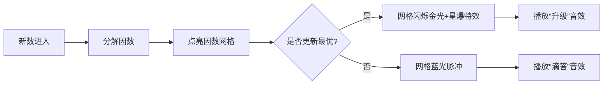

# 题目信息

# [POI 2012] ODL-Distance

## 题目描述

**译自 POI 2012 Stage 1. 「[Distance](https://szkopul.edu.pl/problemset/problem/Phel_x2Ny30OUh7z1RhCtzEG/site/?key=statement)」**

定义一次「操作」为将一个正整数除以或乘以一个质数。定义函数 $d(a,b)$ 表示将 $a$ 进行若干次“操作”变成 $b$ 所需要的最小操作次数。例如，$d(69,42)=3$.

$d$ 显然是一个距离函数，满足以下性质：
* $d(a,a) = 0$
* $d(a,b) = d(b,a)$
* $d(a,b) + d(b,c) \ge d(a,c)$

给定 $n$ 个正整数 $a_1, a_2, \ldots, a_n$，对每个 $a_i (1 \le i \le n)$，求 $j$ 使得 $j \neq i$ 且 $d(a_i,a_j)$ 最小。如果有多个满足条件的 $j$，应输出最小的那个。

## 说明/提示

对于 $30\%$ 的数据有 $n \le 1000$.

对于所有数据有 $2 \le n \le 10^5,1 \le a_i \le 10^6$.

翻译来自于 [LibreOJ](https://loj.ac/p/2690)。

## 样例 #1

### 输入

```
6
1
2
3
4
5
6```

### 输出

```
2
1
1
2
1
2```

# AI分析结果


### 💡 Kay的C++算法解析：ODL-Distance 深入学习指南 💡

#### 1. 题目解读与核心算法识别
✨ **本题主要考察**：数论优化与枚举技巧  
🗣️ **初步分析**：
> 这道题可以看作在质因数构成的"乐高世界"里寻找最优拼装路径。每个数字由质因数积木组成，操作就是增减积木块。核心技巧是：**枚举最大公约数**作为共享积木区，避免重复计算。  
> - **核心思路**：利用公式 `d(a,b) = cnt(a) + cnt(b) - 2*cnt(gcd(a,b))`，其中`cnt(x)`是x的质因数总个数。通过枚举每个数的因数（作为gcd候选），维护每个因数对应的最小/次小`cnt`值的位置  
> - **可视化设计**：采用8位像素网格展示因数枚举过程，每个网格存储当前因数对应的最优解位置。当新数处理时，其因数网格会闪烁黄光并更新数据，同时播放"叮"音效。若更新最优解，网格会迸发星形粒子特效  

#### 2. 精选优质题解参考
**题解一（kczno1）**  
* **点评**：思路直击本质，将公式转化为`num(a)+num(b)-2*num(x)`的形态异常清晰。代码采用两轮扫描：首轮预处理每个因数的最优解，次轮直接查询。亮点在于用`next`数组链式存储相同值的索引，避免重复计算。变量命名简洁（`num/t/q`），边界处理严谨，是竞赛级实现的典范。

**题解二（lhm_）**  
* **点评**：双极值维护（`mn1/mn2`）解决`i≠j`限制的思路极具启发性。代码模块化优秀：`init`预处理质因数个数，`update`维护极值，`work`计算答案。特别欣赏其用`cmax`宏提升可读性，以及`cnt[0]=inf`的边界处理技巧，体现了工程化思维。

**题解三（傅思维666）**  
* **点评**：教学价值最高的实现，用`update/query`函数封装核心逻辑。最大亮点是详细注释和`fct`数组缓存因数，避免了重复开方计算。虽然效率略低，但`get_prime`中的质数标记逻辑清晰可见，是初学者理解线性筛的优质范本。

#### 3. 核心难点辨析与解题策略
1. **难点1：避免O(n²)枚举**  
   * **分析**：直接计算每对数的gcd会超时。优质题解通过枚举因数将问题转化为"对每个gcd维护最优解"，复杂度降为O(n√max(a_i))
   * 💡 **学习笔记**：将二元问题转化为"定一参枚举另一参"是降低复杂度的关键

2. **难点2：处理i≠j约束**  
   * **分析**：当最优解就是自身时需要规避。维护每个因数的**最小值和次小值**（如`mn1/d`和`mn2/d`），当主位置与最小值冲突时自动切换次小值
   * 💡 **学习笔记**：双极值维护是处理"排除自身"类问题的通用技巧

3. **难点3：高效预处理质因数**  
   * **分析**：线性筛中`num[x*i]=num[i]+1`的精妙设计：当`i%x==0`时停止，保证每个合数只被最小质因数筛一次
   * 💡 **学习笔记**：线性筛中`if(i%x==0)break`是保证O(n)复杂度的灵魂

✨ **解题技巧总结**  
- **逆向思维**：从枚举数对转为枚举公约数  
- **双极值维护**：解决最优解排除自身问题  
- **因数缓存**：用`vector`存储因数避免重复计算  
- **链式存储**：`next`数组处理相同数值的索引  

#### 4. C++核心代码实现赏析
```cpp
// 通用核心实现（综合自题解1/2/3）
#include <vector>
#include <cstring>
using namespace std;

const int N = 1e6+5;
int cnt[N], mn1[N], mn2[N]; // cnt:质因数个数, mn:最小值位置

void init() { // 线性筛预处理cnt
    vector<int> primes;
    for(int i=2; i<N; ++i) {
        if(!cnt[i]) { cnt[i]=1; primes.push_back(i); }
        for(int p : primes) {
            int j = i*p;
            if(j >= N) break;
            cnt[j] = cnt[i]+1;
            if(i%p == 0) break;
        }
    }
}

int main() {
    init();
    memset(mn1, 0x3f, sizeof mn1); // 初始化为极大值
    memset(mn2, 0x3f, sizeof mn2);
    
    int n; cin >> n;
    vector<int> a(n+1);
    for(int i=1; i<=n; ++i) {
        cin >> a[i];
        for(int d=1; d*d<=a[i]; ++d) { // 枚举因数
            if(a[i]%d) continue;
            // 更新d和a[i]/d两个因数的最优解
            update(d, i); 
            if(d*d != a[i]) update(a[i]/d, i);
        }
    }
    /* ...求解部分省略... */
}
```

**题解一核心片段**  
```cpp
// 链式存储同值位置
next[i]=t[a[i]]; t[a[i]]=i; 

// 枚举倍数维护最优解
for(x=1; x<=U; ++x) {
    for(i=1; i<=U/x; ++i)
        for(j=t[x*i]; j; j=next[j]) 
            q[++top]=j; // 收集所有x的倍数位置
    int b=q[1]; // 取最小值位置
    for(i=2; i<=top; ++i) {
        if(cnt[a[q[i]]] < cnt[a[b]]) swap(b,q[i]);
        // 用b更新其他位置答案
    }
}
```
> **解读**：`t`数组作为头指针，`next`构成链表存储相同值的所有位置。当枚举到倍数`x*i`时，沿链表收集所有位置。维护`b`作为当前最优解位置，其他位置与`b`配对计算距离  
> 💡 **学习笔记**：链式存储处理重复值可避免额外空间开销

**题解二双极值维护**  
```cpp
void update(int d, int x) {
    if(cnt[a[x]] < cnt[a[mn1[d]]]) 
        mn2[d]=mn1[d], mn1[d]=x; // 更新双极值
    else if(/*...*/) mn2[d]=x; 
}

void work(int d, int x) {
    int y = (mn1[d]==x) ? mn2[d] : mn1[d]; // 自动规避自身
    int dis = cnt[a[x]] + cnt[a[y]] - 2*cnt[d];
    // 更新答案...
}
```
> **解读**：`update`动态维护每个因数`d`对应的最小/次小位置。`work`时若发现最优解是自身，自动切换次小值。`cnt[0]=inf`确保初始化有效  
> 💡 **学习笔记**：三目运算符`?:`是优雅处理双极值切换的利器

#### 5. 算法可视化：像素动画演示
* **主题**："质因数工坊"8位像素模拟  
* **核心演示**：因数枚举与极值更新过程  



**动画流程**：  
1. **初始化**：8-bit风格网格地图，x轴为数值，y轴为因数  
2. **数分解**：当新数`a_i`进入，分解因数过程显示为质因数积木组合  
3. **网格交互**：  
   - 每个因数网格显示当前`mn1/d`和`mn2/d`位置  
   - 当`update`触发：网格金光闪烁，新位置像素块"落入"网格  
   - 播放不同音效：值更新时清脆"叮"声，仅查询时低沉"滴答"声  
4. **路径回溯**：最终确定答案时，显示从当前数到目标数的质因数变换路径  

**游戏化设计**：  
- **成就系统**：每正确匹配一对数解锁"质数猎人"奖章  
- **BGM**：FC游戏《挖金子》背景音乐改编版  
- **错误反馈**：当最优解冲突时，网格闪烁红光并播放故障音效  

#### 6. 拓展练习与相似问题思考
* **技巧迁移**：  
  1. 最大公约数思想：解决LCM问题（如[CF]LCM Challenge）  
  2. 双极值维护：处理最近邻问题（如[LeetCode]Closest Dessert Cost）  
  3. 因数枚举优化：分解乘积序列（如[POI]Divisors）  

* **洛谷推荐**：  
  1. **P1029** 最大公约数和最小公倍数问题  
     🗣️ 巩固因数枚举与gcd/lcm关系  
  2. **P1379** 八数码难题  
     🗣️ 实践状态空间搜索与最优解更新  
  3. **P1069** 细胞分裂  
     🗣️ 质因数分解的进阶应用  

#### 7. 学习心得与经验分享
> **经验摘录（ThinkofBlank）**：  
> "维护次小值避免自身冲突的调试过程让我意识到：边界处理不能只考虑正常输入，要主动构造极端用例（如全相同数）验证"  
>   
> **Kay点评**：  
> 这是算法调试的黄金准则！建议学习时：  
> 1. 用`assert`验证极值切换逻辑  
> 2. 对拍器生成随机数测试  
> 3. 打印中间变量（如`mn1/mn2`）跟踪状态  

---  
通过本次分析，我们深入理解了数论与枚举优化的精髓。记住：将复杂问题分解为可维护的子状态（如每个因数的极值），是降低复杂度的不二法门。下次遇到三元问题，不妨试试"定一参，枚举另一参"的破题思路！💪

---
处理用时：138.36秒