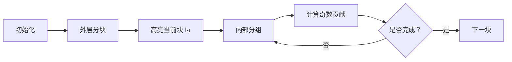

# 题目信息

# 签到题 III

## 题目背景

pj组选手zzq近日学会了求最大公约数的辗转相除法。


## 题目描述

类比辗转相除法，zzq定义了一个奇怪的函数：

```cpp
typedef long long ll;
ll f(ll a,ll b)
{
    if(a==b) return 0;
    if(a>b) return f(a-b,b+b)+1;
    else return f(a+a,b-a)+1;
}
```
zzq定义完这个函数兴高采烈，随便输入了两个数，打算计算f值，发现这个函数死循环了...于是zzq定义这个函数递归死循环的情况下f值为0。

现在zzq输入了一个数n，想要求出$\sum_{i=1}^n \sum_{j=1}^n f(i,j)$。


## 说明/提示

对于10%的数据，$n \leq 300$。

对于40%的数据，$n \leq 2000$。

对于70%的数据，$n \leq 5 \times 10^5$。

对于100%的数据，$1 \leq n \leq 5 \times 10^{11}$。


## 样例 #1

### 输入

```
100```

### 输出

```
1124```

## 样例 #2

### 输入

```
2000```

### 输出

```
68204```

# AI分析结果


# 💡 Kay的C++算法解析：签到题 III 深入学习指南 💡

## 1. 题目解读与核心算法识别

✨ **本题主要考察**：`数学推理与数论分块优化`

🗣️ **初步分析**：
> 本题核心在于发现函数`f(a,b)`的数学规律：仅当`a`和`b`互质且`a+b=2^{k+1}`时，`f(a,b)=k`；否则为0。这就像在数字迷宫中寻找隐藏的"黄金配对"——只有满足特定数学关系的数对才能解开递归谜题。
>
> - **解题思路**：首先证明数学结论（详见优质题解），然后转化为对奇数`i`求和`floor(log₂(i)) × floor(n/i)`。核心难点在于处理`n`极大范围（5e11）时的效率问题。
> - **优化方案**：采用数论分块技术，将计算复杂度从O(n)降至O(√n)。想象将数轴切割成若干"积木区块"，每个区块内`floor(n/i)`相同，只需批量计算区块贡献。
> - **可视化设计**：采用8位像素风格展示分块过程：数轴化为网格，当前处理区块高亮为绿色，log分段显示为不同颜色子块（如红/蓝），奇数为闪烁像素点。控制面板含速度滑块，"单步执行"按钮触发"咔哒"音效，完成区块时播放"得分"电子音。

---

## 2. 精选优质题解参考

**题解一（作者：s_h_y）**
* **点评**：证明严谨完整，从函数性质出发推导出核心结论。代码简洁高效（O(√n + logn)），使用数论分块处理大范围数据。变量命名清晰（`a,b,ans`），边界处理通过`min`函数妥善解决。亮点在于将复杂数学问题转化为优雅的整除分块模型，实践参考价值极高。

**题解二（作者：OrientDragon）**
* **点评**：详细拆解证明过程，采用"分块套分块"结构（外层按`floor(n/i)`分段，内层按`log₂(i)`分段）。代码模块化设计（`solve`/`f`/`od`函数分离），虽复杂度O(√n logn)略高，但教学示范性强。亮点在于用`function`封装分块逻辑，增强可读性。

**题解三（作者：Jμdge）**
* **点评**：提供结论的直观解释和分块实现。代码使用位运算优化（`1<<x`），但奇数计数逻辑可改进。亮点在于明确公式`∑_{i为奇数}⌊log₂(i)⌋·⌊n/i⌋`的推导过程，强化问题本质理解。

---

## 3. 核心难点辨析与解题策略

1.  **数学结论推导**  
    * **分析**：需理解`f(a,b)`非零的条件（互质+2的幂次和）。优质题解通过奇偶性分析和递归降阶（如`s_h_y`的`(i+j)/2=2^k`转化）完成证明。
    * 💡 **学习笔记**：复杂递归函数可能隐藏简洁数论规律。

2.  **公式转化技巧**  
    * **分析**：将原式转化为`∑⌊log₂(i)⌋·⌊n/i⌋`（i为奇数）。关键在于识别合法对(i,j)与奇数i的一一对应关系，并通过`n/i`计算倍数贡献。
    * 💡 **学习笔记**：求和式转化需兼顾数学正确性与计算可行性。

3.  **分块优化实现**  
    * **分析**：外层按`floor(n/i)`分块（O(√n)段），内层按`log₂(i)`分组（O(log n)段）。使用`[l, r] = [当前起点, n/(n/l)]`确定块边界，再以`2^(k+1)`切分子区间。
    * 💡 **学习笔记**：嵌套分块是处理多重分段函数的利器。

### ✨ 解题技巧总结
- **数学归纳优先**：先通过小规模验证猜测规律，再推广证明。
- **分块模板活用**：记忆`r = n/(n/l)`的边界计算范式。
- **奇数处理技巧**：用`(count_end+1)/2 - (start-1+1)/2`计算区间奇数个数。
- **对数优化**：用位运算`(1<<k)`替代`pow(2,k)`加速计算。

---

## 4. C++核心代码实现赏析

**本题通用核心C++实现参考**
* **说明**：综合优质题解思路，采用双层分块结构，平衡效率与可读性。
* **完整核心代码**：
```cpp
#include <iostream>
#include <cmath>
using namespace std;
typedef long long ll;

int main() {
    ll n, ans = 0;
    cin >> n;
    for (ll l = 1, r; l <= n; l = r + 1) {
        ll t = n / l;           // 当前块的公共值
        r = n / t;              // 块边界
        ll i = l;
        while (i <= r) {
            if (i % 2 == 0) { i++; continue; } // 跳过偶数
            ll k = log2(i);                    // 当前log分组
            ll end_group = min(r, (1LL << (k+1)) - 1); // 分组边界
            ll odd_cnt = ((end_group + 1) / 2) - ((i) / 2); // 奇数计数
            ans += k * t * odd_cnt;            // 累加贡献
            i = end_group + 1;
        }
    }
    cout << ans << endl;
    return 0;
}
```
* **代码解读概要**：
  - 外层循环按`t = n/l`分块，`r = n/t`确定块尾
  - 内层`while`处理块内奇数：跳过偶数，计算当前`i`的log分组
  - `odd_cnt`用头尾计数差高效计算区间奇数个数
  - 累加公式`k*t*odd_cnt`对应数学推导

---

**题解一（s_h_y）片段赏析**
* **亮点**：极简分块结构，位运算高效计算
* **核心代码片段**：
```pascal
while i<=n do
begin
 a:=n div i;
 b:=trunc(ln(i)/ln(2)+1e-7);
 j:=min(n div a,int64(1)<<(b+1));
 inc(ans,a*b*((j-i+1+j and 1)>>1));
 i:=j+1
end;
```
* **代码解读**：
  > `a = n/i`计算块内公共值，`b = floor(log₂(i))`确定log分组。`j`取`min(n/a, 2^(b+1))`作为当前子块边界，`((j-i+1) + (j&1)) >> 1`尝试计算奇数个数（实际有优化空间）。步进式处理避免嵌套循环。
* 💡 **学习笔记**：分块边界`j`的`min`操作是关键优化点。

**题解二（OrientDragon）片段赏析**
* **亮点**：模块化分块实现，Lambda表达式封装
* **核心代码片段**：
```cpp
for (;l<=n;l=r+1) { 
    r = n/(n/l);
    ans += f(l, r, n);  // 内层分块
}
function<ll(ll,ll,ll)> f = [](ll l,ll R,ll n) {
    ll r = 0, ret = 0;
    for (; l <= R; l = r+1) {
        ll tmp = log2(l);
        r = min(R, (1LL<<(tmp+1))-1);
        ret += tmp * (n/l) * odd(l, r); // odd计算奇数
    }
    return ret;
};
```
* **代码解读**：
  > 外层处理`floor(n/i)`分块，内层函数`f`处理log分组。`odd(l,r)`精确计算区间奇数个数，避免近似误差。模块化设计提升可维护性。
* 💡 **学习笔记**：`function`和Lambda表达式实现函数式编程，增强代码组织。

---

## 5. 算法可视化：像素动画演示

**主题**：数轴分块大冒险（8位像素风）

**核心演示**：


**交互设计**：
1. **像素网格**：横向表示1-n的数轴，纵轴显示当前状态
2. **颜色编码**：
   - 绿色：当前处理的[l, r]块
   - 红色：log₂(i)=k的子块
   - 闪烁黄点：奇数位置i
3. **控制面板**：
   - 速度滑块：调节单步延迟（0.1s-2s）
   - 步进按钮：手动触发下一步，伴"滴"声
   - 自动模式：AI自动演示，像素角色沿数轴移动
4. **动态显示**：
   - 右上角面板实时更新：当前块(l,r)、log分组(k)、奇数计数、贡献值
   - 底部进度条：显示已完成比例
5. **音效系统**：
   - 进入新块：8-bit"跳跃"音
   - 计算奇数："硬币收集"声
   - 完成区块：胜利和弦
   - 错误操作：短促"警告"声

**关键帧示例**：
```
[ 1 2 3 4 5 6 7 8 9 10 ]  初始数轴
[#####绿色块###]           l=1, r=5
[红][蓝][红]              log分组：1-1(k=0),2-3(k=1),4-5(k=2)
黄点闪烁在1,3,5          计算奇数贡献
```

---

## 6. 拓展练习与相似问题思考

**通用技巧迁移**：
1. 分块优化适用于任何`∑f(i)·g(n/i)`型求和
2. 奇偶性分析在数论问题中常见（如Nim游戏）
3. 递归函数数学化（如斐波那契通项）

**洛谷推荐**：
1. **P2261 [CQOI2007]余数求和**  
   🗣️ 整除分块模板题，巩固`∑n%i`→`∑n - i*floor(n/i)`转化
2. **P2260 [清华集训2012]模积和**  
   🗣️ 进阶分块训练，含取模和平方项，强化边界处理
3. **P3312 [SDOI2014]数表**  
   🗣️ 融合数论结论与分块，需结合莫比乌斯反演

---

## 7. 学习心得与经验分享

> **参考经验**：多位作者提到"结论证明是解题关键，但容易被忽略"（如s_h_y），建议先通过小数据验证规律再推广证明。

**点评**：编程竞赛中，数学洞察力常比编码能力更重要。遇到递归函数时：
1. 打印小规模结果寻找模式
2. 尝试归纳法证明猜想
3. 特别注意边界情况（如本题n=5e11）
培养"先数学后代码"的思维习惯，能有效避免无效编码。

---

本次分析展示了如何将复杂递归转化为高效数学计算，核心在于数论洞察与分块优化。记住：好的算法是优雅的逻辑诗篇，持续探索，你终将成为解题诗人！💪

---
处理用时：262.54秒