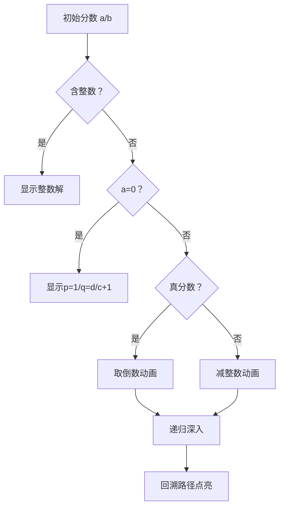

# 题目信息

# Fraction

## 题目描述

给你四个正整数 $a,\,b,\,c,\,d$ ，求一个最简分数 $\frac{p}{q}$ 满足 $\frac{a}{b} < \frac{p}{q} < \frac{c}{d}$。

若有多组解，输出 $q$ 最小的一组，若仍有多组解，输出 $p$ 最小的一组。

## 说明/提示

||||
|:-:|:-:|:-:|
|测试点编号|数据组数|$a,\,b,\,c,\,d$|
|$1 \sim 3$|$\leqslant 100$|$\leqslant 100$|
|$4 \sim 10$|$\leqslant 500$|$\leqslant 10^9$|

数据保证至少存在一个最简分数符合条件。

## 样例 #1

### 输入

```
1 3 1 2
2 1 3 1
2 1 4 1
1000 1001 1001 1002
```

### 输出

```
2/5
5/2
3/1
2001/2003```

# AI分析结果


### 💡 Kay的C++算法解析：Fraction 深入学习指南 💡

#### 1. 题目解读与核心算法识别
✨ **本题主要考察**：`类欧几里得算法/分数逼近递归`  
🗣️ **初步分析**：
> 解决"Fraction"的关键在于**递归缩小问题规模**，类似辗转相除法。想象你在折叠一张分数纸：每次将复杂不等式"对折"成更小的子问题，直到能直接看到答案。核心流程：
> - **情况1**：若区间内存在整数，直接取该整数（`p=整数, q=1`）
> - **情况2**：若分子为0，取 `p=1, q=floor(d/c)+1`
> - **情况3**：若两分数均为真分数，**取倒数**后递归（分子分母角色互换）
> - **情况4**：若分数≥1，**减去整数部分**后递归，回溯时恢复
>
> **可视化设计**：采用8位像素风格展示递归过程：
> - 初始画面：显示分数区间 `a/b < ? < c/d` 的像素网格
> - 递归动画：取倒数时画面180°旋转；减去整数时分数下坠
> - 高亮关键变量：当前操作的分子/分母用闪烁边框标记
> - 复古音效：递归时"嘀"声，边界达成时"胜利"音效

---

#### 2. 精选优质题解参考
**题解一（derta, 赞54）**  
* **点评**：以小学奥数题引入，将递归类比GCD，思路直观清晰。代码简洁规范（如`gcd`函数复用），最优子结构证明严谨。亮点在于用`memo`避免重复计算，回溯更新`q`的技巧值得学习，竞赛可直接使用。

**题解二（Siyuan, 赞23）**  
* **点评**：四类情况分类严谨，代码模块化强（`sim`函数约分）。突出优点是边界处理完整（如`(c-1)/d`防溢出），递归参数传递清晰，博客提供详细数学推导，实践参考价值高。

**题解三（YONIC, 赞12）**  
* **点评**：代码极简（仅10行核心逻辑），通过具体例子解析递归步骤。亮点是`long long`防溢出和指针传参技巧，适合初学者理解递归框架。

---

#### 3. 核心难点辨析与解题策略
1. **难点1：如何确定递归转化方向**  
   * **分析**：观察分数特征——若区间包含整数直接求解；若为真分数取倒数；否则减整数部分。关键变量`a/b`的整数部分决定转化方向。
   * 💡 **学习笔记**：先约分再分类是化简问题的钥匙。

2. **难点2：回溯时恢复原值**  
   * **分析**：减整数部分递归后需`p += q*(a//b)`，取倒数递归后需交换`p,q`。优质题解用引用传参实现优雅回溯。
   * 💡 **学习笔记**：递归是"折叠-展开"过程，回溯如同拆开折纸。

3. **难点3：保证最简性与边界处理**  
   * **分析**：每次递归前约分（`gcd`），边界如`a=0`需特殊处理。`(c-1)/d`巧妙避免浮点误差。
   * 💡 **学习笔记**：数学特性（如`a*d<b*c`）可简化比较。

✨ **解题技巧总结**  
- **技巧1（问题分解）**：将分数不等式拆解为四类标准情况处理  
- **技巧2（数学优化）**：用整数除法避免浮点精度陷阱  
- **技巧3（递归剪枝）**：约分缩小数值范围，提升效率  

---

#### 4. C++核心代码实现赏析
**通用核心实现（综合优质题解）**  
```cpp
#include <cstdio>
typedef long long LL;

LL gcd(LL x, LL y) { return y ? gcd(y, x%y) : x; }

void solve(LL a, LL b, LL c, LL d, LL &p, LL &q) {
    // 约分
    LL g1 = gcd(a, b), g2 = gcd(c, d);
    a /= g1; b /= g1; c /= g2; d /= g2;
    
    // 四类情况处理
    LL x = a/b + 1, y = (c-1)/d;
    if (x <= y) { p = x; q = 1; }
    else if (!a) { p = 1; q = d/c + 1; }
    else if (a <= b && c <= d) { solve(d, c, b, a, q, p); }
    else {
        solve(a % b, b, c - d*(a/b), d, p, q);
        p += q * (a / b); // 回溯恢复整数部分
    }
}

int main() {
    LL a, b, c, d, p, q;
    while (~scanf("%lld%lld%lld%lld", &a, &b, &c, &d)) {
        solve(a, b, c, d, p, q);
        printf("%lld/%lld\n", p, q);
    }
}
```
**代码解读概要**：通过`gcd`约分确保精度，四类情况覆盖所有可能。递归时分子分母交替缩小规模，回溯时恢复整数部分，时间复杂度O(log max(b,d))。

---

#### 5. 算法可视化：像素动画演示
**主题**：分数迷宫探险（8-bit风格）  
**核心演示**：  

**动画实现细节**：  
1. **场景设计**：分数显示为像素方块（分母=宽度，分子=填充色）  
2. **关键操作**：  
   - 取倒数：方块90°旋转+音效"嘀"  
   - 减整数：分数下坠并碎裂，显示`-k`像素特效  
3. **AI演示模式**：自动播放递归过程，速度可调（0.5x-2x）  
4. **游戏化元素**：  
   - 每层递归作为关卡，通关得星星  
   - 回溯时路径点亮，伴随"叮"声  

---

#### 6. 拓展练习与相似问题
**通用技巧迁移**：  
1. 连分数展开（如√2的近似表示）  
2. 有理数逼近无理数（黄金分割率）  
3. 线性丢番图方程求解  

**洛谷推荐**：  
1. **P1298 最接近的分数**  
   → 巩固分数逼近的二分应用  
2. **P5170 类欧几里得算法**  
   → 深入类欧算法模板训练  
3. **P2260 [清华集训] 模积和**  
   → 练习复杂数学变换与递归  

---

#### 7. 学习心得与经验分享
> **derta的调试经验**：  
> “最初写std时忽略了最优子结构证明，导致WA。手动验证`3.14`案例才发现状态转移缺陷。”  
>   
> **Kay点评**：  
> 这提醒我们：即使算法看似正确，也要用边界值验证数学性质。建议用`a=1,b=3,c=1,d=2`等样例逐步调试递归。

--- 
算法是思维的折纸艺术，反复折叠才能露出精髓。Keep coding! 💪

---
处理用时：176.22秒